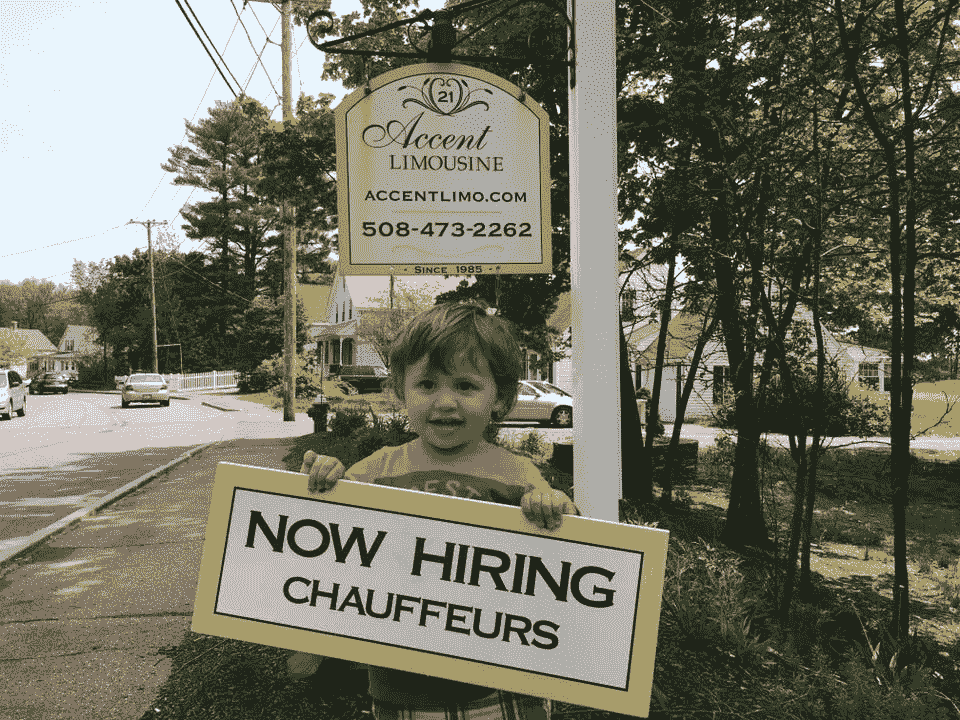
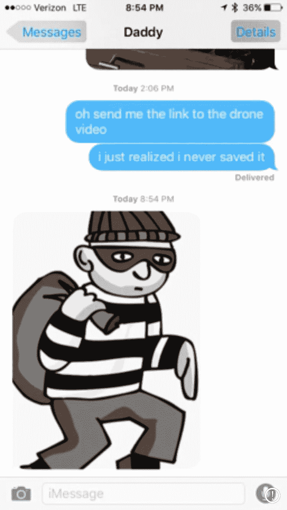

# “平台创业”&为什么不适合我

> 原文：<https://medium.com/hackernoon/the-platform-startup-why-its-not-for-me-6500d0c1b472>

回到 1985 年:我的父母在结婚 10 年后开着他们的第一辆豪华轿车。他们开始了 Accent 豪华轿车服务，因为我爸爸是一名货车司机，他总是在工作。一直都是。他想念我们。我们错过了他。见鬼，我妈妈一定非常想念他。

首先，我们能谈谈我的父母在这张照片中是怎样的吗？你看不到的是 3 个四处奔跑的小孩(我 5 岁，鲍勃 6 岁，里克 7 岁)和所有的生活责任，这些责任来自于放弃一份养老金工作，专注于对他们来说最重要的事情。但这些微笑是真实的，因为他们专注于家庭，提供可以想象的最好的产品和服务。

*“我们的第一个预定来自波士顿杂志的商业广告。我们瞄准高端市场，以符合我们的高端专业精神。我们开车去了米尔福德高中和周围各城镇的高中，以激发兴趣，展示我们的风采。”← —妈妈*

31 年后，我的父母早已退休，我的兄弟们经营着一家巨大的(比以往任何时候都大的)超级成功的公司。

Their youngest grandson and the cutest recruiter I’ve ever seen.

# 这和“平台创业”的兴起有什么关系？

我的父母从来没有期望他们的客户做任何事情，除了打电话给他们，给他们的细节。[口音豪华轿车](http://www.accentlimo.com)照顾到了所有的细节。他们打电话确认，确保他们的车非常干净，然后提前十分钟到家。

顾客所要做的…就是上车。

There’s dad again helping him get.in.the.damn.car.

# 不，但是朱莉，说真的。这和“平台创业”的兴起有什么关系？

如果我不得不登录一个新的[平台](https://hackernoon.com/tagged/platform)，学习一个新的用户界面，为我的最佳用例选择正确的产品，选择正确的定价方案，注册，检查垃圾邮件，确认我的电子邮件，重新登录，阅读该死的文档，永远等待有人回复聊天，当我有点迷路时，得到交付的过时版本的 API，谷歌找到我的答案，因为仍然没有人回应，然后找到并报告他们软件中的一个 bug 给一个太忙而没有时间回应的人…我要把我的电脑从最近的窗口扔出去。

所有这些都是为了每月 99 美元的特权，在一个平台上使用他们最先进的软件。

我们花了太多的时间使用我们注册的服务，以至于我们注册时只是承诺我们会节省多少时间。那是天生坏掉的。

# 你有什么建议，朱莉？

我建议我们都开始把工作拿回手中，把顾客的时间还给他们。为他们做工作。求你了。

在按需经济中([我写在 BostInno 的经历](http://bostinno.streetwise.co/2016/01/05/tech-jobs-how-a-dog-the-on-demand-economy-helped-me-get-1/)和我的 [6 倍超主机 Airbnb 评级](https://www.airbnb.com/rooms/5976821?sug=50)——这是怎样的社会证明)我们比以往任何时候都更加珍惜我们的时间。当我们上网时，我们得到的承诺是服务与自动化相结合。我一直发现，在网上提供真正的服务( [Fiverr](https://www.fiverr.com) 就是一个最好的例子)并不能保证结果，因为修改是王道，你仍然需要监管和改进你得到的东西。

你不能就这么上车。让我一分钟都不用考虑决定…是的，那会很酷。

# 我的解决方案。

我开了一家公司，因为我们不需要从客户那里获得太多信息。没有平台。定价很简单。没有“惊喜！[技术](https://hackernoon.com/tagged/technology)！”。我所需要你做的就是给我你的信息，我会照顾你要找的东西，因为我正在跟随我父母的成熟服务模式的脚步。传递价值。提供最多的服务。提供一种用户体验，当与技术和胆识相结合时，将带来内心的平静。

当我们确定你的约会对象从未抢劫过银行时，继续你的生活吧…因为一旦发生了，要做好准备。你爸爸会把你折磨得死去活来。

For a later medium post.

Aste.io 正在慢慢地在后台整理自己的东西。接下来的几周会有更多的报道。如果有兴趣成为第一批加入我的小革命的人，请在主页上添加您的电子邮件。

如果你能走到这一步，谢谢你的时间。❤

> [黑客中午](http://bit.ly/Hackernoon)是黑客如何开始他们的下午。我们是 AMI 家庭的一员。我们现在[接受投稿](http://bit.ly/hackernoonsubmission)并乐意[讨论广告&赞助](mailto:partners@amipublications.com)机会。
> 
> 如果你喜欢这个故事，我们推荐你阅读我们的[最新科技故事](http://bit.ly/hackernoonlatestt)和[趋势科技故事](https://hackernoon.com/trending)。直到下一次，不要把世界的现实想当然！

