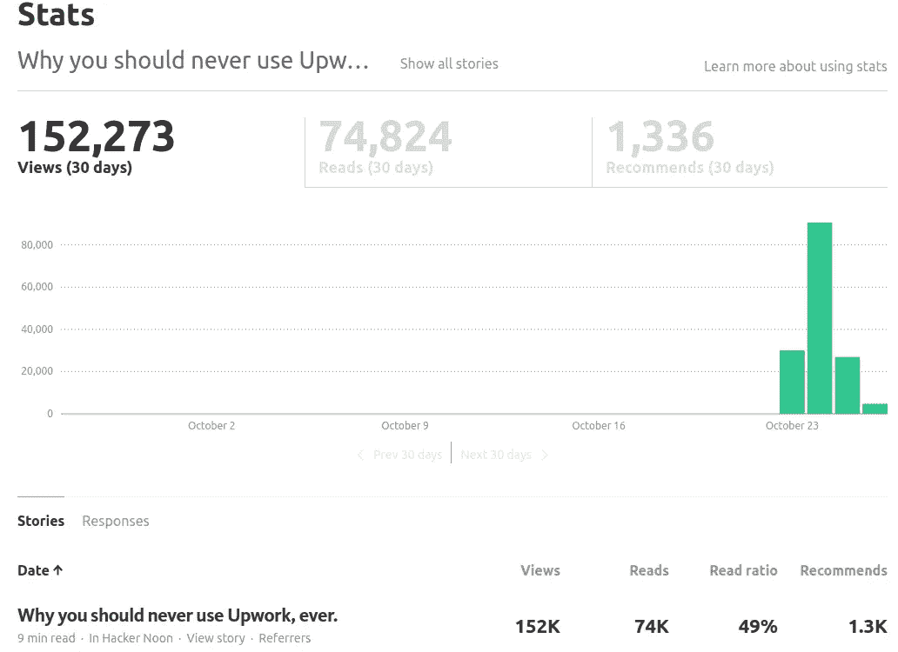
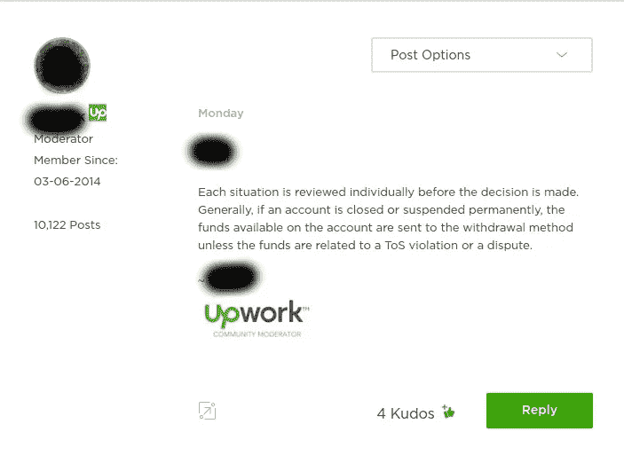

# 后，后工作的崩溃

> 原文：<https://medium.com/hackernoon/the-post-post-upwork-debacle-b53e988b0f45>

*本帖是第二部分，以“* [*为什么你永远不应该*](https://hackernoon.com/why-you-should-never-use-upwork-ever-5c62848bdf46#.bcnhoow9c) [*使用 Upwork，曾经*](http://shadandjulia.com/never-use-upwork-ever/) *”。可以在这里* *阅读 part 3* [*。*](/@AdShadlabs/the-state-of-freelancing-a-guide-to-2017-5cfe4ad44577#.7t14afywm)

我写这篇文章有两个主要原因。首先，实际上说发生了什么，因为职位。澄清任何误解，给出故事的双方，然后就此结束。第二，因为我讨厌成为一个纸上谈兵的政客。没有什么比抱怨和呼吁改变的人更糟糕的了，然而他们并没有采取行动去真正地看到改变。你知道他们的类型。因此，后续的文章将集中于为那些自由职业者或远程工作者(或希望这样做的人)提供有价值的信息。所以我也写了《自由职业的状态，2017 年指南》。

## 到底发生了什么？

一切都变了，真的有点疯狂。黑客新闻首页，多个 Sub Reddits(除了 r/freelance & r/programming，问 mods 为什么)。我的推特疯了。人们分享故事和他们的经历，有好有坏。

我认为最重要的事情是对话。自由职业者和远程工作本来就是一件孤独的事情。人们认为他们应该自己奋斗，不管他们的问题是什么。随着世界及其经济似乎变得越来越遥远和不稳定，我们仍然试图保持人类的生存条件变得越来越重要，社交，交谈，甚至走出去。嘿，我也为穿着内衣接客户电话感到内疚，你不是一个人。

## Upwork 怎么了？

我被安排和‘Ay’(化名)联系。一位可爱的女士在争议升级团队远程工作，来自加拿大。我认为他们用加拿大人是因为他们非常友好，但这是题外话。

我们就一系列话题进行了长时间的交谈。关于情况和工作本身。至于不要拖得太久，虽然没有披露或歪曲她的话，我会保持简短。

Pulled from Upwork Community Forums, posted by a moderator.

1.  金融限制从我被暂停的账户中解除了，我可以取钱了。这一切都还没有通过 10-14 天的审查期，但我相信一切都会好的。
2.  Upwork 正在积极处理这类情况，并努力改进。这是一家大公司，发展速度比以往任何时候都快。我相信当她告诉我他们有一个“愿景”并关心自由职业者和客户时，她是真诚的。原因是这样的，*钱*。他们是一家拥有大量既得利益的 T2 公司。如果像我或你这样的人不赚钱，如果客户和买家不花钱，那么 Upwork 就不赚钱。因此，获得最佳体验对每个人都有好处。我相信他们已经到了吗？嗯，没有。但我认为他们至少在朝那个方向努力是有可能的。
3.  与她交谈后，她将我的建议传达给了执行团队。他们继续前进，创造了(【customer-resolutions@upwork.com】[)。无论是客户还是自由职业者，这都是一个表达你对平台上任何争议的关注的地方。请仅在您积极使用 Upwork 并遇到问题时使用此电子邮件。不是，如果你对 Upwork 本身有问题，想发送不好的消息。请不要发垃圾邮件，因为有诚实问题的人实际上有机会与“高层”接触，讨论他们的问题。](mailto:customer-resolutions@upwork.com)

有趣的是，我觉得我必须写这个。在某一点上，我是在相当可怕的直道。我努力向上爬，它让我过去了。在我提交的数千份提案中，我确实与客户建立了稳固的关系，其中一些直到今天我还在与他们交谈。任何事情都有积极和消极的一面。用你自己的批判性思维和大脑来决定什么对你和你的情况是正确的。

## **中号片**

你可能会注意到媒介上的[柱子已经被完全砍掉了。所以我不得不在这里](https://hackernoon.com/why-you-should-never-use-upwork-ever-5c62848bdf46#.v3bvnw1b2)重新发布[。](http://shadandjulia.com/never-use-upwork-ever/)

在帖子点击量达到 12 万次后，他们的支持者联系了我。实质上，互联网决定开始向未来的客户发送仇恨邮件，同时也对他们进行攻击。

媒体支持告诉我，我有 4 个小时来修改我的帖子，因为它违反了一些规则。其中最主要的一条是“未经对方同意，张贴修改或未修改的对话”。我相信对方写信给 Medium，流露出真正的苦恼。我也看到了直接来自未来客户的信息，那里的人们告诉他们“去上吊吧”等等。更不用说张贴在他们的脸书上的 50+一星评论了。现在，我不相信这些照片有足够的信息去联系某人。但我认为 Medium 采取的是“安全胜于遗憾”的方法。老实说，我不确定我对此有何感受。

唯一奇怪的是，这篇文章从谷歌上搜索“Upwork”的第二页，变成了字面上的脱落。无处可寻。非常奇怪…

## 就这样

仅此而已。

我只想忘掉这件事。

如果你对远程工作和自由职业感兴趣，你可以阅读这篇文章。

@shadalabad

> [黑客中午](http://bit.ly/Hackernoon)是黑客如何开始他们的下午。我们是 [@AMI](http://bit.ly/atAMIatAMI) 家庭的一员。我们现在[接受投稿](http://bit.ly/hackernoonsubmission)并乐意[讨论广告&赞助](mailto:partners@amipublications.com)机会。
> 
> 如果你喜欢这个故事，我们推荐你阅读我们的[最新科技故事](http://bit.ly/hackernoonlatestt)和[趋势科技故事](https://hackernoon.com/trending)。直到下一次，不要把世界的现实想当然！

