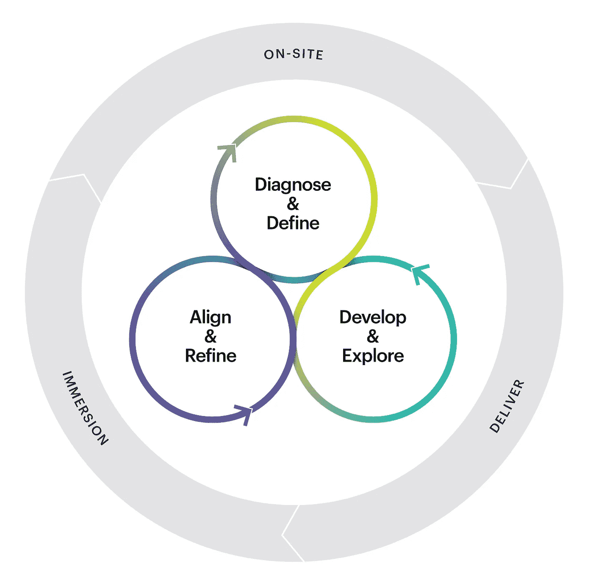

# Fast 对高增长公司的威力

> 原文：<https://medium.com/hackernoon/the-power-of-fast-for-high-growth-companies-1c06a3fe8315>

我们在一个快速发展的世界中工作和竞争，这是由不断加速的技术和社会变革所驱动的。我们竞争的市场瞬息万变，竞争加剧，期望值也随之提高。流动是新的常态。这增加了企业和品牌在越来越短的时间框架内发展和实施战略的压力。

作为一家品牌战略公司，我们发现我们的许多高增长公司，尤其是那些在拥挤、不断变化的类别中运营的公司，需要更加敏捷的方法来应对重塑其市场和业务的不断变化的动态。为了满足这些需求，我们开发了快进。快进是一个为期四周的过程，重点关注您的品牌、团队和业务所面临的挑战，对它们进行优先排序，并为您提供解决这些挑战的工具。

Fast Forward 是一套灵活的战略开发框架、工具和实践，旨在支持学习、获得更高的资本回报并加速实施。这是一个更加灵活的过程，可以克服成功、及时激活策略的障碍。快进就像它的名字所暗示的那样:推动你的业务向前发展，而且速度很快。

您的快速参与完全根据您的情况定制。可交付成果由您面临的挑战和机遇以及您认为最重要的战略产出来定义。

快进的速度和力量源于它的格式和重点。第一步是沉浸:为期一周的情报收集和分析阶段。第二周是现场:我们的团队与您的核心团队合作，诊断您的主要挑战，选择最迫切的需求进行关注，探索各种选项，然后团结协作，完善战略、行动和沟通，以实现这些目标(这是一个激烈的迭代)。第三周和第四周的重点是生产交付品，在情感品牌工作室完成。

在为期四周的项目结束时，您的团队将带着新的战略清晰性和商定的市场就绪型战略要素立即投入运作，以实现对创造持久价值和回报至关重要的转型。

图的内部代表现场阶段的迭代过程。

快进的目标不仅仅是解决问题；它通过在您的活动、资源和人员之间产生新水平的一致性和协调性，来识别具有加速您绩效潜力的新优势。我们经常看到，没有成功的实地执行，30，000 英尺的战略观点就不会成功。这种执行需要领导者和执行者的承诺和信念。快速推进让您的团队参与整个过程，以确保一致性，并为您提供一种新的战略和实施方法。

是时候快速推进你的业务了吗？联系我们，讨论它如何与您的企业合作。

Emotive Brand 是一家旧金山战略公司。

*原载于 2016 年 4 月 21 日*[*【www.emotivebrand.com】*](http://www.emotivebrand.com/high-growth-companies/)*。*

> [黑客中午](http://bit.ly/Hackernoon)是黑客如何开始他们的下午。我们是 [@AMI](http://bit.ly/atAMIatAMI) 家庭的一员。我们现在[接受投稿](http://bit.ly/hackernoonsubmission)并乐意[讨论广告&赞助](mailto:partners@amipublications.com)机会。
> 
> 如果你喜欢这个故事，我们推荐你阅读我们的[最新科技故事](http://bit.ly/hackernoonlatestt)和[趋势科技故事](https://hackernoon.com/trending)。直到下一次，不要把世界的现实想当然！

