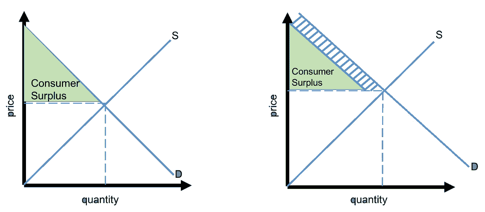

# 免费的力量以及为什么它是为你的产品收取合适价格的秘密

> 原文：<https://medium.com/hackernoon/the-power-of-free-and-why-its-the-secret-to-charging-the-right-price-for-your-product-41599c8d0637>

对于一个成长中的初创公司来说，没有什么比定价[战略](https://hackernoon.com/tagged/strategy)更重要的了，初创公司往往会因为收费不够而留下太多的钱。这使得很难充分利用他们的产品创造的新价值。[正如马克·安德森最近所说的](http://www.businessinsider.com/marc-andreessen-advice-to-startups-raise-prices-2016-6)，如果他能在硅谷的广告牌上放一个词，那就是“提高价格”

我的假设是，为什么初创公司目前在定价方面存在问题，是因为最近(但现在似乎已经结束了)对负利润率增长的冷漠。它让初创公司在不深入思考定价的情况下，或根本不思考定价，就能尽可能多地占领市场。虽然这让产品进入用户手中，但它确实留下了一个问题，即买家愿意为它支付多少钱。

要回答这个问题，有必要回顾一下经济学 101 的第一课——供给和需求，更具体地说，是消费者剩余。消费者剩余为什么好？首先，你总是想让你的顾客感觉好像他们得到了一笔交易。更重要的是，利用这种感觉推出核心产品的需求曲线成为可能，这是任何企业真正想要实现的。

Free or discounted complementary goods increase consumer surplus while shifting the demand curve

虽然可能不直观，但最好的方法之一是“赠送”补充产品或功能。其结果是推出核心产品的需求曲线，以更高的价格销售更多产品，同时增加消费者的感知价值(消费者剩余)。

在两个最流行的技术商业模式中很容易看到这种策略的效果:企业 SaaS 和市场。

*   企业 SaaS —与 iOS 和 Android 非常相似，Salesforce 有一个名为 AppExchange 的应用商店。消费者访问应用程序不需要付费，但丰富的选择加上流行应用程序的轻松集成推动了核心产品的需求曲线，使他们能够对核心产品收取比其他情况下更高的费用。
*   **市场** —几乎每个成功的客户获取平台都有一个在市场销售方的“工具”或“分析”部分，这是有原因的，目标是帮助
    供应方销售更多。在这种情况下，对定价工具等附加产品收取 10 美元的费用没有什么意义，因为对于卖家来说，这种价值很难量化。然而，免费引入，然后将客户获取(即预订或列表)费用提高几个百分点，对减少过度供应几乎没有影响。

最后，解决 800 磅的问题很重要。房间里的大猩猩:亚马逊总理。亚马逊利用服务折扣，这看似武断，但实际上为核心产品创造了大量消费者剩余。让我们来看看为 Prime 会员提供的一些辅助服务折扣。

**亚马逊音乐无限:** $9.99 非 prime / $7.99 Prime

**亚马逊数字存储:**(100 GB):11.99 美元非 prime / 5GB，prime 所有照片免费

**亚马逊音频频道:** $60 非 Prime/Prime 免费

通过对这些补充商品打折，亚马逊增加了对 Prime 的需求(即推出曲线)。此外，包含这些补充商品所创造的消费者剩余小于 Prime 主要服务(更快的运输)的单位边际成本的增加。

下次你在考虑产品定价策略时，不妨借鉴一下这些科技巨头的做法:不仅是你收取的价格，还有你送出的价格。

*特别感谢* [*乔纳森·克劳德*](https://twitter.com/jm_crowd) *帮助我思考这篇文章。*

*原载于 2017 年 8 月 22 日*[*kevindstevens.com*](http://kevindstevens.com/2017/08/when-free-creates-more-revenue/)*。*