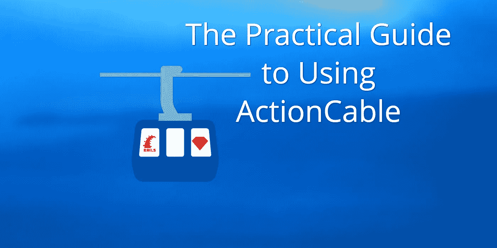

# 使用 ActionCable 的实用指南

> 原文：<https://medium.com/hackernoon/the-practical-guide-to-using-actioncable-30d570d8988c>

大多数关于 ActionCable 的指南和博客帖子都集中在简单的聊天应用程序上，以展示典型的 websocket 工作流程。这很好，但是 ActionCable 如何适应您日常使用类似 SaaS 的 Rails 应用程序呢？

以下是我即将出版的书《在 Rails 6 中构建一个 SaaS 应用程序》中的内容。这本书指导你从卑微的开始，通过部署一个应用到生产。的…