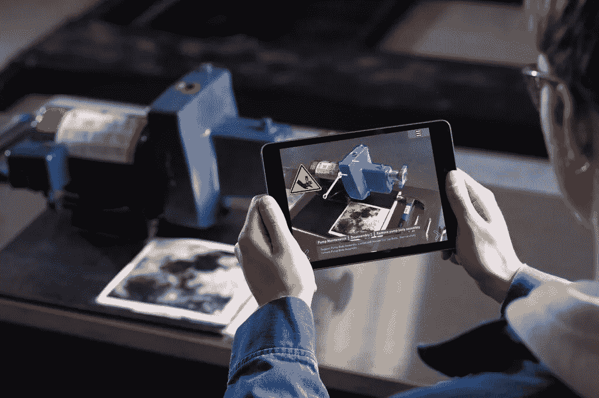
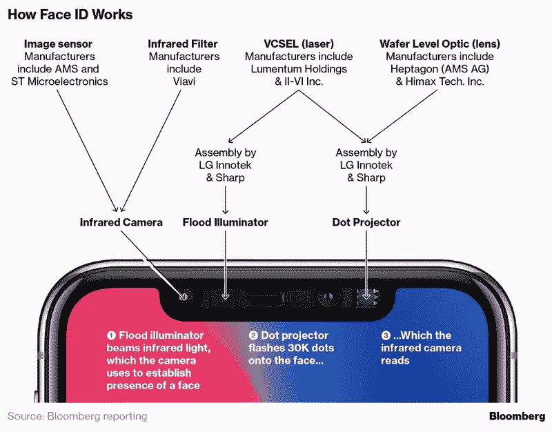

# 增强现实和虚拟现实的现在和未来

> 原文：<https://medium.com/hackernoon/the-present-and-future-of-augmented-reality-bf7213a1d4ea>

9 月，苹果和谷歌发布了 ARKit 和 ARCore——这两个工具可以帮助开发者推进增强现实应用的开发。此外，新的 iPhoneX 包含面部识别技术，这是硬件开发领域的另一个重要步骤，使我们更接近增强和虚拟现实(“VR”)体验。

## ***口袋妖怪 Go 和 AR 的爆炸***

围绕 AR 的[技术](https://hackernoon.com/tagged/technology)在学术空间已经发展了很多。然而，直到最近，移动设备才变得足够快和足够好，能够运行一些非常先进的算法。换句话说，AR 需要强大的硬件和软件来支持先进的计算机视觉工作。

Pokemon Go 在快速移动体验方面迈出了 AR 的第一步，它让人们可以轻松地出门体验增强现实。《口袋妖怪 Go》的成功可以用两个因素来解释:(1)采用了一些最先进的技术和一种新型的游戏方式；(2)将其与一个非常知名和怀旧的品牌相结合。这两个因素帮助 Pokemon Go 进入大众，并帮助社会了解增强现实实际上是什么样子的。

此外，口袋妖怪 Go 鼓励人们走出家门，在现实世界中一起玩游戏。这几乎就像梦想成真:口袋妖怪 Go 创造了一个看起来像真实世界的虚拟世界，让我们相信口袋妖怪的存在。因此，获得口袋妖怪在我们身边的共享体验以及增加一些与锻炼相关的活动在这个游戏的成功中发挥了重要作用。

## **行业对 AR 的推动**

苹果和谷歌这两家全球科技领军企业在 10 月份推出了 ARKit 和 ARCore。这两个系统标志着对 AR 体验民主化的重大推动。ARKit 和 ARCore 可以在数百万台移动设备上运行。API 和 SDK 使用起来相对简单，并允许人们以他们从未尝试过的方式进行实验。

然而，至少在一开始，ARKit 和 ARCore 将会遇到一些限制。首先，ARKit 和 ARCore 只提供手机体验，它们面临着*跟踪*的问题:覆盖并实现六个自由度(6DoF)。这只涵盖了前端(即可视化)。一旦开发人员开始构建更多独特的体验，就有必要构建与 web 中的后端解决方案有本质区别的后端。

第二，如果用户希望与多人分享他们的 AR 体验，并分享多人 AR 体验，这在 ARKit 或 ARCore 中是不可能的。

## 期待意想不到的事情

很快我们将进入一个阶段，AR 将变得非常有趣。这种形式的实验将导致增强现实新的伟大应用。目前很难预测我们将会看到什么样的应用。

这种意想不到的体验的一个很好的例子是 Instagram:一开始，许多人都在问一个带滤镜的照片应用程序是否有必要，instagram 卖得不够好。然而，现在 Instagram 是最受欢迎的社交应用之一，也是脸书最有价值的资产之一。

另一个类比可能是 iPhone 本身。在 2007-2008 年，当第一批 iPhones 推出时，我们看到了应用程序如何帮助使用闪光灯，并且花了相当多的时间才出现更令人兴奋的应用程序。

在 AR 领域也是如此:我们肯定会看到病毒式增长极高的解决方案。与此同时，将会有一个主要由艺术家和软件设计师进行学习和实验的阶段，试图找出可以建造什么。

目前，我们正处于过去的阶段，AR 应用的构建才刚刚开始。在未来的一两年里，我们肯定会看到大量的垃圾被开发出来。我们还应该记住，开发一个优秀的应用程序通常需要 9 到 12 个月的时间。

ScopeAR solution

毫无疑问，伟大的 AR 应用程序目前正在制作过程中，很快我们就会看到它们。很可能一些令人惊叹的 AR 应用将首先出现在企业应用领域。这些应用程序将使学习和培训变得更加容易。其中一个这样的 AR 学习工具就是由 [ScopeAR](https://www.scopear.com/) 提供的。

企业 AR 解决方案的伟大之处在于问题范围相对狭窄。这使得在规定的空间或其他可能影响开发的因素中限制应用程序变得更加容易。

## 影响 AR 应用繁荣的因素

首先，有两个新的东西使 AR 变得独特:(i) AR 将使设备的定位变得更加重要；以及(ii)新的 AR 内容将为移动设备用户提供全新的体验。

一旦开发者开始理解这两个关键因素，那么我们将开始看到 AR 的繁荣。优步可能是一个很好的学习例子:在个人电脑时代的早期，不可能开发出超级风格的应用程序；优步只有在移动平台出来的时候才开始有意义。

此外，创作和 AR 应用程序的整个画布也不同于传统的移动应用程序。直到现在，我们已经习惯于把手机屏幕看作一块画布。有了 AR，我们周围的所有空间都变成了一块画布，我们可以在上面体验 AR。感知画布的变化也将导致用户体验的巨大变化。

AR 还将改变移动设备用户的位置感知:AR 将使设备用户能够开始与他们所在的空间进行交互，而不是与他们的手机进行交互。

## 同时增强

与 AR 一起，我们可以期待新的尝试，以同时增强音频、地理空间和视觉体验，从而带来改变周围世界感知的体验。这可能是一个有趣的转变，从我们现在生活的世界到一个增强的世界。

是什么阻止了我们实现增强现实？这里最大的因素是 rime *。*如前所述，首先开发者和艺术家需要了解增强的潜力；而一旦这个初期过去，我们就会看到 AR 的下一个阶段。

2017 年 10 月，苹果发布了新的 iPhone X，其中包含了突破性的面部识别技术。这种面部识别技术通过结合四个组件而成为可能:(I)普通摄像头，(ii)红外摄像头；㈢点投影仪；以及(iv)泛光照明器。

AR/VR 行业一直希望在 iPhoneX 的背面引入相同的技术，这可能是硬件开发中更大的突破，可能会为 AR/VR 开发带来更大的潜力。

然而，大多数新一代智能手机已经具有识别表面的能力，这有助于放置 AR 对象并引入各种 AR 体验。但是开发者想得更远。例如，CurioPets 应用程序的开发者可以让移动设备用户拥有自己的数字宠物，他们可以考虑使用 iPhoneX 的面部识别功能为 CurioPets 添加一些个性化功能。也就是说，根据 iPhoneX 主人的面部表情，宠物应该能够做出相应的反应。

> “将情感方面与 AR 技术的使用联系起来真的很重要。”(CurioPets 首席执行官 Nathan Kong)。

## 改变移动设备的使用模式

AR 到达手机并使用户能够拥有增强世界体验的阶段肯定会持续一段时间。然而，我们可能想知道人们是否愿意适应使用硬件的新方式(将他们的设备保持在特定位置，这是 AR 应用程序运行所必需的)。当然，不是所有人都愿意调整和改变他们使用设备的习惯。

AR 开发人员目前正在思考有哪些方法可以促进人类行为的改变。例如，Snapchat 用户平均每次使用该应用 15 秒；移动 AR 体验预计将吸引 2-5 分钟的用户参与，在某些情况下可达 15 分钟。

因此，一个潜在的问题是，什么可以让 AR 技术足够引人注目？我们肯定处于早期开发周期，这使得很难预测。

AR 的主要应用之一是体育赛事和音乐会。开发者将利用观众目前的习惯，他们热衷于拍照，甚至直播他们正在参加的活动。因此，不难想象如何增加音乐会或体育赛事:显示运动员的统计数据或让想象中的龙从舞台后面出现(例如:朝鲜的 SKT 棒球场)。

## AR 当前面临的挑战

AR 的进一步发展面临三个主要挑战:功率/电池寿命、光学和时尚*。*

*光学*需要物理领域的新发现。因此，光学拓展了同样依赖运气的研究领域。在天空中有一个巨大的光子发生器的外部环境中，光学更具挑战性:)

由于现有的技术，光学是一个难题。工程师们必须重新考虑图像是如何到达人眼的，并找到与增强周围世界相关的进一步解决方案。

*时尚解决方案*对于 AR 设备的采用也很重要。如果我们正在考虑眼镜或眼镜，它们应该很酷，否则将没有人想要它们。目前，在有人能制造出高质量的小玻璃杯之前，我们还很遥远。

一些专家预测，我们还需要大约五年的时间来缩小这项技术，生产出可以被广泛采用的东西。此外，将不得不花费数十亿美元来制造下一个令人惊叹的可穿戴设备。

不过，AR 令人兴奋的一点是，它需要全新的后端架构以及 UX 解决方案；尽管这可能需要一些时间。

有没有可能加快 AR/VR 的开发周期？与其他技术相比，增强现实提出的技术问题具有非常不同的性质。同样的问题也适用于耳机。软件工程师将不得不从现实世界中学习，并开发适合 AR 空间的新编程模式。目前，移动设备提出了二维问题。但是 AR/VR 带来的是现在还没有看到的三维问题。

AR 打开了新的市场和新的空间来创建内容，并为我们所有人提供全新的体验。那些设法获得与增强相关的金块的人将能够获得回报。

激动人心的时刻！:)

*感谢您阅读这篇文章！如果你喜欢，点击并按住*👏*在你的左边，或者留下评论。*

我每周发表一个新故事。关注我，你不会错过我对创新、创造力以及硅谷和其他地方的最新趋势的见解！