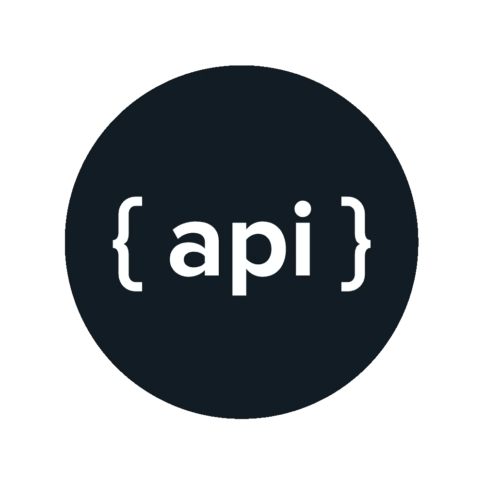

# API 的问题是

> 原文：<https://medium.com/hackernoon/the-problem-with-apis-331f08f7a39c>

Photo Credit: rigor.com

如今，如果你是一名开发 web 或移动应用程序的开发人员，你可能需要与服务器通信以获得特定的服务或访问数据库。这意味着实现一个 API(通常是 RESTful API)将是开发应用程序的关键部分。不幸的是，RESTful APIs 可以采取许多不同的形状和形式，尽管它们中的大多数完成非常相似的功能。在 javascript 领域尤其如此，开发人员可以随心所欲地构建代码。如果您从事过多个 API 项目，那么您很可能有过以一千种不同的方式编写一千次相同的 API 代码的经历。有一些很棒的工具可以让这个过程不那么痛苦，比如 hapi 和 express 之类的服务器框架，或者 mongoose 和 sequelize 之类的 ODM/ORMs，但是，即使有了这些工具，设置特定于项目的最基本的 CRUD api 端点也需要大量的代码，特别是如果您计划实现 API 文档和验证之类的标准特性的话。虽然所有这些工具、选项和特性都允许对 API 进行很好的控制，但它们可能会变得很麻烦，如果不是势不可挡的话，尤其是如果您正试图快速开发 API 以获得概念验证/最小可行产品，如果您是开发 API 的新手就更是如此。

Do any of us really?

考虑到这一点，我决定为快速 RESTful API 开发创建一个框架。我的目标是提供一个工具，允许开发人员快速设置反映其数据库模式结构的 REST 端点，即使他们对 API 没有什么经验。结果就是 [**rest-hapi**](https://github.com/JKHeadley/rest-hapi) ，一个围绕 [hapi](http://hapijs.com/) 框架和[mongose](http://mongoosejs.com/)ODM 构建的 RESTful API 生成器。rest-hapi 基于 mongose 模型自动设置 CRUD 端点，这意味着开发人员所要做的就是设置他们的 mongose 模型并配置服务器，然后就万事大吉了！最重要的是，rest-hapi 有内置的验证(使用 [joi](https://github.com/hapijs/joi) )和文档(通过 [hapi-swagger](https://github.com/glennjones/hapi-swagger) )。一旦服务器启动并运行，就可以通过查看 swagger 文档快速轻松地对其进行测试和记录。

hapi and mongoose are core tools used in rest-hapi

rest-hapi 试图解决的另一个主要障碍是关于数据库是选择 SQL 还是 NoSQL 的永无止境的决策。一般来说，开发人员选择 SQL/关系数据库是因为它们提供的结构优势，因为大多数项目的数据中自然包含某种关系结构，而选择 NoSQL 数据库是因为它们的灵活性和可伸缩性。rest-hapi 试图通过使用 NoSQL 数据库( [MongoDB](https://www.mongodb.com/) )作为其基础来结合两者的优点，同时还允许在模型定义中轻松定义关系结构。当定义模型关联时，rest-hapi 会自动生成关联端点和 CRUD 端点。

Standards, anyone? Photo Credit:

虽然 rest-hapi 没有提供 api 开发的终极解决方案，但我相信，对于那些希望快速建立 API 来测试他们最新应用理念的开发人员来说，它将是一个很好的工具。目前该项目仍处于起步阶段，但最终我希望它能够成为生产级项目的基础。请花点时间来看看吧！如果您有任何反馈，请随时在 [GitHub](https://github.com/JKHeadley/rest-hapi/issues) 中发表问题，或者如果您想与我取得联系，您可以通过 [Twitter](https://twitter.com/JKHeadley) 、[脸书](https://www.facebook.com/justinkheadley)或 [LinkedIn](https://www.linkedin.com/in/justinkheadley) 联系我，或者发电子邮件至[headley.justin@gmail.com](mailto:headley.justin@gmail.com)。感谢阅读！

(感谢[扎克·史密斯](https://github.com/zacharyclaysmith)开发了产生 rest-hapi 的 API 生成器，感谢 [Scal.io](http://www.scal.io/) 的出色表现)

> [黑客中午](http://bit.ly/Hackernoon)是黑客如何开始他们的下午。我们是 AMI 家庭的一员。我们现在[接受投稿](http://bit.ly/hackernoonsubmission)并乐意[讨论广告&赞助](mailto:partners@amipublications.com)机会。
> 
> 如果你喜欢这个故事，我们推荐你阅读我们的[最新科技故事](http://bit.ly/hackernoonlatestt)和[趋势科技故事](https://hackernoon.com/trending)。直到下一次，不要把世界的现实想当然！

