# DynamoDB 自动缩放的问题以及如何改进

> 原文：<https://medium.com/hackernoon/the-problems-with-dynamodb-auto-scaling-and-how-it-might-be-improved-a92029c8c10b>

## AWS 宣布了期待已久的 DynamoDB 自动扩展功能，但我们发现它需要太长的时间来扩展，并且扩展不够积极，因为它通过使用消耗的容量而不是实际的请求数作为扩展指标。

在 [Space Ape Games](http://spaceapegames.com/) 这里，我们开发了一项内部技术来自动扩展 DynamoDB 吞吐量，并在生产中成功使用了几年。它甚至与我们的 [LiveOps](https://www.youtube.com/watch?v=zywAS1NB9V4) 工具相集成，并根据现场活动的时间表扩展我们的 DynamoDB 表。这样，我们的表总是在事件开始时不可避免的流量高峰之前提供。

自动伸缩 DynamoDB 是 AWS 客户的一个常见问题，我在之前的两家公司亲自实现了类似的技术来处理这个问题。在 Yubl 的时候，我甚至把同样的技术应用到了[的自动缩放动作流](https://read.acloud.guru/auto-scaling-kinesis-streams-with-aws-lambda-299f9a0512da)上。

当 AWS [宣布 DynamoDB 自动缩放](https://aws.amazon.com/about-aws/whats-new/2017/06/announcing-amazon-dynamodb-auto-scaling/)时，我们非常兴奋。然而，伴随公告的[博客文章](https://aws.amazon.com/blogs/aws/new-auto-scaling-for-amazon-dynamodb/)说明了两个问题:

*   扩大规模的反应时间很慢(10-15 分钟)
*   它的规模不足以维持 70%的利用率水平

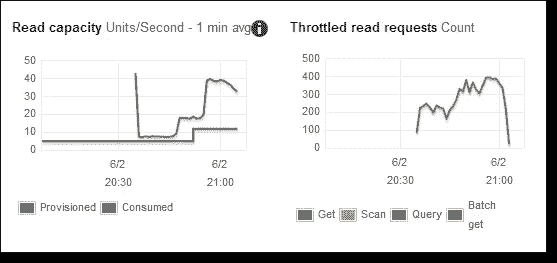

Notice the high no. of throttled operations despite the scaling activity. If you were scaling the table manually, would you have settled for this result?

看起来作者的测试并不符合 DynamoDB Auto Scaling 旨在适应的工作负载类型:

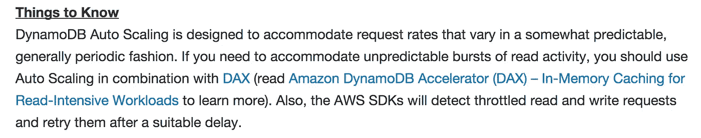

在我们的例子中，我们也有一个很高的读写比率(通常在 1:1 左右)，因为玩家在游戏中执行的每个动作都会以某种方式改变他们的状态。所以不幸的是，我们不能把 DAX 作为一张免罪卡。

# DynamoDB 自动缩放的工作原理

当您修改表的读取或写入吞吐量的自动缩放设置时，它会自动为该表创建/更新 CloudWatch 警报—四个用于写入，四个用于读取。

从下面的截图可以看出，DynamoDB 自动缩放使用 CloudWatch 警报来触发缩放操作。当消耗的容量单位连续 5 分钟超过表中的利用率级别(默认为 70%)时，它将按比例增加相应调配的容量单位。

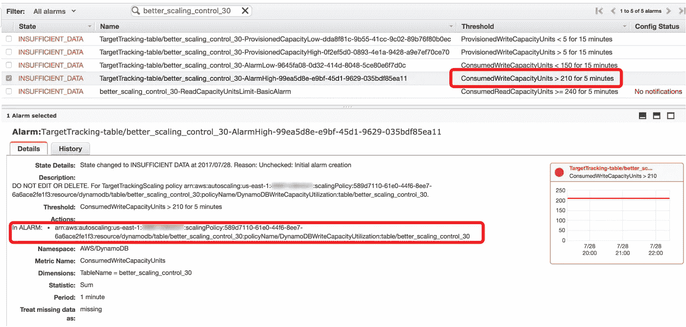

# 当前系统的问题，以及如何改进

从我们自己的测试中，我们发现 DynamoDB 在扩展时表现平平，这源于两个问题:

1.  CloudWatch 警报需要连续 5 次阈值突破。当您考虑到 CloudWatch 指标中的延迟(通常落后几分钟)时，这意味着在首次突破指定利用率级别后的 10 分钟内会发生**扩展操作**。这个反应时间太慢了。
2.  **新供应的容量单位是根据消耗的容量单位计算的，而不是根据实际请求数**计算的。消耗的容量单位本身受到供应的容量单位的限制，即使有可能通过[突发容量](http://docs.aws.amazon.com/amazondynamodb/latest/developerguide/GuidelinesForTables.html#GuidelinesForTables.Bursting)暂时超过供应的容量单位。这意味着，一旦您用尽了节省的突发容量，实际请求数量可能会开始超过消耗的容量单位，而扩展无法跟上实际请求数量的增长。稍后我们将在控制组的结果中看到这种影响。

基于这些观察，我们假设您可以对系统进行两项修改以提高其有效性:

1.  在 1 次阈值突破后触发扩大，而不是 5 次，这符合**“早扩大，慢缩小”**的口头禅。
2.  **根据实际请求数**而不是消耗的容量单位触发扩展活动，并使用实际请求数计算新供应的容量单位。

作为这个实验的一部分，我们还原型化了这些变化(通过劫持 CloudWatch 警报)来展示它们的改进。

# 测试方法

该测试最重要的事情是以一种**可靠的**和**可再现的**方式生成期望的流量模式。

为了做到这一点，我们有一个递归函数，它将每秒钟对测试中的 DynamoDB 表发出`BatchWrite`请求。每秒项目速率是基于以秒为单位的运行时间(`t`)计算的，因此它为我们提供了很大的灵活性来形成我们想要的流量模式。

由于 Lambda 函数最多只能运行 5 分钟，当`context.getRemainingTimeInMillis()`小于 2000 时，该函数将递归并传递有效负载中最后记录的运行时间(`t`)以供下次调用。

其结果是一个连续的，顺利的交通模式，你看到如下。

我们测试了我们经常看到的两种流量模式。

## 钟形曲线

对于大多数人来说，这应该是一种熟悉的流量模式——流量从低谷到高峰缓慢而稳定地增长，然后随着用户进入睡眠状态而快速下降。经过一夜稳定的交通之后，第二天情况又开始好转。

对于我们中许多用户群集中在北美地区的人来说，高峰通常在英国时间凌晨 3-4 点左右——我们更需要 *DynamoDB Auto Scaling* 来完成它的工作，而不是吵醒我们！

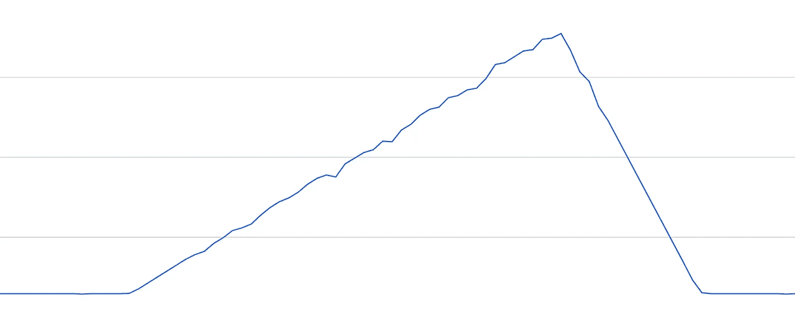

This traffic pattern is characterised by a) steady traffic at the trough, b) slow & steady build up towards the peak, c) fast drop off towards the trough, and repeat.

## 头重

这种流量的突然爆发通常是由一个事件促成的——营销活动、应用程序商店的促销，或者在我们的情况下，是一个预定的 LiveOps 活动。

在大多数情况下，这些事件是可预测的，我们通过自动化工具提前扩展 DynamoDB 表。然而，在意外流量突发的情况下(这种情况在我们身上发生过几次),一个好的*自动缩放系统应该快速而积极地扩展，以最大限度地减少对我们玩家的干扰。*

*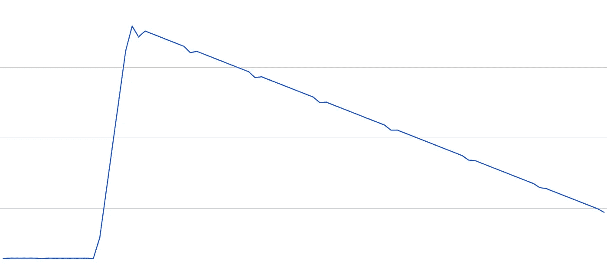*

*This pattern is characterised by a) sharp climb in traffic, b) a slow & steady decline, c) stay at a stead level until the anomaly finishes and it goes back to the Bell Curve again.*

*我们根据几个`utilization level`设置(默认为 70%)测试了这些流量模式，看看它是如何处理它们的。我们通过以下方式衡量系统的性能:*

*   *成功请求的百分比(即消耗的容量/请求数)*
*   *测试期间被抑制的请求总数*

*这些结果将作为我们的对照组。*

*然后，我们针对我们在上面提出的两个假设的自动缩放变化测试了相同的流量模式。*

*为了对提议的更改进行原型化，我们劫持了由 DynamoDB auto scaling 使用 CloudWatch 事件创建的 CloudWatch 警报。*

*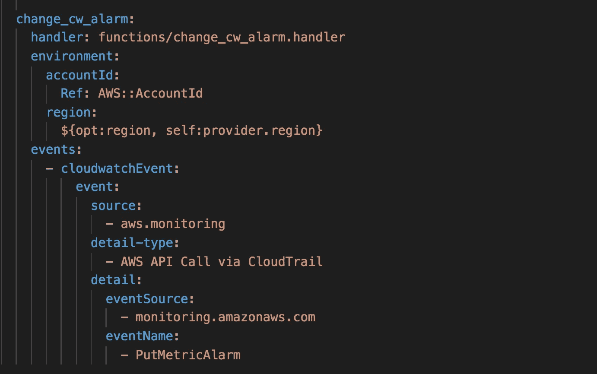*

*当进行一个`PutMetricAlarm` API 调用时，我们的`change_cw_alarm`函数被调用，并用相关的更改替换现有的 CloudWatch 警报——即。对于假设 1，将`EvaluationPeriods`设置为 1 分钟。*

*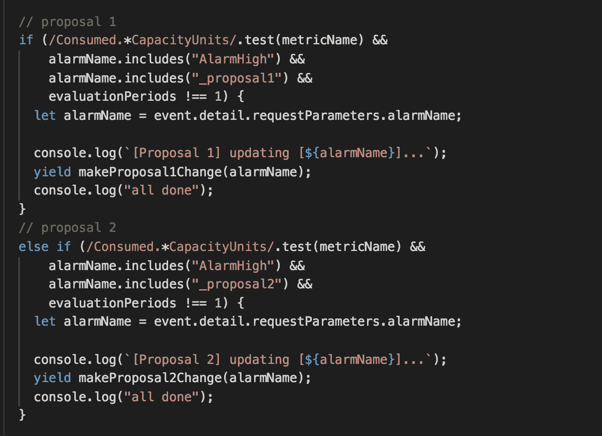*

*To avoid an invocation loop, the Lambda function will only make changes to the CloudWatch alarm if the EvaluationPeriod has not been changed to 1 min already.*

*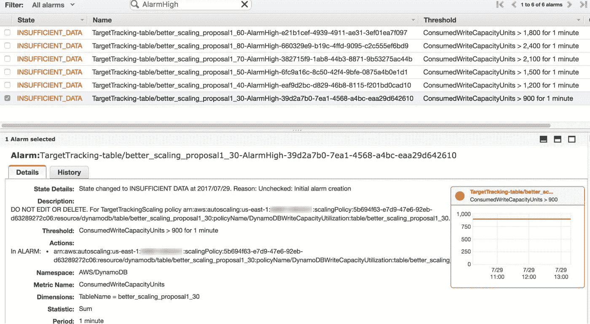*

*The change_cw_alarm function changed the breach threshold for the CloudWatch alarms to 1 min.*

*对于假设 2，我们必须接管扩展表的责任，因为我们需要使用跟踪实际请求数的自定义指标来计算新调配的容量单位。因此，为什么 CloudWatch 警报的`AlarmActions`在这里也被覆盖了。*

*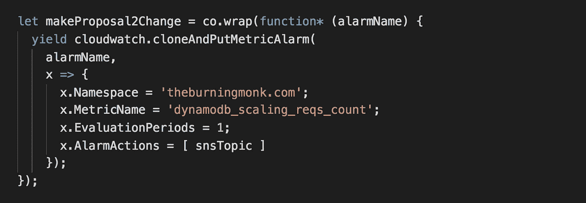*

*The SNS topic is subscribed to a Lambda function which scales up the throughput of the table.*

# *结果(钟形曲线)*

*测试设置如下:*

1.  *表格从 50 个写容量单位开始*
2.  *流量以每秒 25 次写入的速度稳定保持 15 分钟*
3.  *然后，在接下来的 45 分钟内，流量以稳定的速率增加到峰值水平(每秒 300 次写入)*
4.  *在接下来的 15 分钟内，流量以稳定的速度回落到 25 次写入/秒*
5.  *流量稳定在每秒 25 次写入*

*图中所有的单位都是 SUM/min，这是 CloudWatch 跟踪`ConsumedWriteCapacityUnits`和`WriteThrottleEvents`的方式，但我必须将`ProvisionedWriteCapacityUnits`(按秒单位跟踪)标准化，以使它们保持一致。*

*让我们先来看看对照组(vanilla DynamoDB auto scaling)在 30%到 80%的不同利用率水平下的表现。*

*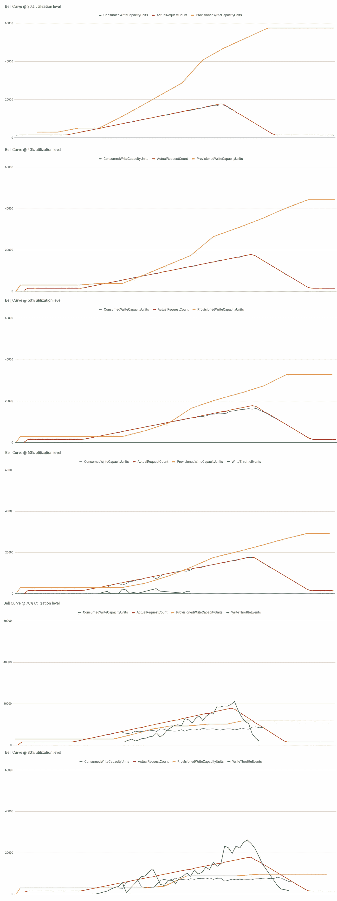**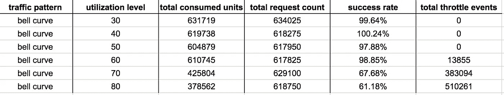*

*I’m not sure why the `total consumed units` and `total request count` metrics didn’t match exactly when the utilization is between 30% and 50%, but seeing as there were no throttled events I’m going to put that difference down to inaccuracies in CloudWatch.*

*我从这些结果中得出几点看法:*

1.  *在 30%-50%的利用率级别，写操作永远不会受到限制，这是我们希望在生产中看到的。*
2.  *在 60%的利用率级别，缓慢的反应时间(问题 1)导致写入在系统调整以适应负载稳定增长的早期受到抑制，但它最终能够适应。*
3.  *在 70%和 80%的利用率水平，事情真的分崩离析。实际请求数量的增长超过了消耗的容量单位的增长，越来越多的写操作受到抑制，因为系统无法适应新水平的**实际利用率**(与按消耗的容量单位衡量的*“允许”*利用率相反，即问题 2)。*

## *假设 1:1 分钟破裂后的缩放*

*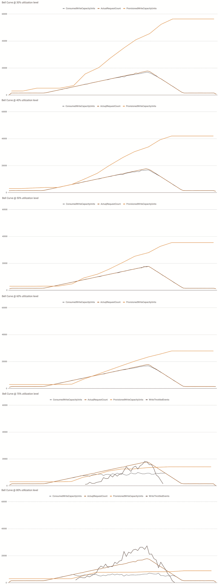**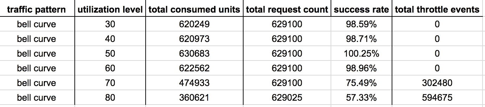*

*一些观察结果:*

1.  *在 30%-50%的利用率水平下，性能没有差别。*
2.  *在 60%的利用率级别，我们在控制组中看到的早期限制写入现在得到了解决，因为我们缩短了系统的反应时间。*
3.  *在 70%-80%的利用率水平下，性能差异可以忽略不计。这是预料之中的，因为对照组中的不良表现是由问题 2 引起的，所以在这些情况下，仅仅提高反应时间不可能显著提高表现。*

## *假设 2:违反实际请求计数 1 分钟后进行缩放*

*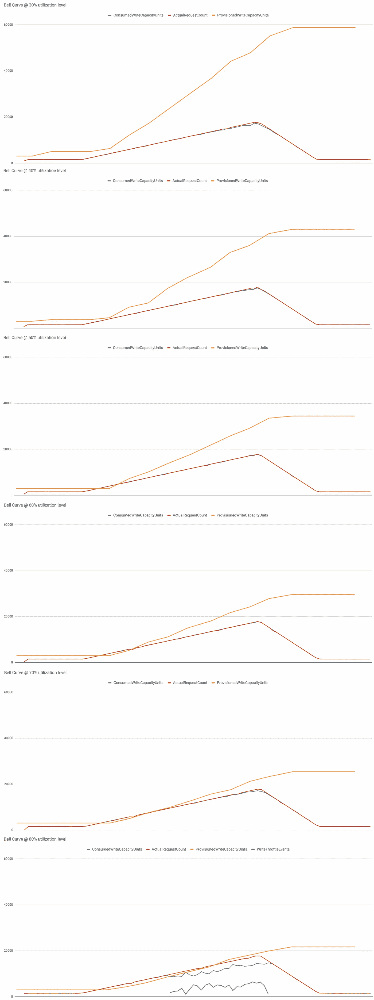**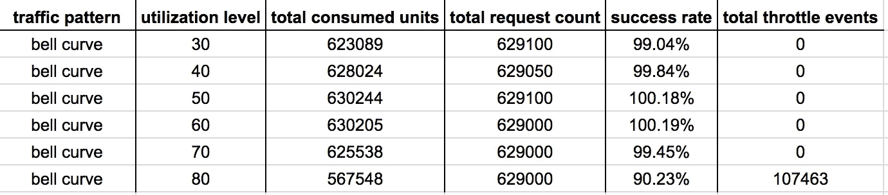*

*根据实际请求数进行扩展，并使用实际请求数来计算新调配的容量单位，会产生惊人的结果。在 30%-70%的利用率水平上，没有**节流事件**。*

*即使在 80%的利用率水平下,`success rate`和节流事件的总数都有显著提高。*

*对于自动伸缩系统来说，这是一个可以接受的性能水平，我很乐意在生产环境中使用。尽管如此，我还是倾向于谨慎，选择 70%或更低的利用率水平，以便为表提供足够的空间来处理流量的突然增加。*

# *结果(头重脚轻)*

*测试设置如下:*

1.  *表格从 50 个写容量单位开始*
2.  *流量以每秒 25 次写入的速度稳定保持 15 分钟*
3.  *然后，在接下来的 5 分钟内，流量以稳定的速率跃升至峰值水平(每秒 300 次写入)*
4.  *然后，流量以每分钟 3 次写入/秒的速度下降*

*同样，让我们先来看看控制组(vanilla DynamoDB auto scaling)在不同利用率水平下的性能。*

*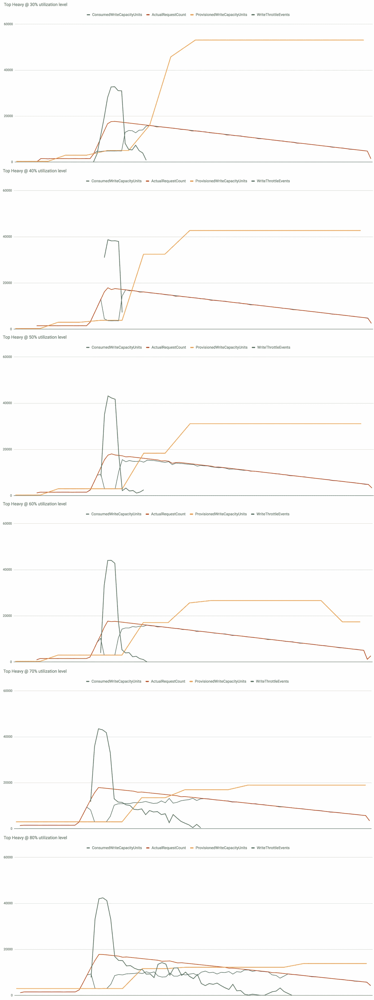**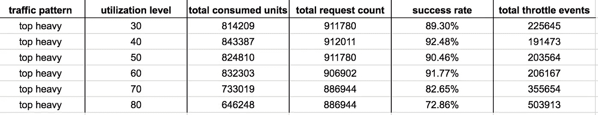*

*以上结果的一些观察结果:*

1.  *在 30%-60%的利用率水平下，大多数受抑制的写入可归因于缓慢的反应时间(问题 1)。一旦该表开始扩大，受限制的写入数量就会迅速减少。*
2.  *在 70%-80%的利用率水平上，系统也没有足够积极地扩展(问题 2)。因此，我们经历了更长时间的限制写入，导致整体性能更差。*

## *假设 1:1 分钟破裂后的缩放*

*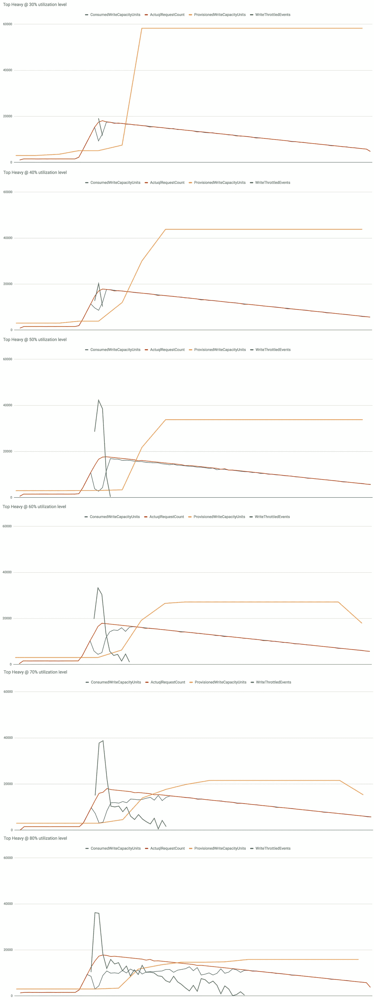**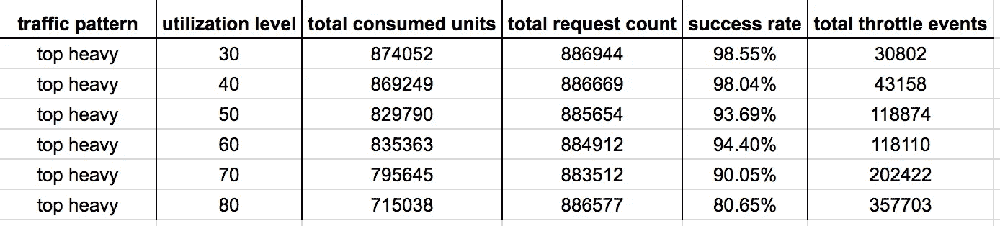*

*一些观察结果:*

1.  *总体而言，性能有所提高，尤其是在 30%-60%的利用率水平上。*
2.  *在 70%-80%的利用率水平上，我们仍然会看到问题 2 的影响—扩展不够积极。因此，受限制的写操作仍然有一条长长的尾巴。*

## *假设 2:违反实际请求计数 1 分钟后进行缩放*

*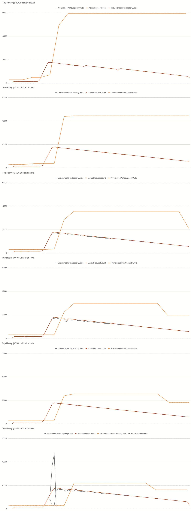**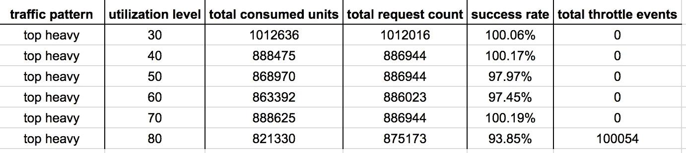*

*与我们在*钟形曲线*流量模式中观察到的情况类似，这种实施方式在处理所有测试的利用率级别的流量突发峰值方面明显更好。*

*即使在 80%的利用率水平下(这实际上并没有给你留下太多的空间)，也有 94%的写操作成功(相比之下，控制组记录的是 73%)。虽然仍然有大量的节流事件，但与 vanilla DynamoDB 自动缩放记录的 500k+计数相比，这是有利的。*

# *结论*

*我喜欢 DynamoDB，我想使用它的开箱即用的自动伸缩功能，但它并不完全符合我目前的期望。我希望 AWS 的人正在阅读这篇文章，这篇文章提供了足够的证据(正如你从下面的数据中看到的),它可以通过相对较小的变化得到极大的改善。*

*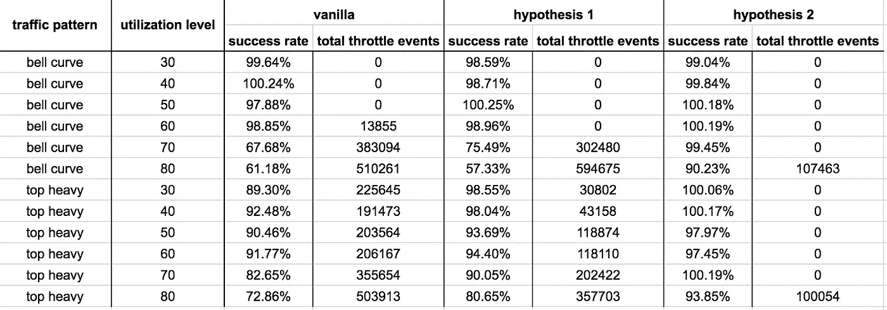*

*你可以随意玩这个演示，所有的代码都可以在[这里](https://github.com/theburningmonk/better-dynamodb-scaling)找到。*

* [## 燃烧 monk/better-dynamodb-scaling

### 更好的-dynamodb-缩放-使 dynamo db 的自动缩放动作发生得更快

github.com](https://github.com/theburningmonk/better-dynamodb-scaling)* 

*喜欢你正在读的东西吗？查看我的视频课程 [**生产就绪无服务器**](https://bit.ly/prod-ready-serverless) ，学习如何在生产中运行无服务器应用。*

*我们将讨论的主题包括:*

*   *使用 API 网关和 Cognito 进行身份验证和授权*
*   *在本地测试和运行功能*
*   *项目组织策略*
*   *CI/CD*
*   *集中伐木*
*   *监视*
*   *X 射线分布式跟踪*
*   *跟踪相关 id*
*   *性能和成本优化*
*   *错误处理*
*   *配置管理*
*   *金丝雀部署*
*   *VPC*
*   *安全*
*   *Lambda、Kinesis 和 API 网关的最佳实践*

*并包括在最近的 AWS re:Invent 大会上宣布的所有最新变化！*

* [## 生产就绪无服务器

### 看到了。动手吧。学着点！生产就绪无服务器:运营最佳实践向您介绍领先的模式和…

bit.ly](https://bit.ly/prod-ready-serverless)*