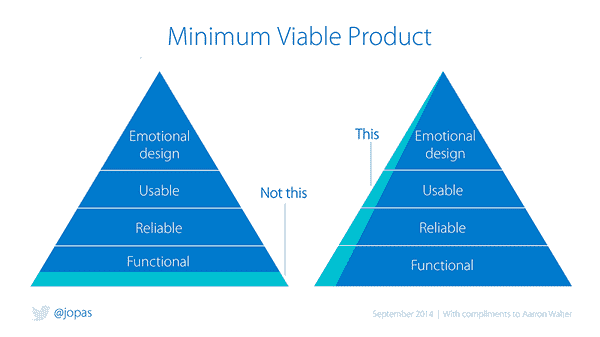

# 产品开发人员:让开发人员在产品团队中大放异彩的 6 个技能以及如何面试他们

> 原文：<https://medium.com/hackernoon/the-product-developer-d8410c092db8>

有很多技能可以区分一个好的(或坏的)开发人员。但特别是，在处理数字产品时，有一些更重要。

受马蒂·卡甘对[产品设计师](https://svpg.com/the-product-designer-role/)的定义的启发，我决定谈谈我所认为的 ***产品开发人员*** 。

这是什么意思？和设计师一样，开发人员会有许多不同的技能和(甚至更重要的)心态。为了建立成功的 ***产品团队*** 有一种特殊类型的开发人员会大放异彩。这些人我称之为“产品开发人员”。

让我们来看看这些是什么，以及它们为什么要分开。

# 产品开发人员特征

## 1.面向客户

最重要的是，这个角色最重要的特点是 ***以客户为中心*** 。我们需要以客户为中心的产品团队，团队中的任何角色都应该如此。

从开发人员的角度来看，这意味着让客户满意应该高于代码的完美。当然，我们希望我们的产品中有优秀的代码，但是如果这会妨碍客户的满意，这不是这个角色愿意走的路。

另一方面，这类开发人员喜欢更多地了解客户。当他们开始一项新任务时，他们想知道他们为什么这样做，这会对用户产生什么影响？他们喜欢从产品经理或产品设计师那里获得关于最新用户研究的信息，甚至参与可用性测试或访谈。

## 2.商业利益

或许类似于“以客户为中心”,这些软件工程师明白我们在这里是为了赚钱。例如，当不得不做“不那么有趣”的事情或挑战产品的某些部分来支持业务规则时，这种兴趣就会被注意到。

另一方面，我评估他们在多大程度上致力于紧急解决影响业务的生产错误。如果发现了一个 bug，并且借口说不立即处理它，这可能是他们不接受这个概念的一个征兆。

与第一点类似，他们也有兴趣了解业务。我们如何赚钱？到目前为止，我们的结果如何？当产品经理分享关于业务运作的指标和见解时，他们会很感激。

## 3.结果与产出驱动

遵循前两点，这类专业人员的关注点不是“产生了多少代码/特性”(输出)，而是我们所做的如何影响结果(结果)。

我通常会感谢他们参与团队工作的优先排序和范围界定，并提供他们的意见，以专注于如何让我们事半功倍。

他们明白，为了看到价值，一切都需要在 A/B 测试中发布(即使以这种方式发布需要更多的努力)，在发布之后，他们将渴望从 KPI 改进的角度看到结果。

## 4.面向价值的切片

我在产品经理和开发人员之间看到的一个常见问题是，如何将大的功能划分成仍然增加价值的小部分。从开发的角度来看，很多时候将前端和后端分开会更有效，比如在一个 sprint 中编写后端代码，而在下一个 sprint 中编写前端代码。

这种方法的问题是，在两次冲刺都完成之前，不添加任何值。是的，在第一次冲刺的最后，你有一个可交付成果，但是没有增加真正的客户价值，也没有降低风险。

产品开发人员明白，需要以一种方式分割工作，这种方式可能不是开发时间效率的最佳方式，但是可以最大化客户价值和/或降低风险。

## 5.返工公差

另一件让一些开发人员感到沮丧的事情是需要对同一个组件或特性进行两次工作。

但是当我们在做产品的时候，**几乎可以肯定的是，你将会对系统的同一个部分进行多次优化**。

我想到的一个快速例子是搜索框。如果你看到一个电子商务或内容产品，搜索组件可能是非常重要的。团队会一遍又一遍地优化它。甚至一些大公司可能有专门致力于某个特定组件的团队。

## 6.实验公差

实验将对开发工作产生两方面的影响:

1.  与返工相关，我见过开发人员在需要扔掉他们做的东西时变得非常恼火。当你做实验的时候，你是在做，因为很有可能有些事情不像你预期的那样。所以你肯定会扔掉代码。
2.  你做实验的代码就是原型代码(这是丑的一个花哨的词)。因为您希望在验证这个想法是否可行之前花费最少的努力，所以您应该以最便宜的方式编写代码。这不是所有开发者都愿意做的事情。

对于产品开发来说，最好的开发人员不仅愿意为实验编写肮脏的代码并多次扔掉，而且能够思考出快速实现实验的最佳策略。

# 这个角色怎么面试？

现在我们有了一些让产品开发人员变得伟大的特征，如果能在面试中发现它们，那就太棒了。

有几个问题你可以添加到你的技术评估中，帮助你了解你的候选人是否符合这个标准。

## 1.面向客户

*   你目前正在开发的软件的客户是谁？
*   软件为他们解决了什么问题？
*   你参加过可用性测试或者用户访谈吗？
*   你从 UX/设计团队那里得到了什么信息？(*你正在寻找比“设计资产”更多的东西作为答案*
*   你的产品有不同的用户群吗？(*你想知道他是否谈到了人口统计或任何其他用户细分*

## 2.商业利益

*   你从事什么行业？你的竞争对手是谁？
*   你的公司是怎么挣钱的？
*   你知道并遵循(或被你的采购订单或利益相关者分享)的指标是什么？

## 3.结果与产出驱动

*   你如何衡量你的工作？
*   你如何评价你建造的东西是好的？
*   当你开始开发一个特性时，你会收到什么信息或者知道什么对你来说是重要的？(期待一些关于他/她如何理解我们构建此产品的“原因”的信息)

## 4.面向价值的切片

*   你必须建立一个用户配置文件工具，允许注册，查看，修改和删除。你知道大概需要 1.5 个月。你会如何计划前两周的冲刺？
*   你上一次遇到无法在 sprint 中完成的功能是什么时候，你对此做了什么？

## 5.返工公差

*   你上一次不得不在相对较短的时间内做两次同样的工作是什么时候？你对此感觉如何？

## 6.实验公差

*   假设你有一个新功能，需要 1 个月的时间来编码。你被要求在 1 周内完成，只是为了向 1%的用户群展示。在这种情况下，你会怎么做？(你在寻找类似“我不会做 I18N 的工作，只用英文发布它”，或者“我不会编写一个特定的错误流并留下一个 404”)。
*   你用过代码原型吗？为什么

# 结论

根据你想要的资历，你可能需要选择在面试中包含多少这样的问题。

他们中的大多数都没有一个“正确”的答案。正如我在开头所说的，我们正在试图理解她是如何思考和她的心态的。

我很想听听你的想法，我应该在这个列表中添加什么🙂

【leanexperimentation.com】最初发表于**。如果您喜欢它，并希望获得更多工具&提示来改进您的产品，您可以* [***订阅此处***](https://www.getdrip.com/forms/245370375/submissions/new)**并加入数百名读者的行列！***