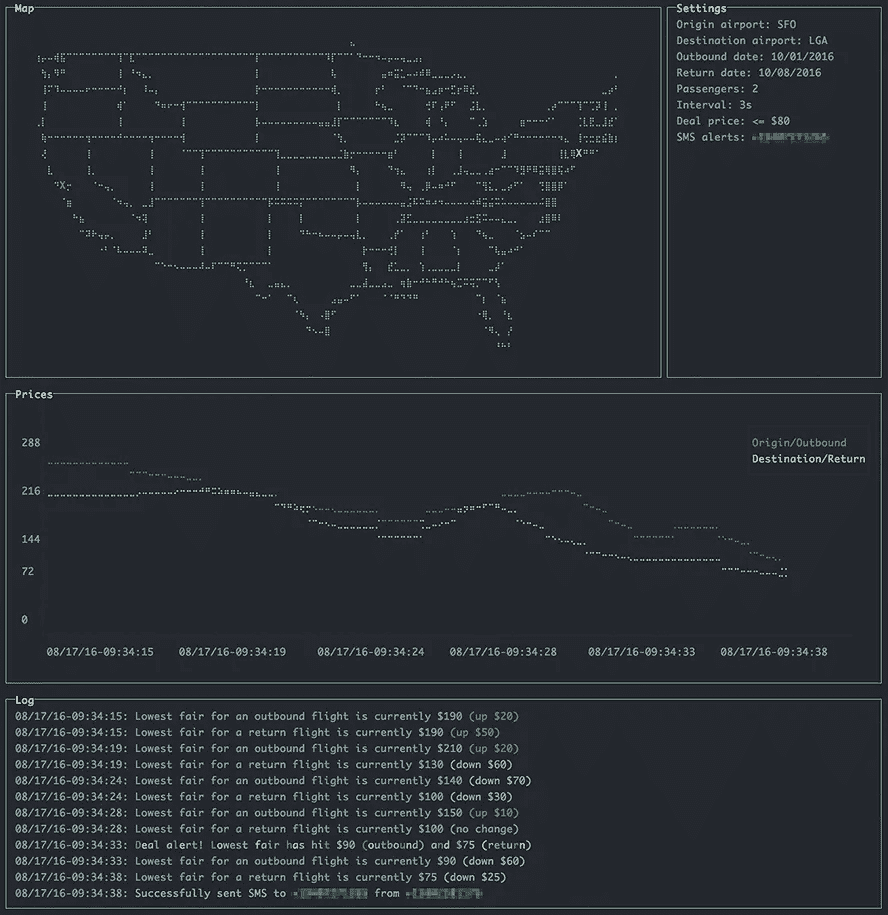

# 预订飞机的程序员指南

> 原文：<https://medium.com/hackernoon/the-programmers-guide-to-booking-a-plane-11e37d610045>

大约两个月前，我想去度假。我差不多已经选好了旅馆，但交通工具还没确定。

我开始在网上寻找便宜的飞机票，就像普通的 T2 旅行者和 T3 一样。我找遍了所有的豪华航空公司，但它们的票价对我来说都太高了。

我决定去看看西南航空，事实上的低价航空公司(其实不是)。我从一些网民那里听说[的门票](https://hackernoon.com/tagged/ticket)会在周二晚上降价，所以我开始验证这一说法。我开始全天定期查看票价。

几天过去了。

重新装弹。

重新装弹。

"您想重新提交这个表单吗？"

是的。

重新装弹。

没什么。

我开始对重复感到厌烦(惊讶，惊讶！)，所以我开始尽我所能让事情自动化。如果我写一个脚本来替我做这些烦人的任务呢？是啊。我喜欢这个主意。

# 爬西南网站

快速浏览一下西南航空的网站，发现没有 API。(这并不奇怪。)

我认为直接抓取他们的网站是一种有效的方法。我可以写一个脚本，你知道，从他们的网站上搜集我想要的数据。

我选择 Node 是因为我认为他们有很好的 web 抓取工具，在这一点上我或多或少是正确的。

当我开始试验算法…呃，脚本时，我意识到在西南航空的网站上伪造表单提交比我想象的要困难得多，这样我就可以进入结果页面。

我试过卷发。

我试过“复制为卷曲”

我试着假装用户代理。

我尝试了所有的方法。

解决方案是使用[渗透](https://github.com/rchipka/node-osmosis)来填写并提交搜索表单，*然后*抓取结果页面。

所以，我构建了一个快速而肮脏的命令行脚本，不时地抓取他们的网站。然后我让它每天晚上在我睡觉的时候做它的事情。它并不花哨，但它做了我让它做的事。

# 分析票价

我写了一个节点脚本…等等，我已经说过了。好吧。我有一个正在运行的脚本。它正在打印票价，但我不确定该如何处理这些数据。我又不想坐在那里看一晚上。

那我做了什么？我联系了 Twilio，每当车费达到某个阈值时，它就会给我发一条短信。Twilio 提供了一个免费账户，只要你验证了你要发送短信的电话号码，所以这很棒。所以我验证了我的号码，让短信进来。

由于我没有想清楚，我也选择以低间隔发送短信，这样它会一直 ping 我，直到我停止脚本，即使我正在和我可爱的妻子约会。

一点也不讨厌。/s

但是效果很好。我可以看到票价确实下降了，尤其是在深夜。这次上网的人没有骗我。

# 绘制数据

过了几天，我有点烦了(有什么新鲜事？)看着一串文字，想出复杂的方法，让我每天看它的那几秒钟看起来更有吸引力。

那我做了什么？我联系了[福佑](https://github.com/chjj/blessed)给我画一些图表，让事情看起来很漂亮。我在可爱的 [webpack-dashboard](https://github.com/FormidableLabs/webpack-dashboard) 中看到过祝福被使用，所以我想“为什么不呢？”。

太棒了。谢谢肯·惠勒。

# 预订航班

几天后，在一个普通的周二晚上，事情发生了:价格急剧下跌，这不是每周二都会发生的事情，而是随机发生的。我抢到了不到 100 美元的票。(当然，我是手动预订的，因为我的剧本没有*那么好。)*

# 甜蜜的胜利

一个月后，我去度假。仅此而已。如果你也想度过一个愉快的假期，你可以在 GitHub 上查看这个项目。

> **注:截至 2017 年 7 月，由于西南航空公司的撤销请求，该项目在 GitHub 上不再可用。**

> [黑客中午](http://bit.ly/Hackernoon)是黑客如何开始他们的下午。我们是 AMI 家庭的一员。我们现在[接受投稿](http://bit.ly/hackernoonsubmission)并乐意[讨论广告&赞助](mailto:partners@amipublications.com)机会。
> 
> 如果你喜欢这个故事，我们推荐你阅读我们的[最新科技故事](http://bit.ly/hackernoonlatestt)和[趋势科技故事](https://hackernoon.com/trending)。直到下一次，不要把世界的现实想当然！

