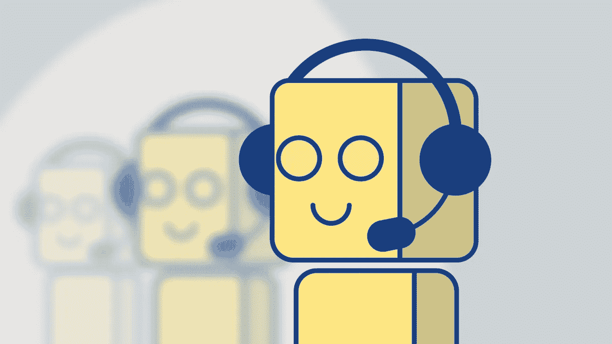

# 聊天机器人的承诺:个人助理不再只是富人的专利

> 原文：<https://medium.com/hackernoon/the-promise-of-chatbots-personal-assistants-are-no-longer-just-for-the-rich-638da4b1444f>

一个年轻女子在路上走着，看到了一个新的早午餐地点。这正是她朋友想尝试的地方。她拿出手机，开始输入信息，不是给她的朋友，而是给她的私人助理——她的私人聊天机器人。

*“这个周末我们和@Sam 一起去一号街的新店吃早午餐吧。”*

*她将手机放回口袋，继续赶路。在幕后，她和山姆的聊天机器人协调找到一个时间，然后预订一张两人桌。10 分钟后，她收到了一份日历邀请，邀请她参加本周末的早午餐，现在她所要做的就是出现。*

这个场景只是当消息应用程序完全利用聊天机器人时可能发生的事情的一个暗示。消息应用的当前发展正集中在构建生态系统上。中国的微信在这方面走在了前列。例如，他们通过社交、支付和信息将商店、餐馆和其他人与用户联系起来。这个视频很好地概括了微信的功能。

这些特征中的大多数要在西方根深蒂固还需要几年时间，但它们正在到来。看到他们如此紧密地模仿微信的模式将会非常有趣。虽然这些新的发展可供讨论的时机已经成熟(还有一两家初创公司)，但这篇文章将重点关注聊天机器人将如何在这种新范式中发展。

脸书、谷歌和苹果都在构建更具沉浸感的信息生态系统，然而，数字个人助理或聊天机器人的方法脱颖而出。脸书的信使生态系统包括完成任务的人工智能助手 [M](https://techcrunch.com/2017/04/06/facebook-messengers-ai-m-suggests-features-to-use-based-on-your-convos/) 。Allo 中的[谷歌助手](https://allo.google.com/)充当对话成员，帮助一个小组计划晚餐或寻找有趣的猫视频。在接下来的几年中，这种数字助理的趋势指向了从为母亲节订购鲜花(提示)到购买音乐会门票的更无缝的服务集成。

目前聊天机器人还处于起步阶段。不仅仅是科技公司，企业也开始使用它们进行简单的交易:从有点滑稽的使用 Slack [订购塔可钟](https://www.tacobell.com/feed/tacobot)到荷兰皇家航空公司的实用[飞行体验。然后是脸书老板马克·扎克伯格，他建立了一个个人人工智能来满足他的需求。](https://messenger.klm.com/)

我认为，聊天机器人的发展将分为两个阶段。

1)公司将开发强大的机器人，让消费者通过消息应用程序与之互动。

2)消息应用程序将为每个消费者提供一个机器人。这些人将充当个人助理。他们最初会与其他聊天机器人和人互动，然后在任何在线活动中代表我们行事。

我们现在处于第一阶段。自动化机器人是存在的，我们可以自己和它们聊天。例如，这里有[五家拥有引人注目的 bot 经验的公司](https://squareup.com/townsquare/how-5-innovative-businesses-are-using-chatbots)。由于人工智能和自然语言处理的进步，这些和其他聊天机器人正变得越来越强大，这使得计算机能够在上下文中准确地理解人类语言(口头或书面)。谷歌主页很好地展示了这一点。

虽然单个聊天机器人能够理解上下文是非常有益的，但它们仍然需要大量用户的参与。这就把我们带到了第二个阶段，在这个阶段，用户将能够把他们所有的动作委托给个人助理。这将大大减少完成任务或组织活动所需的时间。

第二阶段通过两个场景来说明。

假设您订购了一辆优步，但司机取消了订单。你的私人机器人会看到这一点，并迅速预订到同一地点的 Lyft。你的机器人也知道你要去赴宴。所以她(他，它？)通知餐厅的预订系统你的新到达时间，并给你要见的朋友发信息，所有这些你都不用动一根手指。

或者想象你想为周末制定计划——让你的私人助理去做就行了。让你的机器人知道你想做什么，比如在美好的天气里做些什么。该机器人将开始工作，为正在发生的事件抓取在线资源，找到符合你兴趣的热门资源，并确定潜在的合作伙伴。给你的机器人一个许可，它会做所有必要的安排，你所要做的就是出现。

这些场景的重点是说明个人聊天机器人将如何优于当今迎合富人和名人的个人助理。聊天机器人将更快、更准确、更便宜(免费阅读)。这种想法很疯狂，但我们都将拥有自己的*数字*个人助理，它非常了解我们，并代表我们工作。可以把这看作是近 5 年前推出的 Google Now 的巅峰之作。

当然，有一些重要的隐私问题必须得到解决，但是这篇文章的目的是要构思一个关于个人聊天机器人将会带来的美好未来的故事。谈到隐私问题本身是一个完全不同的话题。

所以下次当你制定计划并开玩笑地说“我会让我的人和你的人谈谈”的时候，你要知道我们离现实不远了，除了不会是人，而是聊天机器人。

TechCrunch

点击这里关注[马修·比金斯](https://medium.com/u/92f25ac1082d?source=post_page-----638da4b1444f--------------------------------)或者 [LinkedIn](https://www.linkedin.com/in/bigginsmatthew/) 了解更多

如果你喜欢这篇文章，请推荐，这样其他人也可以喜欢它！

> [黑客中午](http://bit.ly/Hackernoon)是黑客如何开始他们的下午。我们是 [@AMI](http://bit.ly/atAMIatAMI) 家庭的一员。我们现在[接受投稿](http://bit.ly/hackernoonsubmission)并乐意[讨论广告&赞助](mailto:partners@amipublications.com)机会。
> 
> 如果你喜欢这个故事，我们推荐你阅读我们的[最新科技故事](http://bit.ly/hackernoonlatestt)和[趋势科技故事](https://hackernoon.com/trending)。直到下一次，不要把世界的现实想当然！

