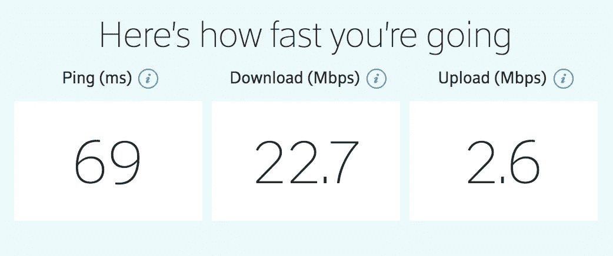
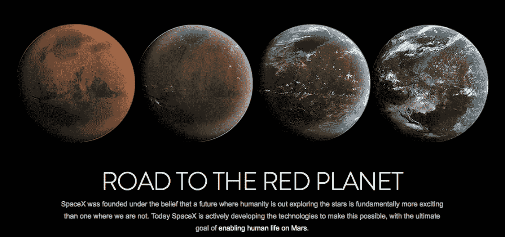

# 无处不在的互联网的承诺:SpaceX 的故事

> 原文：<https://medium.com/hackernoon/the-promise-of-ubiquitous-internet-a-spacex-story-fe19d4f629fc>

让我们面对现实吧。我们与手机相连。当我们错误地认为我们的手机振动表明我们收到了一条信息时，我们会感觉到幻觉振动。当我们没带手机时，我们会变得[焦虑](https://www.scientificamerican.com/article/scientists-study-nomophobia-mdash-fear-of-being-without-a-mobile-phone/)，感觉好像失去了身体的一部分。当我们的手机[电池没电](http://www.prnewswire.com/news-releases/low-battery-anxiety-grips-9-out-of-ten-people-300271604.html)时，我们很无助。

虽然这篇文章不会帮你解决丢失手机的问题，但是我的朋友们，还是有希望的。解决电池问题还需要几年时间。

 [## 无线充电:没有电线的世界

### “这是什么爷爷？”一个年轻女孩问，她在一个满是灰尘的旧鞋盒里翻找着，手里拿着一个小白…

hackernoon.com](https://hackernoon.com/wireless-charging-a-world-without-wires-2ee2a33fb3e2) 

但更令人兴奋的是:在未来 10 年内，我们可能再也不会失去互联网接入。无处不在，无处不在，覆盖全球的互联网…从太空传送。不，不是外星人，而是埃隆·马斯克——所以[离](https://www.youtube.com/watch?v=IAmRwOiQvM0)不远了。

马斯克的火箭公司 SpaceX 最近出现在新闻中，出于很好的原因，他们刚刚重新发射了一枚他们以前用过的火箭(稍后将详细介绍)。然而，你可能不会听说的是，这对 SpaceX 公司的计划意味着什么，该计划将发射 4425 颗卫星，以每位用户高达 1 Gbps 的互联网速度覆盖地球。这是一个相当的声明，所以让我们解析出一些东西。

1)考虑到卫星的数量，目前有不到 1500 颗运行中的卫星围绕地球运行。马斯克和 SpaceX 计划将这一数字提高近 3 倍！

2) 1Gbps 比我目前的 Comcast 互联网下载速度快 44 倍。

或者对那些视觉学习者来说:

3)该计划的基础工作始于 2014 年，但由于技术发展的不确定性，没有明确的时间表。SpaceX 总裁 Gwynne Shotwell 早在 10 月份就证实了这一点。马斯克表示，这将需要 5 年多的时间才能完成。

4)根据 SpaceX 的数据，这种阵列将至少花费 100 亿美元，据一些估计，到 2025 年，潜在收入为 300 亿美元。

但是，您可能想知道以前没有尝试过吗？是的，但是这次不同。第一次尝试发生在 20 年前，当时 Teledesic，一家拥有 10 亿美元资金支持的公司，在本世纪初[倒闭](http://archive.is/Lf88Y)之前烧钱。少数其他企业已经以破产告终。OneWeb 计划提供类似的互联网接入，尽管规模较小，只有 648 颗卫星。然而，这些公司都面临或面临一个 SpaceX 没有的类似问题。

垂直整合。首先，SpaceX 自己完成了大部分制造工作，并且正在建造自己的卫星。更重要的是， [SpaceX](http://www.spacex.com/about/capabilities) 已经拥有最便宜的火箭发射成本:约 6000 万美元，相比之下 [ULA](https://arstechnica.com/science/2016/03/ula-executive-admits-company-cannot-compete-with-spacex-on-launch-costs/) 的约 1.25 亿美元(这是对 ULA 的慷慨)。随着第一枚可重复使用的火箭在上周成功发射…

 [## SpaceX 成功完成首次重复使用火箭任务，为马斯克赢得胜利

### “祝贺@SpaceX 又一次历史性的发射！”美国宇航局周四发推特称。

www.bloombergquint.com](https://www.bloombergquint.com/technology/2017/03/30/spacex-pulls-off-first-reused-rocket-mission-in-triumph-for-musk) 

…在短期内，成本可能会降低超过一个数量级[——每次发射花费数百万，而不是数千万。想想吧。如果一枚火箭可以可靠地使用 10 次，那么每次升空只需要十分之一的成本。这通过了常识测试。对于一个成本仍然经常高达数亿美元的行业来说，更不用说 10 年前 SpaceX 发射第一枚火箭之前的成本了，这简直是一个奇迹。所有这些意味着 SpaceX 卫星计划将直接获得成本最低、最可靠的火箭，因为它们是他们制造的。没有其他卫星制造商或火箭公司拥有 SpaceX 所拥有的这种独特优势，即使它的大多数竞争对手都是政府。](http://aviationweek.com/blog/nasa-cnes-warn-spacex-challenges-flying-reusable-falcon-9-rocket)

结果将是航天工业的一场彻底革命。除了难以置信的快速、无处不在和廉价的互联网，人类将获得前所未有的空间和肥沃的土地，这有望持续创新。

所以在未来，当你在锡安国家公园露营，尽情享受你最近对网飞的痴迷时。一定要花点时间仰望夜空，看看你是否能找到火星这个微小的斑点。因为如果没有踏上那里的梦想，SpaceX 永远不会起步，你现在可能会被困在没有网飞的国家公园里。那将是多么可惜。

点击这里关注[马修·比金斯](https://medium.com/u/92f25ac1082d?source=post_page-----fe19d4f629fc--------------------------------)或者 [LinkedIn](https://www.linkedin.com/in/bigginsmatthew/) 了解更多

SpaceX

> [黑客中午](http://bit.ly/Hackernoon)是黑客如何开始他们的下午。我们是 [@AMI](http://bit.ly/atAMIatAMI) 家庭的一员。我们现在[接受投稿](http://bit.ly/hackernoonsubmission)并乐意[讨论广告&赞助](mailto:partners@amipublications.com)机会。
> 
> 如果你喜欢这个故事，我们推荐你阅读我们的[最新科技故事](http://bit.ly/hackernoonlatestt)和[趋势科技故事](https://hackernoon.com/trending)。直到下一次，不要把世界的现实想当然！

