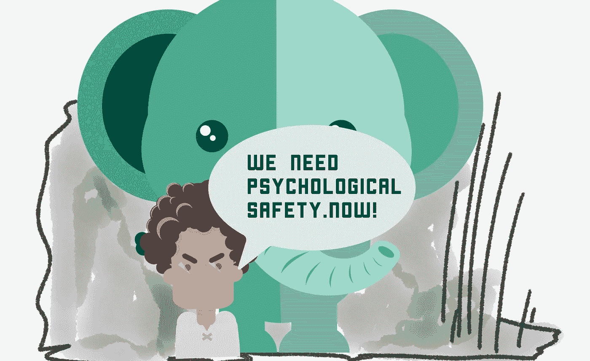

# (心理)安全舞蹈

> 原文：<https://medium.com/hackernoon/the-psychological-safety-dance-9913745d7d8>

## 过度使用？被虐？为什么我们会执着于心理安全？

> 我说，如果我们愿意，我们可以采取行动，如果我们不这样做，没有人会
> 
> 你可以表现得很粗鲁，完全不在状态
> 
> 我可以表现得像个白痴
> 
> 我说我们可以跳舞，我们可以控制一切
> 
> 我们可以跳舞，我们可以跳舞，我们从墙到墙都在跳舞
> 
> 我们可以跳舞，我们可以跳舞每个人看着你的手
> 
> 我们可以跳舞，我们可以跳舞每个人都抓住机会
> 
> 安全舞蹈
> 
> 哦，安全舞

心理安全很重要。

当我与团队(以及经理和高管)谈论心理安全时，我总是看到赞同的点头。“残酷的诚实”瘾君子点头。神经多样性倡导者点点头。内向的人和外向的人以他们独特的方式点头。微观管理者点头。每个人都明白这一点……甚至(不出所料)聪明的混蛋们。

这一切都说得通。心理安全的概念很人性化。我们强烈需要被认可、被尊重、被倾听、被重视、被支持、被保护、被信任，我敢说是被爱。但是，让我们后退一步，看看普通软件产品开发背景下的心理安全(不是作为一名护士拯救生命，解除简易爆炸装置，驾驶核潜艇，等等)。)

一位高层领导最近联系我，说要建立一个“在团队中建立和维护心理安全的项目”。这位高管“完全被收买了”，并且“明白没有心理安全，[他们]就不可能有高绩效的团队。”显然，化名丹最近刚从一个 c 级“静修”回来，在那里“整个社区都在谈论心理安全。”

我开始深入调查，做了一些采访。这个地方变成了一个绝对的高压锅。团队超载——在认知超载和崩溃的边缘摇摇欲坠。AAA 级员工在“疯狂的时间”工作，驱使自己“例行公事地超越客户”并“突破技术限制”。整个大气层不断上升，高度紧张。就像谷歌一样，丹希望不遗余力地寻找高绩效团队。从 ICs 开始，每个人都认为这是一个很好的主意…因为，你知道，每个人都与心理安全有关。

但是缺少了一些东西。当那里的人跟我谈及心理安全时，他们只谈到与他们的需求、T2、T4、T5 和 T6 有关的话题，这些都是他们想要挑战事业极限的渴望。或者……他们泛泛地谈论“不要自满”和“保持真实”没有太多的自我意识。几乎没有人提到加班、不断重组和竞争激烈的阿尔法狗大战对团队心理健康的影响。这就好像心理安全已经成为某种其他东西的代理战场。

N=1，在我看来，在许多情况下，心理安全已经成为在我们的工作中寻找意义和目的的代理讨论……在感觉越来越短暂、过度(内在)竞争、控制欲、不连贯、不可理解、压力过大和没有灵魂的环境中。我们想要“感觉真实”的东西，而这又能变成“变得真实”。个人贡献者阶层——充满激情的问题解决者——来到以盈利为目的的科技巨兽的肚子里，才意识到这些组织有多糟糕。我们的反应是抓住感觉真实和人道的东西。

与此形成对比的是一个谦逊、连贯、好奇、诚实和深思熟虑的组织……在这里，紧张/压力处于可控水平，人们真诚地希望让工作对他人“安全”(不仅仅是他们自己或底线)。有时我希望我们能把“心理安全”换成体面、尊重、做一个好的倾听者和可持续性。那些话是不是太蓬松了？我希望不会。

我听说一些组织在团队层面上进行实际训练，以提高心理安全——或者至少迎合我们对心理安全的内在需求——而明显的不良行为在“高绩效”高管中被默认，人们的智力/情感甚至身体都达到了极限。这传达了什么样的信息？

知识工作是复杂的。它在你的脸上。这是一项团队运动。它吸引了充满激情的问题解决者，他们渴望一定程度的一致性、代理感和创造影响的机会。我们可以随心所欲地将精神安全智能化…但这在很大程度上归结为有勇气活在当下，不做傻瓜，冷静下来，考虑你周围人的需求，给人们空间去做好工作。