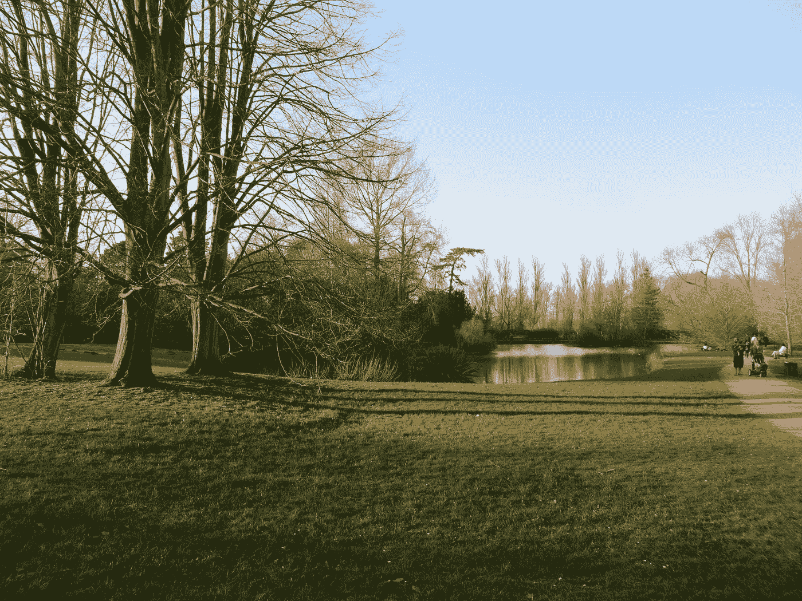

# 量化的自我运动可能敲响了深入思考的丧钟

> 原文：<https://medium.com/hackernoon/the-quantified-self-movement-may-sound-the-death-knell-of-deep-thinking-c771be8dc30f>

## 为丰富的学习体验创造时间和空间

我正在运行的应用程序遇到了一段奇怪的时间。从 2012 年开始，我每次跑步都要花时间，无论长短。事实证明，它是一个可靠的工具，可以绘制我的路线，记录我的里程，分析我的状态。但最近，Runkeeper 越来越过分，发出令人不安的通知，指出过去的运行显然发生在一周的同一天，在完全相同的时间。

Runkeeper 认为它了解我，是基于捕获我以前跑步的数据。它没有意识到的是，我的训练方案是故意无组织的，主要由我的身体感觉来指导。推动我走向跑鞋的不是对过去辉煌的怀念。我的跑步也是如此；我可能一开始就有一个固定的计划，但我总是愿意根据环境条件和身体反馈来调整我的跑步。

就在上周，我被设定在穿过牛津的“标准”5 英里路线上跑步，通常会看到我跑过大学公园的入口。我已经很多年没有跑过公园了，但是在这一天，在这次跑步中，我改变了路线。理想的天气条件，加上一种无法解释的决心，激励我延长跑步时间，包括绕公园跑一圈。五英里延伸到远远超过六英里，因为我不仅仅是在绿地上飞奔。

University parks, Oxford — well worth a detour

管理员后来证实，公园是我跑得最快的一段，但它永远不会知道是什么造成了绕道。它也不会捕捉到在剩下的跑步中伴随我的迷失感。正常情况下，我可以在一英寸之内标出我的里程标，但是绕道把一切都改变了。不遵循固定的线性路径，享受跑步本身而不需要持续的测量，并承担无计划的风险并带来最令人振奋的后果，这是一种解放。弯路可以将平凡的跑步变成有氧运动。

Runkeeper 让人想起我们标准的教育方法。

> *传统的课程模式与 Runkeeper 等应用赖以发展的量化自我运动有许多共同之处:他们只重视他们可以衡量的东西。*

课程规划出一条从基础知识状态到扩展知识状态的固定轨迹。旅程是有预谋的，分为一系列脚本课程，旨在指导学生每一步。旅程必须有预谋，课程必须有脚本，因为根据正规学校教育的叙述，一切都必须有分寸。这是学生和老师应该承担的责任。

对测量的严格要求从两个方面限制了[学习](https://hackernoon.com/tagged/learning):首先，任务结构紧密，以有明确解决方案的封闭问题为中心。这些任务只能梳理出学生思维技能的一小部分。第二，在学习过程中很少允许走弯路。学生们很少有机会探索新的领域——比如说，更多的开放式问题——因为这种学习形式不容易衡量。

> 正如 Runkeeper 仅限于跟踪我的路线和跑步速度，教育还没有开发出捕捉更深层次认知技能的评估工具。

由于不可测量的东西不受重视，这些更丰富的学习任务就被放到了课程的边缘。基于其缺乏结构的课程作业，淡出课程计划就像它淡出一样容易。面对高风险责任的压力，学生、家长和教师通常会引入课程任务，对其进行糟糕的衡量，然后将其扔进下一个周期。今天生硬的测量工具无法应对课程作业的开放性，因此课程作业被彻底淘汰。

但是这里有一个想法——为什么不包括探索性学习，即使在没有严格测量的情况下？所有的东西都需要有一个标记方案吗？探索性学习的好处应该仅仅因为其固有的丰富性使它们难以编纂而被回避吗？

弯路在课程中是值得努力的，因为那是我们最深刻的思考产生的地方。事实上，我们在学习旅程中采取的初步步骤往往只是进行这些短途旅行的一种手段。对探索性学习的标准反对意见是，它让学生迷失在荒野中。然而，更深入的思考仍然可以是一种精心引导的活动，让我们保持在合理的范围内，就像我跑步的弯路被限制在公园里一样。

> 许多科学发现都是偶然发现的，这绝非偶然。我们都需要时间和空间来稍微迷失自己，梦想我们进入创造性思维的方式，并开发我们最丰富的洞察力。这适用于所有的学习者，无论是专家还是新手。

Scientific breakthroughs come at the most unexpected times

探索性学习面临着被控制教育的测量范式所挫败的风险。技术可能只会放大这个问题，增加学习分析的使用，在预测学生的学习路径时，这些分析被视为福音。预测分析往往没有给表现的意外飞跃留下多少空间，让学生根据他们的历史进步进行自我实现的预言。Runkeeper 无法理解我对下一次运行的想法，尤其是因为它还没有在我的脑海中解决。同样，即使是当今最复杂的评估工具也无法预测学生下一个伟大的洞察力会在何时何地出现。

对教育者来说，勇敢的选择是坚持我们重视的东西，并接受不是学习的每个方面都可以衡量。偶尔离开正道是可以的；它甚至可能是必要的，使我们最丰富的学习经验。

*我是一名研究数学家，后来成为教育家，致力于数学、教育和创新的结合。*

*上* [*Twitter*](https://twitter.com/fjmubeen) *或*[*LinkedIn*](https://uk.linkedin.com/in/junaidmubeen)*。*

*如果你喜欢这篇文章，你可能想看看我的以下作品:*

 [## 你数学并不差，只是你看待数学的方式不对

### 数学中的心理表征

hackernoon.com](https://hackernoon.com/you-werent-bad-at-maths-you-just-weren-t-looking-at-it-the-right-way-7b11fb0a0982)  [## 如何(不)记忆数学

### 作为故事讲述者的数学家

hackernoon.com](https://hackernoon.com/how-not-to-memorise-mathematics-98fef71aefcf)  [## 我的侄子带回家这个危险的数学问题

### 接下来发生的是对学校数学的可悲控诉。

brightreads.com](https://brightreads.com/my-nephew-brought-home-this-menacing-maths-problem-e8bbba30e5cb)