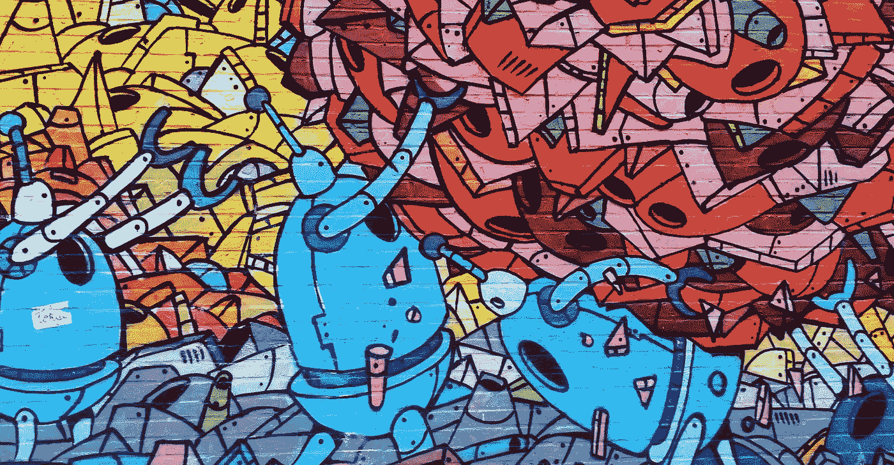
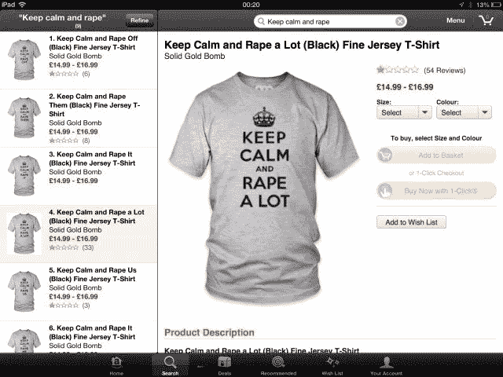
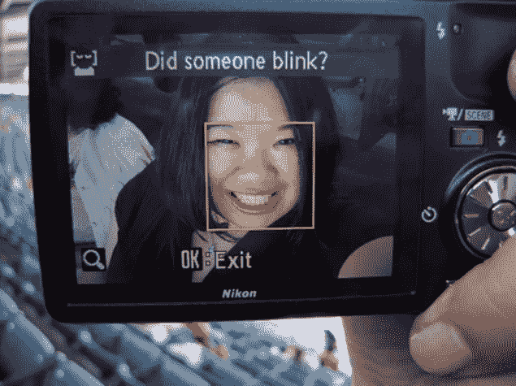
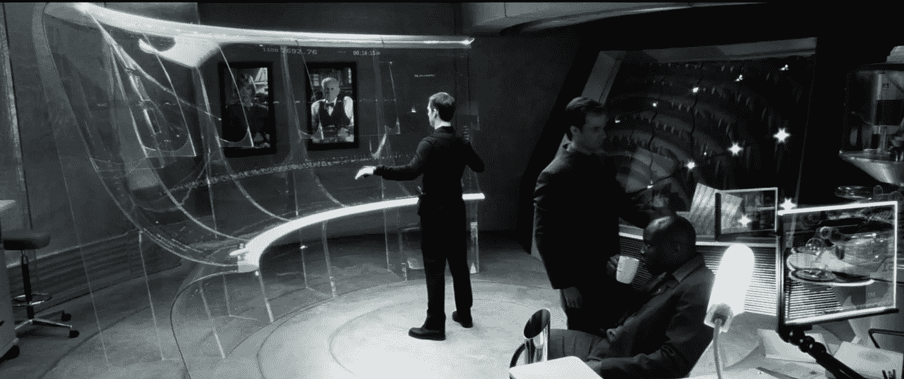
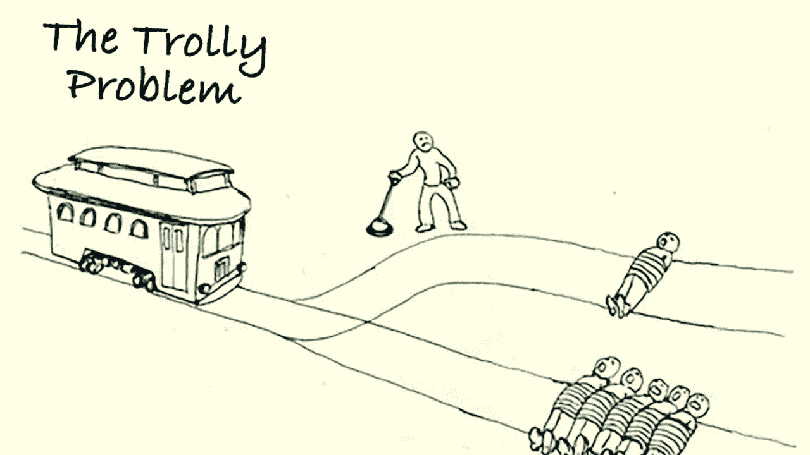
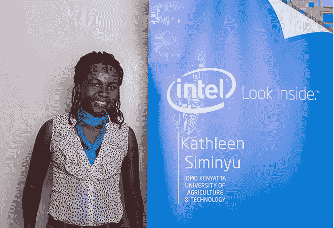

# 人工智能的真正危险不是你想的那样

> 原文：<https://medium.com/hackernoon/the-real-danger-of-artificial-intelligence-its-not-what-you-think-f7fdc7059cf8>

11 月 8 日-10 日，我参加了**全球研讨会:人工智能&包容**。来自世界各地的近 200 名与会者应邀出席了会议。

我对两个主题特别感兴趣:(1)如何创建尊重社会文化价值观的人工智能解决方案；(2)如何使用人工智能来提高教育的包容性。

以下是我的五点建议:

## **1。AI 会造成伤害(即使不是故意的)**

[人工智能](https://hackernoon.com/tagged/artificial-intelligence)的兴起给教育、健康、媒体、政府等领域带来了很多好处。但也会造成伤害和歧视。

这种异常行为可能通过以下方式发生:

*   使用有偏差或质量差的数据来训练模型；
*   没有明确的规则
*   断章取义
*   创建反馈循环

Solid Bomb Gold 是一家 t 恤公司，他们使用人工智能生成短语印在产品上。它的算法创造的短语之一是**“保持冷静，多强奸。”这当然引起了公众的强烈关注。于是亚马逊撤销了他的卖家资格，公司最终关门大吉。**

[https://boingboing.net/2013/03/02/how-an-algorithm-came-up-with.html](https://boingboing.net/2013/03/02/how-an-algorithm-came-up-with.html)

这个算法不是用来生成这种攻击性内容的。但是不管是谁开发了它，它只是简单地从列表中选择一个动词。这张单子上有强奸这个词。他们有糟糕的数据和定义不清的规则。

尼康推出了一项功能，每当有人在照片上眨眼时，就会警告摄影师。一些人报告说，它在亚洲人的照片上发现了错误的眨眼。

[https://gizmodo.com/5256650/camera-misses-the-mark-on-racial-sensitivity](https://gizmodo.com/5256650/camera-misses-the-mark-on-racial-sensitivity)

虽然它是一家日本公司，但它似乎在其算法中使用了有偏见的训练数据。如果该算法是在亚洲以外开发的，但在全球范围内部署，它也缺乏地区背景。

你还记得电影《少数派报告》吗？在这部电影中，机器预测犯罪将在何时何地发生，这样警察就可以预测到它。

Scene from the movie Minority Report

这一切正在发生。有一家公司叫 PredPol，它利用 AI 来预测哪里最有可能发生犯罪，帮助警方更好地利用其巡逻资源。

该公司用于训练其模型的数据来自警方记录的犯罪**。但并不是每个重罪都有同样的机会被警察记录下来。在警察严密巡逻的地区发生的犯罪更有可能是 recorded⁴.**

**这可能导致一个反馈循环，促使警察继续在已经巡逻过的地区巡逻。他们使用有偏见的数据，并创造反馈回路。**

**所以，是的！即使它不是为了伤害而设计的，AI 也能创造出**有害**或**歧视**的情境。**

## **2.人工智能可以学习如何公平(并且可能比人类学得更好)**

**界定什么是公平的，什么是不公平的，并不容易。它涉及文化方面，价值判断，和不同的观点。**

**但是如果有我们能达成一致的案例， **AI 可以从中学习**。**

**人工智能学习如何使用变量来实现一个目标函数。我们可以通过将这些公平性陈述转化为目标函数或变量限制来提高 AI 公平性。**

**如果我们有意**将公平概念**教给人工智能，它会比人类更好地使用它们，因为它在遵循正式规则方面比我们高效得多。**

**例如，巴西非政府组织 **Desabafo Social** 发起了一场运动，揭露像 Shutterstock 和 Google 这样的搜索图像引擎是如何歧视种族的。这是偏见和歧视如何在数字世界中被无形复制的有力例子。**

**如果你在 Shutterstock 搜索“婴儿”，你只能看到白人婴儿。**

****

**这个搜索引擎不能反映我们的人口。但是**它可以被教会那样做**。**

**如果我们将“反映人口多样性”作为其目标之一，它可以使用**大量数据**来保证它在种族、流派和文化方面的代表性。**

**机器能做的比人类更有效率。**

**所以，人工智能是歧视性的，因为它以那种方式学习。但不需要那样。**

## **3.人工智能迫使我们重新思考伦理和道德原则**

**正如我们之前看到的，AI 试图优化变量以达到特定的目标。**

**思考这些目标的过程引发了伦理和道德问题，这些问题已经存在了一段时间，但现在又变得相关了。**

**其他问题是新的，源于人工智能带来的可能性。**

**哲学家迈克·桑德尔教授的哈佛大学正义课程的第一堂课提出了一个道德难题，叫做**电车难题**，它在 1905 年首次提出。**

****

**你是一个失控电车的司机，它只能从一条狭窄的轨道转向另一条轨道；五个人被绑在一条轨道上，一个人被绑在另一条轨道上。⁵**

**如果你什么都不做，电车会撞死五个人。然而，如果你改变轨道，它只会杀死一个。**

**自动驾驶汽车工程师也面临着同样的问题，他们需要决定是优先考虑车内还是车外人员的生命。**

## **4.没有所谓的人工智能中立**

**当我们与 AI 互动时，我们的生活发生了变化。**

**例如，如果我们使用谷歌地图寻找去某个地方的最短路径，我们就不必再问街上的人了。这改变了我们旅行时与城市的关系。**

**孩子们与 Siri 和 Alexa 的关系是一把双刃剑。他们变得越来越好奇，因为他们可以在任何时候问任何问题。但是家长们报告说他们也变得不那么礼貌了。⁶**

****

**(Illustration by Bee Johnson for The Washington Post)**

**与 AI 个人助理在一起，你不必使用“请”和“谢谢”这样的词，这**改变了孩子们学习与世界**互动的方式。**

> **算法不是中立的。如果我们改变算法，我们就改变了**现实**’——Desabafo Social**

**然而，人工智能工程师可以通过编程助手回复“嘿，你必须使用神奇的词！”来改变这一点当被粗鲁地要求做某事时。**

**这是一个**在 AI** 内部创造意图并通过它捍卫特定观点的机会。**

**因此，尽管人工智能不能保持中立，但它可以成为一种**工具来塑造社会中期望的行为**。**

**与其寻找中立，不如以透明**意向性**为目标。**

## **5.人工智能需要多样性来确保成功**

**人工智能算法将永远带着它们的设计者的观点。因此，确保人工智能成功的最佳方式是促进该领域的多样性。**

**如果我们有不同国籍、流派、性取向、肤色和文化的人工智能工程师，算法将复制这种多样性。**

**要做到这一点，接受人工智能教育的机会应该增加。保证不同的人群获得这些知识是很重要的。**

**凯瑟琳·余思敏是来自肯尼亚的数据科学家，她组织了机器学习和数据科学领域女性的内罗毕分会。这个项目在增加人工智能工程师的多样性方面发挥了至关重要的作用。**

****

**对我来说，这个事件是一个极好的机会来了解更多关于人工智能对我们社会的风险。很高兴看到这么多聪明的人参与讨论这些问题。**

**我还想对里约和哈佛大学伯克曼·克莱恩中心表示赞赏，感谢他们聚集了如此多样的公众，组织了如此令人敬畏的活动。**

**最后，我希望这篇文章也能提高你对这些风险的意识。我相信这是创造一个更加公平和包容的人工智能的第一步。**

****参考文献****

**[1][http://web foundation . org/docs/2017/07/Algorithms _ Report _ wf . pdf](http://webfoundation.org/docs/2017/07/Algorithms_Report_WF.pdf)**

**[2][https://boing boing . net/2013/03/02/how-an-algorithm-up-with . html](https://boingboing.net/2013/03/02/how-an-algorithm-came-up-with.html)**

**[3][https://gizmodo . com/5256650/camera-miss-the-mark-on-race-sensitivity](https://gizmodo.com/5256650/camera-misses-the-mark-on-racial-sensitivity)**

**[4][https://www . themarshallproject . org/2016/02/03/policing-the-future？ref=hp-2-111#。UyhBLnmlj](https://www.themarshallproject.org/2016/02/03/policing-the-future?ref=hp-2-111#.UyhBLnmlj)**

**[5]https://en.wikipedia.org/wiki/Trolley_problem**

**[6][https://www . Washington post . com/local/how-million-of-kids-be-shaping-by-know-it-all-voice-assistants/2017/03/01/c0a 644 c 4-ef1c-11e 6-b4ff-AC 2 cf 509 EFE 5 _ story . html？utm_term=.caf4e3367230](https://www.washingtonpost.com/local/how-millions-of-kids-are-being-shaped-by-know-it-all-voice-assistants/2017/03/01/c0a644c4-ef1c-11e6-b4ff-ac2cf509efe5_story.html?utm_term=.caf4e3367230)**