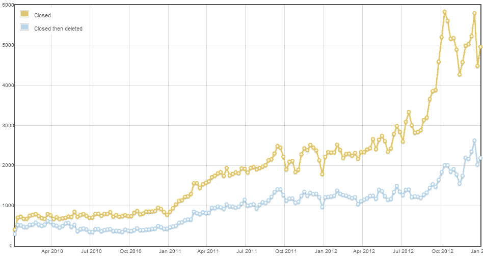

# StackOverflow 衰落的真正原因

> 原文：<https://medium.com/hackernoon/the-real-reason-for-the-decline-of-stackoverflow-10b0132a13b1>

The number of questions closed after Google’s Panda update

互联网上已经有无数关于 StackOverflow 衰落的帖子，我不想用这个帖子来重申它们或咆哮。

但是，我确实想讨论一下 StackOverflow 衰落的真正原因。这是版主执行严格的内容指导方针的结果。这些指导方针的原因都归结于谷歌和收入。

**首先，让我简单介绍一下 SEO …**

谷歌重视内容。事实。这是他们用来决定你的网页在搜索结果中显示位置的最重要的排名因素之一。

众所周知，较长的内容比较短的内容更重要。谷歌对内容的基本指导方针是每页大约 300-400 字。你拥有的内容越多，你的排名就越好，对于相同的搜索项，你的排名会超过竞争网站。

这解释了为什么 StackOverflow 版主让用户在他们的问题中包含尽可能多的内容。纯粹是为了在其他网站上排名同类文章，增加每页的内容。

**低质量内容不利于流量和收入**

低质量的内容伤害 SEO。它对排名位置有直接影响，允许竞争网站排名更高。

[早在 2011 年，谷歌发布了一个名为熊猫](http://searchengineland.com/library/google/google-panda-update)的重大更新。网站上任何低质量内容的页面都会受到影响。这包括许多大型网站，StackOverflow 是其中之一。

堆栈溢出的内容量非常大。在 Panda 更新之后，Joel 和 Jeff 将会看到流量的显著下降，这反过来意味着收入的显著下降。网站上的很多内容会被推下 SERP(搜索引擎结果页面)。

**提高他们的 SEO**

改善这种情况的最好方法是什么？显然是为了提高用户提交内容的质量。他们通过使用版主来执行内容指南。

如果你在 Stack Overflow 上发布一个问题，它被视为*瘦内容*(包含的内容少于推荐的单词)你几乎可以肯定它会被拒绝。

请记住，StackOverflow 页面上的问题和答案构成了内容的总字符数。一个由 200 个单词组成的问题和一个由 100 个单词组成的答案意味着页面内容是 300 个单词。

所以，如果一个问题不可能得到很多答案，它就会被拒绝。即使这个问题完全正确。

**StackOverflow 比编程社区更关心收入**

该网站已经失去了很多曾经投稿的用户。想要一些事实吗？他们来了:http://varianceexplained.org/r/are_users_quitting/。

它们的数量正在下降，而且还会继续下降，直到最终成为存档内容的鬼城。他们意识到了这一点，但却没有采取任何措施来阻止这种下降。

最终会出现一种替代方案，我对此确信无疑。雅虎问答最终被 Quora 和 Reddit 等网站取代。而且 StackOverflow 把用户推向替代网站越多，从长远来看他们就越吃亏。

可悲的是，Joel 和 Jeff 更关心他们的收入，而不是他们的用户和编程社区。

**给 Mods 的消息**

与其帮助那些显然不关心编程社区的所有者中饱私囊，不如把时间花在创新和帮助其他地方。

停止浪费你的时间建立声誉和积分。它没有什么价值，不会给你带来最好的工作或最好的客户。毫无意义。

堆栈溢出现在被永久添加到我的 */etc/hosts* 文件中。我已经找到了更好的替代品，如:IRC、Discord、Slack、Reddit 和 Quora。

> [黑客中午](http://bit.ly/Hackernoon)是黑客如何开始他们的下午。我们是 [@AMI](http://bit.ly/atAMIatAMI) 家庭的一员。我们现在[接受投稿](http://bit.ly/hackernoonsubmission)并乐意[讨论广告&赞助](mailto:partners@amipublications.com)机会。
> 
> 如果你喜欢这个故事，我们推荐你阅读我们的[最新科技故事](http://bit.ly/hackernoonlatestt)和[趋势科技故事](https://hackernoon.com/trending)。直到下一次，不要把世界的现实想当然！

