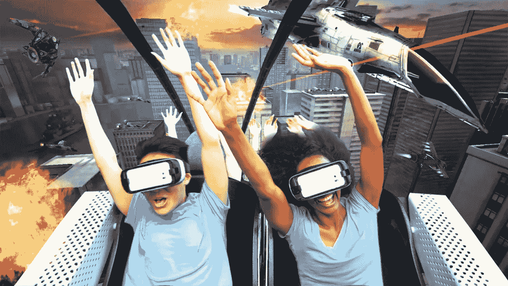
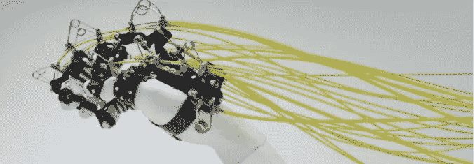

# 现实世界是虚拟的。

> 原文：<https://medium.com/hackernoon/the-real-world-is-virtual-23f210ed7df9>

## 我刚刚试用了新的 HTC Vive。这是自世嘉的 NHL Hockey '91 以来，我第一次对视频游戏感到兴奋(记住，我并不真的喜欢曲棍球或视频游戏)。

25 年过去了，我突然有机会玩最近发布的 [Vive](http://www.htcvive.com/uk/) 。对于外行人来说(就像我本周早些时候一样)，HTC Vive 是一款头戴式显示器，底部边缘附近有一个摄像头。它是完全无线的，使用两个手持控制器和两个灯塔基站。令人惊讶的是，这是房间规模的虚拟现实— *又名—* 它模仿了你所在的真实世界房间。基本上，它 ***让屎变得真真实实*** 。

我已经处于令人瞠目结舌的模式，现在有 3 种游戏类型可供选择:奇幻冒险、动作运动或枪支。自然，我选择了 **Indiegogo** 力挺[胡佛**勇克士手表**。](https://www.indiegogo.com/projects/hover-junkers#/)

总结一下我的经历:这么说吧，摘下耳机环顾四周之后，我的第一反应是我只想做一件事——回到那个世界，而不是这个真实的世界。

我应该在这里提到，我通常是一个非常快乐的人。我喜欢真实的世界。所以我对自己的反应很惊讶。会不会是新奇的感觉？会不会是因为我越来越擅长给我的突击步枪重新上膛，越来越有信心在 3D 世界中导航并杀人，游戏效果的吸引力就太大了？

我不知道。回想起来，对我来说更有意思的是，不要射杀某个突然出现在我视线中的来自威奇托的随机玩家。这是虚拟现实在教育、医学、冥想、购物、电影和艺术等领域的无尽应用。

当新技术和辅助产品上市时(它们就在眼前)，这些 VR 体验只会变得更加丰富。例如学习手，中央研究实验室**的一家企业正在开发下一版本的机械手。**

****

> **通过能够抓取和感觉虚拟物体的物理存在，学习手让你触摸虚拟世界。**

**在上个月的第一次消费者虚拟现实会议上，我了解到有许多不同的虚拟现实耳机。准确地说是 19 岁。这还只是付费购买展位的公司，现在还有很多公司可以购买。我不知道这个市场竞争如此激烈**，而且不可避免地会很快成熟。****

****最大的收获是，虚拟现实环境的开发者不仅关注推动游戏，而且关注推动极限。****

****透视电影公司的克里斯·贝迪克(Chris Bedyk)是 360 度 VR 系列的创造者: [**世界奇观**](http://vrwondersoftheworld.com/) 。背后的想法是，许多人(出于各种原因)永远不会看到一些地方和景观。比如说见证北极光的敬畏(很多人确实有机会，但只是没有抓住它)。****

****我要去吃点东西。显然，在虚拟世界里吃东西还不是全部——目前还不是。我想还有一些问题需要解决，但是..****

# ****前途是光明的。或者黑暗。只是看你选择画哪个世界了。****

*****对于 mroe 未来的工作，设计&业务—* [***报名***](http://socialfabric.com/digest/)**来我们的快讯******

*****

Spread the Love***** 

******&你可能也会喜欢..******

*****→ [**好的设计如何让生意更好**](/@sfagency/how-good-design-makes-better-business-b7437d25aa67#.niyqb453m)*****

******************************

> *****[黑客中午](http://bit.ly/Hackernoon)是黑客如何开始他们的下午。我们是 [@AMI](http://bit.ly/atAMIatAMI) 家庭的一员。我们现在[接受投稿](http://bit.ly/hackernoonsubmission)并乐意[讨论广告&赞助](mailto:partners@amipublications.com)机会。*****
> 
> *****如果你喜欢这个故事，我们推荐你阅读我们的[最新科技故事](http://bit.ly/hackernoonlatestt)和[趋势科技故事](https://hackernoon.com/trending)。直到下一次，不要把世界的现实想当然！*****

**********