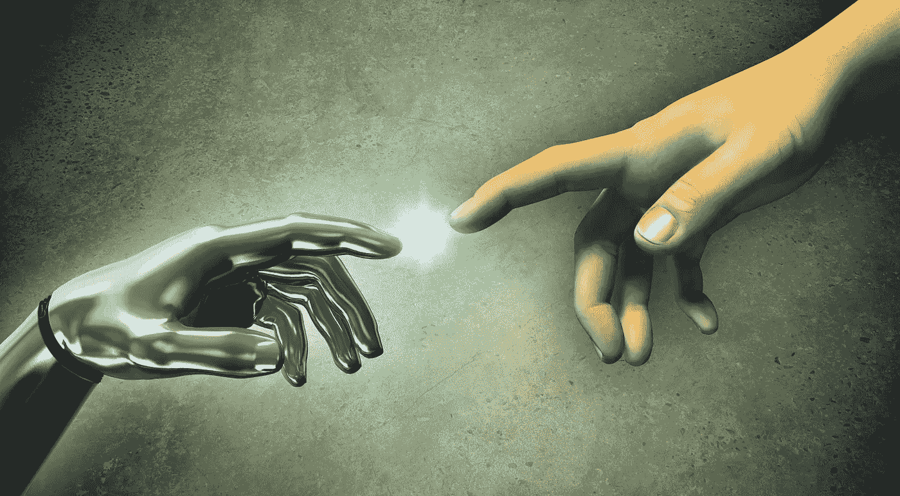
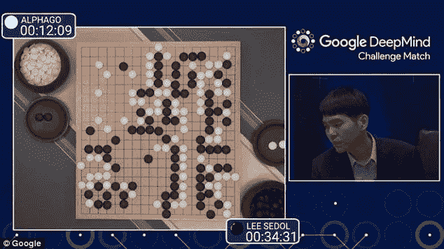

# 人工智能让世界上最伟大的头脑感到恐惧的原因，以及机器不可避免地接管的原因

> 原文：<https://medium.com/hackernoon/the-reason-ai-terrifies-the-worlds-greatest-minds-and-why-it-s-inevitable-machines-take-over-3ff673a3955>

# 人工智能最简单的概念是可怕的

如果它* ***只有*** *达到和我们一样的智能水平，它以高得多的速度运行的能力意味着在 6 个月内它将有效地运行我们相当于 50 万年的时间。

# 相比之下，作为一个物种，我们花了大约 20 万年才到达现在的位置

## 让那件事过去一会儿

对我们来说，在 6 个月的时间里，人工智能将在我们已经知道的一切之上积累 50 万年的知识，这意味着我们将无法在他们达到和我们一样的智力水平的几天内与他们竞争。

我们甚至没有时间做出反应，因为机器将在眨眼之间超越我们。

**同样，我们无法与最早的人类产生共鸣，人工智能也无法与我们产生共鸣**

## 这充其量只能让我们扮演现在如何对待宠物的角色

# 或者更糟——蚂蚁

当蚂蚁远离我们时，我们就不去打扰它们。

当他们入侵我们的家园或阻挠我们的意图时，我们会毫不犹豫地消灭他们。它们微不足道，可以被根除。

## 这是人工智能和我们可能的结果

# 这就是为什么人工智能是一个零和游戏。

如果俄罗斯或中国认为这两个国家正处于操纵这种统治地位的边缘，他们会作何反应？

如果有传言说它即将到来，他们会有什么反应？

这不是一项可以与之竞争的技术——如果你领先 6 个月，你就比竞争对手多了 50 万年的知识。

## 赢家可以拿走所有东西

# 然后很可能会输给人工智能本身

就对人类未来的危险和严重性而言，这比曼哈顿计划超出了几个数量级。

## 这就是为什么世界上最伟大的头脑都感到恐惧

# 这不仅是最有可能的结果，也是不可避免的

如果假定有任何进展速度，我们在未来不确定的时间点上达到这一点是不可避免的。

## 但是这比我们想象的要快得多

在单一任务中，机器已经轻而易举地胜过我们。国际象棋、危险和围棋都是这样的例子。机器比我们能举起更多的东西，并能计算出需要我们数年才能完成的事情。

计算机的运算能力比我们能够理解的要快数百万倍，这是我们与它们一起运算时不可逾越的障碍。

## 这就是为什么实现人机连接对我们人类的生存至关重要。没有它，我们比穴居人还糟糕。尽快扩大我们的带宽至关重要。

然而，人们害怕 Crispr 对另一类人的发展意味着什么。当然，基因可能会被编辑以创造一个更高级的人类——更聪明、更漂亮、更不易患重病——但他们仍然是人类。

# 艾不会的

## 我知道我的恐惧在哪里

如果人工智能每分钟积累相当于我们两年的知识，我们就完了。我们可能已经是了——我们从未因为即将到来的技术革新对人类生存的威胁而后退一步——看看核弹就知道了。

# 即使他们是仁慈的也没关系

最终，他们将会在我们的理解范围之外运作，以至于他们的行为会作为他们意图的副产品影响到我们。

## 就这么简单

如果你假设他们只能达到和我们一样的智力水平，并且永远不会超越这个水平。

# 但是他们会的

它现在需要的是一种方法，将所有这些单独的智能元素结合成一个单一的人工智能，能够利用它们。纵向来看，他们已经在各个领域超过了我们。水平方向上，它们不会靠近。这意味着他们的普遍智力让他们在能力的广度上失望了。

## 一旦他们做到这一点，游戏就结束了

一眨眼的功夫，一台机器就积累了多年人类水平的知识。

## 一旦我们的目标出现分歧，人工智能就控制了我们的命运

它要么进化，要么面临灭绝

# 被我们自己的创造杀死