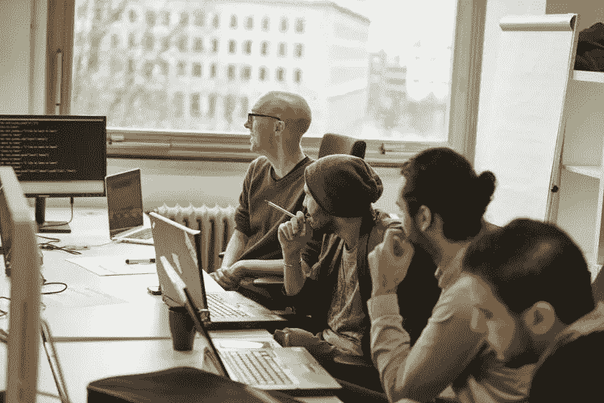
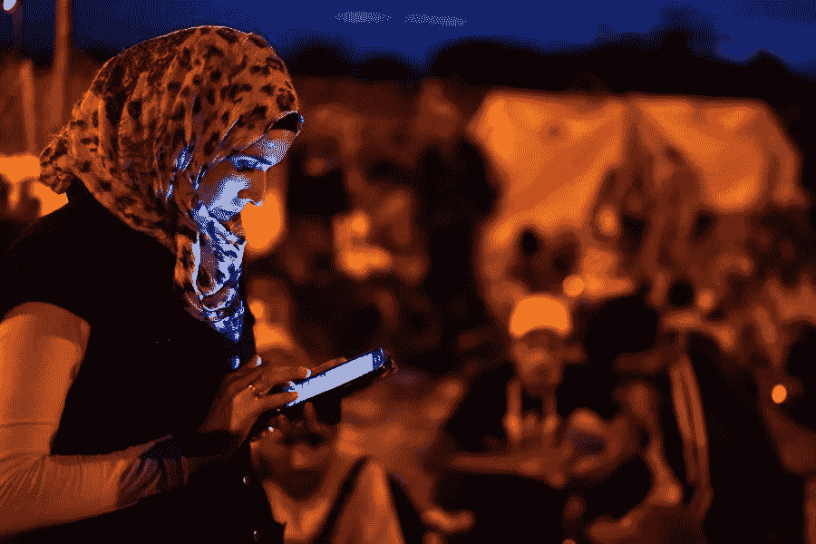
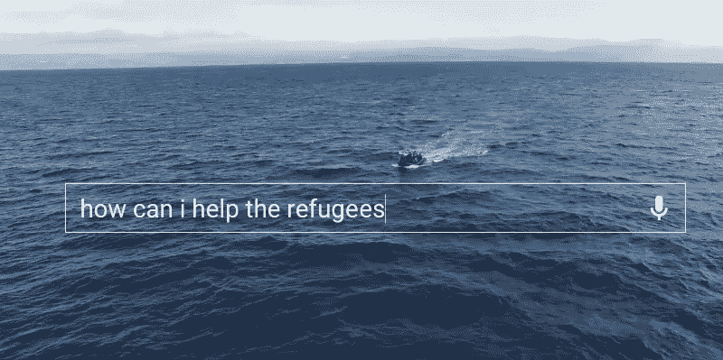
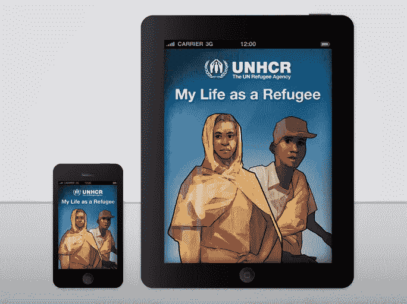
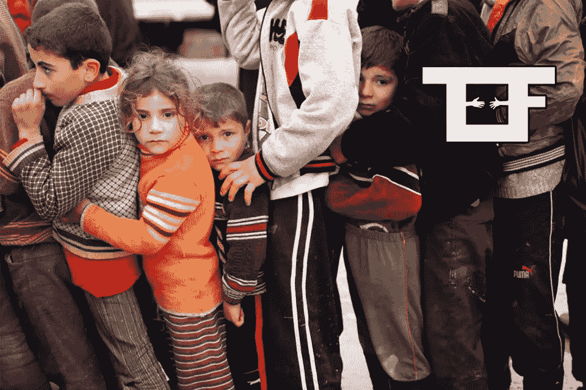
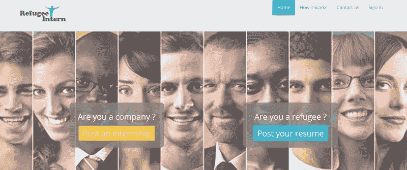
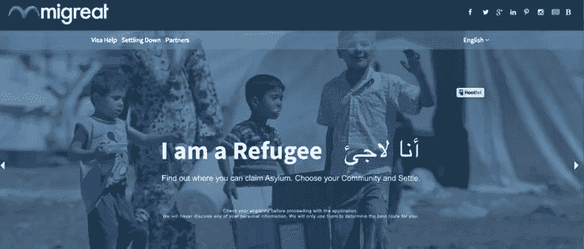

# 难民危机:编码者、应用程序和技术如何提供救济

> 原文：<https://medium.com/hackernoon/the-refugee-crisis-how-coders-apps-and-technology-provide-relief-c618783050bf>

Photo: [Ben Fuchs](http://benfuchs.de/) (Co.Exist [article](http://www.fastcoexist.com/3057223/a-new-tech-school-in-berlin-is-training-refugees-to-code/6))

当今世界面临的难民危机规模空前。但是，编码员可以为难民提供救济…甚至不用离开家。所需要的只是人道主义精神和帮助他人的热情。

当我的编辑建议我写一篇关于编码和难民的文章时，老实说，我不认为这是一篇容易写的文章。

但事实证明我错了，大错特错。事实也证明，我没有必要要求提前付款。

这是因为当我开始做一些研究的时候，我很快就看到了大量的证据、研究，以及我在科技世界很长时间以来看到的纯粹利他主义的最好例子之一。

你可能意识不到，但程序员、技术工程师和应用程序设计师每天都在帮助来自世界各地的难民……他们这样做不是为了盈利。不仅如此，他们对全世界难民的生活产生了真正的影响。

*有自己的想法？* [*在我们的兼职编程课程中实现你的梦想。*](https://coderfactory.com/coding-courses)

**难民危机？有一个应用程序可以解决这个问题**

如果你不幸卷入了一场内战，一方是独裁者，另一方是无效的国际干预，你害怕受到宗教极端分子的摆布；或者被困在战区，现在试图靠橡皮筋穿越沙漠或不毛之海以求生存，试图挽救你和你家人的生命；或者支付了数千美元的特权，逃到一些不可信的和邪恶的个人，结果却在一个你不会说这种语言的国家，并面临着偏见，怨恨和真正的压制的不确定未来，因为“来到这里，不作出努力”…

那么不要惊慌，因为有一个应用程序可以做到这一点。不，说真的，有。事实上，有很多！挑一个开始吧。

**真正的启示**

难民可以使用帮助他们拯救生命的应用程序，这实际上是全球增长趋势的一部分。

说实话，我早该知道的。在过去的几年里，我报道了其他旨在帮助人类的科技创新，比如微软、谷歌和脸书为让世界上最偏远的地方也能享受更好的互联网服务所做的努力。我也是树莓派的拥护者，甚至报道过第三世界国家的新兴可再生能源。

所以，不用说，也有针对难民的应用程序。像你我这样的人已经创建了它们…而最好的消息是，如果你能编码，你也拥有了为人类利益创建应用程序的能力。

关于编码如何帮助难民的一件奇怪的事情(也是一件奇妙的事情)是，它大部分是由志同道合的小团体和个人完成的。

但是，技术和编码到底能如何帮助难民呢？

在最基本的层面上，事实证明，仅仅拥有一部安装了 GPS 和谷歌地图的手机，就已经成为难民的救命稻草。

据大赦国际统计，仅叙利亚战争就导致 400 多万人流离失所——更不用说全世界还有 4300 万人(还在增加)流离失所。

毫不奇怪，对于想要逃离战区的平民来说，没有太多的组织基础设施。对于试图提供帮助的非政府组织和其他组织来说，庇护、食物和提供基本医疗服务是一场后勤噩梦。但是，通过利用数据和分析技术，一些团体已经部署了相当创新的机制，试图改变现状。

**为什么不呢？**

就在去年[联合国人权理事会(UNHRC)的首席信息官说“管理约旦 Za'atri 难民营的人首先要求的不是帐篷和毯子，而是可以给手机充电的地方。”](http://www.forbes.com/sites/bernardmarr/2015/10/15/big-data-technology-and-the-middle-east-refugee-crisis/#3aeebcd8430c)

对于一个难民来说，看小猫可爱的照片是他们最不想做的事情之一。取而代之的是，不起眼的手机现在被视为在联合国创新计划的指导下正在实施的一系列战略的一个组成部分。

这也是大型科技公司能够让人们感受到它们存在的一个例子。自 1999 年以来，微软一直致力于通过利用技术，特别是 proGres 倡议，支持难民署执行其提供难民援助的任务。

一些志愿微软员工早在 1999 年就开始进步。此后，ProGres 成为联合国全球难民登记系统。截至 2010 年底，proGres 在 82 个国家的 250 多个地点运作，迄今已向近 500 万难民提供援助。

由于 ProGres 实施了美国银行普遍使用的虹膜扫描技术，不再有等待登记的难民行政积压。一个具体的例子是，联合国估计目前有 60 多万难民居住在约旦。

事实证明，记录难民人数比知道每个难民的名字更有影响力。据联合国的安德鲁·哈珀称，这从根本上改变了联合国向约旦及周边地区约 200 多万难民发放援助的方式。由此产生的数据确保以比以往更有效的方式实施援助。

移民档案项目采取了一种不同的方法，可能是因为它在设计时考虑到了另一个目的。它于 2013 年启动，当时一群欧洲记者和研究人员联手量化了在欧洲寻求避难的移民的死亡人数，并在地图上确定了这些悲剧的地点。《移民档案》涉及图形信息系统的广泛使用，以在地图上准确地绘制数据，并描绘了一个与媒体报道不同的故事。

技术和编码帮助难民的另一个很好的例子是[难民](https://refunite.org/)，这是另一个帮助流离失所者的强大服务。“难民”的口号是:“每个人都有权知道他们的家人在哪里。”

《难民》讲述了两位技术工程师大卫和克里斯托弗的故事，他们发现现有的家庭追踪程序缺乏协作技术。他们的任务是根除那些使机构、边界和冲突之间的信息共享变得无效的填表形式。

**企业家、黑客马拉松和技术高手的力量**

正如你所看到的，一些科技企业家和知名的大科技公司已经尽了自己的力量来帮助世界各地的难民。但是，主要玩家已经在志愿者或非营利的基础上这样做了。也就是说，你不需要加入或受雇于非政府组织或人道主义组织来提供帮助。你也不需要到受影响的地区去参与。你只需要成为一名科技难民。

“techfugee”一词只是指世界各地自愿贡献时间来帮助应对当今人类危机的人。Techfugees 是希望利用技术帮助难民的全球集体的一部分…他们也不是孤立的一群！

Techfugee.com 为这项工作提供便利。在提出创新解决方案的同时，techfugee.com 还在非政府组织中安排人道主义工程师和编码员。最精彩的部分？Techfugee 的工作在本质上似乎完全是利他的。

**难民和他们勇敢的新世界**

这不仅仅是帮助难民逃离发给他们的任何一张牌。还有事后的问题。这只是其中之一。有很多记录难民逃离的新闻，但一旦他们到达，就没有多少信息了。

虽然他们的生命可能不再受到致命迫害的直接威胁，但他们在新的国家仍然面临着 101 个问题。从语言障碍到文化问题，再到完全缺乏基本信息，难民们有大量的工作要做，而他们能依靠的资源又太少。

**重申:编码者拥有为难民提供救济的权力。**

在我们当前的数字时代，地理位置不再像十年前那样重要。毫不奇怪，许多帮助新来难民的应用程序和软件的想法来自曾经是难民的个人。

根据一般经验，编程能力类似于学习一门通用语言。编码是可以转移的。

来自叙利亚、利比亚和伊拉克等国家的难民是历史长河中最新的流离失所者。在过去的两年里，Techfugee 黑客马拉松已经在世界各地举办，包括我们自己的[澳大利亚](http://www.businessinsider.com.au/australia-is-hosting-its-first-techfugees-hackathon-in-response-to-the-growing-refugee-crisis-2015-11)。

早在 2015 年 11 月，50 多名技术开发人员和 30 名以难民身份来到澳大利亚的人在悉尼郊区联合起来，创建了一些应用程序，帮助最近抵达的难民家庭更容易融入澳大利亚社会，并以一种开明的方式了解我们的文化差异。

Techfugee 活动涉及的不仅仅是善意的程序员聚在一起，假设他们知道如何创建能够帮助难民的应用和软件。参与者采用敏捷方法，直接与难民合作。难民与开发人员一对一地进行小范围的直接对话，讨论他们在到达时个人面临的问题。

甚至兼职程序员工厂学生 Anna Robson 也运用她最近的编码技能为难民构建了一个功能齐全的应用程序。更不用说，安娜在 2015 年 11 月的悉尼 Techfugee 黑客马拉松上遇到了联合创始人 Nirary。两人联手解决了在澳大利亚寻求庇护的有才华、受过教育、有经验的人在他们的新国家努力获得当地工作经验的问题。解决办法？[难民实习生](https://refugeeintern.com/):一个将有技能的难民与提供实习机会的公司联系起来的数字平台。

*有自己的 app 想法？* [*在我们的兼职编程课程中，让你的梦想成真。*](https://coderfactory.com/coding-courses)

当然，虽然大多数 Techfugee 应用程序仍在开发中，但由于小型本地化代码团队的共同努力，周转时间已经大大减少，例如我们悉尼的天才。

**加入努力**

虽然最近有大量关于人工智能的快速发展和机器人即将取代工作的新闻，但 Techfugees worldwide 继续尽最大努力帮助全球难民，做他们最擅长的事情:编码。

最令人耳目一新的是，他们不受利润的激励。参与其中的每个人都努力做出真正的改变，技术对难民的积极影响已经在全世界显而易见。

任何知道如何编码的人都可以帮忙。你还在等什么？今天就从[编码器工厂](http://coderfactory.com/)开始学习吧。

单词:尤安·维维亚什和斯蒂芬·谢弗

*关于*我们的沉浸式课程帮助学生通过行业专家为期 24 周的基于项目的实践培训获得所需的技能。仅在六个月内成为一名合格的全栈开发人员。

[*现在正在招生*](https://coderfactoryacademy.com/apply) *国内&留学生在悉尼&墨尔本！现在学习，以后付钱！兽医费用-合格学生可获得的帮助。*

你是一个对编码感兴趣的女人吗？ [*看看我们理工女奖学金*](https://coderfactoryacademy.com/women-in-tech) *！*

> [黑客中午](http://bit.ly/Hackernoon)是黑客如何开始他们的下午。我们是 [@AMI](http://bit.ly/atAMIatAMI) 家庭的一员。我们现在[接受投稿](http://bit.ly/hackernoonsubmission)并乐意[讨论广告&赞助](mailto:partners@amipublications.com)机会。
> 
> 如果你喜欢这个故事，我们推荐你阅读我们的[最新科技故事](http://bit.ly/hackernoonlatestt)和[趋势科技故事](https://hackernoon.com/trending)。直到下一次，不要把世界的现实想当然！

