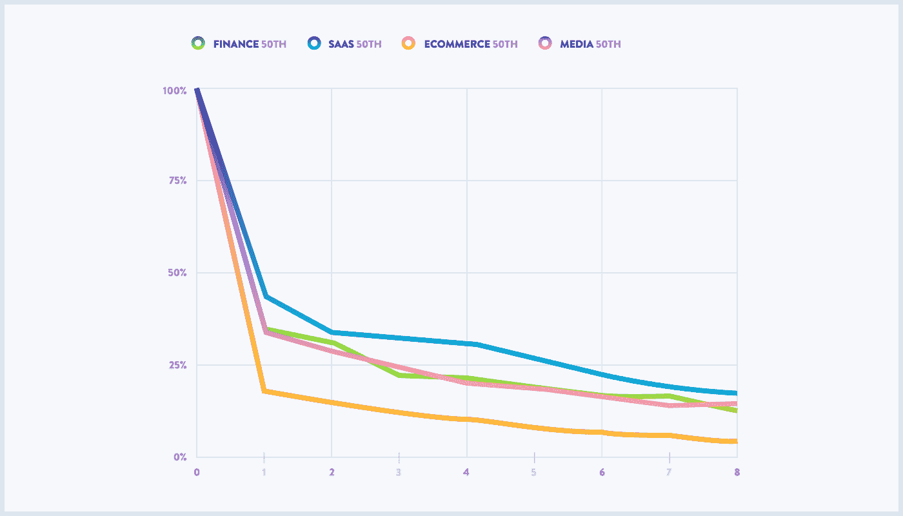
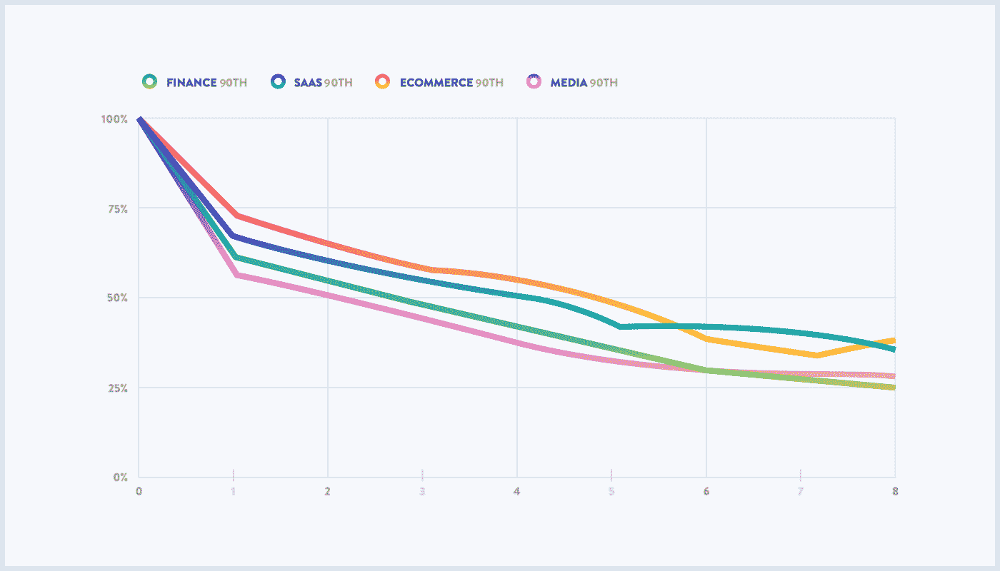

# 习惯培养产品背后的保持数据

> 原文：<https://medium.com/hackernoon/the-retention-data-behind-habit-building-products-f71472fc4595>

> 披露:[数据分析公司 Mixpanel](https://goo.gl/9Q5bKE) 此前曾赞助过黑客 Noon。

数据驱动的[产品](https://hackernoon.com/tagged/product)团队关心的不仅仅是页面浏览量、独立访客和账户注册。他们想知道这些用户中有多少成为客户，有多少仍然是付费客户——一个月、一年或一生。然后，他们想知道如何提高这些数字。

我们采访了 Mixpanel 的两位[留人](https://hackernoon.com/tagged/retention)专家。在这篇文章中，Mixpanel 联合创始人兼客户成功负责人 Tim Trefren 和我们的首席产品经理之一 Jenny Li 分享了他们对留住人才的看法以及过去对他们有效的策略。

但我们的团队比任何人都清楚，当一个团队甚至不知道什么是好的客户保持力时，他们很难设定客户保持力的目标。在充满变化无常的消费者的竞争市场中，即使是行业巨头，年复一年又能留住多少忠诚的客户呢？这些客户中有百分之几会逐渐流失？

这些问题经常被抛给我们，所以我们在我们的 [2017 产品基准报告](https://goo.gl/kvQQJ9)中回答了它们。我们汇总了 13 亿独立用户的行为数据，这些用户在 Mixpanel 客户运营的数百种产品中引发了超过 500 亿次网络和移动事件。综合考虑，我们客户的数据揭示了软件即服务、金融、电子商务和媒体娱乐的中值和最佳保留率。

当然，公司如何定义什么是他们的保留用户取决于他们的业务目标和他们希望看到他们的用户采取什么行为。类似地，团队用来衡量保留的时间框架——无论是每天、每周、每月还是每年——取决于他们的产品、他们的用途和他们的目标。在这份报告中，我们尽可能宽泛地定义了留存率:已经执行了一项操作的用户再次执行另一项操作的比率。我们以周为基础计算这些比率，这意味着在第一周使用某个产品并在第二周某个时间回来的个人将被算作保留用户。

不管具体的定义或时间框架，保留是了解业务健康状况的一个重要指标。特别是对于产品团队来说，这有助于他们看到他们是否已经构建了对客户有长期价值的东西。

如下图所示，在第一周之后，中值产品倾向于保留大约 30%的新用户和现有用户。到第八周，这个数字下降到了百分之十几。离群值是电子商务，它倾向于保留其他三个行业一半的用户。

第 90 百分位的产品在第 1 周后的保留率明显更高，从 63%到 74%不等。到了第 8 周，这个数字下降到 25%到 38%之间，仍然比一周后的中值产品有更高的用户百分比。在这种情况下，电子商务领域的顶级企业比其他行业保留了更高比例的用户。SaaS、金融和媒体娱乐产品的第 90 百分位保留率是这些行业中中值产品的 2 倍，而电子商务在中值和第 90 百分位之间有 5 倍的差异。我们在报告中探讨了这一分歧。

显然，中位数和第 90 百分位之间的差距是巨大的。当然，一家公司的商业模式会影响他们对留住人才的期望。但表现不如竞争对手的公司需要制定策略来提高员工保留率——无论是从底部到中间值，还是从中间值到第 90 位。为此，我们采访了 Tim 和 Jenny，了解他们对留住人才的看法。以下是三个要点:

## 在为你的产品定义留存时，想想你的用户需要什么来养成习惯。

B2B 公司和 B2C 公司必须以不同的方式衡量留存率。例如，在 B2B 公司 Mixpanel，我们的产品团队更多考虑的是周留存和月留存。正如 Tim 指出的，仅仅因为一个用户没有每天去他们的 Mixpanel 账户，并不意味着他们下周就不会使用它。用户可以养成每周甚至每月检查 Mixpanel 中数据的习惯，他们仍然会被认为是保留的。

另一方面，对于一些 B2C 公司来说，将保留用户专门定义为每周甚至每天使用该产品的人可能更有意义。游戏和社交媒体产品团队倾向于在每天使用其应用的用户身上看到更多的成功，因此他们相应地定义了他们的保留用户。

不管产品团队如何定义留存用户，他们应该始终关注非常活跃的用户和高价值客户的行为。根据 Jenny 的说法，这项研究可以发现倾向于形成习惯的行为，并帮助他们了解他们应该在入职流程和客户营销活动中鼓励什么样的行为。研究并复制这些流程。

## **留存是一个漏斗，所以先关注早期留存。**

珍妮说，让新用户养成习惯比重新吸引老用户要容易得多。这意味着 B2B 和 B2C 公司的产品团队应该将更多的精力和资源用于提高早期保留率。

此外，永远不会回来的用户和在第 12 个月仍在使用的用户之间的区别通常可以追溯到第一个月的保留差异。许多有年度计划的 B2B 公司倾向于查看他们的第十二个月留存。但是，即使是这些团队也应该注意第一个月的用户行为，因为第 12 个月的保留问题很可能只是第一个月出现的问题的放大。

Tim 分享了 Mixpanel 的情况:“我们发现，受邀加入现有项目的用户在第 6 个月和第 12 个月的留存率明显高于自己注册的用户。这在直觉上是有道理的。被同事邀请加入现有 a 项目的用户已经有了要探索的数据。这意味着他们不需要做任何设置就能看到价值。但那些自己注册并坚持使用一个月的用户，在第 12 个月的时候表现得就像受邀用户一样。”如果我们的团队只关注第 12 个月，他们就不会发现这种模式。

## 高保留率并不总是意味着成功。

保留率处于中值甚至 90%的公司仍然不应该自满。根据 Jenny 的说法，拥有高留存率的产品可能会有其他问题。例如，如果一个产品不再吸引新用户，留存率可能会增加，因为整体用户群正在下降，幸存者正在人为地提高留存率。事实上，留存率和产品在该时间段内获得的用户数量之间可能存在反比关系，因此产品团队应该始终在其他指标的背景下考虑留存率。

同样，为了准确了解产品的表现，团队应该了解对于给定的产品和商业模式，什么样的用户旅程最有意义，然后相应地定义和衡量留存率。

然而，着手解决保留问题的唯一方法是对其进行诊断。阅读完整的[产品基准报告](https://goo.gl/kvQQJ9)，看看你的产品如何达标。