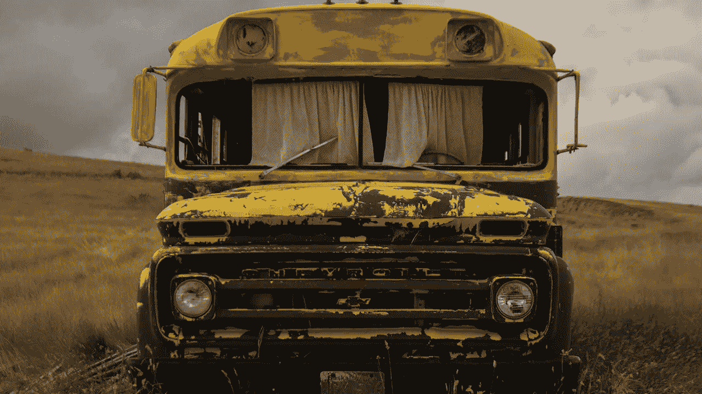

# 摇摇晃晃的巴士遇到了意想不到的颠簸——这是初创公司面临的第一个重大问题

> 原文：<https://medium.com/hackernoon/the-rickety-bus-hits-an-unexpected-bump-dealing-with-a-startups-first-major-problem-78ccd94d2dc>

迈克·萨尔盖罗

我倾向于用一个类比来向人们描述创业是什么样子的。对于那些没有涉足早期企业的人，我把这种经历比作一次未知的冒险。

我先讲一个故事，当你创办一家公司时，就像你刚刚掉进了一个茂密的丛林，你不知道如何出去。

**打个比方，你首先需要劈出一条路来，而你所拥有的只是一把砍刀。**你让其他人加入进来——建立团队——并且倾向于让那些和你一样用力挥舞砍刀的人加入进来。你们都在朝着一个共同的目标努力，即使你不知道接下来会发生什么，你们也会建立信任和友谊，每个人都会找到自己的理想角色。最终，你找到了一条路，你沿着它走，希望它会通向一条路。

你还需要为下一步做好计划。一路走来，你很有希望在团队中增加一些既能挥舞大砍刀又知道如何驾驶的人。

**当你穿过丛林，踏上土路**，事情才变得真正有趣。

业务现在处于一个新的阶段，一切都将变得更加复杂；你不能像以前那样信口开河了。你需要结构。你需要系统。你需要安全感。你需要过程。

回到类比，在这一点上，你需要学习如何驾驶你刚刚发现的一辆摇摇晃晃的公共汽车。你刚刚意识到，现在的目标是乘坐那辆巴士，并把它开上土路。这条路崎岖不平，有许多崎岖不平的地方，但它也可以是有趣和惊险的。你只能希望并祈祷那辆巴士能开到主干道上而不会散架。

然后事情发生了:你从一条泥路走到一条铺好的路上。仍然有很多坑坑洼洼，所以你还不能顺利驾驶。在这个新阶段，有大量的交通流量，大量糟糕的司机，有时，我会称之为“路上的松鼠”(即，不可预见的灾难)，它们随时都可能跳出来。因为你在土路之外，可以走得更快。你开始对巴士进行压力测试，看看它能跑多快。

在公司发展的这个阶段，你仍然需要你在“泥路”上建立的所有东西——系统、流程、安全、结构。如果你没有真正修好行驶在泥路上的巴士，当你真正踩下油门时，事情就会开始摇晃和震动。

**这就是我们现在使用 ButcherBox 的情况。**

让我来给你解释一下，一个小小的变化是如何对一个年轻的公司造成大问题的。

在黑色星期五和网络星期一，我们做了一次大促销。事实上，这是我们有史以来最大的一次促销活动。

它的工作方式是，我们向任何注册订阅的人提供六块牛排的“牛排样品”。如果你已经是会员，你可以低价购买牛排取样器。我们预计会有很多订单，所以我们已经准备好了我们的配送设施，并确保我们为比我们最疯狂的预测多 40%的人切割和储存了足够的牛排。

到了感恩节晚上，我们知道我们有了一个赢家，因为新的注册用户不断涌入，当前的订户在他们的每月订单中添加了六份牛排。这是令人兴奋和振奋的。

但是在我们所有的兴奋中，我们没有意识到我们犯了一个严重的错误，没有被我们通常严格的监督发现。你看，我们在设置订单和履行流程时按错了按钮，一个大问题就要出现了。

我们无意中按了一个按钮，让每个报名购买牛排试吃器的人的订单翻倍。这意味着每份订单都会得到两倍的牛排，12 份牛排而不是 6 份。

等到我们发现有问题的时候，一半的订单已经出去了。不幸的是，应该和后半部分订单一起送出的牛排已经和前一半一起送出了。很快，我们就遇到了一个大问题:我们没有牛排可以订购，没有库存，也不知道什么时候会有更多的牛排。

当我们临近新年的时候，我们仍然在从这个错误中挖掘自己。我们比以往任何时候都更加疯狂；这几乎就像我们带着砍刀回到了丛林中——我们有更多的团队成员在努力扫清道路，最糟糕的是，我们让我们伟大的屠夫团成员中的一些人失望了。

还有数百名顾客还没有收到盒子——我们随后已经为他们的购买退款。由于这个小错误，该公司也因退款和发送额外产品而损失了数十万美元。

最糟糕的是，我们给数百名顾客留下了非常糟糕的品牌印象。(我认为我们永远无法充分表达我们对没有达到他们期望的遗憾。)

当我们接近一条新公路的入口匝道时，变速器从摇摇晃晃的公共汽车上掉了下来，因为我们忘记检查一两个螺栓。我们正在狂热地工作，让巴士得到改善，回到我们曾经走过的道路上。

**我们从这里开始:**

-我们需要保持谦逊，我们修补破损的地方。我们作为一个团队工作，找出我们的问题所在，并专注于解决它们。

-我们在全公司范围内实施检查和平衡，以便我们可以在将来发现类似的错误。

-我们接受这些问题，因为我们知道它们会让我们变得更好、更聪明、更快。

此时此刻，我们已经在扭转局面。幸运的是，我们仍然有热情的弯刀手、经验丰富的司机，以及我们发现的一些知道如何修理变速器的人。

Mike Salguero 是 ButcherBox 的联合创始人兼首席执行官。

[**这个帖子最早出现在 ButcherBox 博客 Roam 上。**](https://www.butcherbox.com/roam) **如果您想了解更多关于 ButcherBox 订阅的信息，请点击** [**此处**](https://www.butcherbox.com/get-started/) **或上面的横幅。**

如果你喜欢这个帖子，请给我们一些👏下面。