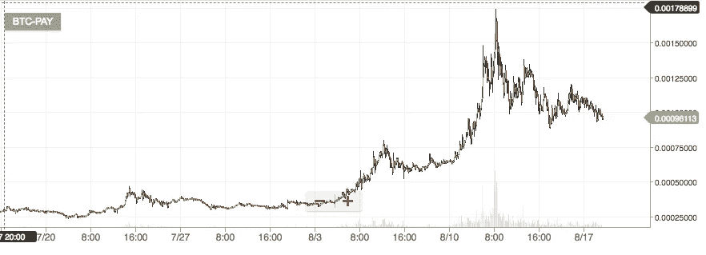

# 财付通的正确估值

> 原文：<https://medium.com/hackernoon/the-right-valuation-of-tenx-pay-4fd640698e9b>

# 因为我们不想要一个加密气泡(系列的第一篇文章…直到它变得不必要！)

*介绍和一些背景信息*

早在 2013 年，我就用[比特币](https://hackernoon.com/tagged/bitcoin)进行了我的第一笔加密投资，从技术的角度来看，我对正在发生的事情感到非常兴奋，尽管我没有完全理解这将如何**改变一切**。
2014 年，我创办了一家创业公司(与 crypto world 无关)，继续我正常的创业生活。一年前，我的一个朋友在[脸书](https://hackernoon.com/tagged/facebook)加入了以太坊小组，大约有 1000 人，我不知道这件事——我很好奇，我关注并不断查看新闻、小组和博客帖子。我可以自豪地说，在刀的兴衰过程中，我可以说是坐在前排的。然而我仍然很兴奋，我相信这项技术。所以我花了一年时间研究密码世界是如何发展的，以太坊是如何令人难以置信地繁荣的。今年 5 月初，许多 ico 开始涌现，优秀团队的伟大项目，估值游戏变得更加棘手。

我开始投资，也想知道我们是否真的处在一个秘密的泡沫中。带大 B 的大词！我阅读了白皮书，理解了商业模式，核对了数字，并问了很多问题(我还忘了说，我上辈子在投资银行和战略咨询部门都呆过一段时间)。当我这样做的时候，我注意到我收集的所有数据对社区没有任何用处。所以在这里，我开始了这一系列的文章，以解决这些硬币的市场价值，并与你分享！

*目标 1 号:财付通*

关于这个项目的一点点:在三行中，这是一张借记卡，允许用 Iphone 应用程序、Android 应用程序和桌面应用程序花费市场上所有的加密货币
,所以 TenX 业务是发行支付卡，他们的硬币是 PAY

团队:伟大的故事，联合创始人之一是以前的医学博士，团队能够提供服务，他们定期与他们的硬币持有者沟通(我应该说硬币霍德尔；-) )

市场:和其他发卡机构一样，它们都在和大人物玩游戏

商业模式:和其他信用卡发行商一样，他们将通过收费赚钱。简单来说，假设 TenX 卡是 Visa 卡。每次使用信用卡时，收到钱的商家都要支付一定的费用。对于 100 美元，商家将支付 2 美元的费用(例如)，这些费用将分配给 3 个股东:
1)商家与之合作的银行
2)拥有允许支付的技术(卡和读卡器)
3)信用卡发行商(在本例中为 TenX)
第一个将收取 0.4 美元，第二个 0.4 美元，第三个 1.2 美元(仍是一个示例)

在 TenX 获得的这 1.2 美元中，他们将拿出 0.7 美元用于支付他们的费用并获得一些利润，将 0.1 美元重新分配给持卡人(您)，并将 0.4 美元以 ETH 的形式分配给 TenX PAY 硬币持有者。(真正的商业模式，数字只是举例)

因此，这项业务是由数量驱动的，越多人使用 TenX 卡支付，越多的付费用户获得 ETH。持卡人获得发卡机构(TenX)三分之一的费用。伟大的硬币，伟大的商业模式！

*那么一个人应该愿意为* ***付出多少*** *？*

市场总币数:2 亿
估值方法:
首先让我们看看在这个领域有类似(相似，不完全相同)商业模式的其他公司然后让我们试着对市场的大小有个概念。从那里我们可以作出一定数量的假设来试图对薪酬进行估价

其他公司:
[Visa](https://usa.visa.com/dam/VCOM/global/about-visa/documents/visa-facts-figures-jan-2017.pdf):70 亿美元的收入——6.3 万亿美元的交易额(也就是 6 300 0 亿美元)，31 亿信用卡持有人(占世界人口的一半！)和大约 80%的毛利率
[美国运通](https://fr.finance.yahoo.com/quote/AXP/financials?p=AXP):340 亿美元的收入——略高于 1 万亿美元的交易额，1.4 亿持卡人和大约 25%的毛利率

Visa 和 Amex 的区别在于，Amex 是一家发卡机构，运营自己的网络，收取更高的费用(因此两家公司的收入存在差异)。

我们将选择另外两家科技公司进行比较:Paypal 和 Stripe。Visa、Amex、Paypal 和 Stripe 之间的共同点是，它们都收取主要由收到付款的商家支持的费用。费用的百分比可能会有所不同，但他们赚钱的方式是一样的。

Paypal:该公司大约有 1.9 亿活跃账户，交易量为 4000 亿美元，收入为 100 亿美元。

Stripe:其交易额估计为 450 亿美元，收入约为 10 亿美元

2001 年，Paypal 的融资额为 2 . 17 亿美元，该公司以 15 亿美元的价格卖给了 Ebay(2002 年)，这是互联网泡沫的巅峰时期。Paypal 在上市时(2002 年)有 1300 万活跃用户。

Paypal 始于 1999 年，所以这个例子很老了，这就是为什么我也想采用 Stripe，尽管我们没有这个例子的所有数据。

[Stripe](https://www.crunchbase.com/organization/stripe#/entity) 成立于 2010 年，估值约为[90 亿美元](https://www.bloomberg.com/news/articles/2016-11-25/payments-startup-stripe-valued-at-9-billion-in-new-funding)，融资 4.5 亿美元。

一旦我们收集了所有这些事实和数据，我们就可以开始进行薪酬评估了。

简单的估价方法:用户/持卡人的价值

这种方法可以让我们看到每个持卡人一生中为公司贡献了多少利润，换句话说，在用户/持卡人留在公司的几年里，公司预计从每个持卡人或用户那里平均获得多少钱。

visa:31 亿持卡人，公司总估值 2330 亿美元，233 亿美元/31 亿美元=每位持卡人 75 美元

美国运通:1.4 亿持卡人，公司总估值 760 亿美元，76B/1.4 亿=每位持卡人 540 美元

paypal:1.9 亿活跃用户，估值 770 亿美元，770 亿/1.9 亿=每用户 405 美元

条纹:我们没有这些数字，但我们以后会使用它

因此，这是评估一家无聊公司的一种方式(已成立，一切都已公布，收入和利润流清晰)。TenX 是一家初创公司，大约有 5 000 名持卡人，我们不能将其与一家乏味的公司相提并论，因为我们着眼于未来的收入。然而，我们有一个重要的数据，薪酬价值可以在市场上直接获得:

自 ICO 以来，工资在 50 美分至 6 美元之间浮动。市场上有 205，218，256 个付费代币。这意味着薪酬的总市值在 1 亿美元到 12 亿美元之间，1 次薪酬= TenX 收入的 1/3 作为“红利”

现在让我们记住，当 Paypal 被 Ebay 以 15 亿美元收购时，它拥有 1300 万用户，PayPal 用了 16 年时间才达到 1.9 亿用户。

另外两个信息:
1)比特币基地拥有 1000 万用户(总数)，最近估值为[16 亿美元](https://techcrunch.com/2017/08/10/coinbase-raises-100m-at-a-1-6b-valuation-amid-explosive-growth/)。让我们假设全球有 5000 万人拥有加密货币(我认为大约有 2000 多万人)
2)支付令牌持有者的数量为 [17259](https://etherscan.io/token/TenXPay)

100 万持卡人，加上一些惊人的增长数字，我很乐意以 10 亿美元的市值进入，有些人支付 5 年的费用，看着它增长并盈利。Stripe 成立 7 年后，估值达到 90 亿美元。TenX 8 个月大。根据加密的世界数字，我认为 TenX 到 2018 年底不会有一百万持卡人。因此，代币被高估，最高价为 6 美元，实际价格约为 4 美元。对于 2017 年和 2018 年，在我看到至少第一批 10 万名持卡人之前，我不会支付超过 1 美元的薪酬。

我不会谈论竞争，其他最近的 ico 和可能进入这个市场的更大的公司，因为现在数字已经说明了一切。为了获得一个条纹或一个贝宝，许多其他创业公司 ***失败*** 。
是的，失败是一种选择。

作为密码投资者，我们在这里支持这项技术，因此值得一提的是，COMIT 协议项目是一个游戏规则改变者(更多详情[请点击](http://www.comit.network/doc/COMIT%20white%20paper%20v1.0.2.pdf))。然而，它的成功与 TenX 的成功密切相关。该项目依赖于机构和企业对它的使用和采纳，这是一个(非常)缓慢的过程。我们也希望避免陷入秘密泡沫，因此我的建议是避免跟随牛市，进行长期投资和持有。如果你看到工资是 1 美元或 1.5 美元，如果项目继续按现在的方式进行，那就去拿一些。

做这项研究让我对自己合理愿意支付的目标水平有了一个概念。由于我在这家公司花了这么多时间，看了几个小时的采访/每周更新，我渐渐喜欢上了 Julian Hosp(联合创始人)的风格和沟通方式:)。因此，我得到 1(一)支付 4 美元，并会等待，看看接下来会发生什么；-)

这是我的第一篇文章，所以我希望它足够清楚和有帮助。如果您有任何意见或问题，请在评论区提出。

此外，如果你想让我对其他代币/项目或 ico 做同样的事情，请在评论中列出它们，我会尽量挑选最受欢迎/最有趣的，让你们做一个快速的市场/估值分析。

***你的评论是我的氧气。***

***还有别忘了关注我获取更多！***