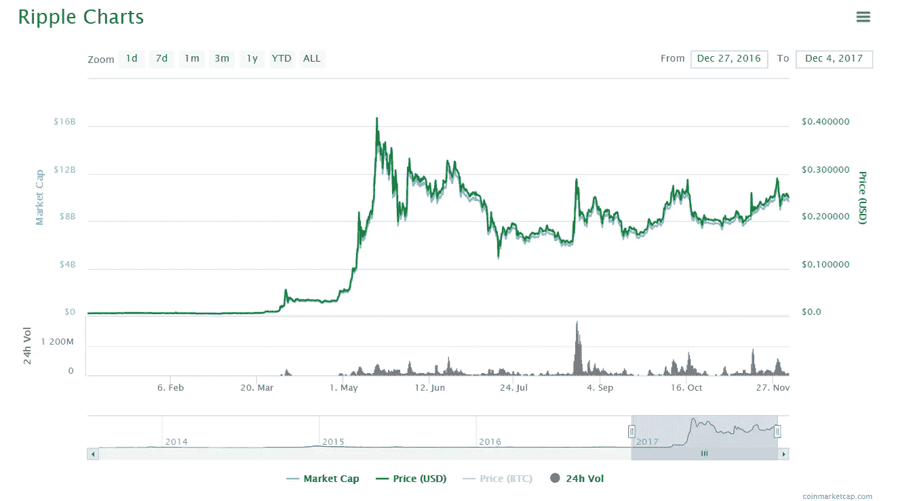
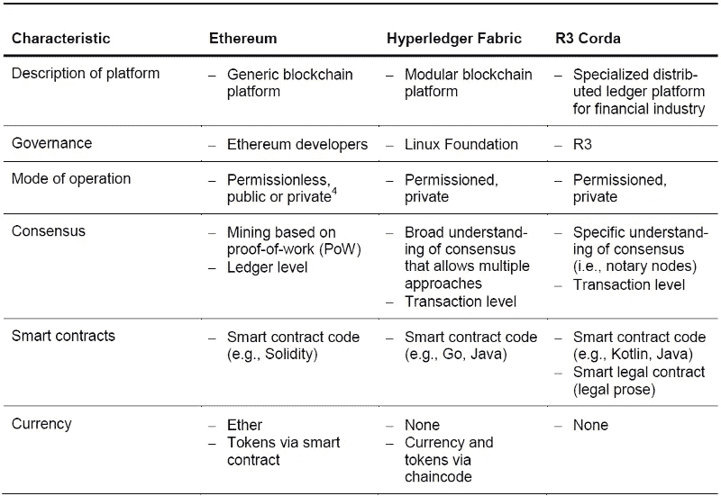

# 波动的货币问题:为什么被允许的区块链会让 XRP 贬值

> 原文：<https://medium.com/hackernoon/the-ripple-currency-problem-why-permissioned-blockchains-will-devalue-xrp-d79aef84c074>

XRP 货币背后的组织 Ripple Labs 在区块链行业有很大优势。在 2012 年推出他们的区块链后，Ripple Labs 一直与金融机构合作，构建生态系统中最大的支付网络之一，证明了这个新兴行业的首批 B2B 用例之一。

加密货币爱好者将此作为 XRP 未来将非常值钱的标志。为了让这些金融机构在区块链上开展任何业务，它们需要花费少量 XRP 来完成交易。市场认为，这对 XRP 来说意味着高价值:

就在今年，XRP 的价值已经从不到 0.01 美元一个硬币上涨到 0.25 美元一个硬币，上涨了 25 倍，甚至比得上 BTC 的增长。

那么，为什么有人会认为 XRP 在未来不会很值钱呢？在这篇文章中，我要说明的是，尽管 Ripple Labs 取得了令人印象深刻的增长和强大的合作网络，但 XRP 已经因为其市场上出现了许可的区块链而变得过时了。

# 什么是涟漪？

在我们能够理解这个问题之前，我们需要理解波纹的作用。Ripple 是由 Ripple labs 运营的一个开源、半许可的区块链。从表面上看，Ripple 提供了许多与其他区块链应用程序没有太大区别的东西:它有一个分布式账本、各种钱包应用程序和一个本地资产 XRP。

Ripple 决定像比特币一样将自己与区块链区分开来的地方在于它对网关、发行信用额度和 T2 的使用。以下是这些功能的基本概述:

*   区块链网关的特点是允许将*的非本地*资产(区块链或其他)转移到特定的区块链。这包括银行能够锁定美元、日元，甚至另一种区块链资产，如 BTC/LTC，并能够在 Ripple 网络上与之交易。
*   发行是区块链个人账户持有人在区块链总账上“锁定”特定资产(比如黄金)的一种方法。类似于网关，在发行到区块链后，你可以将它发送到其他账户，从而利用低费用的优势。
*   信任额度是 Ripple 确保各方之间发行交易的方式。与可以发送给任何人的 XRP 相反，发行只能发送给双方都同意开通通信线路的各方。因此，虽然我可以向世界上的任何人发送和接收 XRP，但我只能将我声称拥有的黄金发送给真正相信我的话的账户。

这三个特点很特别，因为它们给了 Ripple 大举进军金融领域的动力。通过允许银行创建自己的合作伙伴网络，并允许它们在区块链交易资产，他们引入了一种降低交易成本的新方法。

这是 Ripple 成功背后的秘方:通过在网络上创建低成本交易，金融机构能够利用区块链。通过使用 XRP 来保护每一笔交易，Ripple 为这些机构使用 XRP 提供了强大的动力。

# Ripple 的竞争对手是谁？

在新兴的区块链产业中，每一个价值驱动者都在创造一个小产业。Monero 和 Zcash 正在引领以隐私为中心的加密货币。以太坊、NEM、Waves 和大量其他区块链正在竞争成为区块链的顶级平台。比特币、比特币现金和比特币黄金正在竞争成为整体上的“顶级”加密货币。其他市场也在形成。

当你观察 Ripple 的市场并试图找到他们的竞争对手时，一些奇怪的事情就出现了。尽管是最古老的加密货币之一，用例最清晰，但令人惊讶的是，金融支付领域缺乏直接竞争对手…至少大型企业银行的金融支付是如此。平台很容易有 20 多个区块链竞争以太坊的位置，但 Ripple 似乎只与恒星网络和少数其他组织竞争。因为 Ripple 在生态系统中如此成熟，你会期待更多。那么 Ripple 的竞争对手在哪里呢？

事实证明，Ripple 有非常激烈的竞争…但你不会在 [CryptoMarketCap](https://coinmarketcap.com/) 上找到它们。Ripple 今天的主要竞争来自名为“许可区块链”的新型加密货币。与全球任何人都可以加入的免许可系统相反，许可区块链需要组织的邀请才能被允许加入。

今天，有少数获得许可的区块链提供类似 Ripple 提供的服务。这些组织包括 R3 Corda、Hyperledger、以太坊企业联盟(EEA)和 SWIFT(至少根据 Ripple 首席技术官 Stefan Thomas 的说法，这是 Ripple 的主要竞争对手[)。这些企业正在创造与 Ripple 的功能集和合作伙伴网络足够相似的产品，这些组织构成了金融支付网络市场。](https://www.quora.com/Who-or-what-is-Ripples-main-competitor/answer/Stefan-Thomas-1?share=75588be2&srid=zMqH)

# 为什么 Ripple 的市场对 XRP 很重要

如果你接受 Ripple 的竞争对手是区块链许可的，那么比较他们的功能以了解 SWIFT 的区块链支付网络如何可能比 Ripple 更有用是有用的。关于每一个被许可的区块链，有一件事立即跳出来，那就是这些网络没有本地资产，尽管提供了 Ripple 可以提供的相同的基本服务。

[以下是关于 SWIFT 和考虑本地资产的陈述](https://bankinnovation.net/2017/11/whats-next-for-swift-apis-realtime-payments-and-cryptocurrency/):

> Grainger 说，SWIFT 不会考虑的一个领域是生成自己的数字资产或加密货币。这与其他跨境支付服务不一致，特别是 [Ripple](http://bankinnovation.net/tag/ripple) ，其数字货币 XRP 被用于通过其分布式账本网络进行支付。

[这是 Philipp Sandner 的另一份分析，比较了 Hyperledger、Corda 和以太坊](/@philippsandner/comparison-of-ethereum-hyperledger-fabric-and-corda-21c1bb9442f6):

甚至通过欧洲经济区的以太坊也在创造不需要本地资产的许可区块链([如 JP 摩根的法定人数](https://github.com/jpmorganchase/quorum))。

如果部分市场被分割，只有一半市场拥有本土资产，这可能就没那么奇怪了。即使替代产品出现在市场上，柴油发动机仍在生产。但事实是，每一个主要竞争对手都选择不拥有本土资产，这使得 Ripple 通过 XRP 控制了价值数十亿美元的资产，这标志着市场的变化。

# 本土资产的缺乏意味着什么

让我们想一想这意味着什么:正如所预料的那样，市场上出现了激烈的竞争。但是，这些竞争对手没有创建本地资产来保护网络，而是决定使用另一种方法(在本例中是本地身份管理)来保护网络。这些区块链可以提供类似的功能，而不需要类似 XRP 的组件。

我们可以争论 SWIFT、R3 Corda 或 Hyperledger *是否真的*拥有比 Ripple 更好的功能，但这不是重点。这些项目通过普遍忽视本地资产所展示的是，不再需要 Ripple 的那个组件来提供价值。这是 Ripple 的区块链的过时部件。在闪存驱动器变得更加普遍后，CD 驱动器慢慢从新 PC 中淘汰，同样，区块链支付网络的本地资产有了更好的替代选择。

即使 Ripple 仍然是金融机构的最佳支付网络，XRP 仍然是 Ripple Labs 所认为的市场未来的遗迹。但是市场变了。Ripple 的竞争对手将变得更好、更强大，金融机构将开始考虑替代方案，而 XRP 将成为一个棘手的问题。即使 Ripple 是最好的，也不是因为 XRP 提供了一些巨大的优势。如果有的话，这是他们的竞争对手都不会有的额外成本。

# 这对 XRP 有什么影响？

Ripple 仍然拥有更好的合作伙伴网络、更成熟的产品线和强大的领导力。但是随着像 IBM 和 R3 Corda 这样的竞争对手进入这个行业，竞争变得更强只是时间问题。在这场竞赛中，XRP 没有提供任何竞争优势，只是增加了成本。

归根结底，Ripple Labs 是有价值的，因为它们能够为金融机构提供巨大的价值。但如果像 SWIFT 这样的组织开始赢得市场，Ripple Labs 将被迫做出回应。由于 Ripple 已经拥有全 XRP 55%的股份，他们的组织很容易要么以市场折扣出售 XRP，要么将它完全赠送给想要加入他们网络的新组织。提高 XRP 的价格并不能加强他们在赢得金融机构市场中的地位。当竞争变得激烈时，XRP 将是首先被淘汰的因素之一，要么通过大幅贬值 XRP，要么完全放弃它。

这就是 XRP 的最终命运:往好了说，这是一种让新组织加入他们业务的潜在激励，往坏了说，这是一种额外的成本，通过放弃 XRP(或接近它)就可以完全消除。在这两种情况下，XRP 的价值根本不受其用例的支持，并且不太可能保留其价值。