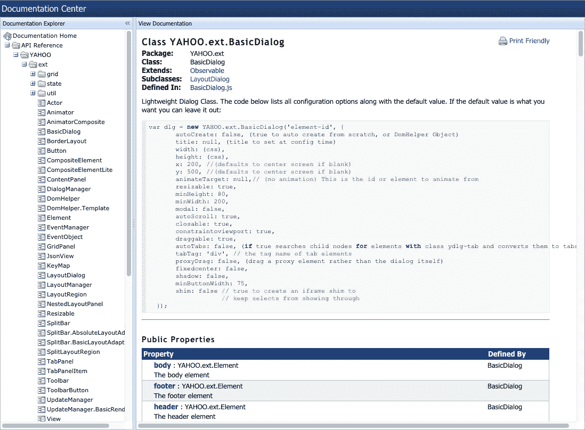
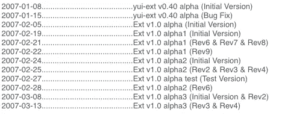

# Ext JS 的兴衰

> 原文：<https://medium.com/hackernoon/the-rise-and-fall-of-ext-js-c9d727131991>

尽管已经有十多年的历史，Ext JS 仍然是开发许多企业级(比如内部网)应用程序的良好平台。从 2006 年到 2015 年，我积极投入到 Sencha 社区，回答论坛帖子，发表文章，书籍，截屏，并在全球范围内进行培训。

本文的目的是带您了解这个框架的历史，并在此过程中表达我的观察和个人想法，这些想法我已经沉默了将近五年。

## 一个时代的终结——Sencha 被 IDERA 收购(2017 年 8 月 25 日)

Sencha 的客户和社区被告知，Sencha 已经通过时事通讯和 Sencha 博客上的[公开帖子](https://www.sencha.com/blog/exciting-news-sencha-acquired-by-idera-inc/)出售给 [IDERA](http://idera.com) 。

我最初对这个消息感到兴奋。然而，不久之后，我的兴奋变成了困惑，我知道我并不孤单。

一些社区爱好者冲到 Sencha 的博客和[论坛](https://www.sencha.com/forum/showthread.php?377323-Sencha-sold-to-IDERA)问问题，因为过去几年该技术的受欢迎程度不断下降，行业本身也很难找到合格的专家。

Comment taken from Sencha’s blog.

对我来说，这是一个持续了大约 11 年的时代的结束，我觉得应该讨论一下框架的历史，因为框架仍然有许多功能，让世界各地的爱好者都想使用它。

# 让我们回到 2005 年

2005 年引发了一场网络技术革命。对于当时在业内的人来说，请记住，我们坐在前排观看由真正架构良好的 JavaScript 库驱动的单页面应用程序(SPA)的诞生。

让我们先做好准备:

*   IE6 仍然占主导地位，火狐是它唯一的竞争对手。
*   常用调试工具(Chrome 开发工具、firebug 等。)还没有被发明出来。这意味着使用*alert()；在开发人员中很常见*
*   原型 JS 和 Scriptaculous 是主导的 JavaScript 框架
*   基于 DOM 的动画仍然相对较新，而且很昂贵(cpu 方面)
*   虽然 AJAX 已经存在了一段时间，但围绕其使用的良好设计模式仍在形成中
*   使用 Dreamweaver、textmate 和 vi 等工具开发网站和应用程序是常见的做法。
*   智能手机还不存在。

2005 年，谷歌发布了其地图网站的测试版。对于这个行业来说，这是一个巨大的*神圣的时刻。这是第一个让我们有机会看到地图被操作而不需要刷新页面的网站，也是一个很好的例子，说明浏览器中的异步操作如何改善网站/应用程序的用户体验。*

## 进入雅虎！用户界面库

2006 年 2 月 13 日，雅虎！发布了他们的第一版雅虎！BSD 许可下的用户界面库(YUI)。

web 开发人员第一次在一个免费的库中找到了 Prototype + Scriptaculous 组合的许多核心特性，但还有更多:

*   CSS 重置
*   丰富的 UI 组件集——自动完成、容器、树形视图、TabView 和 DataTable 等等。
*   版面设计经理。这在当时对 JavaScript 框架来说是新的。

许多开发人员在网站上使用 YUI，我称之为“分散 AJAX ”,他们将松散耦合的组件放在他们的网页上以增强它们。YUI 的高级应用来自企业内部，我们将在这里看到 UI 库的巨大飞跃。

像许多人一样，我使用了 YUI 组件库，但觉得许多功能没有经过深思熟虑，将它们作为 SPA 耦合在一起的方式也不直观——至少在最初的几个版本中是这样。对于我正在开发的应用程序，我需要一个健壮的数据网格组件，并不断尝试其他工具，如 MochiKit、dojo、Flex 和许多其他库。直到偶然发现一篇详述一个人的工作和愿景的博客帖子，才永远改变了我对建造水疗中心的看法。

## 输入 YUI 分机

2006 年 8 月，一个叫杰克·斯洛科姆的人([现在是 Alta5](https://www.linkedin.com/in/alta5) 的 CEO)开始在博客上记录他和 YUI 的实验。随着时间的推移，这些实验变得越来越复杂，杰克开始将它们捆绑成后来被命名为 YUI-ext(雅虎 UI 扩展)Ext JS(可扩展 JavaScript)的前身。

*Jack Slocum’s blog was used to communicate his vision for YUI-ext and garnered community support from around the world.*

YUI-ext 网格组件的发布将永远改变图书馆和社区的轨迹，因为 GridPanel 将成为未来许多应用程序的核心 UI 组件。

在其早期，Jack 继续在 YUI-ext 的基础上添加特性，比如动画、模态、标签面板、可调整大小的元素和一个布局管理器，它大大扩展了 YUI 框架。这些组件很少扩展 YUI 库，它们有自己的渲染功能。

一个在当时颇具突破性的新增功能是文档中心。基于 [JSDoc](http://usejsdoc.org/) 规范，YUI-ext 文档是用框架本身构建的，所以如果使用正确，它允许你立即看到框架的价值。

今天，我们认为框架文档是理所当然的，但是在那个时候，拥有关于 JavaScript 框架的好文档并不常见。所有 YUI-ext 开发人员都发现附带的文档非常重要，因为它不仅能让你学习，还能让你看到组件动作的例子。

The YUI-ext documentation center

YUI-ext 为 web 程序员创造了一个前所未有的基础，许多开发人员涌向这个框架，并投资于这个新成立的社区。最终结果是 YUI-ext 的爆炸式扩张。

## 从 YUI 扩展到扩展 JS

2007 年 1 月，我们发现杰克正忙着推出 YUI-ext 0.40，正是在这个版本中，我们发现框架的命名空间从[*Yahoo . Ext*](https://web.archive.org/web/20070110035856/http://www.yui-ext.com:80/deploy/yui-ext.0.33-rc2/source/DomHelper.js)*变成了一个更简单的[Ext](https://web.archive.org/web/20070222203630/http://www.yui-ext.com:80/deploy/yui-ext.0.40-alpha/source/DomQuery.js)[被一些美国老派社区成员读作“ekst J S”或“E-X-T J S”](https://www.sencha.com/forum/showthread.php?13043-Do-you-say-quot-ekst-quot-or-quot-E-X-T-quot)。*

*2007 年 2 月，Ext JS 1.0 正在与一个新网站 ExtJS.com 一起开发。2007 年 4 月，随着 Ext JS 1.0 的发布，向社区宣布了 ExtJS.com 的发布。*

*

The commit log from YUI-ext v0.40 to Ext JS v1.0 alpha* 

**在* 2007 年，随着 Ext JS LLC 的创建，以及商业许可选项和 1.0 版本的发布，社区见证了框架的正式货币化。大多数机构群体支持这项工作，因为我们完全理解框架的价值。*

*在短短的几个月和大量开发 YUI 扩展的时间里，杰克·斯洛科姆成功地创造了一大批社区贡献者。然而，随着框架的货币化，出现了(可以说是)必要的许可变更，这将永远分裂社区，其许可变更至今仍困扰着社区。*

# *Ext JS 1.0*

*该框架的 1.0 版本在社区中广受欢迎，主要是 YUI-ext 的演变，我们看到除了更多的主题外，还发布了更多的小部件。*

*Ext JS 基于 YUI 核心库，但是 1.0 版允许开发人员通过适配器使用 jQuery、Prototype 或 YUI 作为应用程序的核心库。这有助于吸引许多已经在使用 jQuery 和 Prototype+script acous 的开发人员。*

# *ext JS 2.0——xttype 革命！*

*这个版本的框架是相当革命性的，因为它引入了一种叫做“XTypes”的东西，除了更多的 UI 组件、布局选项、更新的 OOP 工具包、增强的组件生命周期和更新的文档系统之外，它还允许开发人员基于 JSON 生成 UI 配置。*

*XTypes 永远改变了 Ext JS 应用程序的开发方式，过去是，将来也永远是好坏参半的事情。一方面，您可以使用服务器端生成的 UI 配置来控制应用程序的呈现，但另一方面，该功能允许开发人员单独使用 JSON 生成整个应用程序。*

*Ext JS 2.0 是我最喜欢的框架版本之一。这是非常快速和容易定制。*

# *ext JS 2 . 0 . 2——许可困境的开始*

*在 Ext JS 开发的早期阶段，杰克联系了社区来讨论许可证变更，并首次向公众展示了他的赚钱策略。有超过 65 个回复，杰克创建了第二条线索[来继续对话。](https://www.sencha.com/forum/showthread.php?2253-Official-Open-Src-License-Thread-(Commercial-License-Part-2))*

*YUI Ext 是在 BSD 许可下发布的，Ext JS 1.0 是在 LGPL 许可下发布的。有了 Ext JS 2.0.2，许可权就变成了 GPL，并在网络上引发了很大的争议，这也是许多社区倡导者决定脱离 Ext JS 潮流的地方。*

*[论坛的讨论始于 2008 年 4 月](https://www.sencha.com/forum/showthread.php?33096-License-Change)，但早在那年 2 月，在 [C|NET](https://www.cnet.com/news/extjs-when-open-source-is-not-open-at-all/) 、 [Slashot](https://it.slashdot.org/story/08/04/22/138203/extjs-21-ajax-library-switches-to-gpl) 、Ajaxian 和[其他个人](https://infrequently.org/2008/02/clean-licensing-why-you-should-care-if-you-dont-already/)博客上就公开谴责了该框架。*

*下面这段话总结了这一变化对社区的负面影响，完整的博文可以在[这里](http://www.alittlemadness.com/2008/04/)找到。*

> *最令人难过的是，Ext 团队真的建立了一个奇妙的图书馆，以及围绕它的一个充满活力的社区。该库具备开源成功故事的所有特征。然而现在，Ext 犯了开源项目的大罪:他们破坏了自己社区的信任。我可以看到这种策略会带来短期利润，甚至可能是长期业务。然而，我看不到社区恢复全部力量。从长远来看，虽然 Ext 可能会有一个成功的商业产品，但是他们将会失去他们当前和潜在社区的很大一部分给竞争和仍然开放的项目。社区的力量将见证这些竞争者的蓬勃发展。*

*这是正确的。许多人对这种变化感到非常不快，离开了这个社区。社区中的负面情绪如此糟糕，以至于杰克·斯洛科姆开始受到人身攻击，这促使他在自己的博客上首次公开回应[。](https://web.archive.org/web/20080430222338/http://jackslocum.com:80/blog/2008/04/26/ext-js-license-change-and-personal-attacks/)*

# *Ext JS 3.0*

*这个版本引入了 Ext。Direct 是一个服务器端平台，允许 RPC 调用非常容易地建立。我们还看到了基于 Flash 的图表，它使用了早期的 YUI 图表组件(是的——我也不喜欢)和一个新的 light ListView 组件。这个版本将被证明是 Ext JS 2.0 的发展，Ext JS 开发人员的数量将继续增长。*

# ***煎茶成型***

*2010 年 6 月， [Sencha](https://web.archive.org/web/20100616210931/http://www.sencha.com:80/blog/2010/06/14/ext-js-jqtouch-raphael-sencha/) 宣布成立，其办事处新设在帕洛阿尔托。虽然社区开始认识到 Ext JS 的发明者已经不像以前那样参与社区活动了，但是这一变化的消息还是被很好地接受了。*

*红杉资本合伙人为 Sencha 提供了种子资金，最终结果是这家新成立的公司拥有非常光明的未来。有了这笔新的资金，许多出色的工程师被雇佣并搬到了帕洛阿尔托，参与了一个相当积极的新产品计划。Sencha 将继续开发 Sencha Touch，这是世界上第一个移动 HTML5 应用框架，此外还有其他一些在市场上表现不佳的产品。*

*Sencha Touch 最初开发时只支持 WebKit(Android，iOS)将保持与桌面框架的分离，直到它们在 Ext JS 6.0 版本中统一。*

*值得注意的是，在这里，Sencha 通过收购 jQTouch、Raphael JS 等技术和其他一些开源技术来扩展其工程团队。森查还开始雇用关键的社区贡献者和发烧友。这些行动也将改变森查社区。*

# ***Ext JS 4.0***

*该框架的第四个版本是一个雄心勃勃的项目，旨在彻底改变 Ext JS 应用程序的开发方式。这将是自 1.0 到 2.0 重写以来对库进行的最大一次修改，在这个框架的开发过程中，我有幸参与了我的第二本动作书中的 [Ext JS。](https://www.manning.com/books/ext-js-in-action)*

*   *框架中引入了全新的类系统。从一个(非常简单的)单一方法调用中，开发人员可以在其名称空间中定义他们的类，并注册 XType。除了这种开发人员经验的变化，我们还看到框架中加入了 Java 和类似 Ruby 的语言语义，包括 Statics 和 Mixins。*
*   *最初遭到了来自社区的质疑，一个新的 MVC 模式被引入到框架中，几年后将被证明是无价的。*
*   *在以前的版本中，开发人员只能重写、扩展类来将功能注入到组件中。为了解决这个问题，框架中引入了基于组件的插件。*
*   *基于 YUI 的 Flash 图表被踢到了路边，支持纯 HTML5 解决方案。*
*   *GridPanel 和 Tree Panel 面板经过了大规模的重写，在以前的版本中变得更像近亲而不是远亲。这允许跨两种用户界面模式有显著的代码可重用性，并利用新创建的插件架构，允许开发人员轻松启用编辑或 BufferedView(垂直分页)等功能。*
*   *该框架受 Adobe Flex 的启发，引入了两种新的布局，VBox 和 HBox。这些立即在社区中引起了轰动。为了实现这一点，重新编写了布局引擎，以跨布局引入代码可重用性和效率。*
*   *引入 Sencha Cmd，这是一个命令行工具，可以帮助您引导、升级和创建版本。*

*随着 Ext JS 4.0 的发布，我们目睹了框架的第三次革命性变化。这最初在社区中很受欢迎，尽管该框架在未来一段时间内没有兑现其承诺。*

## *Ext JS 4.0 的性能问题震撼了整个社区*

*对框架的许多改变都是在业绩的掩盖下进行的。该框架于 2011 年 4 月 26 日发布，4.0 版发布后引起了社区的负面反应。这些性能问题直到许多宝贵的月之后才会得到解决，并且可以说是社区中另一个重大裂痕的原因。*

*随着建筑的更新，森查的工程师们开始做一些伟大的事情，但是感觉很匆忙。*

*grid panel——可以说是使用最广泛的组件——被重新设计以提高性能。但是社区会在发布后的一段时间内处理性能问题。其他组件，如 TabPanel，性能也有所下降。一个社区成员发帖说 Ext JS 4.0 是[【慢得要命】](https://www.sencha.com/forum/showthread.php?135301-ExtJs-4-SLOW-AS-HELL)。*

*Sencha 的回应是一系列快速的漏洞修复和更新。直到该框架的 4.1 版本，性能才会得到严重的缓解，详见[这篇精彩的博客文章](https://www.sencha.com/blog/whats-new-in-ext-js-4-1/)，4.2 版本带来了更快(和稳定)的缓冲 GridPanel 组件的承诺，如下面的视频所示。*

*对我来说，这个版本将是 Ext JS 版本的“Windows Vista”。虽然 4.0 版的新架构是框架的一个重大飞跃，但 GridPanel 等核心组件的性能和稳定性问题使得使用框架变得相当困难，并迫使一部分开发人员远离框架。*

*4.0 版本也是第一个引入了全新的 SASS 应用程序主题化方法的版本，并将在其生命周期中经历一些重大的突破性变化。*

*在 Ext JS 4.0 的生命周期中，社区本身开始发生变化。我们看到 Sencha 的核心团队成员一波一波地离开公司。这些变化也会对社区产生负面影响。*

*Sencha 社区受到谷歌发布 Angular JS 的冲击。许多开发人员加入了 NG 的行列，再也没有回头。*

# *Ext JS 5.0*

*与 4.0 版本相比，这个版本的框架在架构上的变化相当小，但它带来了新的核心特性，这些特性在开始时被证明是有用的，但后来显示增加了 Ext JS 应用程序的复杂性。*

*这些特性包括模型视图视图模型(MVVM)，带验证的数据绑定和路由。大多数使用 4.0 的开发人员已经习惯了以前的 MVC 模式，大多数人认为它提供了一个足够的平台来开发和维护大型应用程序。*

*引入 MVVM 并不是 Sencha 所要求的，而是强烈建议作为一个最佳实践，许多开发人员(包括我自己)采用了这个策略。根据应用程序的大小，最终结果可能是数百个附加的视图模型文件被引入到您的源代码中。*

*该框架的 5.0 版本引入了平板电脑支持，这在社区中受到好评，因为以前的版本在这些(当时)相对较新的设备的范围内执行得不好，并将为 Ext JS 和 Sencha Touch 的移动位的统一埋下种子。*

## *对自由职业者和支持社区的致命打击*

*随着 Ext JS 5.0 的发布，Sencha 改变了其定价模式，这将对社区造成不可挽回的损害。*

*从一开始，Sencha 就卖单座牌照。这使得一个非常健康的自由职业者群体从这个行业中茁壮成长，这个行业诞生于 Jack Slocum 在 2006 年创建一个可扩展的 web UI 框架的愿景。我可以从经验中说，因为我的职业生涯是这一愿景、其早期社区和所创建的行业的产物。*

*当 Sencha 的定价模式在 2014 年取消了单座许可证，转而支持 5 包许可证时，这一切都将改变，并将被证明是对支持它的社区的致命打击。由于这一变化，Sencha 社区开发者开始在 Twitter、博客和 Sencha 论坛上发泄他们的不满。*

> *看起来我和大多数人一样，对价格如此之高感到震惊。我不敢相信我刚刚提出在我的新工作中使用 Ext/Touch 的想法，他们当然接受了。我想这是我的错，因为我认为价格不会像这样暴涨。现在我不得不改变路线，找点别的，该死的。*

*作为对许可变更的回应，一位沮丧的开发者在[的博客](http://www.designlimbo.com/sencha-complete-massive-price-increase/)中写下了以下内容。*

> *开发者的骚动应该让 Sencha 的决策者意识到他们犯了一个错误。如果他们改弦易辙，那很好，但事实是短期内这会让他们赚更多的钱。但从长远来看，随着越来越少的新开发人员进入大公司，他们将开始失去这项业务。开发者生态系统是一场持久战，不要以短期收益为名牺牲长期生存。*
> 
> *我唯一能说的是，如果你正在看 Sencha Touch 的移动开发，现在就停下来，看看 [Ionic Framework](http://ionicframework.com/) 或[剑道 UI](http://www.telerik.com/kendo-ui) 。不要让“数量”的控制影响你的决定，这不是数量就是质量，你可以很容易地建立任何你想要的解决方案。*

*Shawn 的想法完全概括了大多数社区对这些许可变更的反应。与 2006 年不同，2014 年有数以万计的 JavaScript 框架和库可供开发者选择，许多 Sencha 社区成员专注于帮助围绕 Angular JS、Kendo UI、Ionic 等构建社区。*

# ***Ext JS 6.0***

*Ext JS 和 Sencha Touch 的合并在这个版本中找到了进入框架的方法。对于许多依赖 Sencha 技术的开发者和组织来说，这种框架的统一很受欢迎，因为 Touch 和 Ext JS 之间的差异是一个痛处。*

## *React JS 越来越受欢迎，Sencha 社区继续衰落*

*React JS 于 2012 年进入社区，慢慢在 JavaScript 社区流行起来。大约在 2014 年，它的受欢迎程度开始加快，在 2015 年，我们看到了 React Native 的推出，这进一步加强了 React 生态系统的采用。*

*在寻找 Sencha 的替代品时，许多程序员(包括以前的员工和社区成员)发现了 React JS 并爱上了它。*

*就像早期的 Ext JS 社区一样，React JS 社区通过提供自由开发的组件来投资自己，正是这种持续的投资使得从 Ext JS 到 React JS 的过渡更加容易。和早期的 Ext JS 社区一样，React JS 社区是活跃的，充满活力的，并且积极参与宣传和改进框架。*

## *Sencha 及其社区不确定的未来*

*除了定价失误和产品发布失败的历史之外，Sencha 在许可证变更方面的反复已经损害了它所创建的社区和行业，很可能已经到了无可挽回的地步。*

*我个人参与 Ext JS 社区已经超过十年，并帮助公司使用 Sencha 技术开发任务关键型软件，在过去的三年中，这些组织已经决定投入资金迁移 Sencha 平台，因为他们根本不相信 Sencha 的交付能力。将 Sencha 出售给 IDERA 只会加剧这些担忧，并可能导致其遭受重创的社区和苦苦挣扎的行业进一步衰落。*

## ***上更好的东西***

*我在 2015 年断开了与 Sencha 社区的联系，将会怀念早期 Ext JS 社区的美好时光。我很难过地说再见，因为我有许多美好的回忆，并与世界各地的了不起的人建立了终身的关系。*

*我很高兴离开 Ext JS，专注于脸书、微软和 Twitter 这样的大公司投入更多，并且受到全球 JavaScript 开发者社区重视的技术。我相信 Sencha 可以通过研究许多围绕前沿技术的社区学到很多东西，并希望他们能够在为时已晚之前实施符合其社区和技术最佳利益的变革。*