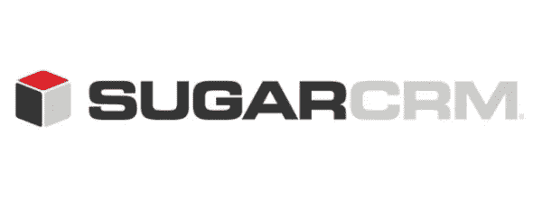

# 开源 CRM 软件的崛起

> 原文：<https://medium.com/hackernoon/the-rise-and-rise-of-open-source-crm-software-ec1967e3a7e2>

O 笔源[软件](https://hackernoon.com/tagged/software)正在成为 IT 界最热门的话题。对开源软件收入增长率高达两位数的预测进一步强调了这个话题的相关性。那一天并不遥远，开源软件将成为 T4 商业中新形式的协作和合作的基础，这种协作和合作将公司与客户和商业伙伴区分开来。当你打破这些障碍，更多的人和更多的商业信息将被聚集在一起，创造一个充满活力和竞争的环境。这种协作的动态需求和扩展，在开源概念的支持下，将推动商业组织内的有价值的变化。

SugarCRM — Open Source CRM Software

面对不断变化的需求，SugarCRM 软件等软件的消费承诺了更大的灵活性。尽管 [**SugarCRM 开发人员**](http://www.osscube.com/sugarcrm) 提供了一种简单且经济高效的方法来根据不断发展的业务需求扩展软件，但许多人仍然明显错过了这一伟大平台的真正潜力。有远见的公司正在采用这种开源技术来寻找和收集信息，以提高决策质量，细分受众并将数据嵌入产品中，以创造新的机会。

那么，这款软件为什么这么受欢迎呢？大概是方便灵活多了吧。现在让我们讨论一下这个应用给我们带来的更多好处。

在过去的几年里，对 SugarCRM 等功能极其强大的软件的需求急剧增加。这是因为许多任务可以由这个简单的软件执行，而典型的自行开发的应用程序却不能。此外，我们正在讨论的这个平台是协作和集成的。您可以在该软件的帮助下集成和定制新技术，并整合不同的群体，如客户、供应商和利益团体。最重要的是，这个令人惊叹的平台提供了最大的灵活性，可以预测客户的好恶，并尽可能扩大市场，因为客户群有各种各样的投诉、要求和偏好。

通过这次对话，可以清楚地看到，开源软件已经成为主流，对于那些意识到在其业务中部署这种软件应用程序的好处的人来说，有无数的机会。我们已经进入了充满活力和挑战的领域，创业者需要站在最前沿，需要咨询 SugarCRM 开发人员或开源专家才能保持领先。在过去的六个月里，我们看到了对开源软件的兴趣越来越大。然而，它可能不是每种情况下的最佳选择，但它可能是许多情况下的最佳选择。

***来源***:[*http://opensourcecrmsoftware . Tumblr . com/post/41353405674/opensourcecrm*](http://opensourcecrmsoftware.tumblr.com/post/41353405674/opensourcecrm)

> [黑客中午](http://bit.ly/Hackernoon)是黑客如何开始他们的下午。我们是 [@AMI](http://bit.ly/atAMIatAMI) 家庭的一员。我们现在[接受投稿](http://bit.ly/hackernoonsubmission)并乐意[讨论广告&赞助](mailto:partners@amipublications.com)机会。
> 
> 如果你喜欢这个故事，我们推荐你阅读我们的[最新科技故事](http://bit.ly/hackernoonlatestt)和[趋势科技故事](https://hackernoon.com/trending)。直到下一次，不要把世界的现实想当然！

