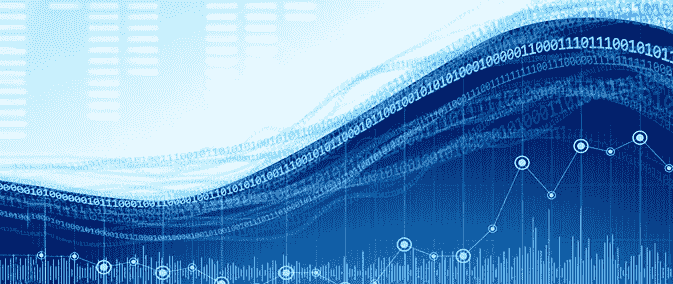

# 人工智能的崛起…以及对后果的担忧

> 原文：<https://medium.com/hackernoon/the-rising-tide-of-ai-and-worries-about-the-consequences-4f2404c27c0c>

[https://blog.justicetech.com/2017/02/24/the-coming-wave-preparing-for-big-data/](https://blog.justicetech.com/2017/02/24/the-coming-wave-preparing-for-big-data/)

感觉好像现在 AI 无处不在。在我阅读的几乎所有出版物中，似乎至少有一篇文章提到了它。

语气感觉很谨慎。我不认为任何人准备在乌托邦方面走得太远；相反，评论员会考虑风险，通常会宣传这一方面。这不是一件坏事。

在最近几期备受瞩目的出版物中，如[《新科学家》](https://www.newscientist.com/issue/3133/)、[《科学》](http://science.sciencemag.org/)和[《IEEE 光谱》](http://spectrum.ieee.org/magazine/2017/June)，人工智能的伦理得到了相当大的篇幅。

所有这些对我来说意味着我们只是不知道发生了什么。发生了很多事情，但是它们是如何联系在一起的呢？这意味着什么？

我认为公平地说，企业家和大企业至少会*尝试*让 AI 在几乎所有行业工作。不久前，我认为这种情况会以令人眼花缭乱的速度发生，我们会考虑如何让所有失业和未充分就业的人就业。我不再这样想了。或者更准确地说，我认为这还需要一段时间。

我把人工智能的第一次广泛应用看作是一种增强的影响。我在科学中看到了增强发现的广泛应用，并且我看到它被用来自动化枯燥(并且容易出错)的手动过程，老实说，没有人想这样做。

因此，对我来说，人工智能意味着旨在帮助决策的新一波移动和企业应用。

# 清算

尽管如此，清算即将到来。人工智能将被依赖于一些它不应该依赖的东西，一个坏的结果将随之而来。这是我们希望避免的意外后果，但我们必须尽快考虑。

研究人员正在研究如何[可视化并更好地解释](http://theprincipledalgorithm.com/index.php/2017/07/10/arxiv-explainable-artificial-intelligence/)深度[学习](https://hackernoon.com/tagged/learning)模型产生的输出。但是当然，即使他们成功了，也需要适当的治理来确保问题被发现。

在数据隐私运动的背景下，以及明年新的欧盟数据保护法的出台( [GDPR](http://www.eugdpr.org/) )，关于这种新的数据制度将意味着什么的讨论越来越多(只需在谷歌上搜索欧洲、美洲和亚洲的任何一家主要律师事务所就可以看到例子)。

# 这一切都要回到数据上

数据无疑是 21 世纪的货币。

这是全球业务处理的输入、处理和输出的燃料，是根本问题。企业和 T2 政府如何向公民保证他们的个人信息不会在下一次黑客攻击中泄露？

当然，我们可以实现一些复杂的数据治理措施。我们也可以制定法律来惩罚疏忽。但是数据仍然很脆弱。

我认为加密和用户友好的区块链应用程序是数据安全的可行解决方案。这并不简单，但总比试图过于依赖人类来保证数据安全要好！

别忘了机器为我们做决定的伦理。正如《新科学家》杂志问的那样:“我们应该……”