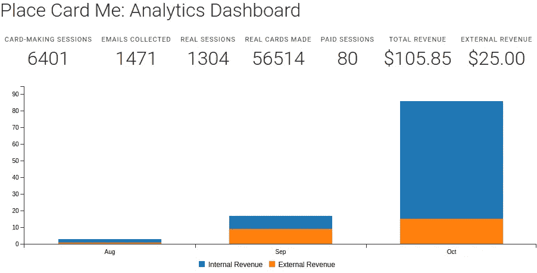
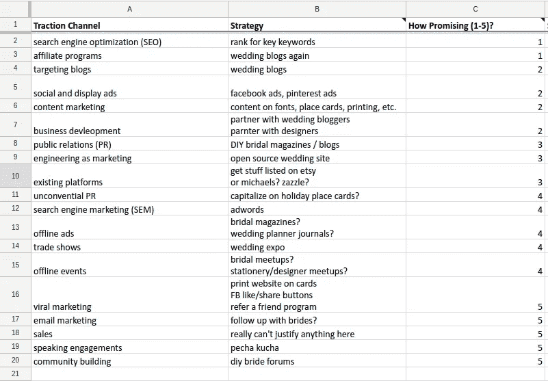
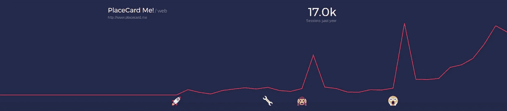
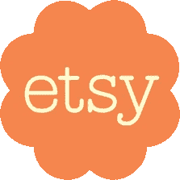
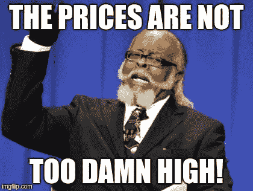

# 通往被动收入的漫长道路第 1 部分:月收入达到 100 美元

> 原文：<https://medium.com/hackernoon/the-road-to-passive-income-part-1-getting-to-100-in-monthly-revenue-6127269ff25f>

## 我如何在三个月内将我的 SaaS 应用从每月 1 美元涨到 100 美元。

> "千里之行始于足下。"——老子

两个月前 [Place Card Me](https://www.placecard.me/) ，我的小小的 Place Card 制作网站和 SaaS 建筑试验台赚到了它的第一美元。

两个月后，接近 10 月底的时候，它越过了另一个重要的里程碑:100 美元。再多卖几笔，我到目前为止投入的每一分钱都会得到回报！

此外，如果你忽略 Y 轴，到目前为止，收入增长看起来很大:

Place Card Me’s first three months of revenue earnings

我现在确信，除非出现任何令人惊讶的不可预见的变化(比如谷歌决定取消我的搜索排名或一个新的重量级竞争对手的加入)，否则该网站成为一个稳定的被动收入来源是可行的——如果不容易的话——每月可能有一两百美元。

很棒，对吧？

老实说，我*很兴奋。有很多次，我认为我将无法在六个月内挣到一个*美元*。除了别的以外，那会让我非常尴尬。*

每月 100 美元，我可以支付我所有的托管费用，我的许多午餐，甚至偶尔在镇上过夜！

这篇文章的其余部分描述了——可能比必要的更详细——这是如何发生的。虽然接下来的很多内容都是针对我自己的产品，但我希望这些教训和思考能够帮助指导和激励其他人继续发展他们的 SaaS 业务。

# 每月从 1 美元到 100 美元不等

所以我花了 5 个月 200 多个小时赚到了我的第一美元。相比之下，达到每月 100 美元是小菜一碟。

这些是主要的影响因素——大致按重要性排序:

1.  我的有机接触和漏斗顶端继续增长。
2.  我找到了一个新的销售渠道。
3.  我开始多收费。

就是这样！

我将在下面详细讨论每一个问题。

# 可再生有机 Reach 的复合效应

几个月前——当我第一次试图找出如何营销我的网站时——我读到了 [Traction](http://tractionbook.com/) 。

这本书概述了 19 种不同的渠道，你可以用它们来获得产品的牵引力，并提供了一种方法——称为“牛眼”——来选择专注于哪些渠道。我发现它对我的整体牵引策略非常有帮助，我强烈推荐给那些不知道从哪里开始营销和销售产品的人。

The spreadsheet I used to evaluate the 19 different traction channels I could use

当我做“牛眼”练习时，我选择 SEO 作为首选渠道。因此，我开始学习 SEO，并采用了一种非常有效的策略。通过那篇文章中描述的技术，我能够慢慢地锁定某些关键词和短语，直到我的网站开始在搜索中排名攀升。随着这一切的发生，我开始获得越来越多的有机流量，直到最终做成第一笔愉快的销售。

然而，重要的是要认识到**那次销售不是一个奇迹般的单一事件。这是一个非常简单的概率游戏的最终结论。**

我的网站每 N 个访问者中就有一个最终会购买。因此，如果第一次销售是在 N 次访问之后，那么下一次销售应该在大约 2N 次之后，以此类推。因此，如果访问率上升(确实如此)，那么销售率也应该上升(确实如此)。只是数学而已！

到目前为止，我认为我的应用在过去两个月里收入增长的最大因素就是它获得了更多的流量。更多的流量=更多的销售，简单明了。

Traffic to Place Card Me over time. The “home alone” face is when the first sale happened. (Chart courtesy of [Tractionbeat](https://www.tractionbeat.com/a/placecard.me))

*顺便说一句，我现在有足够的数据来知道我的销售率是多少，也有足够的流量来运行 A/B 测试以尝试移动它——但这是另一个时间的主题……*

# 新的分销渠道

收入的第二次增长来自一个全新的分销渠道。那个频道是 Etsy。

Etsy is where millions of people go to buy and sell creative products — especially for weddings

在我早期对婚礼行业的研究中，我了解到 Etsy 绝对是这个领域的庞然大物。事实上，相当一部分新娘(和新郎)在为他们的婚礼寻找东西时，只会在 Etsy 上搜索*。*

意识到这一点让我想知道如何参与一些 Etsy 活动。做到这一点的简单方法——你可能已经猜到了——是在 Etsy 上创建一个商店，并在那里出售我的位置卡模板。这确实需要构建一些技术来支持一个以某人在 Etsy 上购物为中心的工作流，但结果并不太复杂。

图表顶部的橙色部分是我的 Etsy 销售额。9 月份，它们实际上高于我的有机销售额，尽管 10 月份我用有机食品推翻了它们。

不幸的是，我不太知道如何提高我在 Etsy 上的有机接触，所以随着时间的推移，数字似乎保持平稳——至少到目前为止。如果有人知道如何成倍地扩大商店的 Etsy 范围，我怀疑他们可以赚很多钱！

也请让我知道，如果你知道如何做到这一点。:)

# 价格变化

我为增加收入所做的最后一件事就是提高价格。

Place Card Me 的工作方式是，你可以免费使用它，但网站上的某些模板需要付费。当我陷入悲伤的低谷时，我怀疑我是否能卖出一单，我把所有模板的价格降到了 1 美元。在连续几周的常规销售后，我决定开始恢复销售。

具体来说，我做了三件事:

1.  除了“空白”设计，我排除了所有自由设计。
2.  我把大多数设计的价格从 1 美元提高到 1.95 美元。
3.  我开始向上传自己设计的人收费。

这些变化的结合实际上*提高了*的销售率。我认为这主要是取消免费设计的结果——我怀疑这产生了一种心理效应，使人们认为他们“应该”必须为设计付费，因此更愿意这样做。

We developers are often very hesitant to raise prices. This gentleman provides some helpful advice.

最后一个有趣的轶事:对自定义上传收费实际上是一个意外。

当我引入让所有设计付费的改变时，我改变了网站的默认行为，无意中导致上传工作流也要花钱。我发现我已经改变了它的方式是得到通知，有人已经支付了定制设计！当然——一旦发生这种情况——我决定保持这种变化。定制设计销售现在是网站上最受欢迎的单一模板/选项。

# 下一步是什么？

我很高兴现在每月有 100 美元的收入，但是离任何有意义地让我走上被动收入之路的东西还有很长的路要走。

在本系列的下一期文章中，我将讨论我计划如何将这个数字至少提高 10 倍，达到每月 1000 美元。应该很好玩吧！如果你想跟进，你可以在下面订阅。

**编辑:第二部分已经出来了！你可以在** [**这里找到**](https://hackernoon.com/the-long-road-to-passive-income-part-2-getting-from-100-to-1000-in-monthly-revenue-6c91a13b6685) **。如果你愿意，你仍然可以订阅。:)**

*原载于*[*www.coryzue.com*](http://www.coryzue.com/writing/road-to-passive-income/)*。*