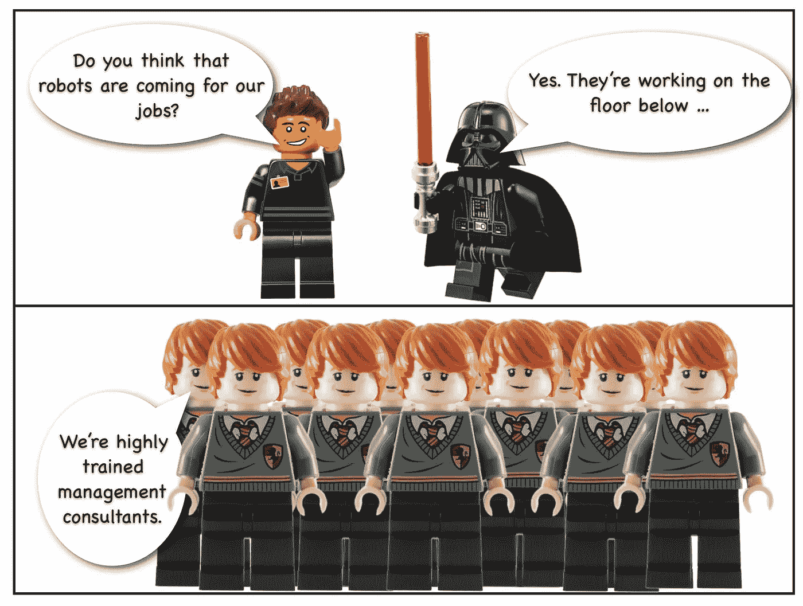
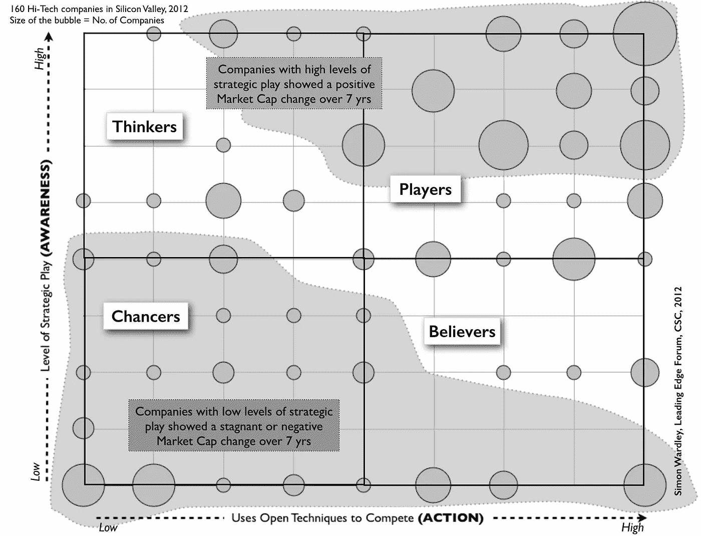

# 机器人来了…

> 原文：<https://medium.com/hackernoon/the-robots-are-coming-9fbe73a0ec40>

## 丧钟为谁而鸣。

我最初在 2016 年 4 月写了这篇[帖子，但鉴于《华尔街日报》对](http://blog.gardeviance.org/2016/04/the-robots-are-coming-for-whom-bell.html)[“全球最大的对冲基金正在从其员工的大脑中构建算法模型”](http://www.wsj.com/articles/the-worlds-largest-hedge-fund-is-building-an-algorithmic-model-of-its-founders-brain-1482423694)的讨论，我认为值得重复一遍，但随着 snark 刻度盘一直调到 11。还记得那句古老的格言“走开，否则我会用一个小 Perl 脚本替换你”……好吧，也许我们可以在*“机器人”*上实现我们的威胁。

## 论机器智能

我经常阅读关于机器智能和机器人将如何取代社会中的基本角色的文章，它们将成为这个世界的新司机、新服务员、新医院搬运工和护士。但这可能吗？如果他们要取代工作，那么他们最适合谁的工作？

对于这样的问题，我倾向于从三个角度来看——能力、成本和可接受性。它有能力以合理的成本做得更好吗？我们会接受它吗？例如，让我们以服务员的想法为例。当然，从营销噱头的角度来看，这的确有一些好处，但人类在接受订单、送餐和收拾桌子方面表现得出奇地好。与目前机器智能和机器人取代人类的成本相比，人类也相对便宜。总体而言，尽管我们可能会相信机器人会为我们送餐，但玩笑会不会一样，消费者会不会接受这种玩笑？除了噱头，我怀疑这种变化会在相当长的时间内发生。

然而，有其他群体的能力，成本和可接受性更积极的替代。一个可能的候选人是首席执行官。首席执行官？一家公司的？肯定不会吗？嗯，我想是的。让我们来看看原因。

## **能力**

从我的经验来看，大多数首席执行官往往表现出较差的情境意识，并且没有能力从具体情境中解读教义。我在 2012 年研究了 160 多家硅谷公司的情景意识和行动，结果显示，情景意识水平高的公司表现更好。但这是硅谷，它应该处于前沿，即使在这里，也有大公司对其环境的情况意识很差，并因此遭受痛苦。

走出硅谷和董事会开始感觉更像炼金术、直觉和 HBR 流行的东西，而不是象棋大师。情境意识似乎是例外，而不是常规。因此，与其说这是一场适者生存的达尔文式竞争，所有获胜的首席执行官都在斗智斗勇，不如换一种不那么仁慈的方式来看待这个问题——风险最小的生存。它由相同的规则管理，但不是一个积极的生存游戏，它更多的是随机出现的英雄角色。有点像《魔兽世界》等幻想角色扮演游戏中新玩家的[争吵，大多数人跑来跑去喊着“我迷路了”，一个玩家拯救了团队。很多事情可以归结为运气。当然，不可能是这种情况吧？唉，各种研究都对首席执行官的影响提出了质疑，例如 Markus Fitza 的研究表明，首席执行官对公司业绩的可测量的](http://blog.gardeviance.org/2014/08/dungeons-and-dragons-vs-art-of-business.html)[影响几乎不随机会变化](https://www.researchgate.net/publication/259542997_The_use_of_variance_decomposition_in_the_investigation_of_CEO_effects_How_large_must_the_CEO_effect_be_to_rule_out_chance)。

鉴于情境意识可以提高，理论和特定情境游戏可以学习，我们已经亲眼目睹了公司未能理解基本教训的经历，以及[被高度可预测的变化](http://blog.gardeviance.org/2015/02/on-two-forms-of-disruptions.html)(例如云)打乱，那么我们必须问这是否只是惰性、盲目或由其他动机造成的？首席执行官们不是愚蠢的人，但基金经理们也不是愚蠢的人，他们中的绝大多数都被简单的金融指数追踪者超越了。从我的经验来看，在这个领域，机器智能可能会极大地改善现任高管以及管理咨询行业的表现，管理咨询行业通常会“*支持*”现任高管。

## **成本**

用机器智能取代首席执行官的另一个好处是成本。与普通服务员不同，首席执行官并不便宜——他们往往非常昂贵。现在，虽然玛丽莎·梅耶尔在雅虎首席执行官的表现并不差(尽管许多人认为，该公司至少保持了收入)，但问题是，5 年的工作是否值 3.65 亿美元。实际上这个数字有多少并不重要，我们只知道它会比服务员预期的要多得多。总的来说，取代首席执行官的钱比普通员工要多得多。

## **可接受性。**

但是首席执行官领导着我们！你不会相信机器人的！嗯，这可能是高管思维和商学院神圣墙壁里的想法。但是在车间里，我们已经习惯了机器在驾驶汽车等领域为我们做出生死抉择。大多数人往往被自己的自主性、掌握能力、目标(如方向)和经济回报所激励。使用基于[单元的结构、地图、健身功能和其他工具](http://medium.com/wardleymaps)(例如[AirBnB 讨论的先驱、定居者和城市规划者结构](http://firstround.com/review/the-power-of-the-elastic-product-team-airbnbs-first-pm-on-how-to-build-your-own/))，那么大部分公司应该有可能创造这样的环境。我认为机器智能可以像人类一样轻松地处理这个问题。

一台机器可以通过探索一个不确定的区域来观察发现了什么，从而指导一群人类先驱去做他们擅长的事情。同样，在另一个极端，机器同样能够告诉一群人类城市规划者去关注工业化的事物，它甚至更有可能做出理性的决定，而不会因为过去的投资而产生惰性、情感动机或对政治资本的担忧。此外，机器完全能够学习适用于环境的基本经济模式。过去云计算技术巨头的失败是高管的失误和对高度可预测变化的人为错误。车间里并不缺少熟练的工程师。

早在 2008 年，在 Canonical (Ubuntu)，我们利用了云计算的可预测变化，以便在大约 18 个月内将该公司从市场的一小部分发展到所有云的 70%。从那以后，Ubuntu 一直保持着这个地位。如果我们面对的是机器，而不是人类高管，那么我不确定我们是否能侥幸逃脱，我们肯定不能利用惯性来对付其他人。不知何故，我怀疑人们会对机器智能担任首席执行官有意见，如果这能带来更多的稳定性和安全性，以及增强他们自己的自主性和掌控力。鉴于这种情况，我怀疑车间里的许多人会高兴地为我们的机器人霸主——*欢呼，“嘿，你还在和那个老 Cyberdyne systems CEO 一起跑吗？我们刚刚安装了新的 HAL 9000，它有更好的股票表现，并增加了道德命令子程序的情商。大家真的很开心。”*

当然，有一个群体可能不会欢呼——那些渴望成为 CEO 的人和那些已经成为 CEO 的人。事实上，还有另一个群体，他们是管理顾问。高管往往是非常忙碌的人，试图处理复杂和复杂的环境。他们总是在寻找快速的答案，整个行业都在准备*出售*最新的神奇解决方案。看看我们这个行业中普遍存在的东西吧，从 Myers Briggs 性格测试到[耳垂是如何表明领导潜力的](https://hbr.org/2011/11/how-earlobes-can-signify-leadership-potential)(据《HBR》报道)。我们能做得更好吗？机器会关心耳垂吗？不幸的是，这些团体投票选举机器人首席执行官就像火鸡投票选举圣诞节一样。如果这种变化真的发生，那么它必须首先在初创公司中进行测试，然后是维权投资者。顺便说一下，这就是为什么《华尔街日报》的那篇文章如此吸引人。

基于能力、成本和可接受性，考虑到所有可能被取代的角色，一般的首席执行官看起来和一般的服务员一样好，如果不是更好的话。规则总有例外，但这的确值得思考。在我看来，需要立即担心机器人/机器智能的不是蓝领工人，而是认为自己不是目标的白领工人。

*原载于 2016 年 12 月 22 日*[*【blog.gardeviance.org】*](http://blog.gardeviance.org/2016/04/the-robots-are-coming-for-whom-bell.html)*。*

> [黑客中午](http://bit.ly/Hackernoon)是黑客如何开始他们的下午。我们是 [@AMI](http://bit.ly/atAMIatAMI) 家庭的一员。我们现在[接受投稿](http://bit.ly/hackernoonsubmission)并乐意[讨论广告&赞助](mailto:partners@amipublications.com)机会。
> 
> 如果你喜欢这个故事，我们推荐你阅读我们的[最新科技故事](http://bit.ly/hackernoonlatestt)和[趋势科技故事](https://hackernoon.com/trending)。直到下一次，不要把世界的现实想当然！

