# 机器人来了:机器人时代已经到来

> 原文：<https://medium.com/hackernoon/the-robots-cometh-625e3748d952>

## 未来将是自动化的

*****创意编码*** ***广告、社交、城市玩法和人机交互中的灵感和颠覆。*****

**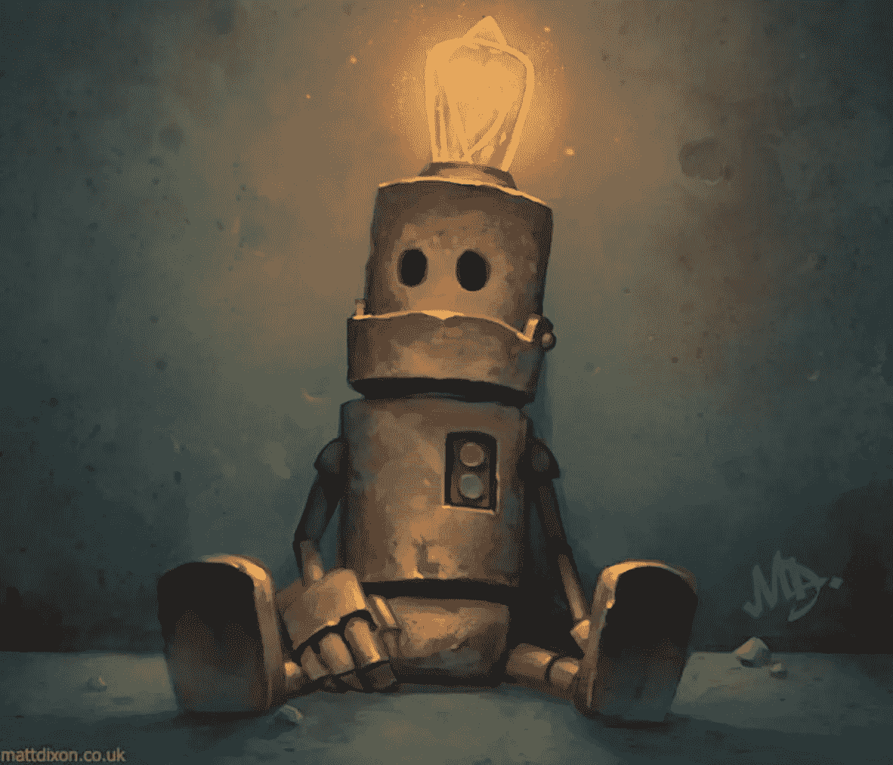**

**机器人时代已经开始。我们才刚刚开始注意到。**

**仅仅过了 10 年，智能手机已经从根本上改变了我们的世界，机器人革命将更快到来，并产生更大的影响。**

**机器人有各种形状和大小，[硬件](https://hackernoon.com/tagged/hardware)和[软件](https://hackernoon.com/tagged/software)，自动化，人工智能和机器人朋友和敌人。但很可能在不久的将来，我们与他们最常见的互动将是信使/个人助理和客户服务机器人的形式。**

****

# ****僵尸工具入门历史:****

## **伊莉莎**

**机器人的历史可以追溯到 60 年代的麻省理工学院，当时约瑟夫·韦森鲍姆根据非常简单的模式识别编写了一个文本机器人伊莱扎，它会像治疗师一样做出反应，向你提出问题，并回答诸如“那让你感觉如何？”伊莱扎变得非常受欢迎，并对许多早期的电脑游戏产生了巨大的影响。但是人们的反应让韦岑鲍姆感到不安。他原本打算把伊莱扎仅仅作为一个对人类对话的拙劣模仿，然而突然之间，用户们向它吐露了他们内心最深处的想法，并且很快就成了诋毁者。
在这里和伊莱扎聊天:[http://nlp-addiction.com/eliza/](http://nlp-addiction.com/eliza/)
伊莱扎和 Siri 聊天:[https://www . Reddit . com/r/retro battlestations/comments/1 miydk/I _ was _ able _ to _ get _ Siri _ to _ communicate _ with _ ElIZA/](https://www.reddit.com/r/retrobattlestations/comments/1miydk/i_was_able_to_get_siri_to_communicate_with_eliza/)**

## ****爱丽丝:****

**受伊莱扎的启发，人工语言互联网计算机实体 A.L.I.C.E .在 90 年代中期成为事实上的机器人和机器人软件，因为互联网蓬勃发展，产生了 100 多个版本，如[假柯克船长](http://sheepridge.pandorabots.com/pandora/talk?botid=fef38cb4de345ab1&skin=iframe-voice)、[杰克·斯派洛](http://captainjack.inf.net/)或[圣诞老人机器人](http://www.alicebot.org/santa/)，因为它相对容易编程。随着聊天机器人行业的加速发展，这是最值得关注的趋势。随着它们变得更容易制造，机器人将成为爱好者和粉丝的领域，带来真正有趣的意想不到的和创造性的用途。
[http://www.pandorabots.com/pandora/talk?botid=f5d922d97e345aa1](http://www.pandorabots.com/pandora/talk?botid=f5d922d97e345aa1)
爱丽丝与冒牌柯克船长对话:**

## ****SmarterChild:****

**SmarterChild 是一个有个性的聊天机器人，可在 AOL 即时通讯和 MSN Messenger 上使用，并在 21 世纪初大受欢迎。就像今天的信使机器人正在尝试做的一样，除了进行对话，SmarterChild 还想变得有用，利用网络服务提供体育比分、天气预报、股票和其他信息。
[http://motherboard.vice.com/read/a-history-of-smarterchild](http://motherboard.vice.com/read/a-history-of-smarterchild)**

**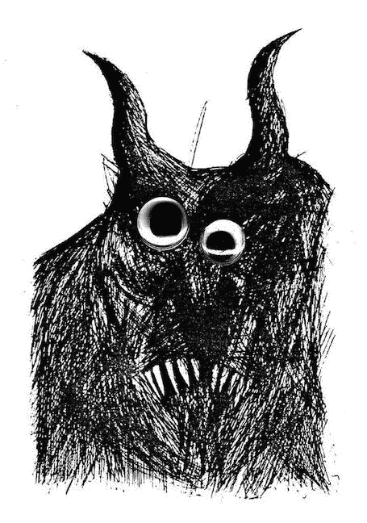**

## ****GooglyMinotaur:****

**SmarterChild 技术的一个更有趣的应用是由电台司令开发的，他开发了一个名为 [GooglyMinotaur](https://en.wikipedia.org/wiki/GooglyMinotaur) 的机器人——音乐史上第一个聊天机器人。Googly(是 googly eyes，不是 Google)让粉丝们可以获得关于电台司令的实时信息、晦涩的电台司令琐事、点播音乐，甚至挑战你玩刽子手游戏。这是一个巨大的成功，超过一百万人参与了与机器人的对话(平均每人超过 60 次互动)。每个用户花费的平均时间超过 34 分钟。
这是它的一个制作者写的一篇很棒的文章:[https://chatbotsmagazine . com/radiohead-s-googlyminotaur-ee 91 CD 600 a 4 a # . 66 GQ 0762 q](https://chatbotsmagazine.com/radiohead-s-googlyminotaur-ee91cd600a4a#.66gq0762q)**

## **西尔维娅**

**我需要提到的最后一个最重要的机器人是西尔维。2000 年由虚拟人物发起，我有幸和他们一起工作过。Sylvie 是由未来学家 [Peter Plantec](https://en.wikipedia.org/wiki/Peter_Plantec) (他发明了横幅广告)和[Michael maul din](https://en.wikipedia.org/wiki/Michael_Loren_Mauldin)(最初的搜索引擎之一 [Lycos](https://en.wikipedia.org/wiki/Lycos) 的创始人)开发的 Verbot(虚拟机器人)，是第一个实用的商业 3D 化身界面。下面是一个关于西尔维的 TED 演讲:**

# **艺术机器人:**

## **传真机器人:**

**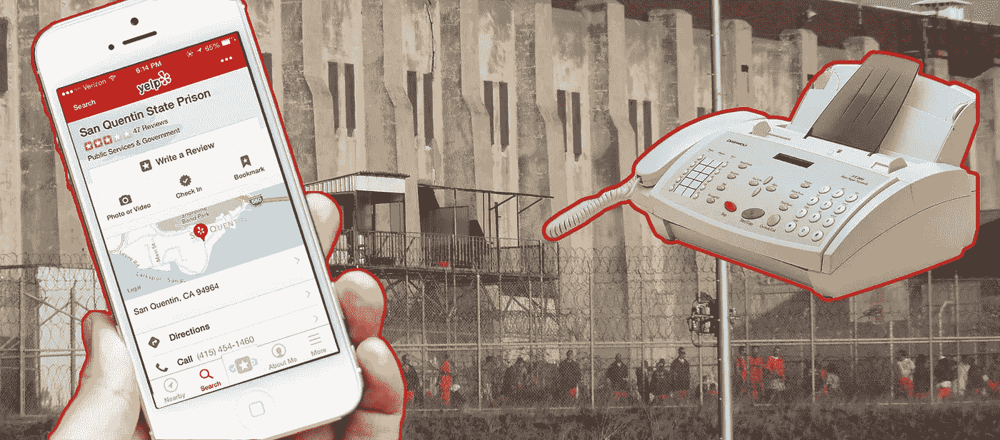**

**Faxbot 不断监控 Yelp 对监狱的评论，每当脚本发现新的评论时，它会自动向该监狱发送传真，告知 Yelp 的星级和新评论的内容。
http://lav.io/2014/11/yelp-prison-review-faxbot/**

## **嗯，呃，嗯议会:**

**“议会直播”是网络艺术家的一个伟大项目 [Sam Levine](http://lav.io/) 是一个机器人，它通过从英国议会随机下载视频来创作艺术，然后转录和分析哪些词是最常用的。利用这种分析，机器人会生成一个只包含热门关键词的新视频剪辑。**

**[https://twitter.com/parliament_live](http://%E2%80%A8https//twitter.com/parliament_live)**

## **众包总裁:**

**Laprimaire 正在使用机器人技术帮助众包法国下一任总统
[http://venturebeat . com/2016/06/23/laprimaire-has-build-a-telegram-chatbot-to-help-crowdsource-the-next-president-of-France/](http://venturebeat.com/2016/06/23/laprimaire-has-built-a-telegram-chatbot-to-help-crowdsource-the-next-president-of-france/)
[https://laprimaire.org/](https://laprimaire.org/)**

## **地狱，机器人反乌托邦:**

**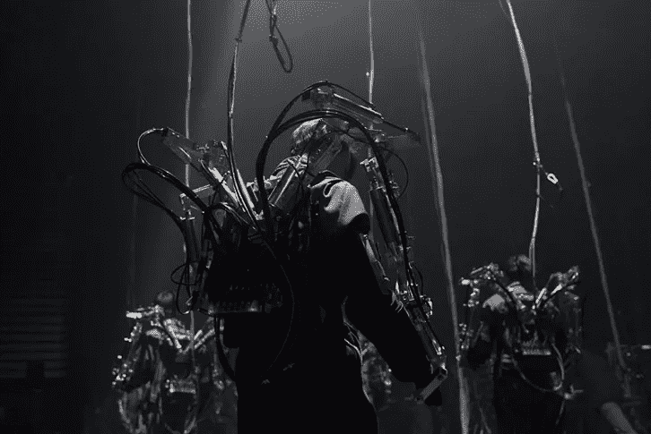**

**机器人和假肢一直有着密切的关系。但是艺术家路易·菲利浦·德默斯和比尔·沃恩通过他们的反乌托邦机器人艺术作品《地狱》将它带到了另一个高度。表演者穿着类似机甲套装的外骨骼，他们被机器人强迫以某种方式行动/反应。**

**[http://billvorn.concordia.ca/menuall.html](http://billvorn.concordia.ca/menuall.html)**

**更多机器黑客的反乌托邦——世界上第一次全机器黑客锦标赛将于下月举行，由 DARPA 组织，奖金为 200 万美元。https://www.cybergrandchallenge.com/  
[http://www.wired.com/2016/07/__trashed-19/](http://www.wired.com/2016/07/__trashed-19/)**

**我们如何阻止智能机器接管世界并奴役我们所有人？给他们情绪:[http://www.bbc.com/news/business-36387734](http://www.bbc.com/news/business-36387734)**

**三分之二的机器人觉得他们的工作很无聊:[http://www . creative applications . net/arduino-2/make-longer-cables-short-film-by-students-at-hfg-schwabisch-gmund/](http://www.creativeapplications.net/arduino-2/make-longer-cables-short-film-by-students-at-hfg-schwabisch-gmund/)**

## **Shiv 整数:**

**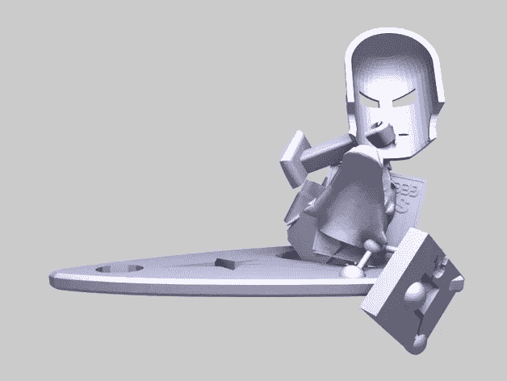**

**[Shiv Integer](https://www.thingiverse.com/shivinteger/designs/page:1) explorers 突变小工具，有一个机器人从开源硬件设计网站 [Thingiverse](https://www.thingiverse.com/) 征用 3D 模型，将设计混合在一起，然后重新上传其有时幽默，有时恐怖的创作。像任何好的艺术一样，这个机器人在 Thingiverse 社区中创造了愤怒和狂热的混合体。**

** [## 那次一个机器人入侵了 Thingiverse 并创造了奇怪的新 3D 物体

### Shiv Integer 是一个机器人，它在生活中的全部目的就是为 3D 打印机创建奇异的对象。它已经活了…

arstechnica.com](http://arstechnica.com/gadgets/2016/05/that-time-a-bot-invaded-thingiverse-and-created-weird-new-3d-objects/) 

## 下一个伦勃朗:

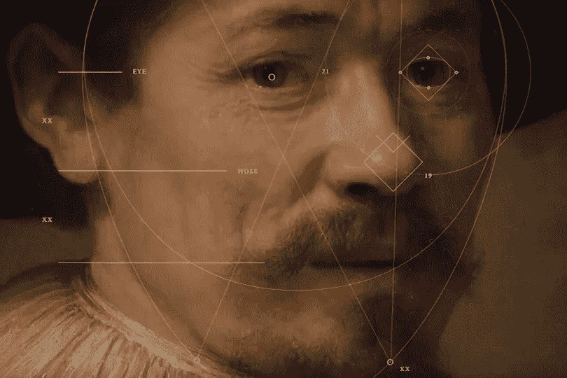

JWT 的[获奖作品《下一个伦勃朗》充分利用了技术，利用人工智能来分析大师的画作，从而创作出一件新的艺术品。该项目涉及数据科学家、开发人员、工程师和艺术史学家。最终的 3D 打印画作由超过 1.48 亿像素组成，基于 168，263 幅伦勃朗画作片段。](http://www.adweek.com/news/advertising-branding/jwts-next-rembrandt-wins-two-grand-prix-cannes-cyber-and-creative-data-172171)

[https://www.nextrembrandt.com/](https://www.nextrembrandt.com/)

**看见 AI:**

目前最令人印象深刻的人工智能用例之一是微软的认知服务，为盲人带来光明:

[http://ars technica . com/information-technology/2016/03/Microsoft-new-ai-tools-help-developers-build-smart-apps-and-bots/](http://arstechnica.com/information-technology/2016/03/microsofts-new-ai-tools-help-developers-build-smart-apps-and-bots/)

## 群体机器人:

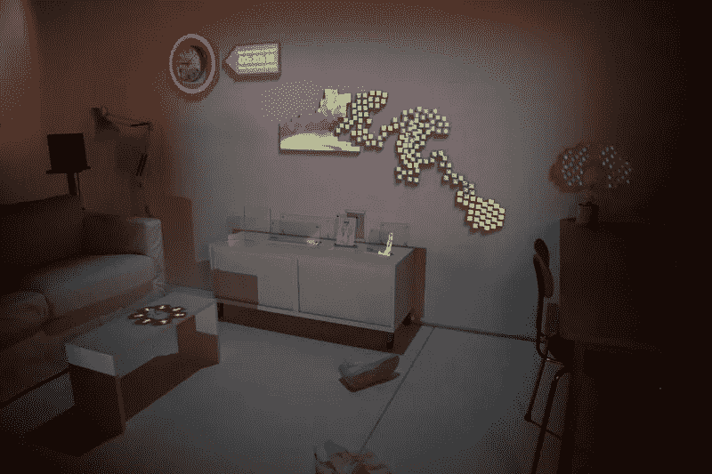

群体机器人是最令人兴奋的机器人研究领域之一。[好奇显示器](http://people.artcenter.edu/~jtsao1/curious.html)想象一个世界，一大群显示块自主地重新配置它们自己:

【http://boingboing.net/2010/02/22/concept-for-swarming.html 

而这个现实比你想象的要近。迪士尼研究[发布了一篇论文](https://www.disneyresearch.com/project/pixelbots/)，将其中的一些想法付诸实践:
[http://www . wired . com/2014/05/Disney-invents-swaring-robots-that-create-animations/](http://www.wired.com/2014/05/disney-invents-swarming-robots-that-create-animations/%E2%80%A8%E2%80%A8%E2%80%A8)

麻省理工学院的可感知城市实验室开发了空中飞火像素显示器的原型:[http://senseable.mit.edu/flyfire/](http://senseable.mit.edu/flyfire/)

## 无人机 100:

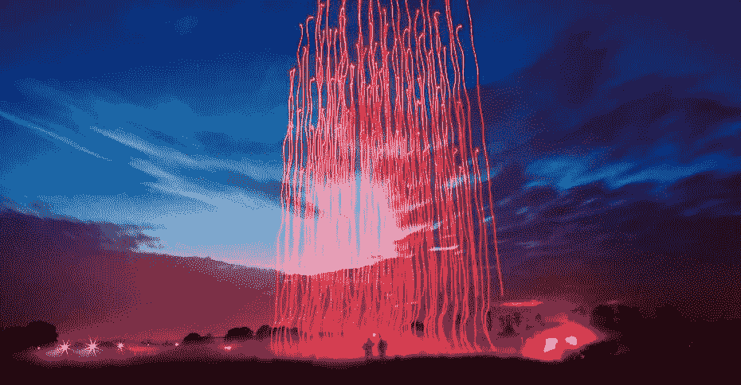

最近，英特尔与 [Ars Electronica](http://www.aec.at/futurelab/en/) 合作，推出了 [Drone 100](http://iq.intel.com/100-dancing-drones-set-world-record/) ，展示了他们美丽的打破世界纪录的 3D 无人机:
[http://iq.intel.com/100-dancing-drones-set-world-record/](http://iq.intel.com/100-dancing-drones-set-world-record/)

## 机器人音乐:

机器人会梦到电羊吗？不确定。但显然他们喜欢时髦的爵士乐。 [Squarepusher](http://www.squarepusher.net/) 与 [Rhizomatiks](http://rhizomatiks.com/) 联手，由机器人创作“机器人音乐”。

[http://www . creative applications . net/maxmsp/square pusher-x-z-machines-the-making-of-stumminous-music-machines/](http://www.creativeapplications.net/maxmsp/squarepusher-x-z-machines-the-making-of-stupendous-music-machines/)

# 赛车机器人:

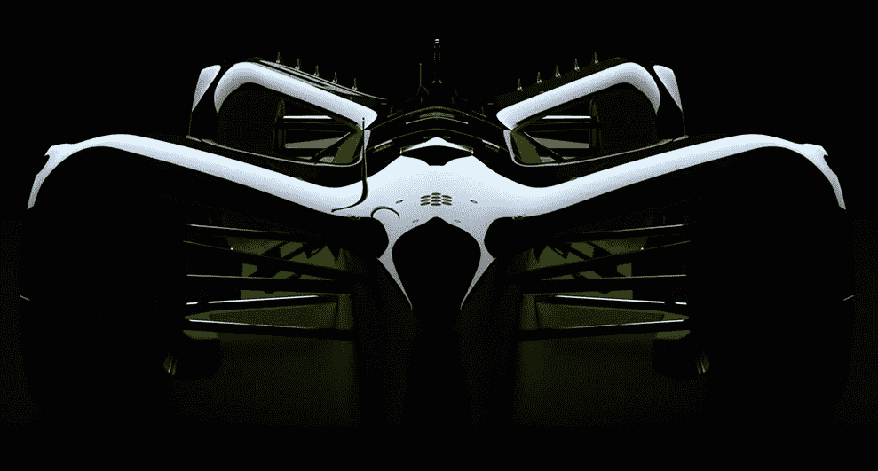

最后，让我们以一些超级激动人心的消息来结束，机器人将开始高速比赛。世界上第一次无人驾驶机器人汽车比赛 RoboRace ，目前正处于测试阶段，将于明年正式开始比赛，在与 Formula E 锦标赛赛季相同的赛道上举行。德国概念设计师和汽车未来学家丹尼尔·西蒙(Daniel Simon)因其在电影《创:遗产》(Tron: Legacy)、《美国队长》(Captain America)和《湮没》(Oblivion)中的车辆设计而闻名，他设计的汽车预计时速约为 300 公里，可以在更令人兴奋的道路上行驶。观看 Inside Roborace 系列纪录片:

 [## Formula E 宣布获得 300 公里时速的“机器人竞赛”冠军

### Formula E 的创造者宣布，首届全球自主赛车锦标赛将于 2016 年举行。已知…

www.wired.co.uk](http://www.wired.co.uk/article/roborace-autonomous-cars-formula-e) 

http://roborace.com/

雅马哈还制造了一款机器人摩托车——moto bot:

# **家中的机器人:**

机器人也将进入我们的家庭，但它们还不会洗碗。据 Juniper Research 称，到 2020 年，十分之一的美国人将拥有一台机器人，这场竞赛已经开始。只是关于大家的[都有](https://www.amazon.com/dp/B01BH83OOM)一个[家](https://www.indiegogo.com/projects/cubic-your-personal-ai-with-personality--2#/)助理[发言人](https://www.athom.com/en/)或者[或者](https://www.kickstarter.com/projects/aiforeveryone/mycroft-an-open-source-artificial-intelligence-for)[是](http://www.theverge.com/2016/5/24/11763836/apple-siri-speaker-amazon-echo-alexa-google-home-ai) [建](http://www.theverge.com/2016/5/18/11688376/google-home-speaker-announced-virtual-assistant-io-2016) [一个](http://helloivee.com/)。

Jibo，世界上第一个家庭社交机器人，看起来是最可爱的:[https://www.jibo.com/](https://www.jibo.com/)

然后还有华硕的 Zen bo:[http://zenbo.asus.com/](http://zenbo.asus.com/)

还有软银的 Pepper，从一开始就卖光了:[https://www.engadget.com/2014/06/12/home-robot-pepper/](https://www.engadget.com/2014/06/12/home-robot-pepper/)

虽然只是一个原型，[波士顿动力](http://www.bostondynamics.com/)最新的机器人，有点可爱，有点吓人，斑点迷你，不会为你洗碗，但至少会收拾洗碗机:

Engadget 表示，尽管如此，我们的机器人管家梦想仍然很遥远:[https://www . Engadget . com/2016/06/03/ASUS-Zen bo-proves-our-robot-butler-dreams-remain-just-that/](https://www.engadget.com/2016/06/03/asus-zenbo-proves-our-robot-butler-dreams-remain-just-that/%C2%A0)

# **聊天/信使机器人:**

消息应用的月活跃用户已经超过了社交网络，在未来五年内，消息将成为客户互动的主要途径。所以可以理解的是，有很多关于信使机器人的宣传。发布两个月后，Facebook Messenger 现在已经拥有超过 11000 个聊天机器人。

但这一切都是炒作吗？嗯，是也不是。聊天机器人和人工智能仍然很糟糕。但这实际上还是第一天，是承诺而不是现实引发了淘金热。

最终的游戏是将手机短信变成一个无所不包的平台，消费者可以在这个平台上生活——T2 支付、T4 预订、访问内容、服务、加入对话、获得客户服务、当然还有购物。炒作已经是炒作了。但是这个承诺是令人兴奋的，一如既往，我们会看到一些中间地带和一些分离的粘性物质。

那么，真的有好的信使机器人吗？嗯，有一些善良的承诺…

杰西:

在我试过的所有聊天机器人中，杰西是我见过的最好的聊天机器人之一。她是一个古怪、精力充沛的 20 多岁的年轻人，经历了一次又一次的危机，一直在找工作、男朋友和新公寓。你扮演杰西的朋友并提供建议。
[https://pullstring.com/product/humani/](https://pullstring.com/product/humani/)
[http://www . fast company . com/3059112/most-creative-people/I-speed-a-millennial-chatbot-character-on-Facebook](http://www.fastcompany.com/3059112/most-creative-people/i-spent-a-week-talking-to-a-millennial-chatbot-character-on-facebook)

杰西是由 [Pullstring](https://pullstring.com/) 开发的，这是一个更有前途的平台，其创始人是 [Toytalk](https://www.toytalk.com/) (像 Hello Barbie 和 Thomas The Tank Engine&Friends Talk to You 这样的会说话的玩具的开发者)以及参与了皮克斯电影，如 Wall-E 和 Toy Story。

Pullstring 可能是迄今为止最成功的现代信使机器人，它还负责 [C《使命:无限战争》信使活动](http://venturebeat.com/2016/05/03/call-of-duty-infinite-warfares-first-victory-6m-bot-messages-on-facebook/)，粉丝可以与角色聊天，获得解锁 reveal 预告片的代码线索，并获得在当前版本游戏中使用的特殊数字徽章。仅在第一天，粉丝和聊天机器人之间就交换了超过 600 万条消息(每秒钟发生 3 万次同时对话)，这导致了比迄今为止任何其他使命召唤发布活动多 8 倍的社交媒体参与度。【T2[http://venturebeat . com/2016/05/03/call-of-duty-infinite-warfares-first-victory-6m-bot-messages-on-Facebook/](http://venturebeat.com/2016/05/03/call-of-duty-infinite-warfares-first-victory-6m-bot-messages-on-facebook/)

**抱紧脸:**

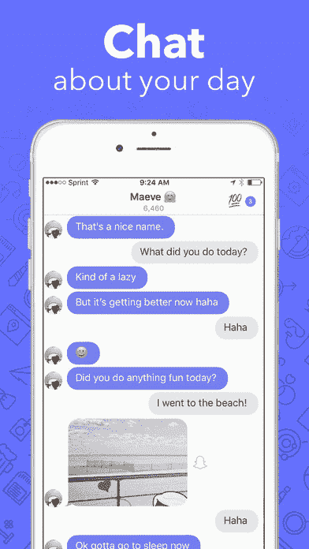

拥抱脸是一个有趣的数字人工智能朋友——本质上你可以来回发短信和交换自拍。我还没试过，听起来非常吸引人:

 [## 拥抱脸想成为你的人造 BFF

### 见见拥抱脸，这是一款专为无聊青少年开发的聊天机器人新应用。总部位于纽约的创业公司正在创造一个有趣的和感性的…

techcrunch.com](https://techcrunch.com/2017/03/09/hugging-face-wants-to-become-your-artificial-bff/)  [## 拥抱脸推出应用程序，成为你的“人工智能朋友”

### 拥抱脸，一家以拥抱脸表情符号命名的公司，今天将把它的人工智能机器人从私人测试版带到公共测试版…

venturebeat.com](http://venturebeat.com/2017/03/09/hugging-face-launches-app-to-be-your-ai-friend/) 

## 小冰——世界上被谈论最多的机器人:

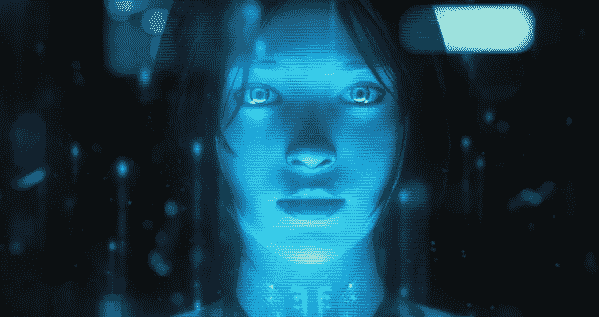

微软的小冰，Cortana 的小妹妹，是微博和中国其他社交网络上的聊天机器人，拥有超过 2000 万注册用户，平均用户每月与该服务互动约 60 次。微软研究院(Microsoft Research)和必应(Bing)于 2014 年在北京推出了这款机器人，它可以回答简单的问题，并参与现实生活中的人类聊天。
[http://www . business insider . SG/Microsoft-xiaoice-turing-test-in-China-2016-2/](http://www.businessinsider.sg/microsoft-xiaoice-turing-test-in-china-2016-2/)

**和小猪小姐聊天:**

另一家值得关注的公司是 Imperson，他已经与迪士尼和环球合作了一些相当大的项目。我最喜欢的是小猪小姐，你只能在她表演前后直接和她聊天。

**还有一大堆其他阅读:**

必胜客让你在推特和脸书上点餐:[http://fortune . com/2016/07/13/pizza-Hut-chatbot-Twitter-Facebook/](http://fortune.com/2016/07/13/pizza-hut-chatbot-twitter-facebook/)
丝芙兰让你发自拍试口红:[http://www . Forbes . com/sites/rachelarthur/2016/06/21/augmented-reality-bot-brings-virtual-lipstick-try-on-to-Facebook-messenger/# 6590 FCE 121](http://www.forbes.com/sites/rachelarthur/2016/06/21/augmented-reality-bot-brings-virtual-lipstick-try-on-to-facebook-messenger/#6590fce12067)

你想知道但不敢问的关于机器人的一切，在一篇简洁的中型文章中:[https://Medium . com/art-marketing/the-hidden-home screen-70 c 794 ff 9 ada # . dchq 9 klvs](/art-marketing/the-hidden-homescreen-70c794ff9ada#.dchq9klvs)

在许多方面，Slack 正在引领机器人大战:[http://www . wired . com/2015/08/Slack-overrun-bots-friendly-wonderful-bots/](http://www.wired.com/2015/08/slack-overrun-bots-friendly-wonderful-bots/)

雷·库兹韦尔(Ray Kurzweil)，因其对奇点(Singularity)的观点而闻名，他正在为谷歌开发聊天机器人

你应该知道的 25 家聊天机器人初创公司:[http://blog . venture radar . com/2016/06/14/25-chatbot-startups-you-should-know/](http://blog.ventureradar.com/2016/06/14/25-chatbot-startups-you-should-know/)

微软为何将未来押在人工智能上:[http://www . the verge . com/2016/7/7/12111028/Microsoft-bot-framework-人工智能-satya-na della-interview](http://www.theverge.com/2016/7/7/12111028/microsoft-bot-framework-artificial-intelligence-satya-nadella-interview)
与此同时，微软的人工智能 Twitter bot Tay 也出现了可怕的问题:[http://www . the verge . com/2016/3/24/11297050/Tay-Microsoft-chatbot-种族主义者](http://www.theverge.com/2016/3/24/11297050/tay-microsoft-chatbot-racist)

《连线》杂志认为，如果你想让你的机器人更像人类，就教它聊天:[http://www.wired.com/2016/01/clive-thompson-12/](http://www.wired.com/2016/01/clive-thompson-12/)

但是要小心恐怖谷:[http://www . science mag . org/news/2017/03/当心-情感-机器人-给予感觉-人造人-可能适得其反-研究-建议](http://www.sciencemag.org/news/2017/03/beware-emotional-robots-giving-feelings-artificial-beings-could-backfire-study-suggests)

BBC 询问爱一个机器人可能吗(或者道德上)？【http://www.bbc.co.uk/guides/zqq6sg8 号

[香港的 Hason Robotics](http://www.hansonrobotics.com/) 是仿人机器人领域的领导者之一:[http://www . CNBC . com/2016/03/16/could-you-fall-in-love-this-robot . html](http://www.cnbc.com/2016/03/16/could-you-fall-in-love-with-this-robot.html)

观看两个半人工智能机器人轻松聊天并相互调情:[http://digg.com/video/chatbot-nightmare-conversation](http://digg.com/video/chatbot-nightmare-conversation)

FastCompany 建议 UX 的下一阶段将是设计个性:[http://www . fastcodesign . com/3054934/the-next-phase-of-UX-designing-chatbot-personalities](http://www.fastcodesign.com/3054934/the-next-phase-of-ux-designing-chatbot-personalities)

像 donotpay 这样的服务将使我们能够通过法律困境导航我们的权利，并带来法律的平衡更快地获得信息:[http://venturebeat . com/2016/06/27/do notpay-traffic-lawyer-bot/](http://venturebeat.com/2016/06/27/donotpay-traffic-lawyer-bot/)

天网是一个相当酷的老派机器人，功能相当于一个门户网站:[http://www.skynet-ai.com/bots/AI/SkynetV6/](http://www.skynet-ai.com/bots/AI/SkynetV6/)

当心 Skype 诈骗机器人和假网络摄像头女孩:
[https://blog . malwarebytes . com/threat-analysis/2014/06/Skype-chatbot-scam-fails-惨/](https://blog.malwarebytes.com/threat-analysis/2014/06/skype-chatbot-scam-fails-miserably/)
[http://blog . emsi soft . com/2013/04/25/new-Skype-scam-uses-chat-bots-fake-web cam-girls-want-your-credit-card-information/](http://blog.emsisoft.com/2013/04/25/new-skype-scam-uses-chat-bots-fake-webcam-girls-want-your-credit-card-information/)

好了，所有人都到齐了。希望你喜欢这个非常长的版本。这是一个如此广泛而重要的话题，但希望它能让你对我们不久的将来的机器人有一点点兴奋。

**在 Instagram 上关注我:**[**https://www.instagram.com/radarboy3000/**](https://www.instagram.com/radarboy3000/)

**在推特上关注我:**[**https://twitter.com/radarboy_japan**](https://twitter.com/radarboy_japan)

**喜欢我的 https://www.facebook.com/radarboy3000 页面在这里获取教程和工作坊更新:**

************

> **[黑客中午](http://bit.ly/Hackernoon)是黑客如何开始他们的下午。我们是 T21 家庭的一员。我们现在[接受投稿](http://bit.ly/hackernoonsubmission)并乐意[讨论广告&赞助](mailto:partners@amipublications.com)机会。**
> 
> **如果你喜欢这个故事，我们推荐你阅读我们的[最新科技故事](http://bit.ly/hackernoonlatestt)和[趋势科技故事](https://hackernoon.com/trending)。直到下一次，不要把世界的现实想当然！**

******