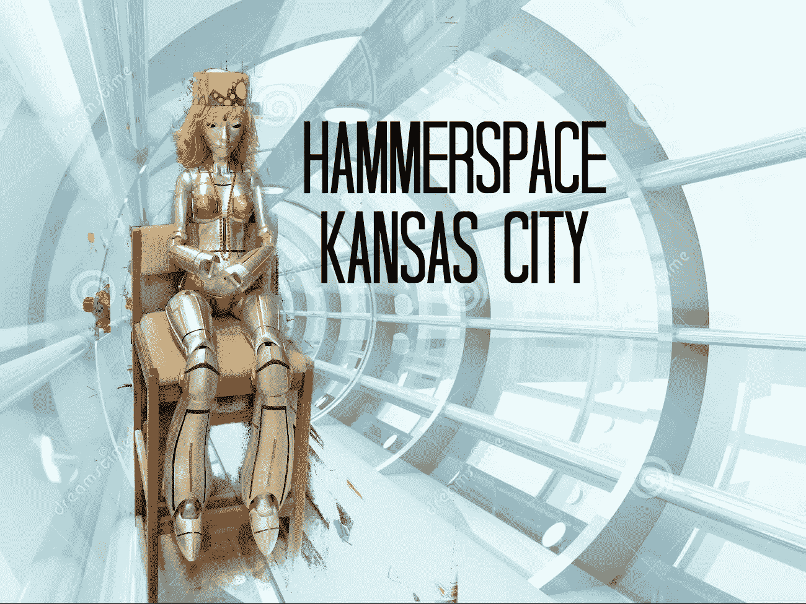
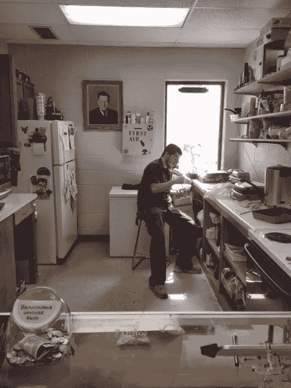
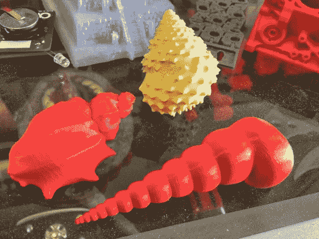
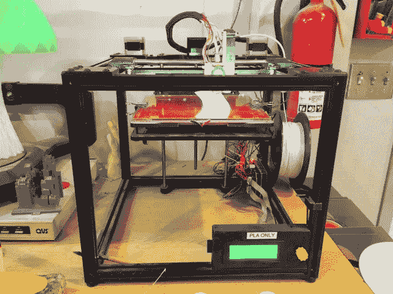
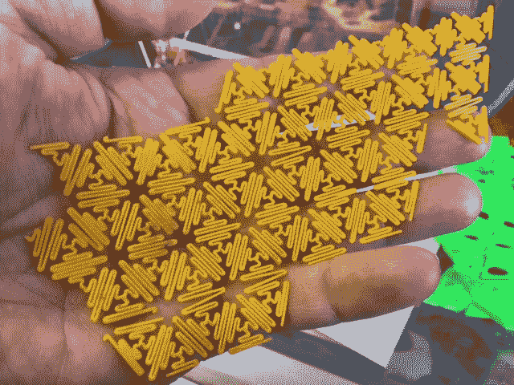
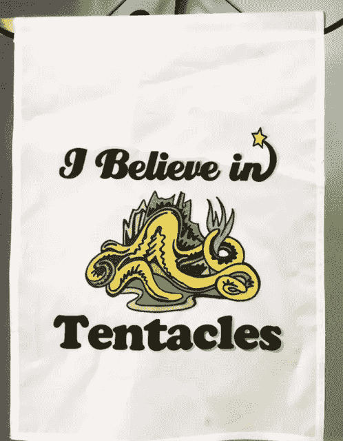
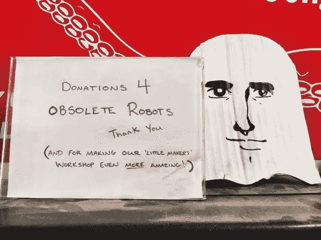
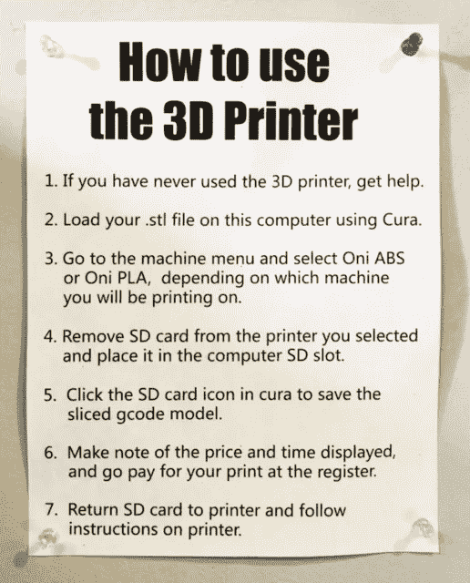

# 机器人降落在堪萨斯城的哈默空间

> 原文：<https://medium.com/hackernoon/the-robots-have-descended-upon-hammerspace-in-kansas-city-68124a698b51>

Robot from Hammerspace Community Workshop in Kansas City

在你相信机器人真的接管了堪萨斯城的一栋小建筑之前，我想让你看看这个视频。然后我们可以谈谈。

15 年前，远在 Siri 发布(2011 年)之前，KC 的 Hammerspace 社区工作室的创始人戴夫·道尔顿(Dave Dalton)创建了一个名为 Iris 的惊人智能语音识别软件程序。他告诉我，他在他儿子的卧室里安装了 Iris，这完全类似于宇宙飞船的内部。他给我看了他儿子卧室的脸书文件夹里的照片，这是我很久以来见过的最酷的东西。戴夫开玩笑地或不那么开玩笑地声称，苹果公司已经吸收了他的程序，并将其倒过来拼写(iris=siri)。

我在那里的时候，我们做了一个测试，问了 Siri 和 Iris 一个问题:“这是怎么回事？”Siri 的回答是“这是一个有趣的问题”，而 Iris 最后回答道，“嗯，这很有趣，我认为机器人革命即将开始，你不觉得吗？”一分钟后，戴夫问了艾瑞斯同样的问题，得到了不同的答案。艾里斯说，“我不确定，但我认为现在正在发生的事情以前已经发生过几百次了。”

艾瑞斯惊人的智力让我大吃一惊。她在各方面都远远优于 Siri。可以听到 Iris 的声音从小吃厨房里传出来，如下图所示。戴夫让艾瑞斯做所有的例行工作，比如向会员宣布，“现在该清理你的工作区了。”

a phallus-like object in right bottom corner.

我漫步走进一个房间，在那里我目睹了一台 3d 打印机正在打印一个物体(现在我看到 3d 打印机在工作，难道不酷吗？).我印象深刻。我问了戴夫一大堆问题，关于我如何制作我的太阳能超级英雄娃娃。他似乎有点生我的气，但在他感觉到我是认真的后，他回答了我的问题。这是 3d 打印机和一堆 3d 打印的物体，我可以触摸和感受到:

My favorite 3-d printed object was the thin yellow fabric at far right. It looks simultaneously organic and computer-generated.

我花了大量的时间来观察墙上和各个房间里那些很酷很奇怪的东西。我也相信触须，所以当我看到它的布海报时，我很敬畏。我也喜欢向过时的机器人捐赠的想法。我今天看到的一切绝对疯狂，让我对堪萨斯城有了新的希望。我加入。我的太阳能爱好包很快就要到了，然后我将开始画我的太阳能娃娃。很明显，我需要帮助，但是，我可以在脑海中清晰地想象出洋娃娃和它的太阳能屋以及宠物。所以现在我只需要把描述转化成现实。

我看到的最喜欢的东西是一个女性机器人。我不知道是谁做的，但它真的很酷:

我认为 Hammerspace 最大的优点是会员费用低廉。一旦你成为会员(每个月 50 美元/个人，每个月 75 美元/家庭，所有孩子免费)，你就可以在自己的项目中使用 3d 打印机。我问打印一个物体要多少钱，戴夫告诉我，当时打印一个物体要 16.03 美元。很实惠！如果你想学习如何使用 3d 打印机，这里有一些指导:

在复活节，哈默空间计划了一个非常酷的活动。[用机器人](https://www.facebook.com/events/100200400379141/)和丝绸领带装饰鸡蛋！

访问他们的[脸书页面](https://www.facebook.com/hammerspace.workshop/)，了解更多关于他们即将举办的活动的详情。

每当我发现这样的事情，我就问自己，“过去的 4 年我他妈的去哪了？”

哦，是的，我一直在阴沟里煎熬，啃着生马肉和黑暗。

在这里加入我的时事通讯[。](http://leahstephens.weebly.com/sign-up-for-my-newsletter.html)

感谢您对此事的关注。机器人赢了。

> [黑客中午](http://bit.ly/Hackernoon)是黑客如何开始他们的下午。我们是 [@AMI](http://bit.ly/atAMIatAMI) 家庭的一员。我们现在[接受投稿](http://bit.ly/hackernoonsubmission)并乐意[讨论广告&赞助](mailto:partners@amipublications.com)机会。
> 
> 如果你喜欢这个故事，我们推荐你阅读我们的[最新科技故事](http://bit.ly/hackernoonlatestt)和[趋势科技故事](https://hackernoon.com/trending)。直到下一次，不要把世界的现实想当然！

