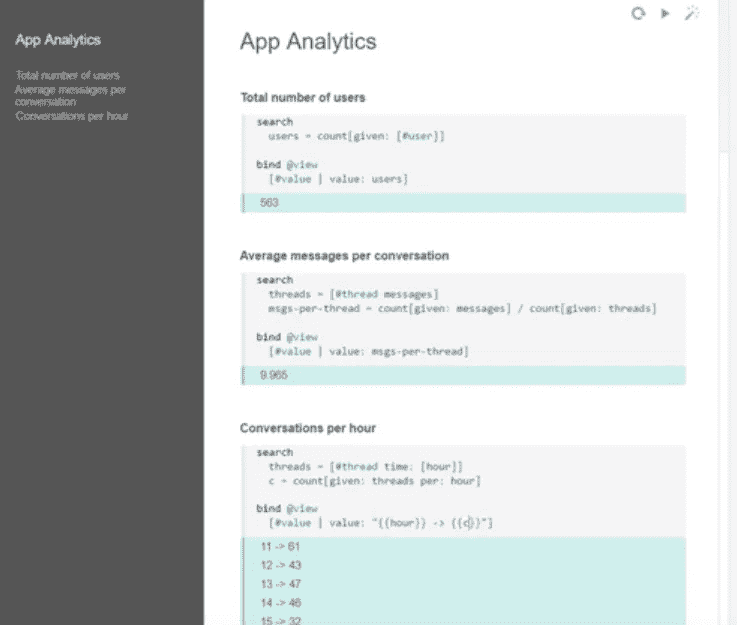
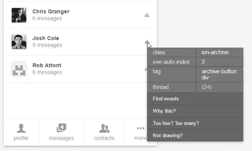
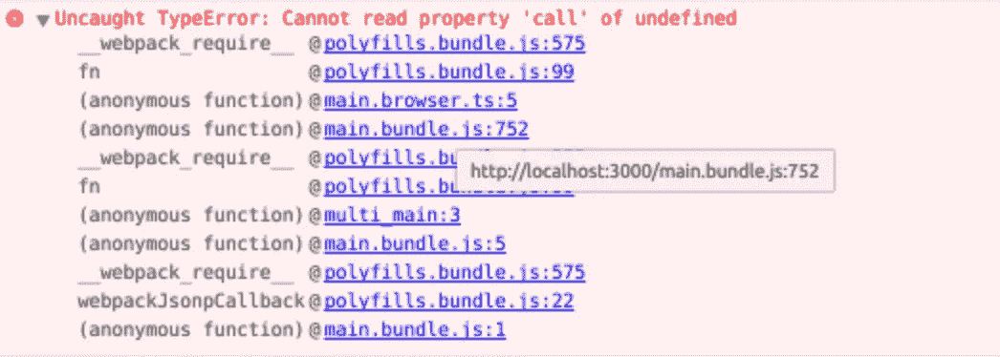

# 夏娃远大理想的坚实基础

> 原文：<https://medium.com/hackernoon/the-rock-solid-foundation-for-eves-big-vision-225b80b91e11>

欢迎来到我关于 [Eve](http://witheve.com/) 的系列文章的第五部分，这是一种令人兴奋和着迷的新编程语言。

*   [*I .*Eve 如何统一你的整个编程栈](https://hackernoon.com/how-eve-unifies-your-entire-programming-stack-900ca80c58a7)
*   [*二世。*当逻辑编程遇上 CQRS](https://hackernoon.com/when-logic-programming-meets-cqrs-1137ab2a5f86)
*   [*三世。*挣脱我们的镜链](https://hackernoon.com/throwing-off-our-scope-chains-7567beb2d0b6)
*   [*四世。* Smalltalk 和蛋白质编程](https://hackernoon.com/smalltalk-and-protein-programming-4da245ac93e2)
*   ***五、*夏娃远大理想的坚实基础**
*   [*六。*为什么 Eve 是实时应用的完美选择](https://hackernoon.com/why-eve-will-be-perfect-for-realtime-apps-92b965b80ad)

> 还有很多事情要做，还有很多事情要弄清楚，但幸运的是，我们有一个良好的基础，我们可以利用它来确保事情不会偏离轨道太远。很高兴知道，只要我们可以将我们的语义解析回 X，我们就可以保持 X 的属性。这是一件非常困难的事情，但结果似乎是这样的:)

— [在](https://medium.com/u/2826fea8bb47#1 和#2 之间的一个尴尬的中间地带:你将状态块从你的 UI 视图中分离出来，并将它们隔离在一个只支持函数式编程的区域中。)

 传统分布式编程中的许多痛苦来自这种不匹配:程序员被期望从有序的编程模型过渡到执行他们代码的无序现实。

夏娃是一种“无序的语言”。Eve 唯一的排序保证是**同步块。**在每个时间步，所有代码块(每个代码块都有一个或多个`search` / `bind` / `commit`段)读入该时间步的世界快照，它们都写入下一个时间步的世界快照。有点像 [Smalltalk 和蛋白质编程](https://hackernoon.com/smalltalk-and-protein-programming-4da245ac93e2)。

Eve 有可能让分布式数据和计算变得更容易访问:

*   编写简单的 Eve 代码来管理大规模的复杂数据事务，这种事务需要锁定多个遥远的碎片。
*   通过编写与单核机器相同的代码，使用 Eve 将计算密集型任务分散到多核 CPU 或云中的大型服务器群。

Eve 团队将这一愿景称为“**世界规模的计算机**”。

**下篇:** [*六*。为什么 Eve 是实时应用的完美选择](https://hackernoon.com/why-eve-will-be-perfect-for-realtime-apps-92b965b80ad)

> [黑客中午](http://bit.ly/Hackernoon)是黑客如何开始他们的下午。我们是 [@AMI](http://bit.ly/atAMIatAMI) 家庭的一员。我们现在[接受投稿](http://bit.ly/hackernoonsubmission)，并乐意[讨论广告&赞助](mailto:partners@amipublications.com)机会。
> 
> 如果你喜欢这个故事，我们推荐你阅读我们的[最新科技故事](http://bit.ly/hackernoonlatestt)和[趋势科技故事](https://hackernoon.com/trending)。直到下一次，不要把世界的现实想当然！

