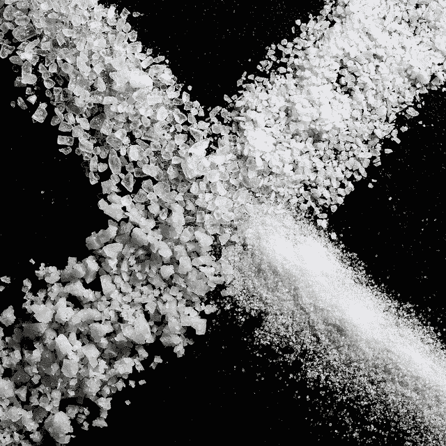
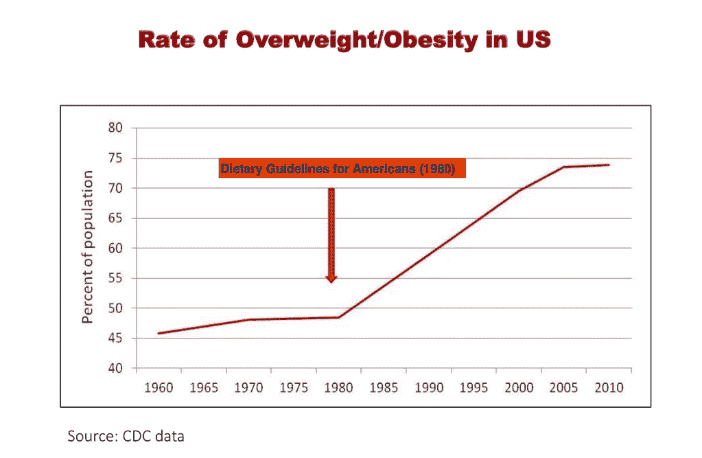
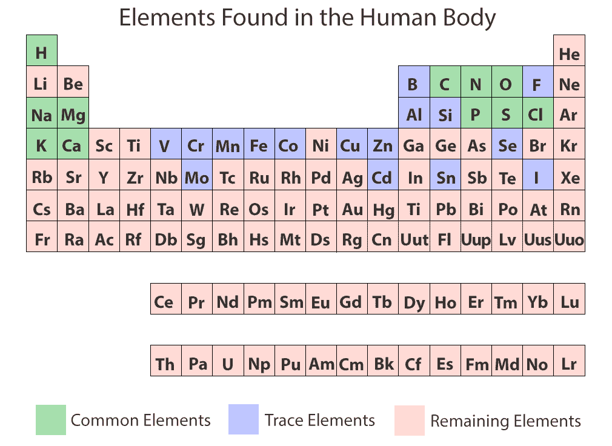
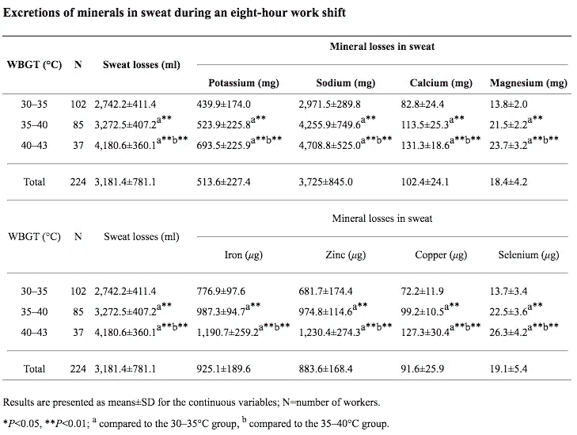

# 盐和电解质的科学(我们摄入的足够多吗？)

> 原文：<https://medium.com/hackernoon/the-science-of-salt-and-electrolytes-are-we-consuming-enough-7299e8f398f1>

Clockwise from lower left: celtic gray sea salt, coarse sea salt, kosher salt, and regular table salt. [photo credit](https://www.flickr.com/photos/sackton/7086073585)

现代科学揭示了我们又一次错了(被愚弄了)。事实证明，矿物质缺乏可能是一个比我们意识到的更大的问题，因为没有摄入足够的盐和电解质对我们的健康既容易又危险。

首先，美国医学会杂志内科学[去年揭露](https://jamanetwork.com/journals/jamainternalmedicine/article-abstract/2548255)糖业在 20 世纪 60 年代付钱给科学家[将责任从糖转移到饱和脂肪&胆固醇作为心脏病的潜在原因。](https://www.nytimes.com/2016/09/13/well/eat/how-the-sugar-industry-shifted-blame-to-fat.html)

现在，越来越多的证据表明低盐运动的起源在科学上也是有缺陷的。

最值得注意的是，科学家们的政治影响，如 [Frederick M. Allen](https://en.wikipedia.org/wiki/Frederick_Madison_Allen) 、 [Walter Kempner](https://en.wikipedia.org/wiki/Rice_diet#Origin_and_original_form) 、 [Lewis K. Dahl](https://www.ncbi.nlm.nih.gov/pmc/articles/PMC4393342/) 、 [George Meneely](https://vanderbiltnuclearmedicine.com/era-2/path-b-george-meneely/) 和 [Harold Battarbee](https://www.ncbi.nlm.nih.gov/pubmed/?term=Battarbee%20HD%5BAuthor%5D&cauthor=true&cauthor_uid=10079262) 在 20 世纪开创了一条道路，导致低盐教条进入 1977 年的饮食目标，并最终进入 1980 年的饮食指南，从[开始影响了我们](http://www.booksforbetterliving.com/eating-more-salt-might-save-your-life/):

> ……1977 年的饮食目标主要依靠乔治·梅内利和哈罗德·巴塔比向所有美国人推荐低盐饮食。然而，即使是这些作者也认为，限盐只对那些钾摄入量低的人重要，并且只对那些遗传上易受盐引起血压升高影响的人重要。换句话说，即使是这些作者也从不认为所有美国人都应该得到低盐饮食建议。

啊哦。休斯顿，我们有一个问题:

我在这篇文章中的目标是教授钠和其他电解质的基础科学，因为它们与人类健康有关。

我将指出表明“低盐”运动可能弊大于利的研究，我将讨论可以引导你走向**电解质营养的饮食技巧。**

**当然，在对你的饮食做任何改变之前，请咨询你的医生/医疗团队。我鼓励你在完善你的健康计划时，与他们一起学习、分享和讨论引用的研究。**

## **盐和电解质到底是什么？**

**从技术上来说,“盐”是任何包含一种叫做*阳离子*(带正电)和*阴离子*(带负电)的带电粒子组合的物质。**

**这些单独的粒子被称为“电解质”，因为它们在水中“分离”时可以导电(希腊语:*ly tos)*。电解质可以是单个元素(如钠)或元素组(如磷酸盐)。**

**我们通常所说的“盐”，其实是“食盐”(NaCl)；一个钠原子和一个氯原子结合，在水中容易分解。**

## **什么电解质对人体健康很重要？**

**在我们的身体中有七种主要的电解质:**

1.  **钠**
2.  **氯化物**
3.  **钾**
4.  **镁(毫克)**
5.  **钙**
6.  **磷酸盐**
7.  **碳酸氢盐**

**其他值得注意的电解质是锌、铁、锰、钼、铜和铬。**

**为了彻底回答这个问题，事实上，让我们看看周期表，记下我们身体需要的所有元素:**

****

**[Source](https://askabiologist.asu.edu/content/atoms-life)**

**由于我们体重的 96.2%来自氧、碳、氢和氮，这意味着我们体重的 3.8%来自上述所有其他元素。这些元素中的大多数是(或包含在)电解质，在我们身体每天发生的数百万个化学过程中起着至关重要的作用。**

## **钠摄入过多会导致高血压吗？**

**这是一个百万美元的问题(或者更像是一个数万亿美元的问题)。事实证明，*没有确凿的科学证据*表明过量摄入钠 ***会导致大多数人患*** 高血压。当然，有大量的研究试图显示两者之间的相关性；但即便如此，对于那些血压正常(即低于 120/80 mmHg)的人来说，几乎没有相关性。即使是已经高血压的人(！)，只有很小的相关性，即使如此，也只有 45%的人有相关性。**

*****什么！？我们一生都被告知，吃少量的盐对健康很重要。*****

**让事情更加混乱的是，[最近的证据](http://www.clinsci.org/content/114/3/221)甚至[向](https://www.medicalnewstoday.com/articles/317099.php)展示了一个相反的相关性:**

> **“虽然我们预计饮食中钠的摄入量与 SBP(收缩压)和舒张压(舒张压)都呈正相关，但结果却相反。”Lynn L. Moore 等人。波士顿大学医学院**

**即便如此——正如任何优秀的科学家都会告诉你的那样——相关性(在任何方向上)并不等于因果关系。**

**除了盐之外，有没有可能血压有问题的人吃的食物中还有其他东西有问题？那种成分真的是导致高血压的*吗，或者是多种成分的复杂混合物？(剧透:看起来碳水化合物是关键问题***

## **这是我们所知道的**

**有充分的证据表明，低钠饮食会导致:**

*   **心率增加**
*   **对肾脏的压力增加(即，将盐吸回体内需要消耗能量，而不是直接从尿液中排出)**
*   **胰岛素分泌、脂肪储存和胰岛素抵抗增加**
*   **[生育率下降](https://academic.oup.com/ndt/article/23/7/2154/1861032/Aphrodite-sex-and-salt-from-butterfly-to-man)**
*   **甘油三酯、胆固醇和肾上腺素水平升高**
*   **总胆固醇与高密度脂蛋白比率增加**
*   **[小鼠](https://www.ncbi.nlm.nih.gov/pubmed/15910852)的动脉硬化[(尚未在人类身上测试，但证据对我们不利)](https://www.ncbi.nlm.nih.gov/pubmed/28481921)**
*   **[血细胞比容增加](https://www.ncbi.nlm.nih.gov/labs/articles/1921252/)(即红细胞体积超过血液总体积)，又名红细胞增多症，可导致容易出血、容易瘀伤、瘙痒、疲劳和血凝块问题。**
*   **[肾素和醛固酮增加](https://www.ncbi.nlm.nih.gov/pubmed/7826551)(其中*增加*血压)**
*   **肝脏中[脂肪酸合成增加](https://www.ncbi.nlm.nih.gov/pubmed/12898476)(可导致脂肪肝疾病)**

**你必须问问自己，对每个人来说——包括低盐饮食降低血压的一小部分人——这些风险值得吗？**

## **其他电解质呢？我如何知道我是否有问题？**

**电解质失衡的症状[包括以下一种或多种](https://draxe.com/electrolyte-imbalance/):**

*   **肌肉疼痛、痉挛、抽搐和虚弱**
*   **不安定**
*   **焦虑**
*   **常性头痛**
*   **异常强烈的口渴**
*   **失眠**
*   **发热**
*   **心悸(心跳不规则)**
*   **消化问题，如痉挛、便秘或腹泻**
*   **困惑和难以集中注意力**
*   **骨骼疾病**
*   **关节痛**
*   **食欲或体重的显著变化**
*   **疲劳(包括慢性疲劳综合征)**
*   **关节麻木和疼痛**
*   **头晕，特别是突然站起来的时候**

**对于那些感兴趣的人，我已经在下面的**附录 A** 中包含了关于人体内 13 种值得注意的电解质的详细信息，包括你体内过多或过少的症状。**

## **我每天应该摄入多少电解质？**

**以下是[目前的 FDA 指南](https://www.accessdata.fda.gov/scripts/InteractiveNutritionFactsLabel/factsheets/Vitamin_and_Mineral_Chart.pdf)(我将在下面评论更多关于钠的内容；其他的没有争议):**

1.  ****钠:2400 毫克*****T5【2018 年 7 月[改为 2300 毫克](http://www.menutrinfo.com/facts-sodium/)****
2.  ****氯化物:3400 毫克****
3.  ****钾:3500 毫克****
4.  ****镁:400 毫克****
5.  ****钙:1000 毫克****
6.  ****磷酸盐(**来源于**磷:1000 毫克)****
7.  ****碳酸氢盐:**(通过碳酸酐酶从 H2O 和 CO2)**
8.  ****锌:15 毫克****
9.  ****铁:**18mg**
10.  ****锰:2 毫克****
11.  ****钼:75 微克(微克，又名微克)****
12.  ****铜:2 毫克****
13.  ****铬:120 微克****

***科学证据表明，这对大多数人来说可能是有害的。根据一项对 17 个国家超过 10 万人的研究,“每天摄入 3 克到 6 克的钠比摄入更高或更低的钠会降低死亡和心血管事件的风险。”另一项[研究](https://www.ncbi.nlm.nih.gov/pubmed/24651634)观察了大约 27.5 万人，发现每天摄入 2645 毫克到 4945 毫克钠是最佳范围。**

**因此，根据上述数据，你可能需要和你的医生讨论一个每天摄入 3-6 克钠的计划，尤其是如果你不是高血压患者。**

**令人欣慰的是，如果你没有太注意你摄入了多少盐，只要你没有狼吞虎咽地吃成吨的加工食品，你很可能每天自然摄入大约 3-6 克。你的身体知道自己需要什么。**

**然而，除了钠之外，美国人摄入的钾、镁、钙、锌和铁不够，这是一个值得关注的问题。**

**这可能是由于在过去的 30 年里，种植我们水果和蔬菜的土壤中这些矿物质的消耗，牛奶消费量的大幅下降，以及牛肉摄入量的大幅下降，和/或大多数人很难定期食用绿叶蔬菜(尤其是菠菜)。**

**事实上，深入研究每一种电解质是值得的，这样可以更好地了解你需要吃多少才能符合指南。在下面的**附录 B** 中，我列出了一份广泛的健康食物清单，以便从你的饮食中获取足够的这些矿物质。**

## **医生如何检测电解质问题？**

**当然，检测电解质失衡最常见的方法是验血。大多数正常的实验室测试会检查您血清中的钠、钾、氯、钙和碳酸氢盐，但除非您或您的医生特别要求，否则您很少会得到其他电解质的结果。**

**由于轻微的电解质缺乏和不平衡通常会导致整体缺乏能量(而且由于大多数美国成年人用咖啡因掩盖这些症状)，电解质问题得不到治疗是很常见的。**

**此外，例如，钙、钾和镁在常规血清测试中可能看起来正常，但实际上在我们体内的细胞和间隙中含量很低。为了解决这个问题，其他测试[包括](https://www.mymagnesiumdeficiency.info/how-to-test-for-magnesium-deficiency/):**

*   ****红细胞(RBC)测试** —即测试红细胞自身内部的电解质，而不仅仅是血清。**
*   ****EXA 测试**——这种测试采取脸颊交换并测量软组织中的电解质，在软组织中更常见的元素是镁。**
*   ****耐受力(或负荷)测试** —这包括给某人注射安全剂量的电解质，然后测量尿液排出量。**
*   ****电离测试** —这些测试仅分离血液中电解质的“自由离子”(即，对许多生物过程最重要的离子)，而正常的血清测试则提取所有形式，包括那些与其他元素或分子结合的离子。**

**不用说，如果你怀疑电解质不平衡，并且在血清测试中没有显示出来，敦促你的医生进行额外的测试。**

## **当我们长时间锻炼或流汗时，我们会流失多少钠？**

**这是一个重要的问题，因为上述研究中记录的 3-6 克的每日钠摄入量并不能解释大量的运动或出汗(例如在炎热的气候下户外工作)。**

**有研究表明，在炎热的气候下工作一整天会导致一天内流失 6 克钠。事实上，由于普通人 0.5 磅的汗液中含有大约[1 克的钠(这取决于你的体型和对气候的适应程度)，而](https://www.livestrong.com/article/445772-how-much-sodium-is-lost-during-exercise/)[在一小时的锻炼中流失大约 1 磅(或更多)](https://www.active.com/triathlon/articles/cracking-the-code-on-sweat-rates)的汗液是很常见的，这意味着一个普通的非运动员在一次典型的锻炼中会流失远远超过 2 克的钠。即使是状态良好的运动员也被证明每小时也会流失 409 毫克到 1248 毫克的钠，这取决于流汗量。**

**因此，对于出汗的人来说，相应地补充钠水平以保持适当的水合作用是至关重要的(例如，每小时运动额外摄入 2g 钠)。不幸的是，耐力运动员或不熟悉炎热气候的人普遍患有低钠血症(即低盐，一种非常严重的疾病)，即使他们已经喝了大量的水。事实上，喝太多水而不摄入钠会导致低钠血症，因为它稀释了体内仅存的少量盐的浓度。**

## **我们是否也会在汗液中失去其他电解质？**

**是的，尽管与推荐的每日摄入量相比，钠的摄入量没有那么多。一项对 113 人进行的研究发现，在一个小时的游戏后，汗水中碘、钠、钾和钙的平均损失分别为 52 微克、1896 毫克、248 毫克和 20 毫克(事实上，碘缺乏成为参与者的一个问题)。另一项[研究](https://www.ncbi.nlm.nih.gov/pubmed/17172008)建议运动员每天应该额外摄入 10-20%的镁，因为男女运动员比那些出汗不多的运动员更容易缺乏镁。**

**此外，对热暴露钢铁工人 8 小时工作班次的全面[研究](https://www.ncbi.nlm.nih.gov/pmc/articles/PMC4939859/)发现以下情况(WBGT = [湿球球温度](http://www.weather.gov/tsa/wbgt)):**

****

**长话短说，如果您出汗，需要多种电解质补充剂。这些应被视为高于推荐每日摄入量的*。***

## **为什么低碳水化合物饮食者(尤其是那些患酮症的人)需要消耗额外的电解质？**

**如果您研究过任何量的低碳水化合物饮食，那么希望您能遇到建议，即增加电解质消耗。这很重要。**

**例如，全面的生酮饮食(我在这里已经写过)伴随着[推荐的](https://www.bodyrecomposition.com/nutrition/whats-causing-my-muscle-cramps.html/)额外摄入 3-5g 食盐(NaCl)、1g 钾和 300mg 镁。**

**您饮食中摄入的碳水化合物越多，您需要的额外电解质就越少。这是因为减少碳水化合物会导致您血液中胰岛素的含量降低，胰高血糖素的含量增加，[会向您的肾脏发送信号，以排出电解质](https://www.ncbi.nlm.nih.gov/pmc/articles/PMC3533616/)(尤其是钠)，从而降低血量并增加心率(以及以上和附录 A 中所列的所有其他低盐症状)。**

**这也与[高- ***碳水化合物*** 饮食而非高盐饮食(尽管它们经常相关)会导致高血压](https://www.webmd.com/diet/news/20100125/low-carb-diet-lowers-blood-pressure)并可导致肥胖和各种心脏疾病的证据相吻合。**

## **电解质失衡是否在宿醉中起作用？**

**是的，他们有。酒精不仅会抑制抗利尿激素(ADH)的分泌(这会让您尿频和失水)，而且您的肝脏需要大量的电解质才能正确排毒。因此，需要丰富的电解质(和其他维生素/营养素)以及大量的水来加快恢复。**

## **在一周内保持电解质平衡的最佳方法是什么？**

**在下面的**附录 B** 中，我列出了一长串营养丰富的食物，供你在值得注意的电解质中考虑。也就是说，很容易看出，特别是对于经常运动和/或出汗的人来说，很难满足大多数电解质(特别是钾和镁)的推荐指南。你可以使用像 [MyFitnessPal](https://www.myfitnesspal.com/) 这样的应用程序来跟踪你每天大概消耗多少电解质(你会发现这有多难)。**

**因此，除了定期食用大量的鳄梨、坚果和菠菜(混合生食和熟食)，正如我上面提到的，我强烈建议与你的医生讨论一个高质量的每日补充方案。随着我们在美国[的食物来源包含比以前更少的营养](https://www.scientificamerican.com/article/soil-depletion-and-nutrition-loss/)(甚至像水果和蔬菜这样的“全食品”)，很难制定一个计划来消费足够数量的电铸版以满足甚至基本的健康条件。**

**此外，如果你经常锻炼，你可能想考虑直接补充电解质丸(我使用[快速补充 8](https://www.amazon.com/Elite-Pills-Will-Painful-Electrolytes-Hydrated/dp/B00OU7YXU2?tag=u809-20) 作为通用混合物，而[医生最好的高吸附镁](https://www.amazon.com/Doctors-Best-Absorption-Magnesium-Glycinate/dp/B000BD0RT0?tag=u809-20))。有趣的是，我发现在锻炼前同时喝水和电版会显著提高表现([研究也支持这一点](https://health.usnews.com/health-news/health-wellness/articles/2015/03/20/is-salt-the-newest-workout-supplement))。**

**最后，在你的厨房里有各种各样的盐是很有帮助的(例如[大蒜盐](https://www.amazon.com/Simply-Organic-Certified-4-7-Ounce-Container/dp/B000WS1KMM?tag=u809-20)、[喜马拉雅盐](https://www.amazon.com/Sherpa-Pink-Himalayan-Incredible-Nutrients/dp/B00HVJI7KI?tag=u809-20)、[雷德蒙真盐](https://www.amazon.com/Redmond-Real-Salt-Ancient-Unrefined/dp/B000R5PKD0?tag=u809-20)、[凯尔特海盐](https://www.amazon.com/Light-Grey-Celtic-coarse-salt/dp/B000SWTKV0?tag=u809-20)等)..)，因为除了钠和氯之外，它们还含有许多其他元素，可以补充你的电解质摄入量(另外，细致入微的味道令人惊叹，你不会失望的)。**

***作者注:提前感谢对本文的任何/所有反馈、更正和评论。我个人通过密切关注电解质水平(尤其是钠、钾和镁)体验到了巨大的健康益处，我希望这篇文章能帮助你做到这一点。* [*订阅我的时事通讯*](http://wclittle.us5.list-manage.com/subscribe?u=e0dcd463a855cae724998d8f5&id=030549b371) *，当我写更多关于健康和健身的话题时，我会让你知道(我也写关于* [*创业*](https://www.startuprocket.com/articles/how-to-create-grow-and-fund-a-tech-startup-an-operational-framework) *，* [*区块链科技*](https://hackernoon.com/a-primer-on-blockchains-protocols-and-token-sales-9ebe117b5759) *，以及其他科学/技术话题)。对于那些特别对钠感兴趣的人，我强烈推荐詹姆斯·迪尼科兰托尼奥博士的有见地的书* [**最后但同样重要的是，记得评论(你也可以通过突出显示某个内容来进行评论)，点击鼓掌按钮，和/或与朋友分享这篇文章，如果你觉得它有帮助的话。谢谢！**](https://www.amazon.com/Salt-Fix-Experts-Wrong-Eating-ebook/dp/B01GBAJR9C?tag=u809-20)**

# *附录 A:人体内 13 种重要电解质的详细信息*

1.  *钠主要负责体内的液体控制，因此有助于调节所有其他电解质的浓度。它还与神经和肌肉功能有关。钠过少则表现为头晕、嗜睡、精神混乱和恶心。过量会导致肌肉抽搐和癫痫。*
2.  ***氯化物**对于体内大多数液体(尤其是细胞外液)的电中性至关重要，也有助于控制水位。过多或过少的氯化物会导致过度疲劳、肌肉无力、呼吸问题、频繁呕吐、长期腹泻、过度口渴或高血压。*
3.  ***钾**对于确保细胞内的电势从而使肌肉和神经组织正常运作至关重要(它在调节液体量方面没有太大作用)。低钾或高钾的症状包括虚弱、疲劳或手臂或腿部肌肉痉挛、刺痛或麻木、恶心/呕吐、腹部痉挛、腹胀、便秘和心悸。*
4.  ***镁**对体内数百种生化反应至关重要，它在神经、肌肉和骨骼功能中也起着关键作用。考虑到身体分泌镁的效率，摄入过多的镁是极其罕见的，但摄入过少会导致肌肉痉挛和痉挛、焦虑&抑郁、高血压/高血压、荷尔蒙&睡眠问题，以及——最明显的——低能量。*
5.  ***钙**对于传递神经冲动、肌肉收缩，当然还有维持骨骼完整性至关重要。钙过少会导致肌肉痉挛、思维混乱以及嘴唇和手指刺痛。过量会导致口渴和排尿增加、腹痛、恶心、骨痛、肌肉无力、精神混乱和疲劳。*
6.  ***磷酸盐**是平衡钙的关键阴离子，对能量产生以及骨骼完整性和功能至关重要。磷酸盐过少会导致关节痛、骨骼变弱、疲劳和呼吸不规律。过多会导致与过少钙相似的症状(即肌肉痉挛、意识模糊、嘴唇和手指刺痛)。*
7.  ***碳酸氢盐**是你体内 pH 值的关键缓冲剂。为了应对酸度的增加(如运动后乳酸的积累)，肾脏会分泌碳酸氢盐来降低血液的 pH 值。另一方面，如果血液变得过于碱性，肾脏会减缓碳酸氢盐的释放。高碳酸氢盐的症状包括意识模糊、手抖、头晕、肌肉抽搐、恶心、呕吐、面部/手部/脚部麻木或刺痛以及长时间肌肉痉挛(手足搐搦症)。碳酸氢盐过低会增加血液酸度，导致呼吸急促、呼吸短促、意识模糊、疲劳、头痛、嗜睡、食欲不振、黄疸和心率加快。*
8.  ***锌**在伤口愈合、蛋白质形成以及——最显著的——免疫系统中发挥着多种作用。锌太少会导致记忆力下降、免疫系统减弱、感冒不断发作、味觉或嗅觉丧失、睡眠问题(锌是制造褪黑激素所必需的)、脱发、食欲不振、性欲低下和腹泻。过量会导致腹部绞痛、恶心、呕吐、腹泻、胃部不适、头痛、易怒、疲劳和/或头晕。*
9.  ***铁**对于正常的血液形成、氧气在全身的分布以及数千种对健康至关重要的化学过程至关重要。缺铁会导致头晕、疲劳、头晕、心悸和呼吸问题。过多的铁会导致慢性疲劳、关节痛、腹痛、肝病、糖尿病、心悸、严重的心脏问题和皮肤颜色变化(古铜色或绿色)。*
10.  ***锰**是一种参与多种角色的多用途物质，包括结缔组织、骨骼、凝血因子的正常功能，性激素的产生，血糖调节，钙吸收，脂肪&碳水化合物代谢，以及大脑/神经功能。过量会导致神经紊乱(锰中毒),症状包括颤抖、行走困难和面部肌肉痉挛。这些症状通常出现在易怒、攻击性甚至幻觉之前。另一方面，过低的锰会导致骨骼脆弱(骨质疏松)、贫血、慢性疲劳综合征、免疫力低下和经常生病、经前综合征(PMS)症状恶化、激素失衡、葡萄糖敏感性受损和/或消化和食欲改变。*
11.  ***钼**充当的催化剂，参与我们体内的氨基酸、氮、尿酸、亚硫酸盐和抗氧化剂等多种反应。过量的话，你会经历严重的腹泻、痛风、皮肤问题、脱发、生长迟缓、骨质疏松、甲状腺异常、骨骼和关节异常和/或明显(不健康)的体重减轻。太少——这是极其罕见的——会导致亚硫酸盐过敏、呼吸或心率加快、性欲低下、夜盲症和/或口腔和牙龈疾病。*
12.  ***铜**参与减少体内自由基，为健康的结缔组织制造胶原蛋白，并产生红细胞、神经细胞和免疫细胞。体内铜过多(由于雌激素能够保留铜，这在女性中更常见)会导致身体疲劳、思维加速、情绪极度起伏、焦虑和/或生殖问题。铜过少会导致疲劳、关节炎、骨质疏松、苍白、低体温(即经常感到寒冷)、贫血和/或由于免疫系统受抑制而经常生病。*
13.  *铬参与多种过程，包括脂肪、碳水化合物和蛋白质的代谢。值得注意的是，铬通过与胰岛素一起将葡萄糖转运穿过细胞膜来帮助调节血糖水平。过少会导致血糖控制不佳、骨骼问题、精力不足、皮肤问题、胆固醇问题、视力问题、伤口愈合缓慢和/或心脏并发症。过量会导致恶心、呕吐、腹泻、发烧、肾衰竭、严重的胃肠道刺激和/或溃疡。*

# *附录 B:如何摄入足够的钾、镁、钙、锌和铁*

## *如何每天摄入 3500 毫克钾*

*这比你想象的要难。帮助你摄入足够钾的食物包括:*

1.  ***牛油果:** 1 个整体:1067 毫克(30% DV)*
2.  ***橡子南瓜:** 1 杯:896 毫克(26% DV)*
3.  *菠菜:1 杯煮熟的菠菜:839 毫克(24% DV)*
4.  ***红薯:** 1 个大的:855 毫克(24% DV)*
5.  *野生鲑鱼:菲力牛排:772 毫克(22% DV)*
6.  ***杏干:**杯装:756 毫克(22% DV)*
7.  ***石榴:**一整颗:667 毫克(19% DV)*
8.  *椰子水:一杯:600 毫克(17% DV)*
9.  ***白豆:**杯:502 毫克(15% DV)*
10.  *香蕉:一个大的:487 毫克(14% DV)*

*更长的列表可以在这里找到[。长话短说，大多数人可能没有摄入足够的钾，这可以部分解释为什么大多数人普遍感到疲倦(并用咖啡因的摄入来掩盖)。](https://www.drugs.com/cg/potassium-content-of-foods-list.html)*

## *如何每天摄入 400 毫克镁*

*与钾相似，镁对大多数美国人来说也很难摄入足够的量。镁含量高的食物包括:*

1.  ***菠菜—** 一杯:157 毫克(40% DV)*
2.  ***Chard —** 1 杯:154 毫克(38% DV)*
3.  ***南瓜子—** 1/8 杯:92 毫克(23% DV)*
4.  ***酸奶或酸乳酒—** 1 杯:50 毫克(13% DV)*
5.  ***杏仁—** 1 盎司:80 毫克(20% DV)*
6.  ***黑豆—** 杯装:60 毫克(15% DV)*
7.  ***牛油果—** 1 中等:58 毫克(15% DV)*
8.  ***图—** 杯子:50 毫克(13% DV)*
9.  ***黑巧克力—** 1 平方:95 毫克(24% DV)*
10.  ***香蕉—** 1 号培养基:32 毫克(8% DV)*

*更详细的列表可以在[这里](https://www.dietitians.ca/your-health/nutrition-a-z/minerals/food-sources-of-magnesium.aspx)找到。镁的缺乏会导致疲劳、焦虑、抑郁和睡眠问题……这可以解释一些典型的美国成年人的问题。*

## *如何每天摄入 1000 毫克的钙*

*许多美国人摄入足够的奶酪，使缺钙比缺钾或缺镁更少，但是，请注意，高钙食物包括:*

***1)原料奶:** 1 杯:300 毫克(30% DV)*

***2)羽衣甘蓝(煮熟):** 1 杯:245 毫克(24% DV)*

***3)沙丁鱼(带骨头):** 2 盎司:217 毫克(21% DV)*

***4)酸奶或酸乳酒:** 6 盎司:300 毫克(30% DV)*

*5)西兰花: 1 杯煮熟的西兰花:93 毫克(9% DV)*

***6)豆瓣菜:** 1 杯:41 毫克(4% DV)*

*奶酪:1 盎司:224 毫克(22%干重)*

***8)白菜:** 1 杯:74 毫克(7% DV)*

***9)秋葵:** 1 杯:82 毫克(8% DV)*

*杏仁:1 盎司:76 毫克(8% DV)*

*更详尽的列表可以在[这里](https://www.nof.org/patients/treatment/calciumvitamin-d/a-guide-to-calcium-rich-foods/)找到。*

## *如何每天摄入 15 毫克锌*

*值得庆幸的是，至少在美国，锌比其他电解质更容易从你的饮食中获得足够的锌，尤其是如果你不是素食者(即牛肉、猪肉和海鲜含有相当数量的锌，尤其是牡蛎、龙虾和螃蟹)。话虽如此，缺锌仍然是一个世界性的问题。*

*其他含锌特别高的食物来源[包括](https://draxe.com/foods-high-in-zinc/):*

***1。羊肉:3 盎司:6.7 毫克(45% DV)***

***2。南瓜子:**一杯:6.6 毫克(44% DV)*

***3。草饲牛肉:** 100 克:4.5 毫克(30% DV)*

***4。鹰嘴豆(鹰嘴豆):** 1 杯:2.5 毫格拉斯(17% DV)*

***5。可可粉:1 盎司:1.9 毫克(13% DV)***

***6。腰果:1 盎司:1.6 毫克(11% DV)***

***7。开菲尔或酸奶:** 1 杯:1.4 毫克(10% DV)(数值不同)*

***8。蘑菇:1 杯:1.4 毫克(DV)***

*9。菠菜: 1 杯:1.4 毫克(DV)*

*10。鸡肉: 100 克:1 毫克(DV)*

*更详细的列表可以在[这里](https://ods.od.nih.gov/factsheets/Zinc-HealthProfessional/)找到。如果你发现自己处于更容易生病的季节，考虑增加富含锌的食物的摄入量。*

## *如何每天摄入 18 毫克铁*

*如果你经常在中午感到疲倦和/或经常感到头晕，轻微(或明显)的缺铁可能是你的问题。含铁量高的食物包括:*

***1。螺旋藻:1 盎司:8 毫克铁(44% DV)***

*肝脏:3 盎司有机牛肝:4.05 毫克铁(22.5)*

*草饲牛肉:一块瘦草饲条状牛排(214 克):4 毫克铁(22% DV)*

*扁豆:一杯:3.3 毫克铁(20.4)*

*黑巧克力:1 盎司:3.3 毫克铁(19% DV)*

*菠菜:一杯煮熟的菠菜:3.2 毫克(17.8)*

*沙丁鱼:1/4 杯:1.8 毫克(10% DV)*

***8)黑豆:**杯装:1.8 毫克(10% DV)*

*开心果:1 盎司:1.1 毫克(6.1)*

*葡萄干:1/4 杯:1.1 毫克(6.1)*

*更详细的名单可以在[这里](http://www.redcrossblood.org/learn-about-blood/health-and-wellness/iron-rich-foods.html)找到。与锌相似，如果摄入足够数量和种类的牛肉/猪肉/鸡肉，或蔬菜，如菠菜，你应该在你的系统中获得足够的铁来维持健康。*

**感谢阅读！* [*订阅我的时事通讯*](http://wclittle.us5.list-manage.com/subscribe?u=e0dcd463a855cae724998d8f5&id=030549b371) *我会让你知道我写的更多关于健康和健身的话题(我也写关于* [*创业*](https://www.startuprocket.com/articles/how-to-create-grow-and-fund-a-tech-startup-an-operational-framework) *，* [*区块链科技*](https://hackernoon.com/a-primer-on-blockchains-protocols-and-token-sales-9ebe117b5759) *，以及其他科技/科技话题)。记得在下面评论，点击鼓掌按钮，和/或与朋友分享这篇文章，如果你觉得它有帮助。谢谢！**