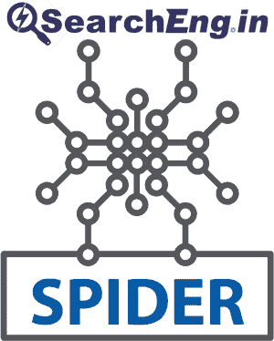
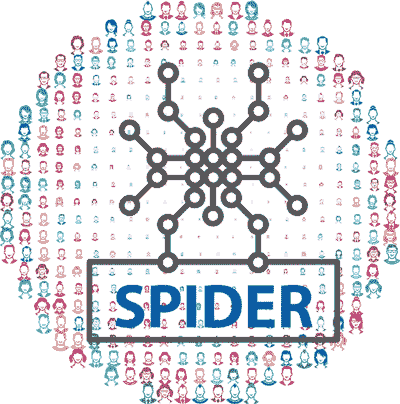
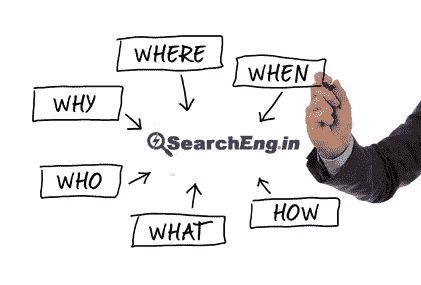
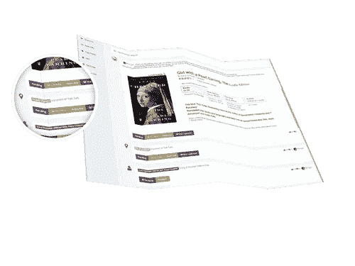
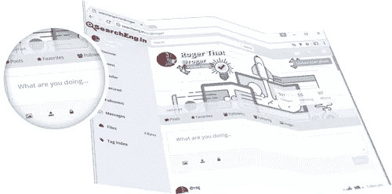

# 由你驱动的搜索引擎！

> 原文：<https://medium.com/hackernoon/the-search-engine-powered-by-you-d01d4f53d601>

## [SearchEng.in](http://searcheng.in) =搜索+众包+社交媒体

## 什么是 SearchEng.in？

SearchEng.in 的设计目的是通过标签识别网页、地点、事物、日期和事件。标签是由众包(用户贡献的内容)和机器人(蜘蛛/网络爬虫)添加的。添加到 SerachEng.in 列表中的所有标签都是通过信任但验证编辑过程完成的。

**CROWDSOURCE = USER CONTENT + USER CONTRIBUTION + COMMUNITY DRIVEN**

## [注册免费。](http://my.searcheng.in/signup)

任何注册用户都可以添加标签，贡献内容，评论和投票表决内容。

鼓励所有用户投稿！相关标签通过社区、协作、贡献、监管得以提升！

SearchEng.in 野心与众包是[知识](https://hackernoon.com/tagged/knowledge)发现和管理，通过提供平台来标记、贡献和汇集[信息](https://hackernoon.com/tagged/information)。

# 蜘蛛；状似蜘蛛的物体；星形轮；十字叉；连接柄；十字头

SearchEng.in Spider 基于 Scrapy Spider 用 Python 编写，使用 Scrapinghub.com 云平台抓取和识别标签。构建 SearchEng.in spider 时经过了精心策划，重点是准确识别有用的标签。

# 蜘蛛+众包

SearchEng.in 蜘蛛抓取页面，自动识别潜在标签。蜘蛛添加的网页可以通过 SearchEng.in 用户进行扩展。蜘蛛添加的标签可以被 SearchEng.in 用户验证。用户可以拒绝不相关的标签。

# 关于标签的一切！

在 SearchEng.in 上索引的页面是基于 5 W 的标签的！重点在于谁、什么、哪里、何时、为什么/如何。标签由 SearchEng.in spider 添加，也可以由注册的 SearchEng.in 用户添加。

# 搜索结果

搜索结果包括相关网页和添加到与搜索查询相关的页面的相关标签。

随着每个网页的排名，搜索项相关的标签也可能出现在相关的查询中。

# **搜索算法&排名指标**

SearchEng.in 基于信任和验证过程进行操作！页面/标签的排名有几个重要的指标。然而，用户验证的标签在确定搜索排名时给予最高优先级。

# 社会化媒体

SearchEng.in 被设计成一个社交媒体平台。互动、关注用户、拥有关注者的能力是一个健康的搜索社区的关键因素。我们提供 SearchEng.in 的直接登录和注册，以及使用您的 FaceBook 或 Twitter 帐户登录/注册的能力。

SearchEng.in 用户界面是围绕社交媒体概念设计的。

# 有机增长

SearchEng.in 的目标是有机增长！给 SearchEng.in 贡献者更多的工具，帮助 SearchEng.in 有效成长。搜索引擎更新过程的一部分是关注与他们可能排名的搜索查询相关的有用站点。SearchEng.in 对大量抓取的网站和页面是有选择性的。注册用户可以通过[添加网址(http://searcheng.in/#AddURL)](http://searcheng.in/#AddURL)添加任何合适的页面。

# SearchEng.in 推出 BumperStickers！

BumperStickers 原创社交媒体工具！通过我们现有的 BumperStickers 推广您的页面。它们可以贴在任何地方。你所要做的就是得到一个保险杠贴纸，通过 [SearchEng.in Add Url](http://searcheng.in/#AddURL) 添加短网址，在保险杠贴纸上写下短网址，将保险杠贴纸贴到你选择的媒体上，然后推广！

# 用保险杠贴纸提升你的形象

使用我们的 bumpersticker，您不仅可以推广您的页面和事业，还可以推广您的 SearchEng.in 个人资料！

注册一个免费账户:【http://my.searcheng.in/signup 

> [黑客中午](http://bit.ly/Hackernoon)是黑客如何开始他们的下午。我们是 [@AMI](http://bit.ly/atAMIatAMI) 家庭的一员。我们现在[接受投稿](http://bit.ly/hackernoonsubmission)并乐意[讨论广告&赞助](mailto:partners@amipublications.com)机会。
> 
> 如果你喜欢这个故事，我们推荐你阅读我们的[最新科技故事](http://bit.ly/hackernoonlatestt)和[趋势科技故事](https://hackernoon.com/trending)。直到下一次，不要把世界的现实想当然！

