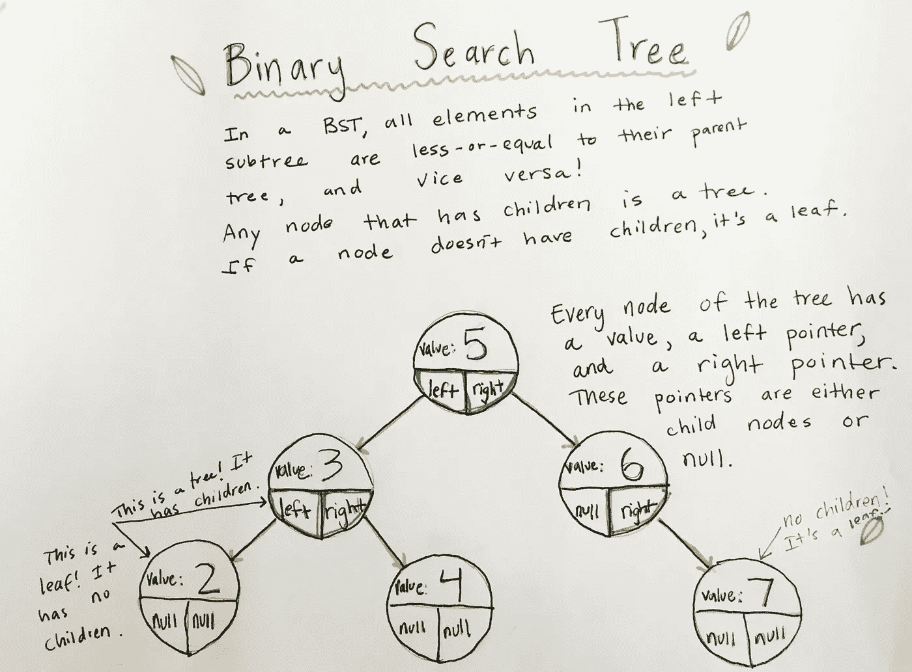
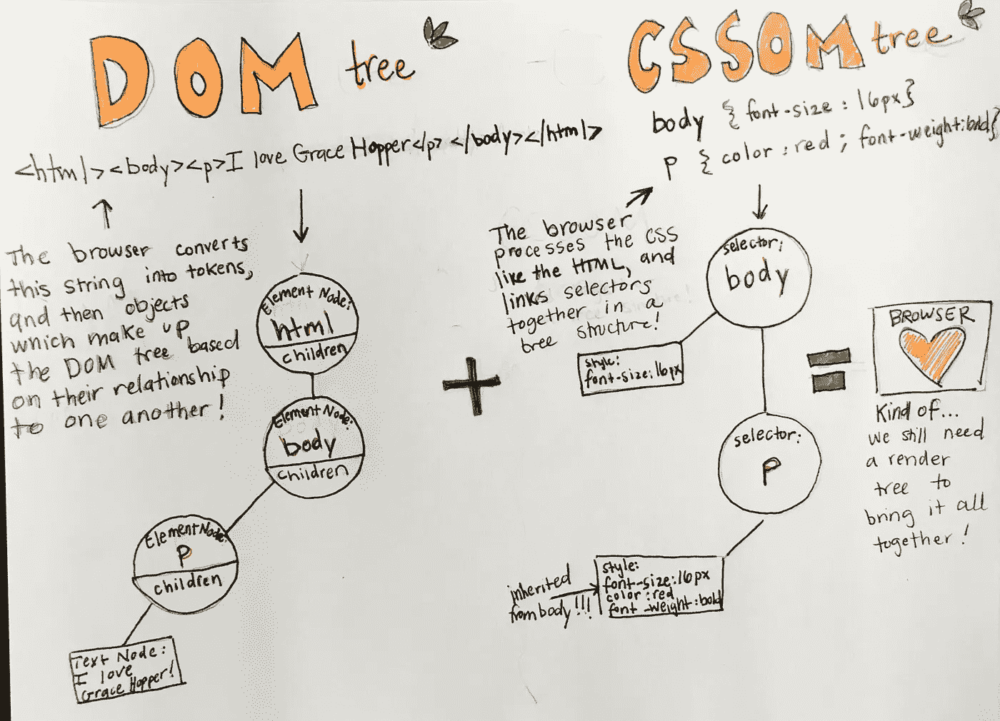
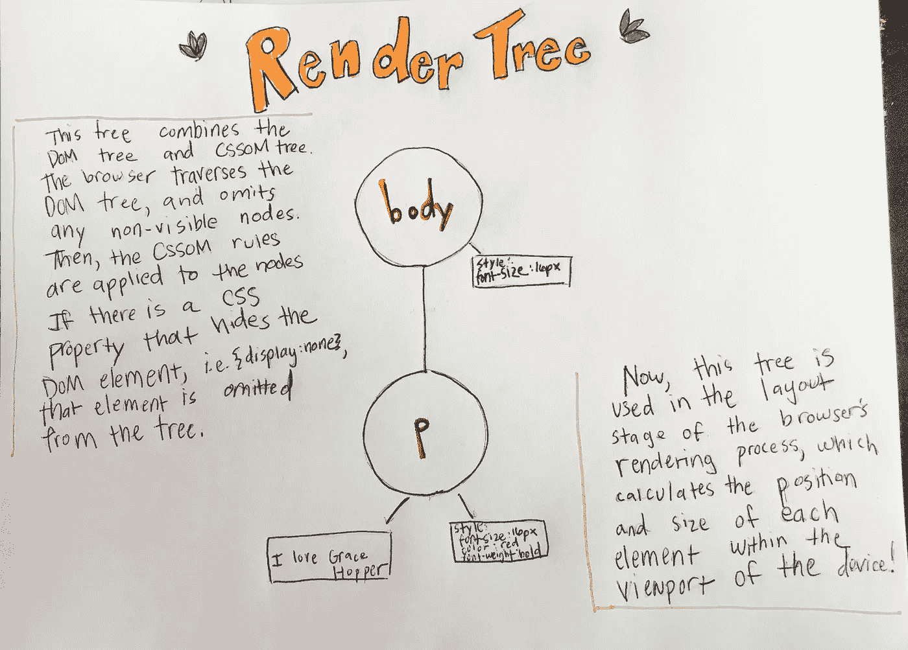

# 树木的秘密生活

> 原文：<https://medium.com/hackernoon/the-secret-life-of-trees-9169c1b5a479>

出现在 web 开发人员日常生活中的数据结构

去年 2 月从格蕾丝·赫柏项目毕业后，我接受了下一批学生的助教职位。我的学生经常问我，除了知道如何在求职面试中解决白板问题之外，数据结构与他们的程序员生活有什么关系。作为一个在大学没有学过 CS 课程的人，我一开始也很纠结于数据结构，但是当我意识到软件的很多底层结构，包括浏览器，都依赖于它们时，我就着迷了。

学生时代我们对树的第一个练习是创建一个**二叉树**，以及插入、遍历和搜索方法。

One of my many data structure doodles

当我们开始探索浏览器时，我们了解了浏览器的渲染引擎如何处理 HTML 文档并创建两棵树:一棵代表 HTML 元素和属性节点的 **DOM 树**(文档对象模型)，一棵代表 [CSS](https://hackernoon.com/tagged/css) 样式的 **CSSOM** 树(CSS 对象模型)。

这两棵树然后被组合成一棵**呈现树**，它包含在页面上显示 DOM 内容所需的节点和样式。

这些树的迷人之处在于，就像 BST 一样，它们经常被递归地遍历。例如，递归遍历 CSSOM 树。浏览器首先处理 CSSOM 树的子节点，因为这些特定的样式规则最终会在页面布局中占据优先地位。这意味着只要一个节点有子节点，遍历函数就会继续被调用。能够向我的学生展示树和递归的用例真是太棒了！

最后， [DOM](https://hackernoon.com/tagged/dom) 树和 CSSOM 树组合成最后一棵树，渲染树！

很酷，对吧？

这里有一个来自谷歌开发者文档的超级[有用资源](https://developers.google.com/web/fundamentals/performance/critical-rendering-path/constructing-the-object-model)来了解更多！

> [黑客中午](http://bit.ly/Hackernoon)是黑客如何开始他们的下午。我们是 AMI 家庭的一员。我们现在[接受投稿](http://bit.ly/hackernoonsubmission)并乐意[讨论广告&赞助](mailto:partners@amipublications.com)机会。
> 
> 如果你喜欢这个故事，我们推荐你阅读我们的[最新科技故事](http://bit.ly/hackernoonlatestt)和[趋势科技故事](https://hackernoon.com/trending)。直到下一次，不要把世界的现实想当然！

