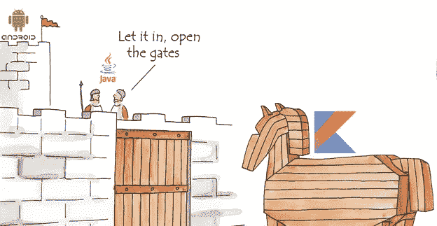
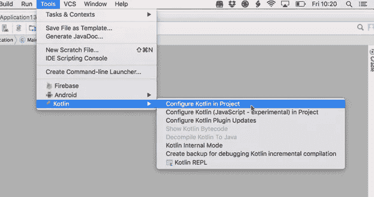
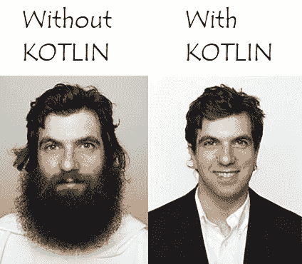

# KOTLIN 成功的秘诀以及为什么要使用它？

> 原文：<https://medium.com/hackernoon/the-secret-of-success-of-kotlin-and-why-should-you-use-it-71303a8ba088>

如果我们回到过去，android 开发意味着 Java 开发。虽然很少有其他语言来开发 android 应用程序，如 Scala、C++、Lua，但是它们都无法与 Java 抗衡。

但是现在每当我们想到 android 开发，Kotlin 就会撞到头。其他语言从外部对抗 Java，但 Kotlin 有一个古老的策略，他们就像几个世纪前的希腊人一样。



机器人的守护者被 Kotlin 最强的力量击败了，互操作性。它站在 Java 旁边，对抗 Java 统治 Android。

**互通性**是科特林最大的优势之一。Kotlin 程序可以使用所有现有的 Java 框架和库，甚至是依赖注释处理的高级框架。它只是简单的即插即用。


**设置非常简单，**一旦你的 android studio 项目被配置为支持 Kotlin，你甚至可以将整个 Java 源文件转换为 Kotlin 文件，只需点击几下鼠标。



它是快乐的源泉，因为它非常容易学习，而且当你学完之后。更少的代码，更少的时间，更少的错误，更少的人为错误。你可以有很多自己的时间。我的时间:)



**更容易维护的清洁剂代码**。科特林减少了样板代码，可怕的点击监听器，通过 id 查找视图。我仍然记得当我的经理让我检查代码时，他在样板代码前停下来问我为什么写这么多乱七八糟的东西，让代码不可读。

```
view.setOnClickListener(new View.OnClickListener() {
    @Override
    public void onClick(View v) {
        // Java the messed up code
    }
});view.setOnClickListener {
    // Write in kotlin
}
```

**空安全**是最期待的事情之一。如果 web api 中的任何键被重命名或删除，Android 应用程序通常不得不遭受损失并发布新版本。我总是羡慕 iOS 开发人员在我准备另一个版本的时候可以坐下来放松一下。是时候放松一下了。科特林是来营救的。


尝试 Kotlin 的理由有很多，但有一个是我最喜欢的。
**有何不可？？？**它是免费的，你不需要另一个 IDE，也不需要另一个项目。它是新的，是来救援的。你可以从编写你熟悉的应用程序的简单小部分开始。顺便说一句，超级简单；)

由于非常相似的字节码结构，Kotlin 应用程序的运行速度与同等的 Java 程序一样快。有了 Kotlin 对内联函数的支持，使用 lambdas 的代码甚至比用 Java 编写的相同代码运行得更快。Kotlin 有一个非常紧凑的运行时库，可以通过使用 ProGuard 进一步简化。Kotlin 支持高效的增量编译，因此尽管干净构建会有一些额外的开销，但增量构建通常与 Java 一样快，甚至更快。

> Kotlin 已经被各大公司成功采用，有几个分享了经验**；**

当你习惯用 Java 写代码时，有时会发生这种情况，你经常会在不需要的时候加上分号。用 Kotlin 编码就不会这样了:)
快乐编码。


Android is happy with KOTLIN