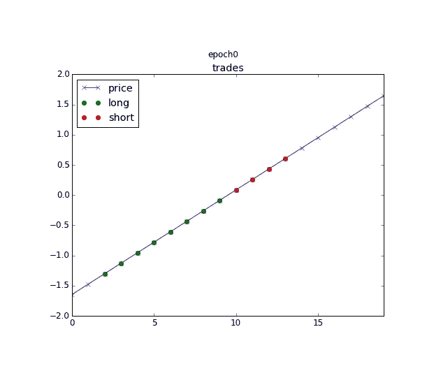
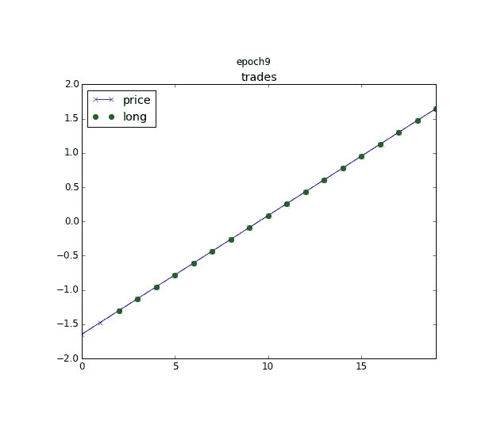
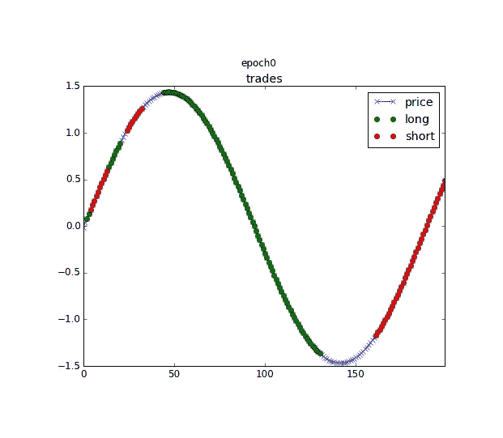
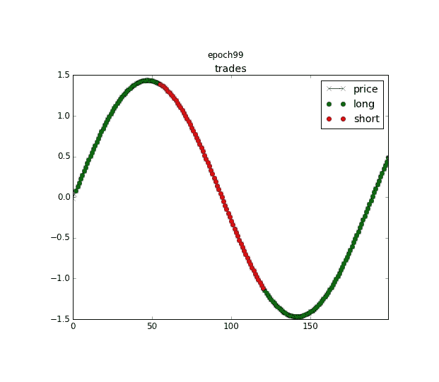
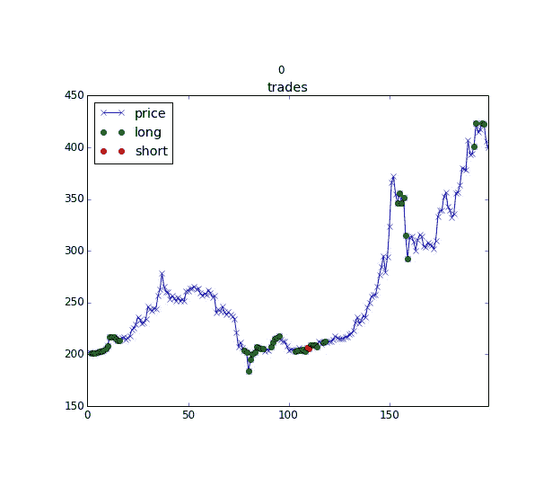
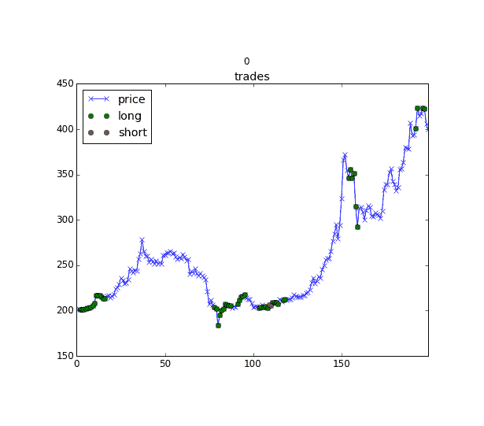
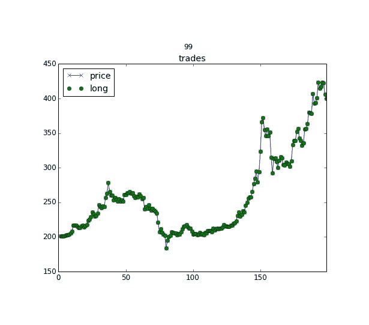

# 自我学习定量分析师

> 原文：<https://medium.com/hackernoon/the-self-learning-quant-d3329fcc9915>

*这个故事最早写于 2016 年，从那时起，机器学习领域已经进步了很多，但它仍然是强化学习的一个很好的介绍。我现在领导着* [*Scaleout*](http://scaleoutsystems.com) *帮助企业将机器学习从研发阶段带到实际生产阶段。*

最近谷歌[deep minds](https://deepmind.com/)在围棋比赛中战胜 Lee Sedol 引起了很多关注。这是一个了不起的成就，因为围棋长期以来一直被人工智能认为是无法破解的游戏，主要是因为该游戏被认为在很大程度上依赖于人类的直觉，以便处理游戏过程中极其大量的可能状态。

DeepMind 使用的技术是深度神经网络和强化学习的结合。在[机器学习](https://hackernoon.com/tagged/machine-learning)中，深度神经网络在过去几年中已经被证明在许多不同的领域中取得了显著的成果(如图像识别、语音识别、语言处理等，一些很酷的例子参见[递归神经网络的不合理的有效性](http://karpathy.github.io/2015/05/21/rnn-effectiveness/))。强化学习还没有得到同等数量的学术和公众的关注，它经常被用来解决各种各样的玩具问题。但是，最近深度神经网络和强化学习的结合被证明是非常强大的，在 DeepMind 将注意力放在围棋上之前，他们展示了这些技术的结合可以用于在许多雅达利计算机游戏中实现比人类更好的结果[,只使用普通人类玩家可以访问的输入和输出。](https://storage.googleapis.com/deepmind-data/assets/papers/DeepMindNature14236Paper.pdf)

将神经网络与强化学习相结合的原因是神经网络将能够处理大量可能的状态。在简单的强化学习中，你经常使用一个查找表，只要可能状态的数量是有限的，并且不太大，这就很好。但是，当可能状态的数量增加或使用连续输入时，就需要能够处理大状态空间的东西。

为了超越玩具示例、视频游戏和棋盘游戏，这篇文章是一个结合(深度)神经网络和自我强化学习以及一些真实数据的教程，看看是否有可能创建一个简单的自我学习 quant(或算法金融交易员)。

对于任何考虑复制/粘贴这个来制作一个实时算法交易机器人的人来说，这是一个严重的警告:无论最终结果如何，一个真正的算法交易者将是一个非常不同的怪物，因为在用真实资产进行实时交易时，还有许多其他因素必须处理。

好吗？我们走吧！

我在 Python (2.7)中用几个不同的导入库做这件事。同样，我的目标是解释和展示与神经网络相结合的自我强化学习的概念。如果你认为你理解了基本的概念，那么就在网上搜索更好更数学的正确解释。

在强化学习中，有一些基本的符号和概念:

1.  状态 S，这是算法看到的当前世界的表示
2.  状态 S '，一个比 S 晚一个时间步长的新状态。
3.  动作 A，在时间步 s 可以采取的可能动作之一。
4.  q，一个在时间步 S '近似行动 A 的回报的函数。可以写成 Q(s，a)。在我们的例子中，Q 是一个神经网络。
5.  奖励 R，状态 S '给定动作 a 的实际奖励。

现在，我将介绍几种不同的情况，其中数据和算法的复杂性逐渐增加。代码的一些关键部分被复制，但是为了保持文章的可读性和合理的长度，这里没有解释或复制每个例子的全部代码。相反，代码可以在 https://github.com/danielzak/sl-quant 的 Github 上找到。

示例 1:直线

在第一个例子中，我将看看我是否可以学习系统来识别价格线性增长的资产。对于量化交易者来说，这意味着交易者应该总是买入(或做多)。

数据只是由一个返回直线的函数创建的:

那么什么是自我强化呢？我们这里有一个非常基本的系统，有一组状态，一些可以采取的行动，以及一些基于这些行动的衡量奖励的方法。我们也有一个 Q 函数，它应该学会近似回报。在一个简单的世界中，我们可以让 Q 成为所有可能状态的表，然后找到一种方法来探索所有可能的状态、动作和奖励，将它们保存到表中，然后在需要时查找给定状态的最佳动作。在一个更加复杂的世界中，我们需要一种方法来概括我们的知识，并能够处理大量不同的状态。

自我学习来自于多次循环通过许多不同的状态和动作的概念，并且每次更新 Q 函数一点点。所以在每一个循环中，Q 函数会对周围的世界了解得更多一点，并且应该能够对每一个可能的行为更好地逼近真实的回报。此外，学习过程中非常重要的一点是增加一点随机性，以便尽可能多地探索世界。在我们的例子中，我们通过增加选择一个随机动作的机会而不是 Q 函数建议的动作来做到这一点，这是下面代码中的ε值。

在我的代码中，这个主循环如下所示:

还有一个 Q 函数，在这种情况下是神经网络。这是一个简单的三层神经网络，每层只有 4 个神经元，应该足以学习直线是什么样子的。

好了，这是这个系统的基本组成部分。让我们运行代码，看看会发生什么。

在一个时期(上面主循环中的一个训练循环)后，我要求系统为每个时间步建议交易。这是结果:

The blue line is the linearly increasing price series, blue crosses represent no action, green circles represent a buy trade (long trade) and red circles represent a sell trade (short trade).

很明显，我们的自学定量分析师不知道自己在做什么。让我们运行代码 10 个时期，看看输出是什么:

Only buy (long) trades except for the first two time steps

哇！只做多头交易！在没有建模或给出任何先验知识的情况下，我们有了一个系统，它已经学会了直线是什么样子:-)好东西。

示例 2:正弦波

现在我们可以用一条正弦波形的线代替直线，让事情变得稍微复杂一点。请注意！在示例 1 和 2 中，没有单独的训练和测试数据集，这对于任何对机器学习感兴趣的人来说当然是令人愤慨的，但这样做只是为了保持事情简单。训练/测试分割将出现在示例 3 中。

让我们也介绍一下自我强化学习中的另一个概念——伽马参数。请记住，我们评估每一个行动都是基于它的回报。默认情况下，这意味着在每个时间步，系统将学习什么是最佳选择的行动，以最大化其奖励下一个时间步。Gamma 在 0 和 1 之间选择，通过设置大的 gamma，我们也将重视高的长期回报，因此系统可以学习重视选择的路径，这将在未来几个时间步长内给予高回报。

有一点还没有涉及到，那就是奖励函数，我将把它复制到这里来举例说明它是什么样子的。如果行动(或信号)与价格运动方向相同，奖励功能将给予奖励，如果行动与上一次行动相同，它还会给予少量额外奖励。

那么一个时代之后会是什么样子呢？

After one epoch the only learning that happened was the advantage I gave to set the next action to the same as the last action.

同样，系统也不知道发生了什么。它在一个纪元中所学到的是，如果这个动作与前一个动作相同，它就会得到奖励。

让我们做 100 个纪元:

After 100 epochs it goes short when the price is decreasing and goes long when the price is increasing.

啊，它能学会平滑的波浪线是什么样子。有了这个简单的神经网络，即使我们增加的历元数远远超过这个数，结果也不会好到哪里去。

示例 3:比特币价格数据

现在让我们试着把脚趾浸入水中更深一点。在最后这个例子中，我对上面使用的基本代码做了一些修改(记住，完整的代码可以在[https://github.com/danielzak/sl-quant](https://github.com/danielzak/sl-quant)获得)

显著的变化:
1。每日比特币价格数据用作输入数据(来源北海巨妖 via Quandl)
2。我对数据进行了训练/测试分割(600 个数据点用于训练，200 个数据点用于测试)。
3。我也在输入的数据中加入了一些常用的技术指标(简单移动平均线(15 和 60 期)，相对强弱指标，平均真实区间)
4。神经网络现在是两层递归神经网络(LSTM ),每层有 64 个神经元。
5。自我强化学习循环使用一种称为经验重放的技巧，通过使每个更新批次更大来大大提高学习速度，这在更新神经网络时在计算上是有效的。

After one epoch of learning there are some random trades

Here you can see the learning process. After around 70 epochs you can see the system is stabilizing, going for a continuous long (buy) trade for the entire time frame. It makes sense considering the clear uptrend.

Final epoch, just to confirm the system learned what an uptrend is.

好的，所以最终这个系统使用这个输入数据的最好结果是买入并持有，而不是在这个时间段内做短线交易。这是一个非常简单的例子，只使用了一些普通的金融指标，真正的交易者使用更复杂的工具。但是，如果没有别的，我想说这显示了自我学习系统的潜力，希望你也学到了一点。

结束语:对于那些对更多信息和基于教程的学习自我强化学习概念感兴趣的人，我推荐阅读 http://outlace.com/Reinforcement-Learning-Part-1/[的三篇博文系列](http://outlace.com/Reinforcement-Learning-Part-1/)

> [黑客中午](http://bit.ly/Hackernoon)是黑客如何开始他们的下午。我们是这个家庭的一员。我们现在[接受投稿](http://bit.ly/hackernoonsubmission)并乐意[讨论广告&赞助](mailto:partners@amipublications.com)机会。
> 
> 如果你喜欢这个故事，我们推荐你阅读我们的[最新科技故事](http://bit.ly/hackernoonlatestt)和[趋势科技故事](https://hackernoon.com/trending)。直到下一次，不要把世界的现实想当然！

