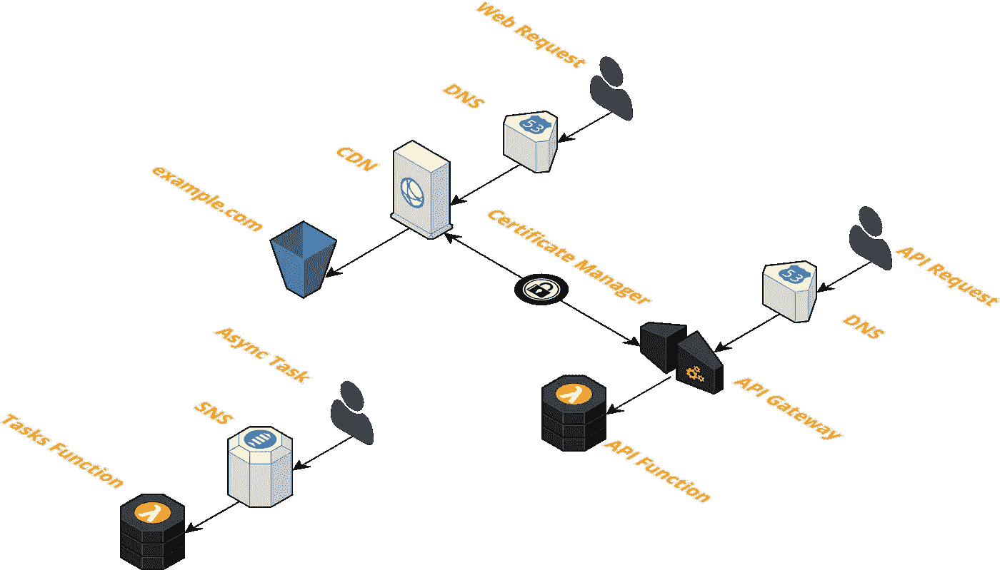
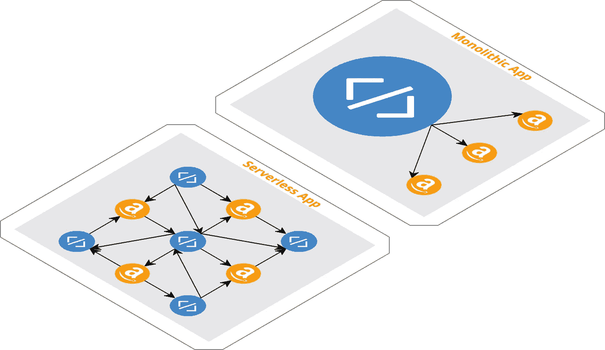
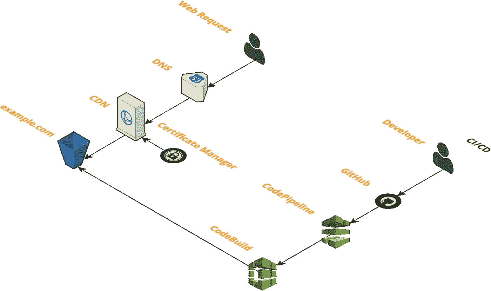
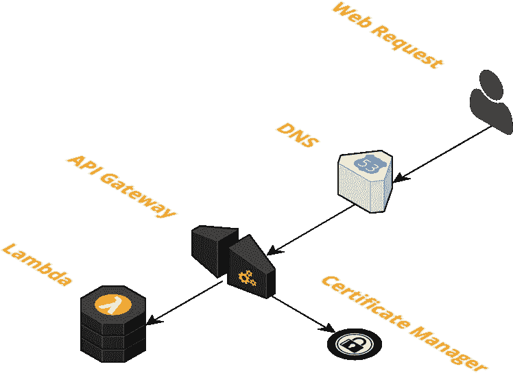

# 无服务器堆栈

> 原文：<https://medium.com/hackernoon/the-serverless-stack-3ae91031f050>

## AWS Lambda、API 网关、S3、事件驱动的任务

## 什么是无服务器？

> **无服务器**架构指的是在很大程度上依赖于第三方服务(被称为后端即服务或“BaaS”)或在短期容器中运行的定制代码(功能即服务或“FaaS”)的应用程序，目前最知名的供应商主机是 AWS Lambda。信用[马丁·福勒](https://martinfowler.com/articles/serverless.html)

## 什么是堆栈？

一个**栈**是 AWS 资源的集合，您可以将它作为一个单元来管理。换句话说，您可以通过创建、更新或删除**栈**来创建、更新或删除资源集合。一个**栈**中的所有资源都由**栈的** AWS [CloudFormation](http://docs.aws.amazon.com/AWSCloudFormation/latest/UserGuide/stacks.html) 模板定义。

## 什么是[无服务器堆栈](https://github.com/thestackshack/serverless-stack)？

[**无服务器堆栈**](https://github.com/thestackshack/serverless-stack) 只是如何使用无服务器技术构建应用程序的一个例子。在这种情况下，我们正在构建一个具有 UI、API 和异步任务的 web 应用程序。我们使用 [CIM](https://cim.sh) cli 实用程序来创建和更新堆栈，并部署 Lambda 代码。

CIM’s Serverless Stack

这个堆栈由 3 个较小的堆栈组成。所有预构建为 [CIM](https://cim.sh) 模板。

*   UI —静态 S3 网站、CloudFront、SSL
*   API — API 网关、Lambda、SSL
*   异步任务— SNS，Lambda

## 构建无服务器应用时为什么要使用 CloudFormation？

我们的应用程序的性质已经改变了。

应用代码模块已经越来越小了(单片->微服务->功能)。与此同时，云提供商一直在增加越来越多的服务。结果是一个由小代码模块和云服务混合而成的应用程序。

好处是？

*   可以扩展以满足巨大需求的应用程序
*   代码易于管理的应用程序
*   花费不多的应用程序

问题是这些应用程序的架构变得越来越复杂。作为代码的基础设施(IaC)的重要性已经大大提高。

我认为作为代码的基础设施和实际的代码一样重要。在新项目开始时实现 IaC 是必须的，尤其是对于新的无服务器应用程序。

Monolithic vs. Serverless app

## 什么是 CIM？

编写 CloudFormation 模板对于无服务器、事件驱动的应用程序来说是必不可少的。云的形成有一些棘手的问题。这也是我建立 [CIM](https://cim.sh) 的原因。

[CIM](https://cim.sh/) 是一个简单的命令行实用程序，它引导您的 [CloudFormation](https://aws.amazon.com/cloudformation/) CRUD 操作，使它们更容易执行，可重复，并且不容易出错。

如果你想了解更多关于 CIM 的知识，以及我为什么要建立它，你可以阅读我的文章，[认识 CIM —云基础设施经理](/@rgfindley/meet-cim-cloud-infrastructure-manager-bc8bcfe0593c)。

# 无服务器堆栈

现在，让我们了解更多关于无服务器堆栈的信息。也许这应该被称为**无服务器网络应用栈**。无服务器堆栈的数量是无限的。这只是一个无服务器 web 应用堆栈的示例。

这个堆栈主要是关于堆栈，而不是代码。一旦部署了这个堆栈，您就可以开始编写自己的前端代码、api 代码和异步任务代码。

## 无服务器用户界面

UI 是由 AWS S3 托管的静态 web 应用程序。web 请求通过亚马逊的内容交付网络(CloudFront 代理。CloudFront 不仅缓存您的 web 资产，如图像、样式表和 javascript 文件，它还支持您的自定义域和 SSL 证书。这意味着您的 web 应用程序将是快速和安全的。

一个静态的 S3 网站的伟大之处在于无限的伸缩性和不需要 DevOps。您的站点可以处理巨大的流量高峰，并且没有服务器需要监控。

UI 还支持持续集成和持续部署(CI/CD)。启用后，GitHub 的所有提交都将触发 CodePipeline 来构建、测试和部署您的站点。你只需要把你的改变推送到 GitHub，你的站点就会被构建、测试和部署。当有多个团队成员在开发应用程序时，这一点尤其重要。

静态网站可以做什么？这里的想法是使用像 Angular 或 React 这样的前端框架，然后向后端无服务器 api 发出请求。

如果我需要一个动态网站怎么办？您可以使用我们的[服务栈](https://github.com/thestackshack/services-stack)来创建一个永远在线的 web 应用程序。或者，你也可以继续使用静态网站，但提前生成所有的静态页面。S3 的存储很便宜，所以即使你有很多文件，也没什么大不了的。也许有些页面可以通过 JavaScript 动态加载。

## 无服务器 API

API 由 AWS API 网关组成，代理对 AWS Lambda 后端函数的调用。api 网关使用自定义域名和 SSL 证书，因此您的 API 端点可以像`api.yourdomain.com/v1`一样可读。

这种架构的优点在于，它非常适合非常小的流量，即低成本，以及非常高的流量，即 AWS 的无忧自动扩展。Lambda 确实有一个[并发限制](http://docs.aws.amazon.com/lambda/latest/dg/limits.html)，如果你的流量真的很高，你可能会遇到这个限制。如果你担心这一点，然后添加一个警报。然后，如果需要，请求 AWS 增加您的并发限制。

## 事件驱动的任务

事件驱动的任务堆栈实际上只是将长时间运行的异步任务从 web 请求中推出并放入后台任务的一种方式的示例。例如，假设我们有一个 api 端点需要格式化并发送一封电子邮件。这项任务应该异步完成。当我们发送电子邮件时，我们的 HTTP api 不应该被阻塞。在我们的示例堆栈中，api 端点会将任务发布到 SNS。SNS 将触发一个 Lambda 函数。Lambda 函数将格式化并发送电子邮件。

这只是处理异步事件驱动任务的一种方式。AWS Lambda 有许多不同的事件触发器。查看我们的[无服务器演示](https://github.com/thestackshack/serverless-demo)，获取一些 Lambda 事件触发示例。

另一个流行的事件触发器是 S3 更新。假设您需要在新图像或资产上传到 S3 后采取行动。您可以在添加到 S3 存储桶的每个新项目上触发 Lambda 函数。

计划更新(cron)也可以通过 CloudWatch Events 事件触发器来实现。例如，您可以触发 Lambda 每 10 分钟执行一次。

# 使用指南

要使用这个堆栈，只需安装 [CIM](https://cim.sh) ，派生[无服务器堆栈](https://github.com/thestackshack/serverless-stack) repo，添加您的自定义域，并执行`cim stack-up`。

*   安装 [CIM](https://cim.sh) ( `npm install -g cim`)
*   用 [Route53](https://aws.amazon.com/route53/) 注册您的域名
*   配置管理员@*yourdomain.com*接收 SSL 验证电子邮件
*   用你的域名替换`ui/_cim.yml`和`api/_cim.yml`中的*example.com*
*   运行`cim stack-up --recursive=true`安装堆栈

感谢您阅读无服务器堆栈。如果你觉得有帮助，请告诉我。