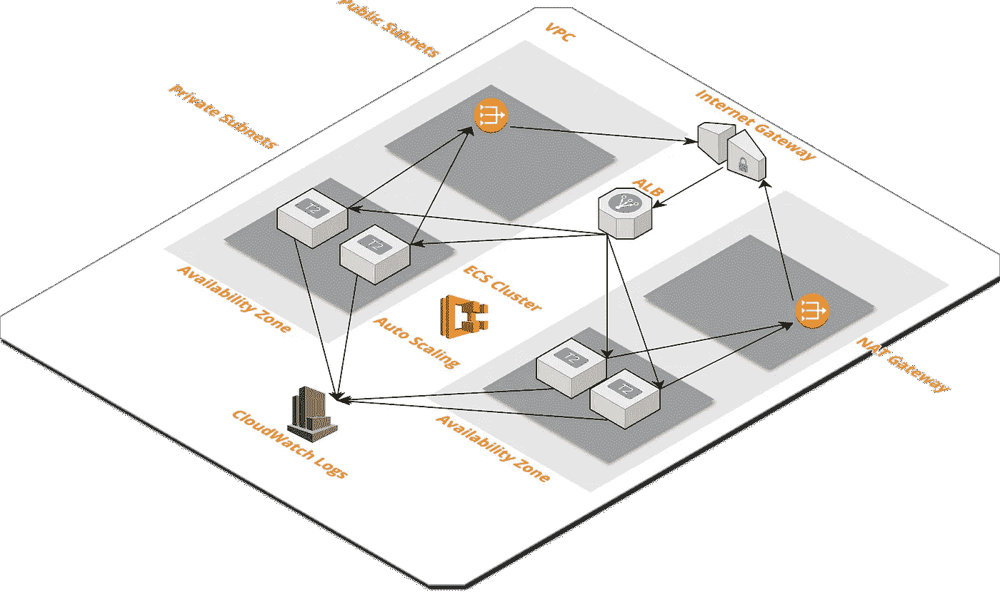

# 服务堆栈

> 原文：<https://medium.com/hackernoon/the-services-stack-235cca4a15f7>

## 在 AWS 上快速部署微服务堆栈

## 什么是微服务？

> **微服务**架构风格[【1】](https://martinfowler.com/articles/microservices.html#footnote-etymology)是一种将单个应用程序开发为一套小型服务的方法，每个服务运行在自己的进程中，并与轻量级机制(通常是 HTTP 资源 API)进行通信。这些服务是围绕业务功能构建的，可由全自动部署机器独立部署。这些服务可以用不同的编程语言编写，并使用不同的数据存储技术，只有最低限度的集中管理。信用[马丁·福勒](https://martinfowler.com/articles/microservices.html)

如果你是微服务的新手，请完整阅读 Martin Fowler 的[文章](https://martinfowler.com/articles/microservices.html)。

## 什么是堆栈？

一个**栈**是 AWS 资源的集合，您可以将它作为一个单元来管理。换句话说，您可以通过创建、更新或删除**堆栈**来创建、更新或删除资源集合。一个**栈**中的所有资源都由**栈的** AWS [CloudFormation](http://docs.aws.amazon.com/AWSCloudFormation/latest/UserGuide/stacks.html) 模板定义。

## 什么是[服务栈](https://github.com/thestackshack/services-stack)

[**服务栈**](https://github.com/thestackshack/services-stack) 是如何在 AWS 上架构、开发和部署微服务的一个例子。具体使用 AWS [虚拟私有云(VPC)](https://aws.amazon.com/vpc/) 、 [EC2 容器注册中心(ECR)](https://aws.amazon.com/ecr/) 、 [EC2 容器服务(ECS)](https://aws.amazon.com/ecs/) 。

这里是[服务栈](https://github.com/thestackshack/services-stack)架构的样子。

如果您准备好部署该堆栈并开始构建微服务，请单击此处的。

# 服务堆栈

让我们了解一下组成这个堆栈的组件的更多信息。

## 虚拟专用云(VPC)

第一个构建模块是 AWS VPC。把 VPC 想象成一个安全和隔离层，我们部署的所有其他东西都生活在里面。在 VPC 中，我们有公共子网和私有子网。

在大多数情况下，我们将所有重要的东西(应用程序、数据库等)放在私有子网中。然后，我们将所有通信资源(ALB、网关)放在公共子网中。通信资源是我们隐藏的服务和互联网之间的桥梁。

例如，我们的**服务**位于私有子网，而我们的**应用负载均衡器(ALB)** 位于公共子网。当向我们的服务发出入站请求时，它们会通过 ALB。互联网可以与我们的 ALB 对话，但不能直接与我们的服务对话。只有 ALB 能和我们的服务对话。

来自或**服务**到互联网的出站请求通过 **NAT 网关**，它们也在公共子网中。

## EC2 集装箱注册中心(ECR)

[AWS ECR](https://aws.amazon.com/ecr/) 是一个完全托管的 [Docker](https://aws.amazon.com/docker/) 容器注册中心，它使开发人员可以轻松地存储、管理和部署 Docker 容器映像。

可以将容器注册中心看作是您的构建工件的存储库，带有版本控制，随时可以运行。您只需告诉 ECS 部署这个版本的工件。我们的每项服务都需要 ECR repo。

## 什么是容器？

**容器**是一种操作系统虚拟化的方法，允许您在资源隔离的进程中运行应用程序及其依赖项。**容器**允许您轻松地将应用程序的代码、配置和依赖项打包成易于使用的构建块，从而提供环境一致性、运营效率、开发人员生产力和版本控制。点击阅读更多关于**集装箱** [的信息。](https://aws.amazon.com/containers/)

## Docker 是什么？

Docker 是帮助你开发、打包和部署容器的软件。点击阅读更多关于**码头**集装箱[的信息。](https://aws.amazon.com/docker/)

## EC2 集装箱服务

[AWS ECS](https://aws.amazon.com/ecs/) 是一个高度可扩展、高性能的[容器](https://aws.amazon.com/containers/)管理服务，它支持 [Docker](https://aws.amazon.com/docker/) 容器，并允许您在 Amazon EC2 实例的托管集群上轻松运行应用程序。

一个或多个 EC2 实例可以运行许多 Docker 容器服务。因此，您可以让一个 EC2 实例运行许多服务。

容器服务使您更容易在一组 EC2 实例中开发、部署和扩展 Docker 容器。

## 应用程序负载平衡器(ALB)

[AWS ALB](https://aws.amazon.com/elasticloadbalancing/details/#details) 在请求层(第 7 层)运行，根据请求的内容将流量路由到目标(容器)。

在我们的例子中，ALB 位于公共子网内，并基于 URI 将 HTTP 流量路由到我们的服务。ALB 也足够聪明，知道我们的服务运行在每个 EC2 实例的哪个端口上，因此它可以相应地路由流量。

常见的设置是具有以下路由规则的 ALB:

*   https://yourdomain.com/service1->服务 1
*   https://yourdomain.com/service2->服务 2

## 微服务—服务 1

最后是代码。我们的服务是一个响应 HTTP 请求的简单 web 应用程序。它可以是任何语言或框架。这种架构的美妙之处在于，计算层不需要实施细节。它们封装在容器定义 Dockerfile 中。

为了部署这个堆栈，我们使用 CIM。

## 什么是 CIM？

在 AWS 上构建任何东西之前，我总是从云的形成开始。IaC 是所有基于 AWS 构建的项目的必备组件。另外，它真的很有趣，让你感觉像一个真正的建筑。云的形成有一些棘手的问题。这也是为什么我建了 [**CIM**](https://cim.sh) 。

[**CIM**](https://cim.sh/) 是一个简单的命令行实用程序，它引导您的 [CloudFormation](https://aws.amazon.com/cloudformation/) CRUD 操作，使它们更容易执行，可重复，并且更不容易出错。

如果你想了解更多关于 **CIM** ，以及我为什么要建立它，你可以阅读我的文章，[认识 CIM——云基础设施经理](/@rgfindley/meet-cim-cloud-infrastructure-manager-bc8bcfe0593c)。

感谢您阅读关于服务堆栈的内容。我希望你喜欢它。