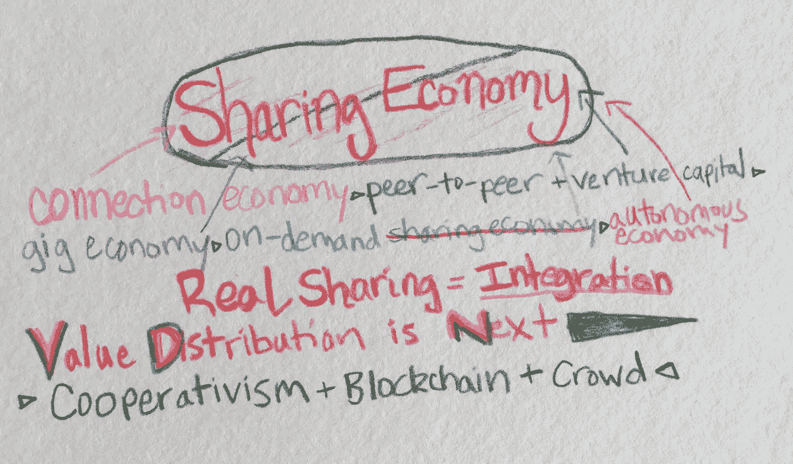

# 共享经济——一场渴望成为经济运动的社会运动

> 原文：<https://medium.com/hackernoon/the-sharing-economy-a-social-movement-dying-to-become-an-economic-one-5bbebddad96b>

有些东西死了。我**有一种无法摆脱的失落感。共享经济已经成为一种商业模式的标志和象征，而不是一场运动。这个短语有了一种含义，让每个人都质疑技术支持的共享的实际利他主义，尤其是在交换金钱的时候。**

最初，[我拒绝了批评者](/@shareablelife/who-owns-the-sharing-economy-we-do-c10d3d178cb6#.1gg8ekssd)——困惑于如此多的人误解了使分享可持续的必要方向和基础。

我没有考虑到的是，共享经济的基础是由富人支撑的，他们寻求变得更加富有，从而造成了更大的经济鸿沟。有人可能会说，创业公司为投资者创造了新的财富和回报，但这只是一小部分。像许多技术官僚一样，保罗·格拉厄姆直言不讳地相信经济不平等是企业家动力和新公司成长的核心。这从根本上说是错误的——如果大多数人欣欣向荣，创新对企业家来说会更有吸引力。毕竟，健康的中产阶级有利于商业发展。

在他的就职演说中，奥巴马总统从未说过更真实的话，“当国家只支持富人时，它不可能长久繁荣。”

我们所有人都需要看到这一点——包括经济上处于优势的人。

我们明确一点:财富没有错。钱不差钱。努力工作会有回报的。我们可以做得比这更好。

> 优步没有汽车，没有司机，拥有 1000 亿澳元，我们真的为此骄傲吗？或者 Airbnb 估值 250 亿美元，却没有一处房产？

> 只需后退一小步，就能意识到这些公司正在吸收其他人相互交换的资产和时间的价值！

Airbnb 和优步等领先平台都是风险投资支持的利润最大化实体。富人变得更富是靠着那些不太幸运的人，他们用自己的财产和时间，比如房子、汽车和专业知识，来使用他们努力工作换来的一切。

> 构建这些平台的技术并不昂贵。与此同时，这些公司的估值飙升( [*，甚至超过了脸书*](http://www.businessinsider.com/chart-of-the-day-uber-valuation-ahead-of-facebook-in-early-years-2014-11) *)的增长轨迹，因为它们从实际创造和提供价值的人那里吸收价值。*

我们不要把脸书排除在外。脸书的估值是基于个人注入平台的内容、网络和个人数据。个人不拥有自己的社交网络或数据——脸书拥有。

虽然这看起来可能无关紧要，但《谁拥有未来》的作者杰伦·拉尼尔或许给了我们一些思考的东西，[“我们的个人数据与劳动没有什么不同——你不会因为放弃而失去，但如果你没有得到任何回报，你就没有得到你应得的东西。他指出，信息本身就有价值。当数十亿人将数据交给少数公司时，结果是大量财富从多数人手中转移到少数人手中。](http://www.newyorker.com/magazine/2011/07/11/the-visionary)

> 有一种方法可以更公平地分配财富和转移价值。我们可以很容易地构建技术来计算、分配和分配所创造的价值。价值分配即将到来——这只是时间问题。这和共享经济有什么关系？一切。

让我们后退一步，看看共享经济已经发展到什么程度，以及这场运动可能会在什么地方转向真正的共享。

# **共享经济的阶段**

## 连接> P2P + VC > Gig >点播>自主

价值共享能融入商业吗？让我们看看最近的过去和即将到来的未来，以及共享经济的各个阶段，看看事情在哪里，以及它们接下来可能会去哪里。

1.  **人际关系、社区和生活方式占据主导地位** 共享经济的繁荣再次代表了信任陌生人——一种新的互动和交易方式，通过不同形式的价值和交换打开我们的心灵、边界、财产和态度，赚更多的钱，节省抵押贷款，买得起更好的车，有更多的时间进行艺术创作，结识新朋友，或去度假。所有这些都指向更深层的背景——我们有足够的东西可以分享！
2.  企业家和投资者一嗅到共享经济的原始潜力，资本就涌入各种市场，包括一些鲜为人知的例子，如[点对点洗手间](https://app.airpnp.co/)。至此，[共享经济跨越鸿沟](http://www.slideshare.net/jeremiah_owyang/sharingnewbuying)成为家喻户晓的名词。这段时间，很多提供社交价值而没有明显收入模式的平台[不复存在，包括 neighborhood goods](http://www.fastcompany.com/3050775/the-sharing-economy-is-dead-and-we-killed-it)、Grubwithus、Loosecubes 等。与此同时，Couchsurfing 从一家非盈利公司变成了一家风险投资公司。
3.  **零工经济全力发展** 随着 1099 名独立承包商的成本节约，零工经济成为未充分利用时间和资源的效率模式，这是一种以很少的资本、投资或管理费用实现经济增长的方式。共享经济成为一种廉价的全职雇佣低工资工人的方式，同时绕过传统的就业法律，专注于未就业/未充分就业者。清洁市场、各种类型的送货以及各种难以想象的服务涌现出来。他们都把革命性的“共享经济”作为他们的绰号。
4.  **随需应变一切吞噬共享经济** *这就是我们今天的处境。
    拼车如野火般蔓延到世界各地的城市。[优步继续扮演媒体](https://pando.com/2014/10/29/uber-prs-latest-trick-impersonating-its-drivers-and-trying-to-scam-journalists/)。通过微妙但残酷的力量，共享经济与“按需”融为一体，即我们应该能够在需要的时候召唤我们想要或需要的任何东西。媒体不断抨击共享经济，理由很充分。有一个臭名昭著的“[反对分享的案例](https://thenib.com/the-case-against-sharing-9ea5ba3d216d#.ij20ipgg5)”，探讨了这场运动自相矛盾的方式。然后就是什么是共享经济的问题？亚马逊、网飞和 GrubHub 真的是共享经济的一部分吗？如今，各种类型的在线市场都声称拥有股份，这进一步淡化了它的意义。《华尔街日报》科技专栏作家克里斯托弗·米姆斯总结道:“这些公司的唯一共同点是，它们都是市场，尽管它们给予买家和卖家的控制权有很大不同。”。*
5.  **按需变自主** *这就是下一步。*
    点对点的连接将变得不那么重要。我们将会有无人驾驶飞机、自动驾驶汽车和统治经济的物联网——基本上是机器人世界。人们将失去工作，除非他们已经有技能，受过教育，或者能够很容易地适应快速变化的潮流。这是一个我们将认真考虑全民收入等改革的时代，因为对体力劳动的需求将会不断减少。

# 下一步是什么？

商业经历一个可预测的循环:理想主义、采纳和整合——然后重复。共享经济也不例外。我们只是还没有集成共享。

虽然共享经济似乎已经失去了它最初的意义，但我们现在有一场全面的社会运动，打破了所有权和交换的社会结构。今天，人们更多地考虑他们已经拥有的价值——慢慢地围绕富足创造一种新的意识。

> 我们的头脑开始描绘一个与参与者分享责任和价值的经济体的可能性。真大！

风险投资家弗雷德·威尔森最近写道，[“随着越来越多的企业利用网络的力量创造经济价值，有一个问题是，网络参与者是否应该分享他们帮助创造的价值。”](http://avc.com/2016/01/network-equity/)

分享经济的教训并没有消失，但它们确实需要在商业结构中重生——我们必须看到我们有足够的东西来分享激励措施，让大多数人而不是少数人发出声音，并为培育我们所有人的可持续就业机会而努力。随着自主技术的出现，我们需要创建一个包容所有人的共享价值的结构，但我们必须从现在开始。我们必须仔细考虑机器的所有权将如何影响未来的每个人，并建立最终分享财富的模型。

## **我们如何整合共享？**

有许多方法来构建或重组组织以分配价值，包括合作模式——其中有多利益相关方方法，允许外部投资。也有员工持股计划(员工持股计划)，可以在价值创造者员工之间分配价值，这种模式与合作社不同，企业最终甚至可以出售。然而，与员工持股计划不同的是，员工、参与者或合作社成员实际上分享所有权，并帮助经营企业。

**平台合作社主义** 合作社是一个法律实体，它起源于 1844 年，[为全球 2.5 亿人创造了部分或全职就业](http://ica.coop/en/whats-co-op/co-operative-facts-figures)。今天，我们可以将合作模式附加到数字环境中，允许创建可扩展的平台，在价值创造者之间共享价值，这被称为[平台合作主义](http://www.platformcoop.net/)。虽然风险投资通常是建立一个多产市场的必要条件，但如果给予激励的话,[人群可以充当营销引擎。合作商业模式并不新鲜，但当应用于全球平台时，它有着无穷的含义。有一些最近成立的公司选择了平台合作模式，包括:](http://evonomics.com/uber-sharing-economys-biggest-threat/) [Stocksy](http://www.stocksy.com/) (股票图片市场) [Fairmondo](https://www.fairmondo.de/) (德国的一个更认真的易贝) [Lozooz](http://lazooz.org/) (区块链版的优步) [Loomio](https://www.loomio.org/) (一个群体决策工具)。

**区块链
尽管大部分共享经济目前被认为是点对点的，但真正的点对点系统将允许交易在不需要中介平台的情况下发生——区块链可以做到这一点。区块链还可以运行自我增强的智能合同([参见以太坊](https://www.ethereum.org/))，并允许平台分配工作，进而管理组织。信任和隐私是与生俱来的。有了区块链，陌生人之间的交易变得更加容易，不需要律师、会计师和银行家。**

**众筹技术** 众筹已经从一种时尚发展成为一个爆炸性的行业，2015 年，估计有 340 亿美元分配给了个人、项目和想法，否则它们可能不会有发展，这使得[众筹成为风险投资](http://www.forbes.com/sites/chancebarnett/2015/06/09/trends-show-crowdfunding-to-surpass-vc-in-2016/#2715e4857a0b73ca9f444b52)的一个有价值的对手。今天，什么都有人群——包括股票、慈善、投资、购买，甚至银行。我们还没有完全意识到我们个人交易的力量。如果我们了解我们个人的购买力作为一个集体如何能够直接和积极地影响生活、行业，从而影响生计，我们就会做出不同的决定(所有其他竞争因素都是平等的)。随着众筹每年翻一番或更多，我们正在实现这一目标。当你将价值分配平台与大众(顺便说一下，参与其中的人受益最大)结合起来时，每个人都有可能获胜。

区块链和群体技术的有效性取决于幕后的风气和治理。政治记者、平台合作主义的大力支持者内森·施耐德指出，

> “只有当我们认真地将公地和民主的原则融入我们的使用方式时，区块链和大众才会乐于分享这些信息。”

这是合作商业模式如此引人注目的原因之一；有 [7 条非常具体的指导原则](https://en.wikipedia.org/wiki/Rochdale_Principles)，将企业的运营理念作为基础。

# 共享的未来

> *在未来，企业将考虑其价值创造者的贡献，而不仅仅是出于营销目的需要“大使”的典型理由。不为别的原因，共享现在是而且将继续是一种竞争优势。*

现有组织将不得不寻找创造性的方法来与新的和模仿的价值共享替代方案竞争，这将通过共享收益来使人们能够用更少的资源做更多的事情。如果你认为这很牵强，Reddit 在上一轮融资中公开了他们与贡献者分享平台股权的计划。下一个会是谁？

> *一旦共享成为我们的金融模式、法律结构和经济支柱，合作将成为定局。分享不再是一种趋势，而是一种生存法则。*

为我们的互动创造语言的系统可以被重写，我完全打算成为实现这一点的一部分！

分享吧。

如果你想了解更多，请参加 1 月 26 日的[分享经济遇见合作商业](http://www.meetup.com/sharing-economy/events/228114886/)或 1 月 28 日的[网络经济下一步是什么](https://www.eventbrite.com/e/whats-next-in-the-network-economy-tickets-20135610152)。