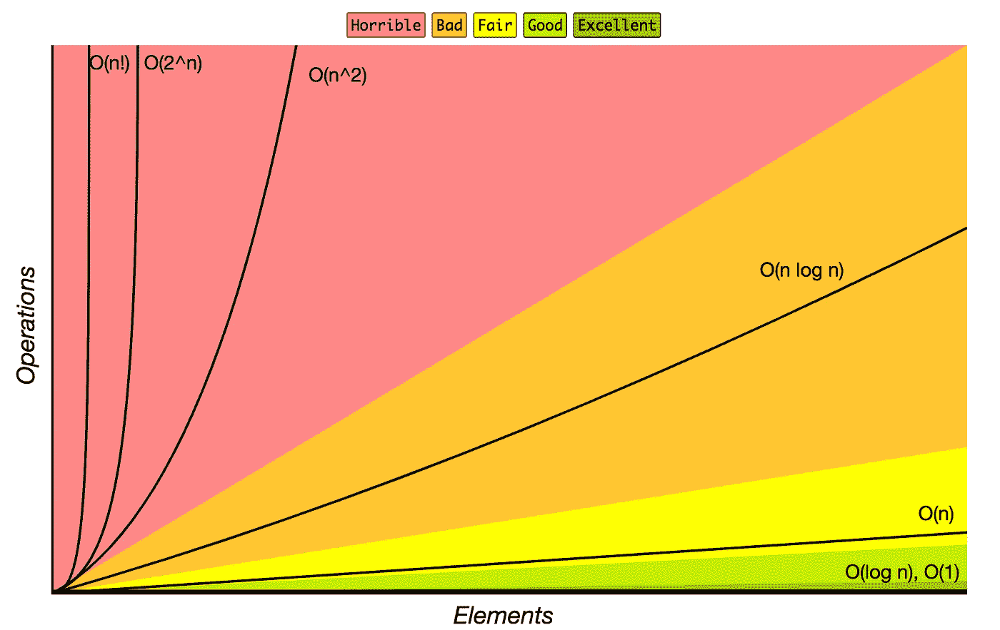
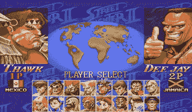
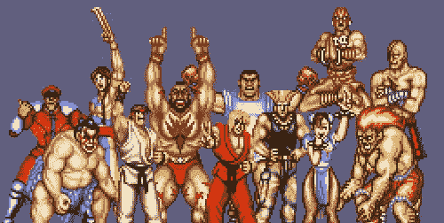

# 计算复杂性的简单性:街头霸王 II 与大 O

> 原文：<https://medium.com/hackernoon/the-simplicity-of-computational-complexity-street-fighter-ii-vs-the-big-o-67786db7653c>

计算复杂性是一个棘手的问题。理解运行时可以让我们看到一个特定的算法或数据结构在计算机中的伸缩性。不幸的是，尝试像计算机一样思考可能有点抽象——例如，说访问链表中的节点是 O(n)而插入节点是更优选的 O(1)是什么意思？为了真正理解这些概念，让我们用现实生活(呃..超级任天堂)的例子来弄清楚这些术语的意思。



courtesy of bigocheatsheet.com

这是一张描述不同运行时复杂性的可伸缩性的图表。虽然所有运行时都从左下角的同一点开始，但是添加更多的元素会改变每个元素的效率。虽然在小型项目中是否使用数组存储一些数据可能没有什么区别，但是一旦您最终成功地获得了一些富有投资者的注意，同一个项目可能就没有那么大的规模了。

# O(1)

O(1)，读作“oh of one”简直是最好的。如果把它拟人化，那就是迈克尔·乔丹。除非你有时间机器，否则没有办法有更好的运行时间。


Choosing from the original eight characters

它是如何工作的？想象这是 1991 年，你第一次体验玩一个全新的游戏，叫做[街头霸王 II](https://en.wikipedia.org/wiki/Street_Fighter_II:_The_World_Warrior) 。你的朋友告诉你，你应该尝试 Guile，因为他的音爆相当可怕。不幸的是，你唯一的信息是名字古勒。你不知道他或她长什么样，这是谷歌成立前的又一个七年。当然，你可以做一些推理，但是你决定有一个更快的方法。你所要做的就是问你的朋友，“这些角色中哪一个是古烈？”

仅仅一个问题之后，你的朋友就指出了诡计。O(1)的意思就是——你的问题在恒定时间内得到解决。不管是 8 个字符还是 800 个字符，这都是瞬间完成的。

# o(登录号)

尽管前面的方法很有效，但现实世界通常并不那么顺利。下一个最好的可能是 O(log n)。


O(log n)算法最好的描述是永远不必查看输入的整体。与二分搜索法一样，O(log n)基本上是获取数据，将其分成两半，然后获取剩下的数据，再分成两半。直到你得到你的答案。

以街头霸王为例，想象你问你的朋友“Guile 在第一排吗？”这使得最初的八架战斗机减少到四架。通过不断地将选择的总数减半，你最终可以达到 Guile。

# O(n)

O(n)可能是最容易理解的运行时。输入越大，花费的时间就越长，并且它们以相同的速度增加。在 O(1)部分，我们发现了通过问一个问题来判断哪个角色是骗子的最有效的方法。为了使用 O(n ),我们会单独询问我们的朋友关于每个字符的情况。从第一个字符开始，我们会问“这是诡计吗？”如果他说是，我们就完成了(这是最好的情况)。如果没有，我们继续下一个字符。如果只考虑八个字符，那么只需要八个问题(最坏的情况)。然而，如果输入变得更大，比如我们增加了八个字符，运行时间会变得更慢。



More inputs means a slower runtime for O(n)

# O(n)

O(n)的复杂性是事情变得有点棘手的地方。如果您看一下本文顶部的大 O 图，您会注意到描述这个特定运行时的线是弯曲的，因为它是多项式时间。

二次或多项式运行时通常包含嵌套的 for 循环。一个嵌套的 for 循环意味着 O(n ),而第二个嵌套的 for 循环意味着 O(n ),依此类推(有可能但不太可能的例外)。



“Hello, sir. Are you Guile?”

这在我们的街霸例子中是如何工作的？想象一下，你可以问真实的人物自己问题。你走近第一个角色，问他的名字是不是叫 Guile。如果他回答“是的，我是”(最好的情况)，那么你就完成了。但是，如果他的回答是“否”，这将开始一个嵌套的 for 循环。这个角色(比如说 Ryu)然后成为提问大师，接近第二个角色为你提问。类似地，他一次一个地问第二个角色(假设是肯)他是否狡诈。这个过程一直持续到原问题的回答为“是”如图所示，数据越多，事情持续的时间就越长。

# O(2^n)和 O(n！)

两个不太常见的运行时是指数 O(2^n 和看似永远阶乘 O(n！).如果一个程序运行在这两种模式中的任何一种模式下，建议考虑一种新的方法。

O(2^n)通常出现在递归函数中，即在函数内部调用函数两次，例如下面的 Fibonacci 示例:

```
fib(n) = { return fib(n-1) + fib(n-2) }
```

大 O 比街头霸王选择屏幕复杂得多，但了解基本知识是一个好的开始。就像超级任天堂一样，理解大 O 更复杂的方面需要大量的练习，也许还需要读一点指导手册。

感谢阅读。如果你喜欢这篇文章，请订阅。


Maybe Guile wasn’t the best choice