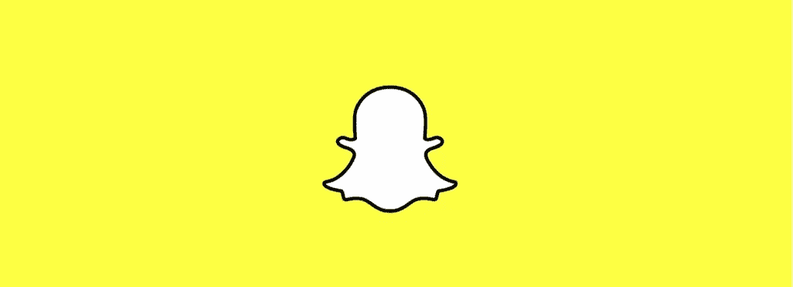
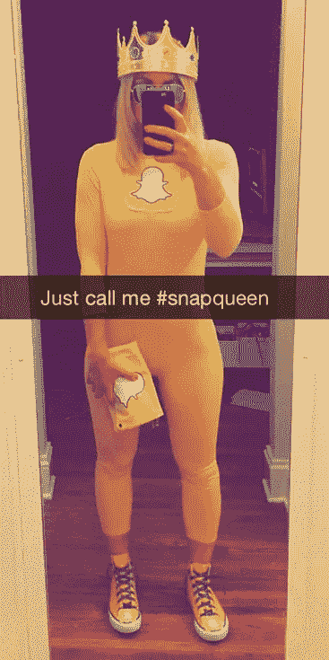
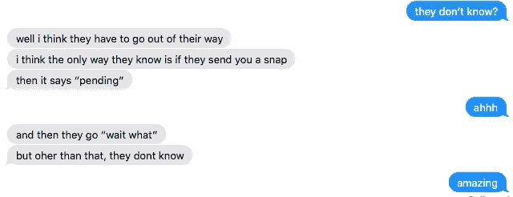

# Snapchat 的困境

> 原文：<https://medium.com/hackernoon/the-snapchat-dilemma-404c46b491c1>

The Snap Ghost.

## 不要鬼我，每天看我的照片

与许多其他社交网络不同，Snapchat 对我来说很特别。这是一个让我和我喜欢的人分享东西的地方，不用担心被评判。

我直接给一群大约 10 个人拍下我的早餐、优步/Lyft 唱歌视频和傻傻的脸。他们包括我的密友，我的兄弟姐妹和我的全职妈妈朋友。随着越来越多的人成为我在 Snapchat 上的“朋友”，我不再考虑我的长期隐私，因为这一刻太有趣了。

Snapqueen, Halloween 2015

随着时间的推移，尤其是在旧金山，人们会在你的生活中进进出出。你会习惯的。

有些时候，你给某人发信息，他们却从不回你信息。当你看到他们活得好好的，在你家旁边的餐馆登记入住，这确实会让人很恼火。

大多数人注意到了，意识到这些“幽灵”很糟糕，然后继续前进。在脸书，取消好友关系被认为是不道德的，所以你只要取消关注，他们就不会出现在你的新闻源中。问题解决了。

***Snapchat 则是另一番景象。你可以不看他们的快照，但他们可以看你的。***

起初我没有注意到，但我开始看到这些“幽灵观察者”出现在我的 Snapchat 故事中。我没有心烦意乱，但有些事情令人不安。

> 你想偷窥我的照片，却不想回复邮件或短信？你知道我能看到你在看着我吗？

## 幽灵观察者的类型:

**幽灵#1:** 前同事

*   我们不是朋友，因为我们共用一个办公室。我找新工作的时候，你甚至对我都没那么好，还当我的鬼。**屏蔽。**

幽灵 2 号:糟糕的日期

*   仅仅因为我们一年前约会过两次，而你给我当了鬼，并不意味着你应该看到我和我男朋友的索诺玛之旅。**屏蔽。**

幽灵特工 3 号:陌生人

*   我们在社交场合见过面，但因为你的消失，我们从未真正交谈过。你只是从我的照片上认识我。**块。**

因此，在脸书上“解除好友关系”相当于在 Snapchat 上“删除好友”。这听起来很刻薄，但据我的技术兄弟说，没那么激烈:

Figuring out how to use Snapchat because it’s so damn difficult.

即使我把它们拿掉，我也可能完全想错了。臭名昭著的 snap chatter DJ Khaled 每天都提醒我们，“他们不希望你[插入任何东西]。”他是对的。不管你在什么社交媒体上，那些讨厌的人都会讨厌你。但至少在 Snapchat 上，我知道谁是我的仇人，并把他们剔除出去。考虑到 Snapchat 的标志是一个幽灵，也许这一切都有意义。

如果你正在拾起我放下的东西，请推荐。如果没有，请在评论区告诉我你的想法。

> [黑客中午](http://bit.ly/Hackernoon)是黑客如何开始他们的下午。我们是 [@AMI](http://bit.ly/atAMIatAMI) 家庭的一员。我们现在[接受投稿](http://bit.ly/hackernoonsubmission)，并乐意[讨论广告&赞助](mailto:partners@amipublications.com)机会。
> 
> 如果你喜欢这个故事，我们推荐你阅读我们的[最新科技故事](http://bit.ly/hackernoonlatestt)和[趋势科技故事](https://hackernoon.com/trending)。直到下一次，不要把世界的现实想当然！

