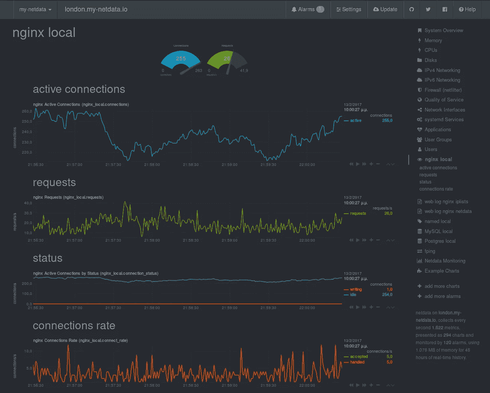
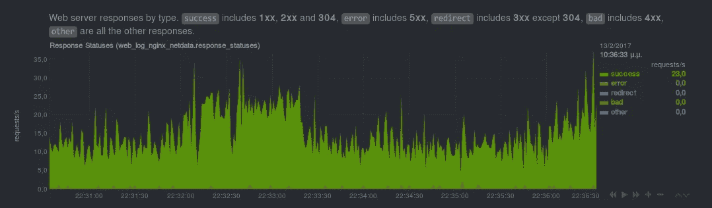
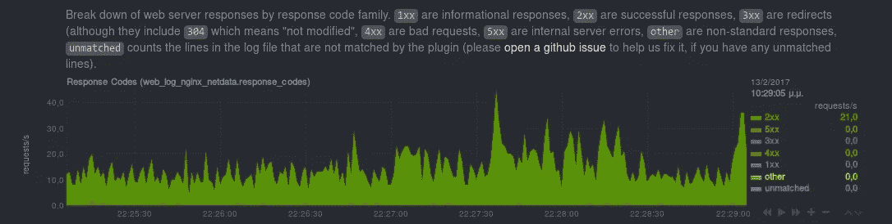
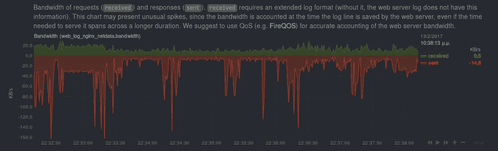
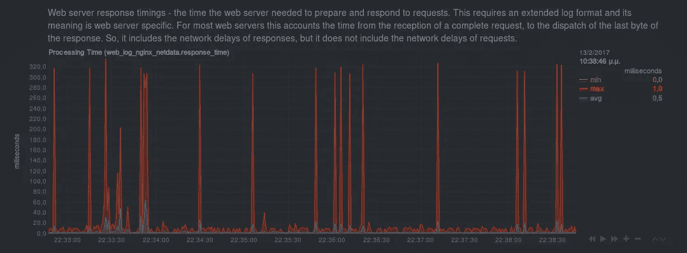
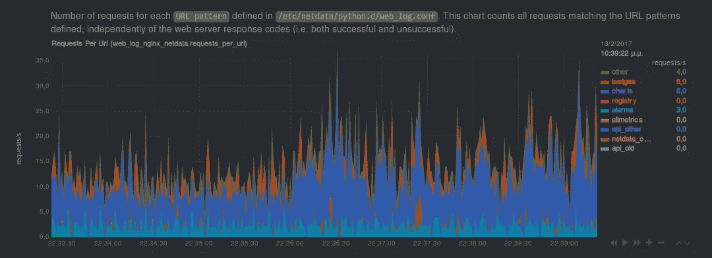
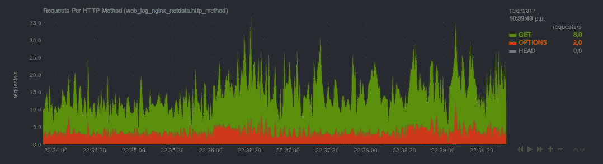
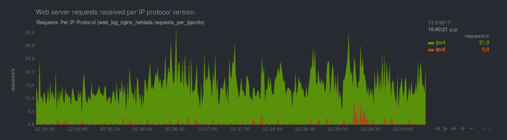
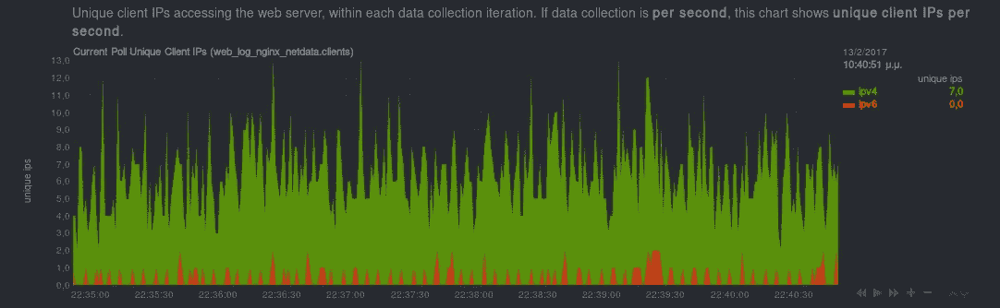
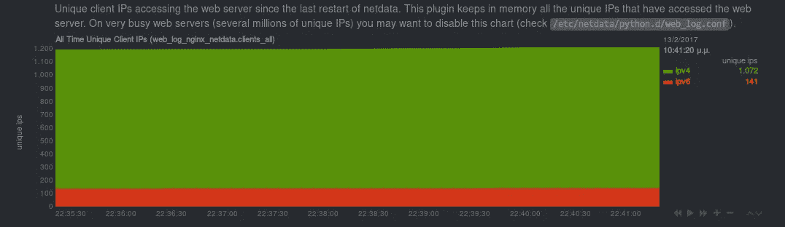

# web 服务器日志文件的奇观

> 原文：<https://medium.com/hackernoon/the-spectacles-of-a-web-server-log-file-90c995e9e986>

*使用*[***netdata***](https://my-netdata.io/)*实时监控您的 web 服务器性能和健康状况。* [*查看现场演示*](https://london.my-netdata.io/default.html#menu_web_log_nginx_netdata) *。*

Web 服务器日志文件存在了 20 多年。

自从 NCSA httpd 为网络提供动力以来，来自所有厂商的所有类型的所有网络服务器都会产生日志文件，实时保存对网站和 API 的所有访问。

然而，在线网络分析(如谷歌分析)出现后，所有这些网络服务器日志文件大多只是填充我们的磁盘，每晚轮换，没有任何用途。

***这就要变了！***

我将向您展示如何轻松地将这个“无用”的日志文件变成一个强大的性能和健康监控工具，能够实时检测最常见的 web 服务器问题，包括:

*   **太多重定向** (即哎呀！这不应该将客户端重定向到自身！)
*   **太多错误请求** (即哎呀！*有几个文件没有上传！*)
*   **太多内部服务器错误** (即哎呀！*这个版本崩溃太多！*)
*   **无理过多的要求** (即哎呀！我们受到攻击了！)
*   **无理地少提要求** (即哎呀！*给网络佬打电话！*)
*   **反应异常缓慢** (即哎呀！*数据库又慢了！*)
*   **成功回复** (即哎呀！*上帝帮帮我们吧！*)

# 安装[网络数据](https://my-netdata.io/)

如果您还没有，现在可能是安装[netdata](https://github.com/firehol/netdata/wiki/Installation)的好时机。

[**netdata**](https://my-netdata.io/) 是一个针对 [Linux](https://hackernoon.com/tagged/linux) 、FreeBSD 和 MacOS 的性能和健康监控系统。 [**netdata**](https://my-netdata.io/) 是**实时**，这意味着它所做的一切都是每秒**秒**的，因此所有呈现的信息都是交互式的，并且仅滞后一秒。

如果你把它安装在一个运行网络服务器的系统上，它会检测到它并自动显示一系列图表，这些图表包含从网络服务器 API 获得的信息，就像这些(*这些不是来自网络服务器日志文件*):

[***netdata***](https://my-netdata.io/) *charts based on metrics collected by querying the* `*nginx*` *API
(i.e.* `*/stab_status*`*).*

> [***netdata***](https://my-netdata.io/)***，*** *在本文写作时，支持* `*apache*` *，* `*nginx*` *，* `*lighttpd*` *，* `*tomcat*` *。为了从 web 服务器 API 获得实时信息，web 服务器需要公开它。关于配置你的网络服务器的指导，检查* `[*/etc/netdata/python.d/*](https://github.com/firehol/netdata/tree/master/conf.d/python.d)` *。每个 web 服务器都有一个文件。*

# 跟踪圆木！

[**netdata**](https://my-netdata.io/) 有一个强大的`web_log`插件，能够增量解析任意数量的 web 服务器日志文件。这个插件是由 [**netdata**](https://my-netdata.io/) 自动启动的，并且是预先配置好的，用于查找流行发行版上的 web 服务器日志文件。

它的配置在`[/etc/netdata/python.d/web_log.conf](https://github.com/firehol/netdata/blob/master/conf.d/python.d/web_log.conf)`处，看起来像这样:

[***netdata***](https://my-netdata.io/) web_log plugin configuration for a web server log file.

您可以为每个 web 服务器日志文件添加一个这样的部分。

> ***重要*** *牢记*[***net data***](https://my-netdata.io/)*运行方式为用户* `*netdata*` *。因此，请确保用户* `*netdata*` *有权访问 web 服务器日志目录，并且可以读取日志文件。*

# 绘制日志！

一旦您配置了所有日志文件并且重新启动了[**netdata**](https://my-netdata.io/)**，您将在 [**netdata**](https://my-netdata.io/) 仪表板上看到一个部分，包含以下图表。**

## 按状态列出的响应

在此图表中，我们试图为所有回答提供一个有意义的状态。所以:

*   `success`统计所有有效响应(即`1xx`信息，`2xx`成功，`304`未修改)。
*   `error`是`5xx`内部服务器错误。这些都是非常不好的，它们意味着你的网站或者 API 面临困难。
*   `redirect`为`3xx`响应，除了`304`。所有的`3xx`都是重定向，但是`304`意味着“未修改”——它告诉浏览器他们已经拥有的内容仍然有效，可以照原样使用。因此，我们决定将其视为一个成功的回应。
*   `bad`是无法满足的错误请求。
*   `other`所有其他非标准类型的响应。

[***netdata***](https://my-netdata.io/)real-time chart of web server responses by status, obtained from its log file

## 按类型排列的响应

然后，我们按照代码系列对所有响应进行分组，而不解释它们的含义。

[***netdata***](https://my-netdata.io/)real-time chart of web server responses by type, obtained from its log file

## 按代码的响应

这里我们显示了每个响应代码的请求数。

[***netdata***](https://my-netdata.io/)real-time chart of web server responses by code, obtained from its log file

> ***重要*** *如果您的应用程序正在使用数百个非标准响应代码，您的浏览器在查看此图表时可能会变慢，因此我们添加了一个配置* [*选项来禁用此图表*](https://github.com/firehol/netdata/blob/419cd0a237275e5eeef3f92dcded84e735ee6c58/conf.d/python.d/web_log.conf#L63) *。*

## 带宽

这是 web 服务器接收和发送流量的一个很好的视图。

对于这个图表，重要的是要知道，每个请求和响应使用的带宽是在写入日志时计算的。由于 [**netdata**](https://my-netdata.io/) 每秒都会刷新这个图表，如果请求或响应太大，可能会出现不切实际的峰值。原因很简单:一个响应可能需要 1 分钟才能完成，但是在该分钟内用于特定响应的所有带宽将在日志行被写入的第二秒被计算在内。

正如图表上的图例所示，您可以使用 FireQoS 在 web 服务器端口和 IPs 上设置 QoS，以准确测量 web 服务器正在使用的带宽。实际上，[在您的服务器上安装 QoS 可能还有更多原因](https://github.com/firehol/netdata/wiki/You-should-install-QoS-on-all-your-servers) …

[***netdata***](https://my-netdata.io/)real-time chart of web server bandwidth, obtained from its log file

> ***重要*** *大多数 web 服务器默认不记录请求大小。
> 因此，* [*除非您已经将 web 服务器配置为记录请求的大小*](https://github.com/firehol/netdata/blob/419cd0a237275e5eeef3f92dcded84e735ee6c58/conf.d/python.d/web_log.conf#L76-L89) *，否则* `*received*` *维度将始终为零。*

## 计时

[**netdata**](https://my-netdata.io/) 还将呈现 web 服务器响应请求所需的`minimum`、`average`和`maximum`时间。

请记住，大多数 web 服务器的计时都是从收到完整的请求开始，一直到发出最后一个字节的响应。因此，它们包括响应的网络延迟，但不包括请求的网络延迟。

[***netdata***](https://my-netdata.io/)real-time chart of web server response timings, obtained from its log file

> ***重要*** *大多数 web 服务器默认不记录定时信息。
> 因此，* [*除非您已经将 web 服务器配置为也记录计时*](https://github.com/firehol/netdata/blob/419cd0a237275e5eeef3f92dcded84e735ee6c58/conf.d/python.d/web_log.conf#L76-L89) *，否则此图表将不存在。*

## URL 模式

这是一个非常有趣的图表。它完全由您配置。

[**netdata**](https://my-netdata.io/) 可以将日志文件中找到的 URL 映射到类别中。您可以通过在`web_log.conf`中提供名称和正则表达式来定义这些类别。

所以，这个配置(对于我的 API URLs):

[***netdata***](https://my-netdata.io/) web_log plugin configuration for a web server log file.

生成以下图表。`categories`部分按照给定的顺序匹配。所以，注意你给你的模式的顺序。

[***netdata***](https://my-netdata.io/)real-time chart of web server URL patterns, obtained from its log file

## HTTP 方法

此图表按使用的 HTTP 方法对请求进行了细分。

[***netdata***](https://my-netdata.io/)real-time chart of web server HTTP request methods, obtained from its log file

## IP 版本

这个提供了客户端使用的每个 IP 版本的请求(`IPv4`、`IPv6`)。

[***netdata***](https://my-netdata.io/)real-time chart of web server clients IP version, obtained from its log file

## 独特的客户

最后的图表是关于访问你的网络服务器的独特的 IP。

这一项计算每个数据收集迭代的唯一 IP 数(即**每秒的唯一客户端数**)。

[***netdata***](https://my-netdata.io/)real-time chart of web server unique clients, obtained from its log file

而这一个，算唯一的 IPs，自从上次 [**netdata**](https://my-netdata.io/) 重启之后。

[***netdata***](https://my-netdata.io/)real-time chart of web server unique client, obtained from its log file

> ***重要信息*** *提供此信息* `*web_log*` *插件在内存中保存 web 服务器看到的所有 IP。虽然这不需要太多内存，但如果您的 web 服务器有几百万个唯一的客户端 IP，我们建议使用* [*禁用此图表*](https://github.com/firehol/netdata/blob/419cd0a237275e5eeef3f92dcded84e735ee6c58/conf.d/python.d/web_log.conf#L64) *。*

# 注意日志！

[**netdata**](https://my-netdata.io/) 的神奇之处在于，每秒钟都会收集到所有的指标，所有的指标都可以用来或者关联起来提供**实时告警**。

开箱后， [**netdata**](https://my-netdata.io/) 自动将[以下报警](https://github.com/firehol/netdata/blob/master/conf.d/health.d/web_log.conf)附加到所有`web_log`图表(即单独附加到每个日志文件):

1.  `1m_redirects` 在最后一分钟内，HTTP 重定向(3xx，304 除外)占所有请求的比率。
    *检测站点或 web API 是否遭受过多或循环重定向*(即**哎呀！** *这不应该将客户端重定向到自身*。
    最低要求:120 次/分钟
    警告:> 20%
    临界:> 30%
2.  `1m_bad_requests` 在最后一分钟内，HTTP 错误请求(4xx)占所有请求的比率。
    *检测站点或 web API 是否收到太多错误请求，包括* `*404*` *、未找到*(即**哎呀！** *少数文件未上传*)。
    最低要求:120 次/分钟
    警告:> 30%
    紧急:> 50%
3.  `1m_internal_errors` 在最后一分钟内，HTTP 内部服务器错误(5xx)占所有请求的比率。
    *检测站点是否面临服务请求*的困难(即**哎呀！** *这个发布崩溃太多*)。
    最低要求:120 次/分钟
    警告:> 2%
    危急:> 5%
4.  `5m_requests_ratio` 与前 5 分钟相比，前 5 分钟成功的 web 请求的百分比。
    *检测站点或 web API 是否突然收到太多或太少的请求*(即太多= **哎呀！** *我们受到攻击，*还是太少= **哎呀！** *叫网络佬* )
    最低要求:120/5min
    警告:>双倍，或<一半
    临界:> 4x，或< 1/4x
5.  `web_slow` 与过去 10 分钟的平均响应时间相比，过去 1 分钟内响应请求的平均时间。
    *检测站点或 web API 是否突然变慢*(即**哎呀！** *数据库又慢了*)。最低要求:120/分钟
    警告:> 2x
    紧急:> 4x
6.  `1m_successful` 在最后一分钟内，成功的 HTTP 响应(1xx，2xx，304)与所有请求的比率。
    *检测站点或 web API 是否在限制范围内运行*(即**哎呀！** *上帝帮帮我们吧！*)。
    最低要求:120 次/分钟
    警告:< 85%
    危急:< 75%

`minimum requests`说明待评估警报所需的最小请求数。我们发现，当网站收到的请求超过这个比率时，这些警报相当准确(即没有误报)。

[**netdata**](https://my-netdata.io/) 报警为[用户可配置](https://github.com/firehol/netdata/tree/master/conf.d/health.d)。因此，即使是`[web_log](https://github.com/firehol/netdata/blob/master/conf.d/health.d/web_log.conf)` [闹钟也能适应你的需求](https://github.com/firehol/netdata/blob/master/conf.d/health.d/web_log.conf)。

享受实时性能和运行状况监控！

> [黑客中午](http://bit.ly/Hackernoon)是黑客如何开始他们的下午。我们是这个家庭的一员。我们现在[接受投稿](http://bit.ly/hackernoonsubmission)并乐意[讨论广告&赞助](mailto:partners@amipublications.com)机会。
> 
> 如果你喜欢这个故事，我们推荐你阅读我们的[最新科技故事](http://bit.ly/hackernoonlatestt)和[趋势科技故事](https://hackernoon.com/trending)。直到下一次，不要把世界的现实想当然！

