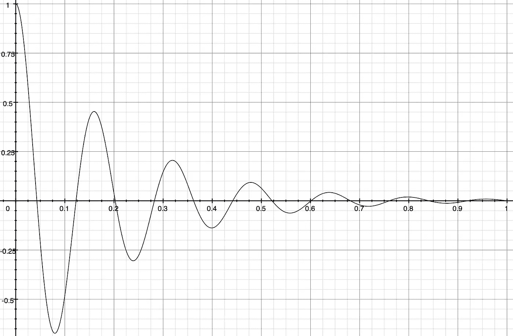
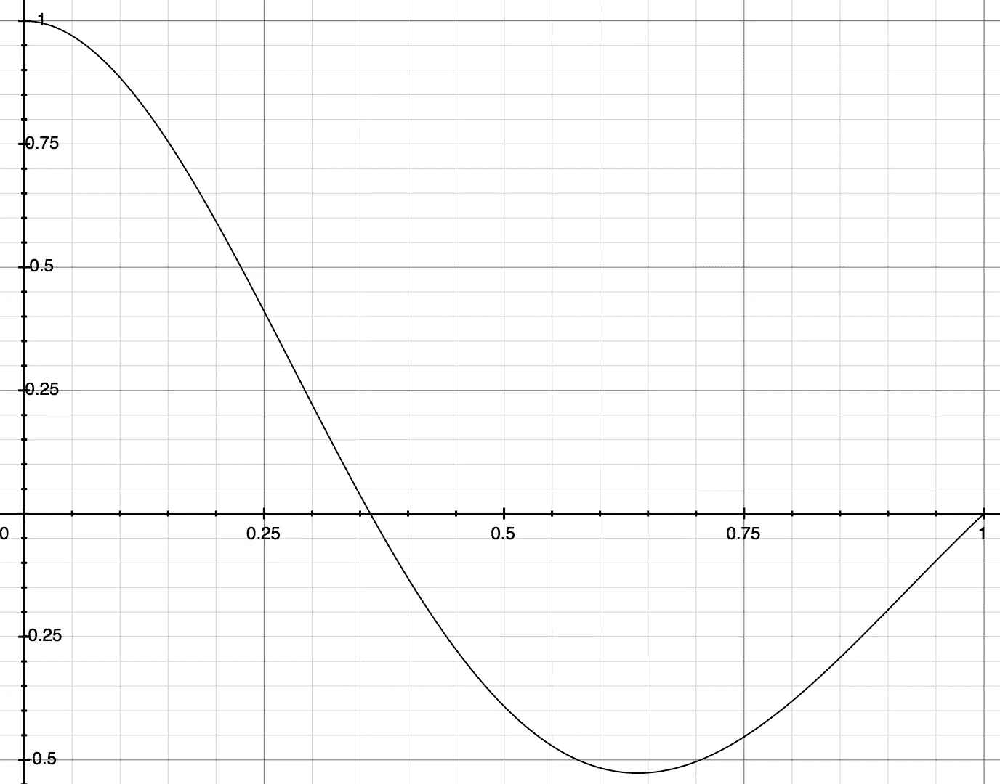
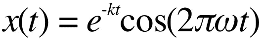
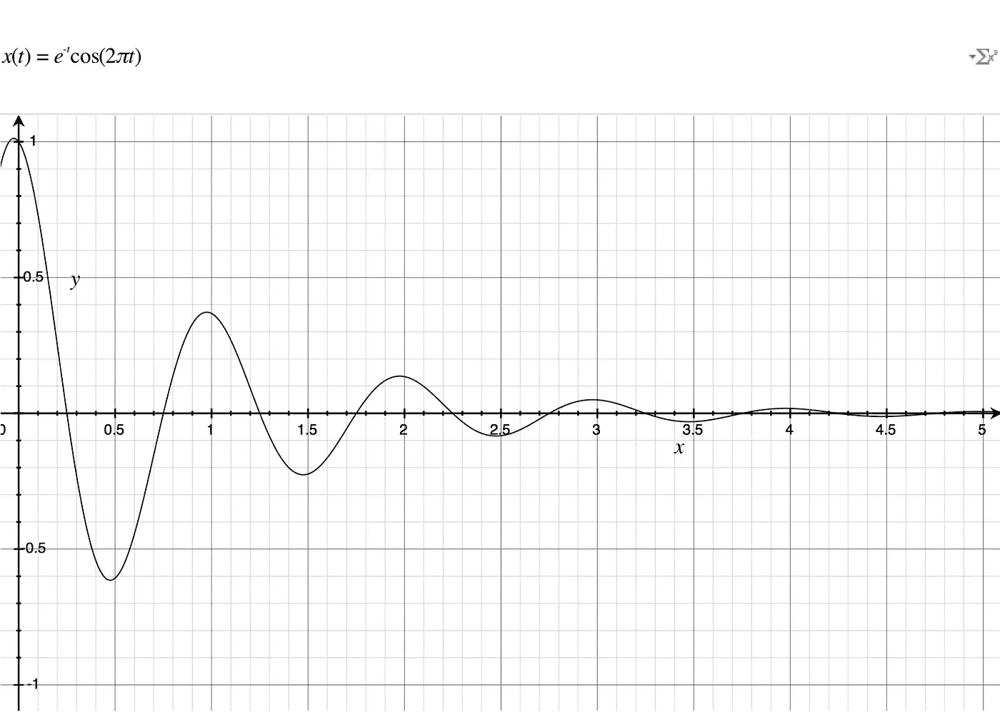
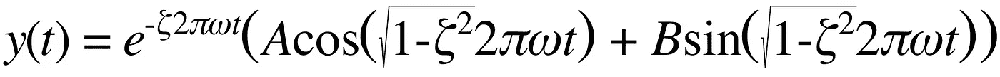
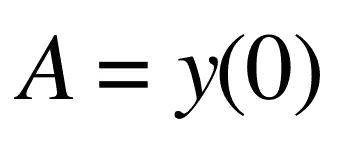
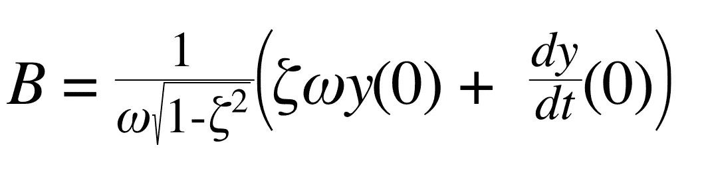
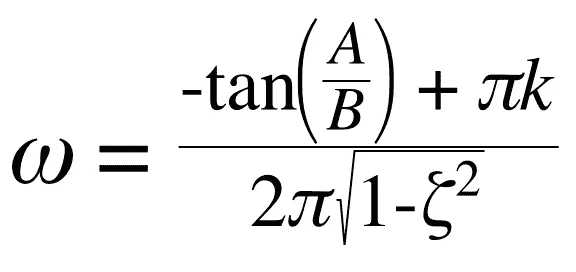
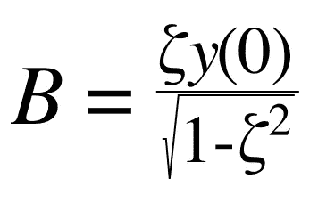
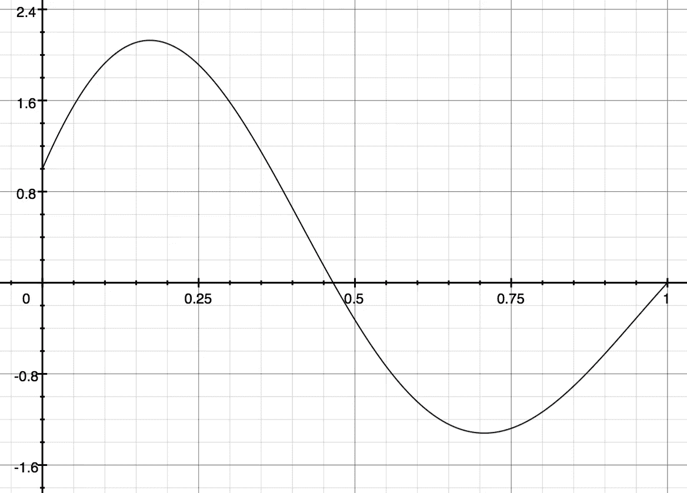

# 弹簧工厂

> 原文：<https://medium.com/hackernoon/the-spring-factory-4c3d988e7129>

## 使用物理弹簧方程创建弹簧动画。



Figure 1\. A spring with damping 0.125, initial position 1, and 13 half cycles.

弹簧效果，其中对象的属性(通常是位置)随时间振荡，对于给应用程序添加有弹性的物理感觉非常有用。在这里，我们讨论如何在物理弹簧上模拟弹性，并创建一个系统，允许您使用时间、反弹次数、阻尼以及可选的初始位置和初始速度来轻松设计弹簧效果。重要的是，这个 spring 库只处理常见的振荡情况，以使其更易于使用。

下面是一个演示效果的视频和一个 JSFiddle，这样你就可以玩代码了。继续阅读，了解是什么让[动画](https://hackernoon.com/tagged/animation)滴答作响。

# 使用适应症

这个 spring 库专门设计已知持续时间和弹跳次数的弹跳动画。例如，您可能希望屏幕上的元素在出现时就弹回原位。有了固定、精确的持续时间，就可以更容易地协调其他动画。

这种弹簧实现可以用于对弹簧进行建模，但效率较低，因为力的幅度变化会影响动画的稳定时间，所以弹簧会实时对未知的力做出反应。

该弹簧实现包括欠阻尼和无阻尼弹簧条件，但不模拟临界阻尼或过阻尼条件。虽然弹簧可以有效地用于这些情况，但在某些情况下，可能更容易推断出[缓入缓出](/analytic-animations/ease-in-out-the-sigmoid-factory-c5116d8abce9)或缓出。

如果您需要这些特性，请参阅下面的参考资料部分，了解其他 spring 实现。

## 对比 CSS 动画

现代网络浏览器包含高度优化的图形例程，你可以通过[转换](https://developer.mozilla.org/en-US/docs/Web/CSS/CSS_Transitions/Using_CSS_transitions?redirectlocale=en-US&redirectslug=CSS%2FTutorials%2FUsing_CSS_transitions)或[动画](https://developer.mozilla.org/en-US/docs/Web/CSS/CSS_Animations/Using_CSS_animations?redirectlocale=en-US&redirectslug=CSS%2FTutorials%2FUsing_CSS_animations)指令用 CSS 访问这些例程。然而，仅使用贝塞尔曲线很难接近完全自然的弹性效果。这里有一个[的例子](http://codepen.io/Venerons/pen/BvHbK)。寻找“向右弹跳”动画。

此外，网页上还有一些 CSS 无法到达的地方。在这些情况下，使用这里描述的 spring 技术将是有利的，因为无论如何都必须使用 [Javascript](https://hackernoon.com/tagged/javascript) 。例子包括动画滚动条和画布。

在下面的实现部分，我提供了一个基于[手写笔的 CSS spring](https://gist.github.com/william-silversmith/8e9b89a0eaad9d168bb9343b1f13df19) 实现。

# 如何使用它

```
// LISTING 1 (Javascript)
// springFactory produces a function representing a spring.var spring_easing = springFactory({ 
    halfcycles: 2, // accepts integers > 1
    damping: 0.15, // must be between 0 and 1 excluding 1,
    initial_position: 1, // typically in -1..1 inclusive
    initial_velocity: 0, // at start, how fast in either direction
});spring_easing(0.00); //  1.00000
spring_easing(0.15); //  0.75796
spring_easing(0.30); //  0.21033
spring_easing(0.45); // -0.32669
spring_easing(0.60); // -0.60467
spring_easing(0.75); // -0.54533
spring_easing(0.90); // -0.24334
spring_easing(1.00); // nearly 0: 9.290299969698109e-17
```



Figure 2\. A a graphic representation of the spring produced in Listing 1\. For simplicity, only two half cycles were used.

*springFactory* 将产生一个函数，该函数采用一个参数 *t* 来表示动画完成的百分比，该百分比是一个介于 0 和 1 之间的数字。值得注意的是，这个派生函数只为每个输入 *t* 生成一个数字，用于动画框架(可能需要构建)中的。一个示例框架包含在[jsdild](https://jsfiddle.net/s1a7140a/2/)中。

这种实现的一个独特方面是 *springFactory* 生产的弹簧主要根据其输出、持续时间、循环次数和阻尼来描述，而不是其他弹簧通常使用的输入，如质量和刚度。[1]这对于有多个交互组件的物理模拟来说不太好，但是对于你确切知道你想要什么的时候来说是完美的。此外，它总是在指定时间内解析到其最终位置零。如果您没有指定足够的周期数，这可能看起来不稳定，但是您总是可以添加更多的周期数。

弹簧上有以下控件:

1.  *时间*(以毫秒为单位)——您可以根据需要设置动画的持续时间。动画越长，弹簧移动越慢。注意，这是你在动画框架中设置的东西，而不是 *springFactory* 本身。
2.  *halfcycles —* 一个大于或等于一的整数，它指定弹簧在停止前通过静止点的次数。一个半周期将在第一次突然恢复时停止。两个将继续下去，反弹一次，以此类推。在数学术语中，它是正弦波的半周期数。
3.  *阻尼* —一个介于 0(含)和 1(不含)之间的数字[2]，主要影响运动的衰减。阻尼为 0 将产生一个完全弹性的弹簧，看起来它永远不会停止(直到它达到您指定的半周期数，此时它将突然停止)。接近 1 的阻尼将产生几乎完全无弹性的弹簧，根本不会反弹。0.15 是一个相当不错的值。试试看。
4.  *initial_position* (可选，默认为 1) —介于-1 和 1 之间的数字。静止的弹簧位于 0，1 被认为是完全伸展的。想象拿一根弹簧，拉它，然后放开它。你这样做的高度用这个数字来表示。
5.  *initial_velocity* (可选，默认为 0)——这个有点难理解。如果你把一个球放在弹簧的顶端，扔出去，这就是它移动的速度。弹簧很容易从静止状态释放，在这种情况下，该参数为 0。当你想让它移动的时候，你必须自己去感觉，但是通常的值可能在-2 到 2 之间。你可以把它想象成和 *initial_position* 差不多大小，但是方向相反。

这里有一个例子，描述了一个弹簧在静止时开始完全伸展，然后被释放。然后，它执行两个半周期，阻尼常数为 0.15。

## 春季设计师

在将这个 spring 框架用于一个[项目](http://eyewire.org/explore)时，我发现使用一个 [Grapher](https://en.wikipedia.org/wiki/Grapher) 文件很有帮助:

[下载 Spring Designer Grapher 文件](https://drive.google.com/file/d/0BzMVmsOw9DxnbUdaT0VHSFN5anc/view?usp=sharing)(针对 OS X)

grapher 文件允许您在更费力地感受弹簧之前，非常容易地绘制弹簧并调整它们。由于涉及到数值解的原因，这个文件不包括初速度的参数，这一点以后会清楚。[3]文件中， *k* 为半周数，ζ(ζ)为阻尼系数， *y0* 为初始位置。

图 2 中的图表是使用上述文件生成的。

# 该理论

根据谷歌的一项简短调查，实现弹性效果的主要技术是使用衰减的正弦或余弦波。“[真实的反弹和过冲](http://www.motionscript.com/articles/bounce-and-overshoot.html)”对此进行了详细说明，但在我们深入讨论之前，让我在这里概括一下要点。



Equation 1\. A decaying cosine wave.

这里， *x* 是行进的距离， *t* 是时间， *k* 是衰减常数，*ω*(ω)是正弦波的频率。它乘以 2π使 *ω =* 1 成为一个完整的周期，而不是必须记住在 *ω* 中说明它。下面是它在图表中的样子(为简单起见，将 *k* 和 *ω* 设为 1)。



Figure 3\. A damped sinusoid approximates a spring.

请注意，该图从 1 开始，下降，超过 0，但不会一直到-1。它慢慢衰减到稳态值 0。我们可以使用正弦或余弦，这取决于我们是想从 1 还是 0 开始。[4]

您可以调整 *k* 和 *ω* 来实现相当逼真的反弹。然而，如果你想精确地模拟一个物理弹簧，[事情变得有点复杂](https://en.wikipedia.org/wiki/Damping)。这样做的主要优点是对波形进行了细微的修改，并且能够以初始速度启动弹簧。

引入ζ(ζ)，阻尼系数。这个变量代表了弹簧的弹性有多大。当ζ大于 1 时，弹簧阻尼过大，不会振动。当它等于 1 时，称为临界阻尼，不振荡。我们关注的是 0 < ζ < 1, underdamped, where it will oscillate but decay towards zero. [的情况，查阅维基百科](https://en.wikipedia.org/wiki/Damping#Under-damping_.280_.E2.89.A4_.CE.B6_.3C_1.29)，下面是欠阻尼情况下的公式:



Equation 2\. The underdamped spring equation.



Equation 3\. Coefficient A in Eqn. 2



Equation 4\. Coefficient B in Eqn. 2

在等式中。2，可以看到真正的欠阻尼弹簧方程是正弦和余弦的线性组合，阻尼指数。从公式中得到的 k*k*。1 变成了 2ππ，余弦的自变量有了前缀 sqrt(1–ζ^2).我们来解剖一下是怎么回事。2π使ω成为一个易于控制的旋钮，因为 1π代表一个完整的周期。ζ具有双重功能，既影响阻尼，又调整振荡频率。 *t* ，自变量，在 0 到 1 之间变化——一个完整的动画。

一个重要的考虑因素是，当 *t* = 1 时，我们希望曲线通过 0，否则动画将根据框架，要么在目标之外停止，要么非常突然地跳到最终位置。这意味着只允许某些ω值。我们可以设置“无滑移”边界条件 y(1) = 0，求解ω: [5]



Equation 5\. Solution for ω such that y(1) = 0, that is to say, there is no slip at the end of the animation. A and B are defined in Eqn. 3 and 4 respectively.

这很好，但是有一个恼人的细节。ω用 *B* 定义，而 *B* 用ω定义。这里有很多细节，但是把情况简化一下更清楚，归结为解这个方程:w = tan(w)，这个方程没有解析解。

然而，并没有失去一切。首先，如果初速度为 0， *B* 简化为一个不依赖于ω的方程:



Equation 6\. Eqn. 4 with 0 initial velocity.

在这个特例中，幸运的是一个常见的用例，我们有一个完全解析的 spring 解决方案。

然而，在一般情况下并没有失去一切。幸运的是， *B* 和ω可以用数值方法求解。我使用了简单的二分法，众所周知这种方法有点慢，但在这种情况下，只需相对较少的步骤就可以快速收敛。重要的是，这个数值解在创建弹簧时出现一次，而不是在实际使用弹簧时出现，所以对性能的影响是最小的。

这是一个例子，当你给弹簧一个初速度时，会是什么样子。图 4 与图 2 相同，图 2 的初始速度为 0，但初始速度为 2。请注意，动画的开始是上升而不是下降，范围没有限制在-1 到 1 之间。



Figure 4\. A spring with initial velocity 2, damping 0.15, halfcycles 2, and initial position 1.

我们现在有五个易于控制的旋钮来调节我们真正的弹簧:

1.  ζ —弹簧质量，0 到 1。(0 为最大弹性)[6]
2.  k——在到达 *t =* 1 处的
    休息点之前执行的半周期数。你也可以认为这是过零点的数量。
3.  *t* — *t* 从 0 运行到 1，但这只是一个百分比。你可以把动画的长度调整到你想要的长度。
4.  *初始位置，y(0)* —您可以在任何高度启动弹簧，但通常您会希望将其保持在 1，因为您可以在使用后缩放输出。
5.  *初始速度，dy/dt (0)* —这允许您通过用一定的力驱动弹簧来扭曲弹簧的自然运动(例如，来自用户输入的运动)。

## 履行

下面是 *springFactory* 的实现。值得注意的是，如果我们只支持初始速度为零的常见特例，那么实现的规模可能会缩小 50%以上，因为 B 和ω的数值解需要大约 100 行。

你可以在这里找到 CSS 动画方面的[手写笔 CSS 预处理器](http://stylus-lang.com/)实现:

## 动画

在我们继续之前，稍微讲一下如何把这个方程变成一个动画。虽然数学适用于任何语言，但让我们使用 javascript，因为它很流行。请参阅旁白 animation.js，了解动画对象的基本框架。[7]

在本文中，我们将重点放在缓和函数上。缓动函数提供了在给定时刻要跨越的起点和终点之间的距离比例。有时它可以是正的，动画向前移动，有时它可以是负的，动画似乎向后运行。所示的框架只是将缓解功能放在上下文中。

在第 25 行，可以看到 *t* 是动画完成的比例，是[0，1]中的一个值，提供给了缓动函数。

在第 14 行，您可以看到缓动函数的默认值是线性缓动。也就是说，动画将与时间的进展成正比。

# 新颖性声明

我不敢说这个实现的这些方面真的很新颖，但是在评估了许多 spring 库之后，我还没有看到它们以这种形式出现。在为 web 构建的 Javascript 欠阻尼 spring 公式领域，以下特性的组合可能是独一无二的。

## 分析解

虽然指定初始速度需要正弦系数的数值解，但总的来说，使用标准的代数工具可以很容易地分析该方程。这使得动画可以很容易地跳到任何一点，向前或向后运行，随时开始、停止或恢复。

大多数(但不是全部)其他实现似乎依赖于对[粘性质量-弹簧-阻尼器模型](https://en.wikipedia.org/wiki/Damping#Linear_damping)中的力进行物理模拟，或者通过使用 [RK4 方法](https://en.wikipedia.org/wiki/Runge%E2%80%93Kutta_methods)求解常微分方程。

基于物理模拟的方法可以向前运行，也可能向后运行，但跳过需要非常快速地运行模拟，这是一种低性能条件。

## 按时建立

如本文所述，ω和 *B* 的代数和数值解保证了当 *t* = 1 时弹簧将位于 0。其他解决方案也在其算法中寻找收敛，但这有时会以失去对动画持续时间或停止点的控制为代价，需要摆弄数字直到它看起来正确。

## 更简单的参数

虽然许多框架都提供了不带参数调用函数并从中获得某种弹性的能力，但是比较它们完全指定一个特定函数需要多少工作量仍然是公平的。这个框架需要三个参数:持续时间、半周期和阻尼，尽管初始位置和速度可以达到五个。

最常见的完整备选集是持续时间、质量、张力(刚度)、摩擦力(粘度)、初始位置和初始速度。

与全套相比，这个公式少了一个参数，尽管允许质量为 1 并且只改变张力和摩擦力是公平的。尽管如此，关于这些参数的推理的相对复杂性是不同的。

在这个公式中，持续时间、半周期和初始位置很容易推理。你可以在没有工具的帮助下预测改变它们的影响。调整阻尼和速度的效果需要更多的猜测和检查，除非你准备开始计算。

在最常见的替代方案中，持续时间和初始位置仍然很容易推理，但调整质量、张力、摩擦力和初始速度的效果需要猜测和检查。

## 表演数学

在 2013 年末配备 2 个 2.8 GHz 英特尔 i7 内核的 13 英寸 Macbook Pro 上，测试了以下代码:

```
var easing = springFactory({
 damping: 0.2,
 halfcycles: 15,
 initial_position: 0.5, // +50% screen, from center
 initial_velocity: 0,
});for (var t = 0; t < 1; t += 1 / 1e8) {
 easing(t);
}
```

节点版本 5.1.1 的结果如下:

```
$ time node springFactory.jsreal 0m6.136suser 0m6.104ssys 0m0.027s
```

我还运行了一个空载 for 循环控制组测试，用了 0.220 秒。这证实了 JIT 优化器由于缺少副作用而没有删除缓和函数调用。

这相当于每秒更新 1630 万次。如果你以 60 fps 的速度运行，spring math 本身将在这台笔记本电脑上支持大约 271，000 个弹簧，如果渲染它们和调用许多不同的函数不需要开销的话；不切实际的情况，但有助于比较。

## 丢弃严重阻尼和过度阻尼的弹簧

我没有经验证据，但我的直觉告诉我，大多数设计师在接触弹簧时都在寻找反弹。消除非振荡弹簧条件可能通过防止混淆和减少掌握所需的学习时间来提高易用性。

人们可以合理地批评这一点，认为这是将缺陷误认为特性，但是我很想看看它在现实世界中的表现。

## 图表产生器文件

分析解决方案允许 Grapher(默认情况下安装在 OS X 上的绘图程序)作为设计弹簧的可视化辅助工具。

*如果你对这幅作品感兴趣，你可能会喜欢* [*进出:乙状结肠工厂*](/@willsilversmith/ease-in-out-the-sigmoid-factory-c5116d8abce9) *或* [*弹跳工厂*](/@willsilversmith/the-bounce-factory-3498de1e5262) *。*

# 资源

1.  看这个框架[玩个 JS 提琴](https://jsfiddle.net/s1a7140a/2/)。
2.  [Spring Designer Grapher 文件](https://drive.google.com/file/d/0BzMVmsOw9DxnbUdaT0VHSFN5anc/view)(针对 OS X)
3.  罗伯特·彭纳(Robert Penner)是第一个将放松方程命名为“放松-放松”的人，他在书中自由地分享了动态运动部分。有点过时(最初是为 ActionScript 编写的，action script 是一种为 Flash 设计的类似 JS 的语言)，但非 Flash 的逻辑仍然是健全的(尤其是本章的前半部分)。他的代码有一点过度优化，很难阅读，但他当时是为更慢的机器编写的。
4.  [http://easings.net/](http://easings.net/)—一组你可以在 CSS 动画中使用的计时功能。它们是用贝塞尔曲线描述的，所以它们有点难以用 Javascript 动画即插即用，除非你使用贝塞尔曲线库。这是留给读者的练习。
5.  [Runge-Kutta 四阶(RK4)解算器](http://mtdevans.com/2013/05/fourth-order-runge-kutta-algorithm-in-javascript-with-demo/) — Javascript 实现，如果你有兴趣制作自己的 spring 库。

# **尾注**

[1]一些示例框架:

[RBBAnimation](https://github.com/robb/RBBAnimation/blob/07d79f57b37373bac9d9c9e5c27487d9a9f8720b/RBBAnimation/RBBSpringAnimation.m)——需要阻尼、质量和刚度。使用标准微分方程解，但不强制 spring 在您选择的特定时间进行求解。

[Intuit 动画引擎](https://github.com/intuit/AnimationEngine/blob/master/INTUAnimationEngine/SpringSolver/INTUSpringSolver.c) —需要阻尼、质量和刚度。使用 RK4 自动获得过阻尼、临界阻尼和欠阻尼的解决方案。

脸书流行音乐似乎只需要跳跃、动画开始和结束。我对 iOS 核心动画的理解还不足以完全解释它的 API，但是[内部](https://github.com/facebook/pop/blob/1d666021f595a513a0812bb5da313bb0219369ee/pop/POPSpringSolver.h)它似乎在微分方程上插上插下，直到[收敛](https://github.com/facebook/pop/blob/1d666021f595a513a0812bb5da313bb0219369ee/pop/POPSpringAnimationInternal.h)。

[Velocity.js](https://github.com/julianshapiro/velocity/blob/9c9c052a5fb6d5854c9aad931d9410c6790816ee/velocity.js#L818) —需要持续时间、张力、摩擦力。使用 RK4。运行两个过程，以确定如何使弹簧在设定的持续时间内收敛。

[2]阻尼允许您描述弹簧的“弹力”或“弹性”程度，由变量ζ(ζ)表示。如果ζ > 1，则弹簧“阻尼过大”,并在没有反弹的情况下停止。如果ζ = 1，则称为“临界阻尼”,它会在最小时间内停止，并有轻微的超调。如果 0 < ζ < 1，则称之为“欠阻尼”,它会振荡，并随时间衰减至零。如果ζ = 0，振荡将无衰减地发生，称为“无阻尼”。在本文中，我们主要关注欠阻尼情况。

[3]好吧，你问倒我了。我有一个 grapher 文件，可以让你计算出初速度，但是很难使用。本质上，你选择一个初始速度 *v0* ，然后通过猜测变量 *B* 的值，看看你是否能得到一条表示误差的线到达零。

[下载初速弹簧设计器](https://drive.google.com/file/d/0BzMVmsOw9DxnbUdaT0VHSFN5anc/view)

[4]回想一下 sin(*x*)= cos(*x*-π/2)。你可以通过增加相移φ(φ)来调整正弦波的起始位置，如下所示:sin(x + φ)

稍微细说一下，sin( *f* x)，其中 *f* 为倍频器，可以相移为 sin( *f* x + φ)。

[5]这里是代数。


[6]这似乎有点尴尬。1 不应该是最大弹性吗？

ζ来自物理学界，他们对事物衰变的速度感兴趣。你可以用一个新的变量ɛ(ε)来代替ζ，因为ɛ = 1-ζ，它在 0 附近弹性最小，在 1 处弹性最大。除此之外，请注意，在ɛ = 0(或ζ = 1)时，方程。2 分解了，因为余弦自变量归零了。你可以尽可能接近零，但你不能去那里。

[7]在可能的情况下，您会想要使用[window . requestanimationframe](https://developer.mozilla.org/en-US/docs/Web/API/window/requestAnimationFrame?redirectlocale=en-US&redirectslug=DOM%2Fwindow.requestAnimationFrame)。与 setInterval 相比，这是一种现代的计时渲染方法。它提供与浏览器刷新率同步的一致刷新率，并尊重电池寿命。两种方法我都试过了，setInterval 总是不稳定。请注意，cancelAnimationFrame 与 clearInterval 一样存在。