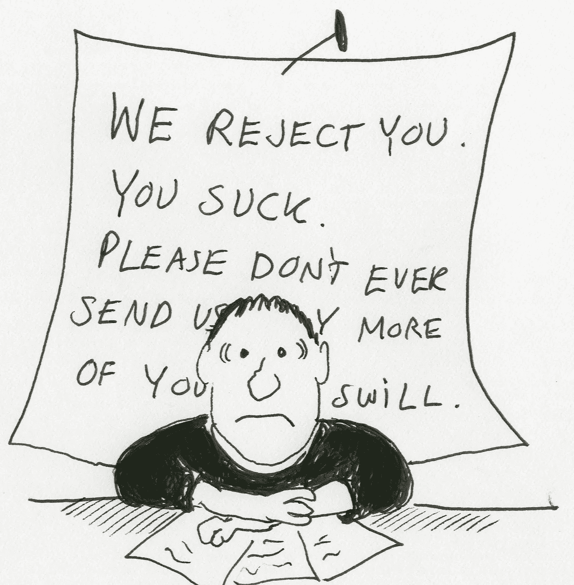

# 美国和以色列风投之间的明显差异

> 原文：<https://medium.com/hackernoon/the-stark-difference-between-us-and-israeli-vcs-474ead1dbb9c>

我们一次又一次地看到这种情况:以色列企业家从硅谷的一次筹款路演中兴奋而满怀希望地回来。他们在访问期间会见了一些世界顶级投资者，并普遍听到了积极的反馈。在大多数情况下，他们遇到的投资者似乎真的感兴趣，并表示他们希望继续下去。自然，以色列企业家相信他或她会收到几份投资意向书，只需要选择最好的一份。事情似乎再好不过了。

然而，接下来往往会发生的是，最初的势头慢慢消退，投资者的响应水平随着时间的推移而下降，温暖友好的关系逐渐变得更加正式。有趣的是，对于没有经验的企业家来说，这总是令人不快的惊喜。

刚刚发生了什么？为什么以色列企业家如此频繁地误读美国投资者？主要原因是在当地筹集资金和在美国筹集资金之间的巨大差异。(我还没有看到足够多的欧洲公司在美国融资，但我相信下面的情况对欧洲的初创公司也是如此。)

首先，美国和以色列投资者参与创业的方式存在明显差异。大多数以色列投资者倾向于告诉企业家他们的真实想法，而不会试图过多地粉饰信息。即使他们喜欢这家公司，许多以色列投资者也会在会议上花大部分时间试图找出故事中的漏洞和/或辩论为什么这个想法行不通。另一方面，美国投资者往往倾向于“软化”他们的信息，以示礼貌。根据一般经验，无论你从美国投资者那里听到什么信息，你都应该低调一点:当你听到你的想法“有趣”时，通常意味着它并不有趣。只有当你听到它“令人兴奋”或“令人印象深刻”时，才意味着对方真的认为它很有趣。

其次，在你的“本土”之外投资的门槛总是更高。投资者觉得在本地投资更放心的原因有很多:当公司在本地时，更容易保持联系和支持公司。没有必要在奇怪的时间接电话，或者只是为了见团队而长途飞行。此外，如果你能在做出投资决定前经常与首席执行官及其团队会面，对一家本地公司进行尽职调查会更容易。最后，作为一名投资者，当你在国外投资时，你总会有这种担心，你会看到当地投资者不想做的剩余交易。这并不意味着风投不会投资本土以外的公司，但门槛更高，他们通常更愿意根据收入和增长等客观数据做出决定。因此，创业公司在本土以外筹集早期融资要困难得多，因为赌注仍然主要在团队和愿景上，没有足够的数据来支持投资。

风格差异的另一个不太明显的原因是，美国的风险投资生态系统比以色列更具竞争力，因此美国人对错过交易的担忧更强烈。这意味着，美国投资者通常会试图保持投资选择的开放性，直到他们最终决定是否真的想投资。当仍未决定时，许多美国投资者的默认状态是听起来比他们实际上更感兴趣，这样机会就不会消失。因此，从参与和积极到决定不投资的转变是如此的生硬。另一方面，以色列投资者大多不太担心失去交易，因此不会高估他们的兴趣。

这并不意味着你不应该试图在美国融资(尽管通常最好不要这样做，除非你在美国有一个值得信赖的合作伙伴，否则公司还处于早期阶段)。然而，当你评估你的投资选择时，你一定要相应地校准投资者的兴奋程度。

> [黑客中午](http://bit.ly/Hackernoon)是黑客如何开始他们的下午。我们是 [@AMI](http://bit.ly/atAMIatAMI) 家庭的一员。我们现在[接受投稿](http://bit.ly/hackernoonsubmission)，并乐意[讨论广告&赞助](mailto:partners@amipublications.com)机会。
> 
> 如果你喜欢这个故事，我们推荐你阅读我们的[最新科技故事](http://bit.ly/hackernoonlatestt)和[趋势科技故事](https://hackernoon.com/trending)。直到下一次，不要把世界的现实想当然！

