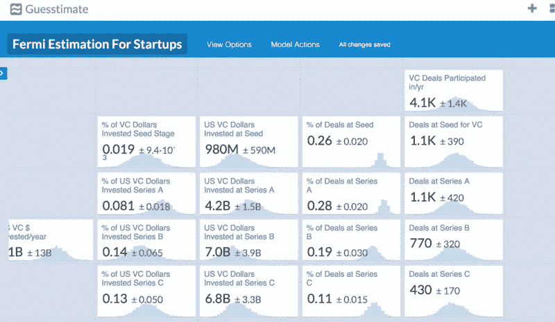

# 创业游戏

> 原文：<https://medium.com/hackernoon/the-startup-game-57667c58bc34>

几周前，猜测测试版出来了。挺爽的；这就像内置水晶球的 Excel。您可以输入一个数字或一系列值，并用它来构建模型。Guesstimate 的发布和假日季给了我一个绝佳的机会去探索一个关于创业行业的想法。我一直想建立一个模型来理解创业公司的形成和发展，直至最终失败或退出。

这是试图量化一个经常不透明的行业的一长串尝试中的一个。数据驱动的风险融资方法的两个突出例子是 [Aileen Lee 的 TechCrunch 文章](http://techcrunch.com/2013/11/02/welcome-to-the-unicorn-club/)，它普及了术语“独角兽”和最近 [Cambridge Associates 关于风险回报变得不那么集中的研究报告](http://www.cambridgeassociates.com/our-insights/research/venture-capital-disrupts-itself-breaking-the-concentration-curse/)。虽然这两份报告都是理解初创企业形成和融资的一个方面的良好尝试，但如果你是这个行业的新手，通常很难理解初创企业是如何走过这一过程的。

Guesstimate 中的创业行业模式从 Sam Gerstenzang 的[开源风险模型](/@gerstenzang/open-source-venture-model-osvm-v1-55bebf3eda9#.53z3tm6yb)和 Bryan Johnson 的 [OSF 剧本](http://osfund.co/osf-playbook/)中获得灵感。像任何模型一样，我的创业模型试图对要测试的世界做出明确的假设和信念。它允许你改变数值来观察每个元素如何相互推拉。它跟踪了一批在一年内成立的公司，并跟踪了它们的整个生命周期。它假设在每个阶段都有一定数量的可用资本，这些资本总是被用来资助那些公司。这里 可以玩模型 [**。现在，你可以在 Guesstimate 上对模型进行修改，但是一旦你离开这个页面，任何修改都不会被保存。改变“退出倍数”和风投参与的交易数量对模型的影响最大。**](http://getguesstimate.com/models/316)

在构建模型的过程中，我们学到并强化了一些重要的东西:

*   关于每年到底有多少初创公司，人们有很大的分歧。考夫曼基金会表示，大约有 600 万家新企业诞生，但没有说明其中有多少是高增长的初创企业。马克·安德森说，T2 有 4000 家初创企业。此外，人们对创业公司的定义仍不一致。
*   **创业真的很难**。所以，很多人失败了。绝大多数新企业根本吸引不到天使投资或风险投资基金。
*   **幂律分布仍然没有被人们内化**(也没有被这个模型很好的表现出来)。一家公司能够创造的回报的数量和差异是令人震惊的。WhatsApp 总共筹集了 6000 万美元，退出时总估值为 190 亿美元，投资回报率为 316 倍。50%的创业公司将无法回报任何东西，接下来超过 40%的创业公司将有望回报投资者的总投资。正是世界上最顶尖的 1%的 WhatsApps 带来了有意义的回报。
*   天使投资者构成了一个巨大的、不太为人所知的创业资本池。天使每年向初创公司投资 200 亿美元。在最初阶段，它们的重要性怎么强调都不为过，在这一阶段，它们每年达成 5 万到 7 万笔交易。自 2000 年以来，由于 AWS 和其他相关服务提供的创业成本较低，这种突出地位有所增长。由于创办一家软件公司的成本已经下降到如此之低，风投无法在一笔交易中投入这么少的资金。他们的模型不是这样的。事实上，天使投资者确实产生了不错的回报，与风险投资的回报相当。

如前所述，Guesstimate 只有两种分布:正态分布和均匀分布，它不能捕捉创业公司的大部分统计现实。虽然正态分布可能是一个很好的方法来模拟创业公司进入下一阶段融资的可能性，但它不是一个很好的方法来衡量退出时产生的回报。目前，这个模型仅仅是描述性的(几乎是描述性的)。在未来，我想转向一个规范的模型来回答这个问题:“我们如何改变当前的系统来创造世界上更有影响力的创新？”。诸如“我们是否需要一个更加多样化的风险投资团队来为不同的初创公司分配资本？”或者“创造创新的最有效方式是向风险投资公司注入更多资金还是降低创业成本？”可能用这个模型更容易回答。

也就是说，我想探索以下几个方向:

*   **探索宏观经济趋势如何影响创业行业**。在 2015 年中期，中国正准备通过[风险投资](https://hackernoon.com/tagged/venture-capital)投资 300 亿美元。2016 年中国将如何影响今年的融资，这些将如何影响未来 5-10 年的创业生态系统？(谢谢丹尼尔)
*   **行业(以及创业成本)如何影响创业率**。虽然我们已经看到软件初创公司的形成出现了可观的繁荣，但生命科学初创公司的情况却并非如此，风投的初始融资数量一直保持不变。随着创业成本的下降，我们应该会看到更多的硬件和生物创业公司在早期阶段得到资助。 [PCH 国际](http://www.pchintl.com/)和[trans copy](https://www.transcriptic.com/)正在努力降低各自行业的成本。
*   **让这个模型更像是一个模拟，看看生态系统如何随着时间的推移而演变**。我想看看大公司的退出如何能够孕育下一代天使投资者，并为收购提供着陆地。硅谷不是一夜之间建成的。公司退出和投资者向下一代传递建议的动态过程对于创建大公司和创新生态系统非常重要。
*   **添加更多数据！我想看看单个公司、投资者和企业家如何影响一家初创公司的成长，而不是由报告提供的综合统计数据。**

感谢 Daniel Kao、Jonathan Zong 和 Reed Rosenbluth 阅读草稿。

这里有一个来源列表。

这是转贴自我的博客:[blog.dillchen.com](http://blog.dillchen.com)

> [黑客中午](http://bit.ly/Hackernoon)是黑客如何开始他们的下午。我们是 [@AMI](http://bit.ly/atAMIatAMI) 家庭的一员。我们现在[接受投稿](http://bit.ly/hackernoonsubmission)，并乐意[讨论广告&赞助](mailto:partners@amipublications.com)机会。
> 
> 如果你喜欢这个故事，我们推荐你阅读我们的[最新科技故事](http://bit.ly/hackernoonlatestt)和[趋势科技故事](https://hackernoon.com/trending)。直到下一次，不要把世界的现实想当然！

