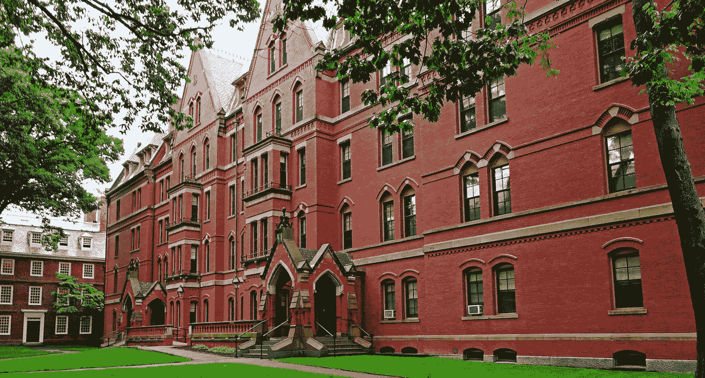

# 哈佛的创业场景

> 原文：<https://medium.com/hackernoon/the-startup-scene-at-harvard-4b832967d64b>

[https://www.hcs.harvard.edu/](https://www.hcs.harvard.edu/)

当人们想到“[哈佛](https://hackernoon.com/tagged/harvard)”和“[创业公司](https://hackernoon.com/tagged/startups)”时，通常会想到退学当上世纪最重要的两家科技公司(脸书和微软)由两位哈佛辍学生创建时，很难抗拒这种倾向。然而，这所大学仍然是创新和创业人才的温床。我想我应该分享一下校园里正在发生的关于创业的事情。

# 俱乐部

[哈佛风险投资](http://www.harvardventures.org/)——哈佛风险投资是领先的本科生团体之一，致力于让学生对创业和技术感兴趣。该集团由[meetbird](https://medium.com/u/99d2523540f2#/features)—meetbird 是一款日历解决方案，旨在让会议变得精彩。它是由 junior Henry Dornier 联合创立的，最近通过了 Y Combinator 奖学金计划。

Wolfe 是 MAC 电脑的一个插件，可以增强它们的处理和图形能力。它是由三名大学三年级学生创建的，并在夏季的 Kickstarter 上取得了巨大成功。

[户外通行证](http://outdoorpass.co/) —想想户外活动的 ClassPass。这家公司是去年由 HBS 学生让·罗创立的。

[Memora Health](http://www.memorahealth.com/)—Memora Health 是一款针对患者护理的消息解决方案。这家公司是由哈佛医学院的学生尼萨尔·帕特尔共同创立的。

# 科技/创业领域的知名校友

以下是过去几年中可以追溯到哈佛的一些人和团体。

兴旺资本(Thrive Capital)——兴旺资本是风险投资领域新兴的年轻明星之一，曾投资 Instagram、Twitch 和 Jet 等公司。该公司成立于 2010 年，其历史可以追溯到哈佛，创始合伙人[。Hamed 曾在 Thiel Fellowship 和 Jawbone 工作过，现在在高盛的一家内部创业公司工作。](https://medium.com/u/255575b88a07#.tpa8ertlo)

丽贝卡·坎塔尔(Rebecca Kantar)——坎塔尔于 2012 年辍学，追寻自己的创业激情，目前在洛杉矶工作。她是一家名为 [Imbellus](http://imbellus.com) (由 Thrive 支持)的公司的首席执行官，重塑了我们衡量人类潜力的方式。他们位于洛杉矶，最近筹集了 400 万美元。

我希望这篇概述能让你了解哈佛的初创企业是什么样子，以及它是如何成熟的。这里列出的组织和人物来自我的记忆和经历。关于背景，我是一个住在温思罗普楼的大学二年级学生。

> [黑客中午](http://bit.ly/Hackernoon)是黑客如何开始他们的下午。我们是 T21 家庭的一员。我们现在[接受投稿](http://bit.ly/hackernoonsubmission)并乐意[讨论广告&赞助](mailto:partners@amipublications.com)机会。
> 
> 如果你喜欢这个故事，我们推荐你阅读我们的[最新科技故事](http://bit.ly/hackernoonlatestt)和[趋势科技故事](https://hackernoon.com/trending)。直到下一次，不要把世界的现实想当然！

