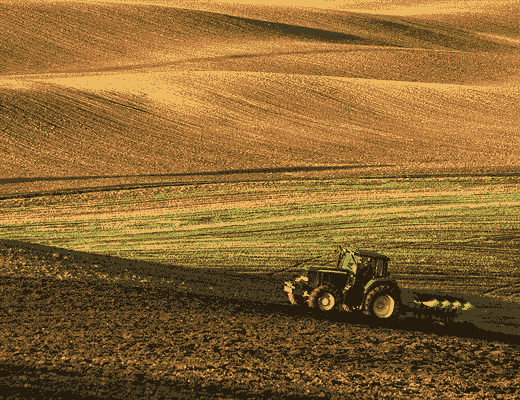
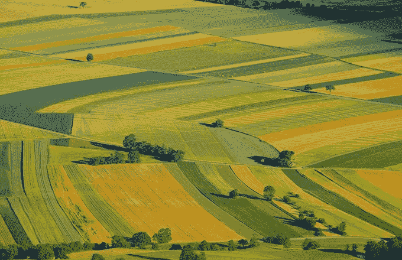
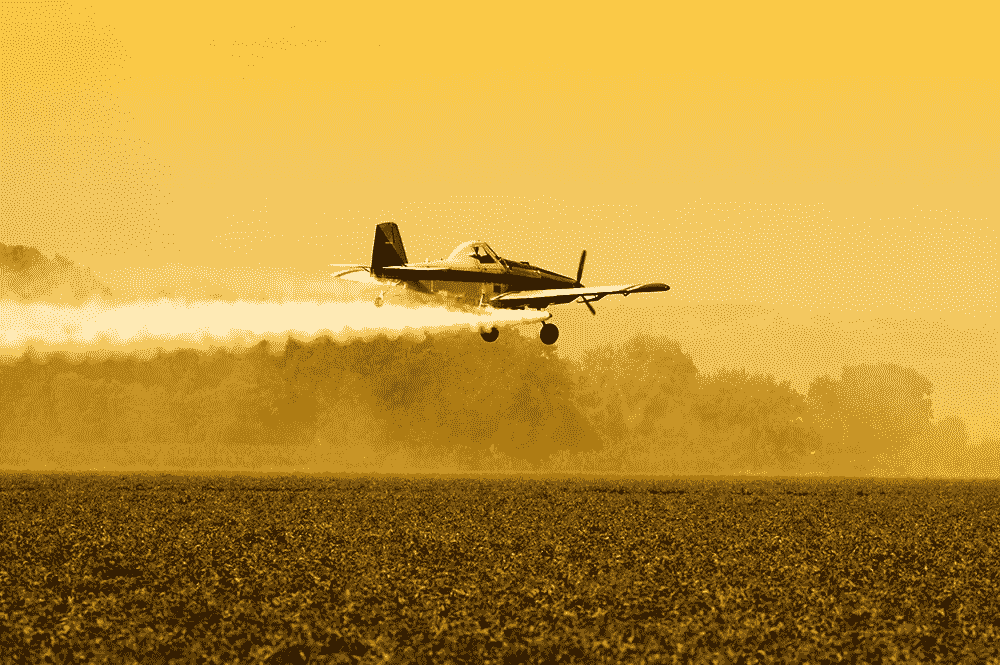

# 这家初创公司已经颠覆了美国农业

> 原文：<https://medium.com/hackernoon/the-startup-that-s-already-disrupted-us-agriculture-54fe6a93ad9>

## 你可能从来没听说过。

[农民商业网络](https://www.farmersbusinessnetwork.com/)，最新的[谷歌风投宠儿](http://techcrunch.com/2015/05/19/farmers-business-network-raises-15m-from-google-ventures/#.sfe1zy0:ufTv)，正在通过[最近宣布的采购服务](http://info.farmersbusinessnetwork.com/fbn_procurement)改变农民采购化肥和农药的方式，这大大降低了农民的成本，并使用数据(而不是当地推销员的推荐)来指导申请决策。

当硅谷的许多人在为农业科技寻找全新的空间，而这些空间往往离真正被采用还有几个迭代，更不用说变革了(想想室内农业和替代食品)，FBN 正在利用现有的大农业系统，并从核心上动摇它。

在过去 70 年左右的时间里，全国各地的农民都依赖于当地的化学品经销商，通常只是他们农村镇上的一个男孩或女孩，来获得关于使用什么肥料、喷洒什么杀虫剂、在什么时间喷洒以及喷洒数量的建议。虽然这个非常私人的[网络](https://hackernoon.com/tagged/network)是出了名的强大，但在像 2015 年这样的一年之后，其中[农场收入下降了多达 36%](http://www.cnbc.com/2015/08/25/farm-income-seen-falling-36-in-2015.html) ，一项提供显著节约的技术( [FBN 引用一位客户节省了高达 40，000 美元](http://cornandsoybeandigest.com/crop-chemicals/announcing-fbn-procurement-services-source-farm-inputs-lower-prices))可能是削弱这些联系所需的能量。

想知道 FBN 采购公司是如何提供如此大的折扣的吗？它本质上是出售无建议的通用农业化学品。没有名牌(这意味着没有产品保证)，也没有当地销售农学家。这种知识和风险保护似乎太多了。但是我采访的几个推广代理人说，事实上，农民可能真的不需要也不使用。有人告诉我，总的来说，农民只在 20%的时候(或者更少)需要特别的建议或推荐。80%的时间不需要特别的产品或推荐，那么为什么要付费呢？将 20%的时间支付给一个自由职业的农学家的推荐费，然后将 100%的时间支付给一个销售农学家的推荐费，会更有成本效益。

至于产品保证，我交谈过的许多生产商报告说，在一些非常罕见的情况下，他们有产品问题，证明产品有问题(而不是应用程序、混合或其他一些因素)非常耗时，不值得头痛，他们最终还是付钱给 respray。

FBN 新采购服务的明显优势是，结合其数据分析系统，有一天它可以为化学应用添加一个极其精确的元素，这可以减少农业中化肥和农药的总使用量——这对农民和消费者来说是一个巨大的成果。种植者节省了资金，我们其他人在我们的土壤、水和食物中享受到了更少的化石燃料。这是现有系统的一个明显问题；当销售人员兼任你的顾问时，他们更有可能“建议”能让他们获得最高佣金的金额。

然而，对于可持续食品运动来说，这种服务也有不利的一面。当农业收入特别低而投入成本高的时候，会鼓励种植者撒下更大的网来获取廉价的投入，并为替代品(如[藻类](http://www.livefuels.com/)或[基于废物的肥料](http://www.calsafesoil.com/)或[杀虫剂替代品](http://apeelsciences.com/))进入农民的眼皮底下创造机会。通过以批发折扣提供农民知道并信任的相同投入，FBN 可能会进一步巩固传统化学应用系统。

有一点我们可以肯定，FBN 的收购服务对农民来说是一笔意外之财，尤其是在这充满挑战的一年。然而，特别是随着气候变化的威胁越来越大，真正的作物顾问，独立于化学品批发商，只会在数据不能最好地预测投入需求的非常时期变得更加重要。

我认为说 FBN 将自己定位为农业的亚马逊并不夸张。这对食物的未来意味着什么？我们必须等等看。

> [黑客中午](http://bit.ly/Hackernoon)是黑客如何开始他们的下午。我们是 [@AMI](http://bit.ly/atAMIatAMI) 家庭的一员。我们现在[接受投稿](http://bit.ly/hackernoonsubmission)并乐意[讨论广告&赞助](mailto:partners@amipublications.com)机会。
> 
> 如果你喜欢这个故事，我们推荐你阅读我们的[最新科技故事](http://bit.ly/hackernoonlatestt)和[趋势科技故事](https://hackernoon.com/trending)。直到下一次，不要把世界的现实想当然！

