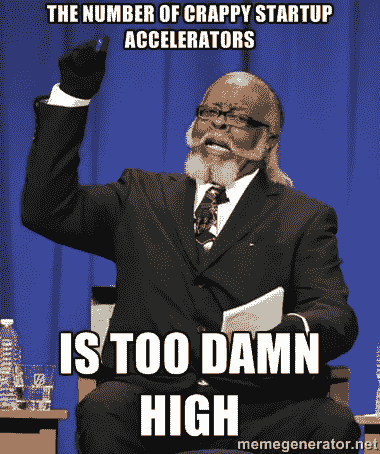

# 创业世界已经成熟。大部分加速器该走了。

> 原文：<https://medium.com/hackernoon/the-startup-world-has-matured-it-s-time-for-most-accelerators-to-go-afbb221d5d22>

Y Combinator 发布了一些有趣的发现关于以前参加过另一个加速器的申请人在申请 YC 的项目时不太成功，这重新点燃了关于加速器项目作用的讨论。

自从 YC 推广这个概念已经十年了，你可能会认为媒体上发表的大量“我学到了什么”的事后分析足以让除了最有效的加速器之外的所有加速器都关门大吉。事实上，相反的情况发生了:今天，似乎每个大学项目、每个边远地区的地方商会和每个企业实体都在竞相避免成为加速器游戏中的最后一个。我曾经经营一家加速器，度过了许多不眠之夜，试图找出如何同样好地帮助其投资组合中的每一家公司(我做不到)——我对这些项目及其背后的好心人情有独钟。尽管如此，我还是担心这些新程序可能会对更大的[创业公司](https://hackernoon.com/tagged/startup)生态系统造成损害。

到目前为止，所有关于如何克服创业初期障碍的信息都可以在网上找到。所有这些信息都可以在 Quora 上找到，一遍又一遍地回答。你能找到的所有建议都可以在媒体上免费获得，或者在资深风险投资者的博客上找到，比如弗雷德·威尔逊的 MBA 周一系列，以及马克·苏斯特在桌子两边说的任何话。那么，你到底在做什么，向这些加速器和预加速器程序支付基本的启动信息，你可以在任何地方找到，而且是免费的？

更别提反稀释和污染的帽子表了。当你连续第二个月吃顶级拉面时，你很难看清事情的真相，因为你一文不值，你的公司也一文不值，所以让我给你解释一下:如果你以可观的 2 亿美元退出，即使你公司的 1%也是一大笔钱。$2M 可以给你买很多更好的拉面。你真的想像安德鲁·洛克利[如此雄辩地](http://www.meetup.com/londonocc/messages/71810152/)所说的那样，为了“欢呼和一张小桌子，仅此而已”而放弃这些吗？

有这么多不同质量的加速器在争夺初创公司的注意力和股权，是时候清楚地审视一下这个领域了。下面是一个决策树，我希望所有的创业者在评估创业加速器项目对他们是否真正有意义时都会用到它。

**最警惕用心良苦的平庸演员**

它真的提供了你需要的东西吗？

去年，帮凶风投公司的克里斯·林奇引起了不小的轰动，他警告创业者要小心加速器，因为加速器是披着羊皮的狼。问题不在于这些加速器是故意有害的——对于每一个掠夺性的程序，至少有 20 个善意的其他人在申请。不幸的是，尽管他们可能很有意义，但许多运行这些程序的人没有资格这样做，无论是因为他们的风险投资网络有限，创业经验有限，还是当涉及到你的特定垂直领域时，他们力不从心。他们以前经营过自己的创业公司吗？一旦他们帮你完善了这个项目，他们真的有投资者网络让你加入吗？不要成为那种穿戴整齐却无处可去的创业者。

*2)如果是的话，你真的会从这个项目中得到吗？*

许多加速器受到[设计](https://hackernoon.com/tagged/design)的时间限制——每个群组得到大约 8 到 12 周的关注，然后进入下一个闪亮的批次。每一批都有十几家甚至五十家公司。你如何保证你的 7%能让你接触到顶级导师？第二和第三好的选择能有效地帮助你吗？如果你是一家 SaaS 的企业公司，他们可能会，但如果你在太空水产养殖领域，只有一个在该领域知识渊博的导师，而他被指派给了别人，那该怎么办？关于如何评估对客户和分销合作伙伴的战略介绍的承诺，请参见下面的第 4 点。

如果是，现在有意义吗？

我们现在经常听到“加速器”这个词，以至于我们似乎已经忘记了它的根本含义:加速器帮助你移动得更快。正如保罗·格拉厄姆在黑客新闻中对最近 YC 的发现所说，“一个简单的思考方式是，只有当你被指向正确的方向时，加速才有帮助！”不要被推着向前 100 英里，却发现自己不得不折回。

我见过的大多数加速器都专注于完善推销，把你推向投资者。我希望看到更多的公司向投资者传授如何让他们的投资获得丰厚回报——似乎除了教授推销和销售策略，加速器还把公司战略和规模的课程留给了机构投资者。加速器方法背后的动机是有意义的——对他们来说:你付钱给他们，让他们学习如何赚更多的钱，这将让 T2 他们赚更多的钱。这就是加速器的设计目的，也是它们最擅长做的。如果你想利用这一点，拥有一个 MVP，并在进入之前准备好销售。

**没有股权项目怎么办？阅读小字之外的内容**

跟着钱走:他们必须对谁负责？这和你的需求有冲突吗？

即使他们没有从你这里得到，加速器也必须找到资金来维持运转和支付员工工资。其中一些是由服务公司零星赞助的，而[是几乎不加掩饰的向你出售招聘、税务、法律和其他服务的尝试](http://davidgcohen.com/2013/08/29/a-shocking-accelerator-story-that-youll-need-to-read-twice/)。那些没有的仍然在很多方面受到限制。挖掘他们的 990 表格和任何你能找到的东西来追踪这笔钱，看看它通向哪里。

*地方经济发展剧*

一些加速器依赖政府拨款，旨在将创新和创业人才吸引到经济不景气的地区，这要求你搬到某个城市居住特定(有时太长)的年限。它们通常由前商会成员或没有创业经验或创业投资者网络的本地人才经营。(不要误会我的意思，仍然有一些非常棒的电影符合这种情况，但也执行得非常好)。如果该地区的经济仍在复苏，你能否吸引到你需要的人才，让你快速行动起来？你将不得不放弃多少时间与来访的政治家和政要握手？你的团队在威斯康辛州的麦迪逊再呆六个月真的有意义吗？或者搬到密歇根州的底特律住一年，以获得 20 万美元的资助？一如既往，视情况而定。

*新兴行业，特定于垂直行业的计划*

创业热正在许多摇摇欲坠的老行业(金融科技)和其他之前崩溃和烧毁但似乎准备重新启动的行业(清洁科技，有人吗？).想想看:对于新兴创业活动的行业，既了解这个领域又知道如何经营一家创业公司的人可能很少。这些人几乎肯定不是在运行你的加速器项目——他们可能在追逐自己的创业梦想。对于像清洁技术这样经历过大规模熄火的新兴行业，知道自己在做什么的人更少——否则，一开始就不会有如此大规模的崩溃。这是一个结构性的生态系统问题。利用这些项目来减少噪音，抓住那些战略合作伙伴、飞行员和客户，但是不要对他们期望太多。

*企业加速器*

更多的是由寻找竞争信息或在 M&A 游戏中领先的公司支持的——你的参与会妨碍你未来的战略发展吗？您是否受限于使用特定的云存储服务或特定的数据可视化平台？您是否被阻止在未来与某些实体作为战略合作伙伴进行合作？如果是，它对您的产品开发路线图和增长计划有影响吗？

看看上面这些项目，了解非稀释性资本的来源，包括低息贷款、免费或减免租金，以及政府和非营利机构的拨款。很难找到好的项目并被录取。如果你没有被录取，不要浪费时间去满足于一个不够好的。

**但是如果我不在热门的风险投资市场呢？**

我用一只手数了数通用加速器的数量，我推荐的垂直加速器不超过 12 个。当你置身于当前的创业热点之外时，我理解内置投资者网络的吸引力。NewGen 认识到了这一点，我们在美国各地进行投资，越来越多的风险投资公司也是如此。搜索 Crunchbase，找出他们是谁，然后伸出手。我赞同克里斯林奇的声明:任何与我联系的初创公司都会有至少 15 分钟的时间来说服我，我是否应该花更多的时间来了解他们。说真的——给我发电子邮件，附上你的推介材料和一份 3 到 4 句话的 ivy@newgenpartners.com 简介。

好的加速器项目仍然有发挥作用的空间。如果你的创业公司已经准备好了，知道你想从中得到什么，并准备好为之奋斗，它就能真正加速(这个词又出现了！)你的成长。但是仅仅因为有大量的“机会”向你招手，并由二级或更低级别的项目提供，并不意味着你必须抓住它。作为一家初创企业，你的每一秒钟和每一分股权都很重要，因为这是你必须付出的全部。明智地使用它。

编辑:感谢您的精彩回复！仍然不确定你是否需要一个加速器或者应该现在就加入一个？给我发电子邮件，告诉我 1)你的资料 2)你在哪里，3)用 2 到 3 句话介绍你在做什么 4)你在公司发展的哪个阶段，我会帮你找到答案。ivy@newgenpartners.com

> [黑客中午](http://bit.ly/Hackernoon)是黑客如何开始他们的下午。我们是 [@AMI](http://bit.ly/atAMIatAMI) 家庭的一员。我们现在[接受投稿](http://bit.ly/hackernoonsubmission)并乐意[讨论广告&赞助](mailto:partners@amipublications.com)机会。
> 
> 如果你喜欢这个故事，我们推荐你阅读我们的[最新科技故事](http://bit.ly/hackernoonlatestt)和[趋势科技故事](https://hackernoon.com/trending)。直到下一次，不要把世界的现实想当然！

