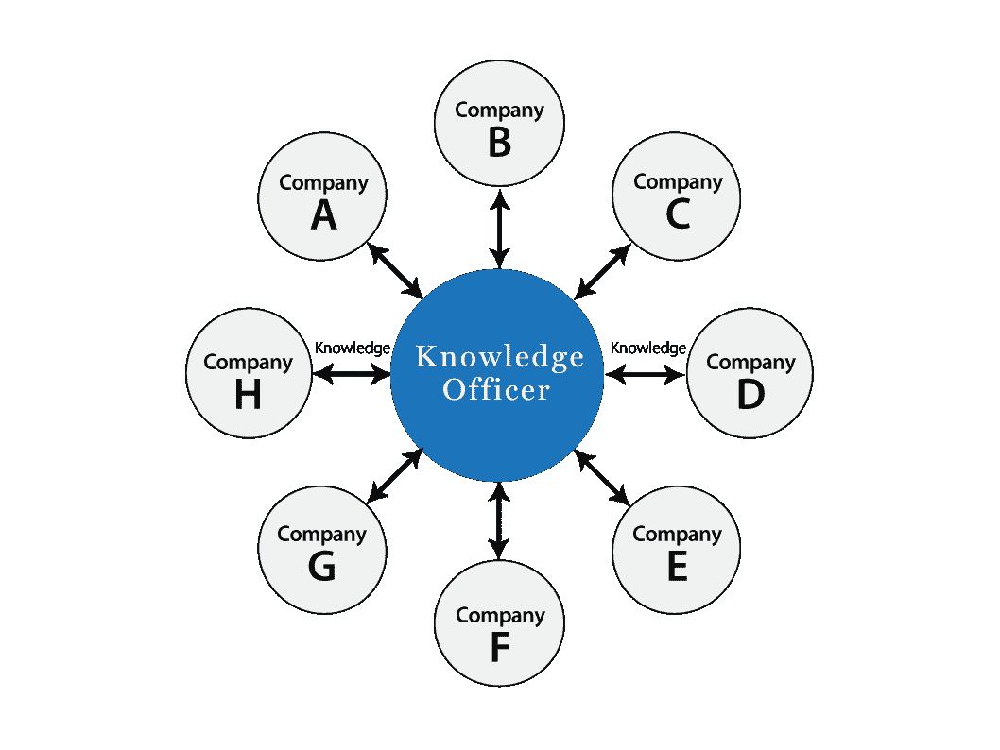

# 创业生态系统和挑战

> 原文：<https://medium.com/hackernoon/the-startups-ecosystem-and-challenges-2bc99396d7d3>

我们都可能同意，网络已经成为一个开放的空间，每个人都可以表达自己的意见，想法和经验，没有任何边界或限制。虽然这非常强大，但也导致了一些问题；其中之一是*信息过载*，我们有大量的内容，但处理和理解这些内容的时间和资源有限。

另一个问题是，这些内容中的好的部分不值得存在到它被发表的那一刻！许多作家这样做只是为了写作，为了出名或赚更多的钱，很少有人出于对某一主题的深刻体验或分享有见地的教训或建议而写作。

> *这些问题使得寻找优质内容变得极其困难，这些内容不一定是广告驱动的、病毒式的或新鲜的，也不会浪费你的时间或失去你的理智。*

在创业公司的世界里，我们有一个很大的孤立问题！每一家[初创公司](https://hackernoon.com/tagged/startup)都在自己的 blob 中工作，解决自己的问题，却没有对其他初创公司面临的共同挑战和可能有用的合作点给予足够的关注。招聘、文化、组织结构等挑战不一定是分享的敏感话题，如果利用跨创业公司的合作，可以减少大量的重复工作。

在[知识官员](http://knowledgeofficer.com)中，我们对人们的时间非常谨慎，我们想让每一分钟都有价值。我们希望建立一个值得信赖的[知识](https://hackernoon.com/tagged/knowledge)来源，为任何寻求深入创业相关知识的人提供一站式服务。为了做到这一点，我们知道我们需要区分什么是好的什么是坏的，并消除噪音。

所以我们想，为什么不创建一个平台，专注于高质量的内容，同时促进这些主题的讨论和合作。

> 一个帮助创业公司**在团队内部和团队之间高效地**和**分享** **来之不易的**知识**的平台。**

虽然我们知道这个问题很大，到目前为止还没有人能够完全解决它，但我们也相信它值得我们花费时间和精力。比起解决方案，我们更喜欢问题，这是我们前进的动力。

三周前，我们[推出了我们的网站](https://hackernoon.com/the-knowledge-officer-is-now-live-908422a4175f)以及我们的[知识信](https://hackernoon.com/rip-newsletters-and-welcome-knowledge-letters-9ccda9c4ab4d)和 Slack 应用程序。我们对用户的参与度以及已经注册和使用我们 Slack 应用的公司数量非常满意。

在接下来的几周里，我们将根据收到的反馈来执行，并确保平台继续发展以满足您的需求。

如果你还没有报名，请试一试；访问我们的[网站](http://knowledgeofficer.com)并给我们反馈。

*如果你喜欢这个产品，请在* [*上给它你的爱，在*](http://producthunt.com/posts/knowledge-officer/) *上寻找产品，并在*[*Facebook*](https://www.facebook.com/knowledgeofficer/)*&*[*Twitter*](https://twitter.com/ko_platform)*上关注我们的更新。*

> [黑客中午](http://bit.ly/Hackernoon)是黑客如何开始他们的下午。我们是这个家庭的一员。我们现在[接受投稿](http://bit.ly/hackernoonsubmission)并乐意[讨论广告&赞助](mailto:partners@amipublications.com)机会。
> 
> 如果你喜欢这个故事，我们推荐你阅读我们的[最新科技故事](http://bit.ly/hackernoonlatestt)和[趋势科技故事](https://hackernoon.com/trending)。直到下一次，不要把世界的现实想当然！

