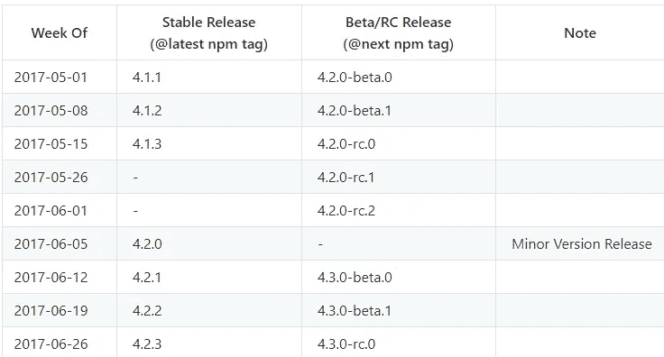
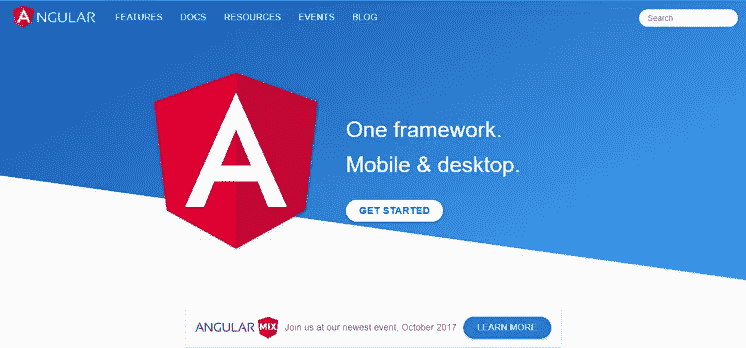
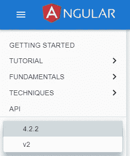
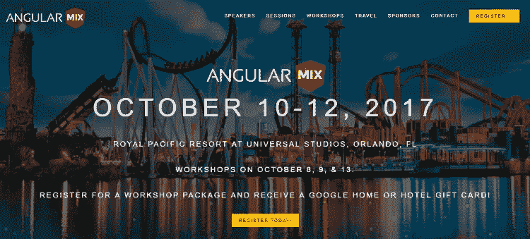

# Angular 的状态和版本 5 的到期日

> 原文：<https://medium.com/hackernoon/the-state-of-angular-and-the-due-date-of-version-5-68374002267f>

## 对 4 . x-5.0 版本状态的高级观察

***本*条** ***原本出现在***[***dormoshe . io***](https://dormoshe.io/articles/the-state-of-angular-and-the-due-date-of-version-5-13)

Google 的 Angular 团队继续根据语义版本发布 Angular 的新版本。版本 2 于 9 月 16 日发布。Angular 版本 4 于 3 月 16 日发布，比版本 2 晚了 6 个月。在过去的三个月里，两个小版本和许多补丁版本都有了新的东西。

在本文中，我们将对 4.x.x 版本进行高层次的概述，了解即将到来的版本的时间安排，发现新 Angular baby(版本 5)的到期日期，并且我们将回顾 Angular 提供的另外两个惊喜。

# 版本 4.0.0

最后一个主要版本是 Angular platform 的 4.0.0 版本。发布版本是一个主要版本，因为**从 v1 升级到 v2** 。兼容新的 Typescript 版本是可行的，以便保持更新并获得新的功能和最新的修复。

第 4 版比前一版更小更快。Angular 团队构建了一个 [**新视图引擎**](https://docs.google.com/document/d/195L4WaDSoI_kkW094LlShH6gT3B7K1GZpSBnnLkQR-g/preview) ，它将组件生成代码的大小减少了大约 60%。另一个大的变化是新的动画包。动画的代码从`@angular/core`包移到`@angular/platform-browser/animations`。这优化了应用程序包的大小。

这个版本中有很多特性和错误修正。突出的新特性是`ngIf else`语法和改进的`ngFor`指令。Angular Universal 和 Angular-CLI 现在是官方 Angular 项目的一部分。我们可以通过新的`@angular/universal`和`@angular/cli`包装来消费它们。

The release schedule of 4.1.x-4.2.x and 4.3.0 beta/rc versions

## 版本 4.1.0

根据语义版本化，**在 4.x.x 版本中没有重大变化**。用 Typescript 2.1 版构建的 4.0 版中的角度代码。v4.1 增加了**对 Typescript 2.2 & 2.3** 以及用 v2.3 构建的 Angular 代码的全面支持，另外在 v4.1 Angular 中兼容 Typescript 的`[StrictNullChecks](https://basarat.gitbooks.io/typescript/docs/options/strictNullChecks.html)`。

团队的大部分工作已经在官方文档网站上完成。这个网站现在是一个 Angular-CLI 应用程序。

## 版本 4.2.0

添加了大量新功能，使**动画**更加简单和强大。其中一部分是可重用动画的定义，查询内部元素，当路线改变时制作动画，以及使用 AnimationBuilder 构建/控制动画。所有这些都是 Angular 中新的和重要的动画特性浪潮的一部分。

 [## 新一波的动画功能在角-yearofmoo.com

### Angular 4.2 引入了一波新的动画特性，允许多元素和可重用的动画(带输入…

www.yearofmoo.com](https://www.yearofmoo.com/2017/06/new-wave-of-animation-features.html) 

**为了方便编程，增加了新的测试方法:** `overrideProvider, whenRenderingDone and flush`。

为了覆盖提供者，在`TestBed`中添加了`**overrideProvider**`方法，而没有关注它如何定义和谁声明了提供者。这种方法是 Angular 团队在测试区最高目标的一部分——以 JIT 模式 对 AOT 进行 [**测试，以模拟生产环境。**](https://docs.google.com/document/d/1VmTkz0EbEVSWfEEWEvQ5sXyQXSCvtMOw4t7pKU-jOwc/edit)

`ComponentFixture`增加了`**whenRenderingDone**`方法。这个函数类似于`whenStable`方法，但主要是等待动画完成。

`**flush**`函数帮助我们自动等待，直到所有的宏任务事件，比如超时，都从事件队列中清除。`tick(milliseconds)`调用需要被这个新函数取代。

在 Angular 代码中的许多区域，如 i18n、表单验证和模板，也做了其他改进。

# 发布时间表和版本 5.0.0 🥂

发布时间表的目的是帮助 Angular 团队、Angular 贡献者、Angular 应用团队和 Angular 社区项目之间的协调。

The release schedule of 4.3.x-5.0.0 versions

所以，现在我们可以说**Angular 的第五版将于 2017 年 9 月 18 日**发布😍🎉

这些日期只是一个指南，必要时可能会稍作调整。在版本 2 的发布中，团队成功地坚持了暂定的时间表。

正如你所看到的，在主要版本之前有 21 个版本。其中一个是小调——4 . 3 . 0。其他的是 10 个补丁版本，7 个测试版和 3 个候选发布版。2018 年 3 月和 2018 年 9/10 月将是版本 6 和 7 的月份。

**第 5 版将包含一系列新功能、改进的流程、错误修复和惊喜**。将 AOT 设为默认值、观察模式、模板中的类型检查、更灵活的元数据、删除*.ngfactory.ts 文件、更好的错误消息、平滑升级、可树摇组件和混合升级应用程序改进只是将组装下一个主要版本的惊人内容的一部分。

 [## Angular v5 有什么值得期待的？

### 当我们忙于学习和探索 Angular v4 时，Angular 的团队正在展望和规划第五版…

hackernoon.com](https://hackernoon.com/what-to-expect-for-in-angular-v5-6e0fc9c4b13e) 

# 更多惊喜

## 全新 angular.io 现已上市

在 4.2 版本中，该团队还发布了一个新的 angular.io 网站。该网站的基础设施，建筑和设计已经**重建**使用角引擎盖下。**该网站的内容和代码示例现在托管在 angular 的 GitHub 资源库** 的 [***aio 文件夹*中。**](https://github.com/angular/angular/tree/master/aio)

The new angular.io website

为了改进文档，团队重构了内容，未来将为每个页面添加一个**“改进此文档”**链接。该团队认为公众贡献者可以提出新的东西来改进文档。

该网站是由一名服务人员构建的，目的是提高桌面和移动设备的性能。**愿景是使该网站成为一个实现最佳实践和渐进式 web 应用方法的 Angular 应用程序的良好范例**。

Choosing of site/content version via the menu

此外，网站的菜单包含一个****按钮来选择你更喜欢使用哪个版本的**。目前， *4.2.2* 为新场地， *v2* 为旧场地。**

## **角度组合—奥兰多@ 2017 年 10 月**

**Angular 为我们提供的另一个惊喜是 [AngularMix 大会](https://angularmix.com)。AngularMix 大会旨在提供 Angular、开源和企业软件开发的完美结合。**本次大会将于 2017 年 10 月 10 日至 12 日在佛罗里达州奥兰多市首次举办**。研讨会将于 10 月 8 日、9 日和 13 日举行。**

****

**AngularMix — a new formal Angular conference**

**一些演讲者将是最受欢迎和最著名的开发人员，包括 Angular 核心团队成员。核心团队将介绍会议主题以及几个环节。包括研讨会在内，费用在 1500 美元到 2700 美元之间。**

**这个新的会议加入了社区和谷歌等关键公司一直支持的角会议和聚会的投票。**

** [## 游览我最喜欢的 JavaScript 会议堆栈

### JavaScript 专区充斥着世界各地举行的数百场会议。这些会议…

hackernoon.com](https://hackernoon.com/tour-to-my-favorite-javascript-conferences-stack-62b7e4ec7c58)** 

# **结论**

**过去的三个月包含了许多新的东西。Angular 团队每次都在致力于让我们开心的新功能和改进。“你可以和我们一起建！”是 Angular 团队今年给开发者社区的总体信息。我们可以说这个口号是他们成功做到的。现在，我们知道了版本 5 的时间表和截止日期，所以我们可以把它固定在我们的日程表上📅。**

****

*****您可以关注我的***[***dormo she . io***](https://www.dormoshe.io)***或***[***Twitter***](https://twitter.com/DorMoshe)***阅读更多关于 Angular、JavaScript 和 web 开发的内容。*****